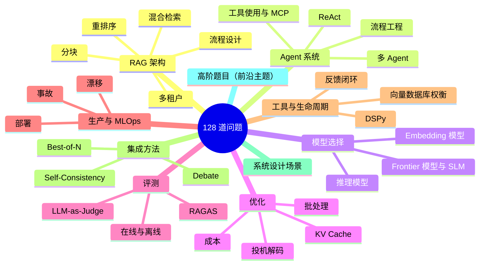
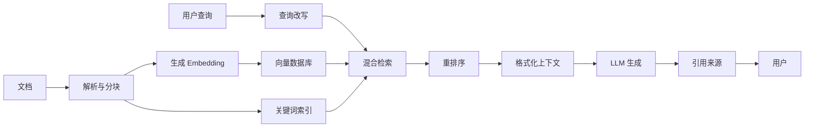
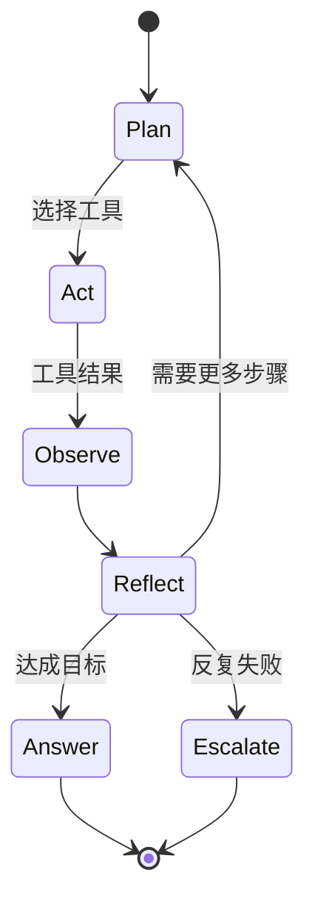

# AI 系统设计面试题库

本章按主题整理了 128 道 AI 系统设计面试题（Q1-Q128，连续编号），并提供示范答案、可能的追问以及优秀候选人应展现的信号；另外还包含 5 个未编号的深度设计场景。内容更新至 2026 年 8 月。

本章全面整理了 AI 系统设计面试题，并按主题进行组织。每道题都说明了面试官期望的回答深度，以及优秀回答应覆盖的关键点。建议结合[答题框架](02-answer-frameworks.md)（帮助你把记忆转化为流畅表达的元技能）、[FAQ](07-faq.md)（高频问题的简短答案）以及[AI 岗位市场趋势](06-job-market-trends-2026.md)（影响当前面试内容的招聘背景）一起学习。

## 内容速览



## 目录

- [RAG 架构问题](#rag-架构问题)（Q1-Q10）
- [Agent 系统问题](#agent-系统问题)（Q11-Q17）
- [模型选择问题](#模型选择问题)（Q18-Q21）
- [优化问题](#优化问题)（Q22-Q26）
- [评测问题](#评测问题)（Q27-Q29）
- [生产与 MLOps 问题](#生产与-mlops-问题)（Q30-Q33）
- [工具与生命周期问题](#工具与生命周期问题)（Q34-Q39）
- [集成方法问题](#集成方法问题)（Q40-Q49）
- [系统设计场景](#系统设计场景)（5 个深度演练）
- [高级问题（2025 年 12 月）](#高级问题2025-年-12-月)（Q50-Q65）
- [高级问题——2026 年 3 月](#高级问题2026-年-3-月)（Q66-Q80）
- [高级问题——2026 年 5 月](#高级问题2026-年-5-月)（Q81-Q110）
- [高级问题——2026 年 6 月](#高级问题2026-年-6-月)（Q111-Q116）
- [高级问题——2026 年 7 月](#高级问题2026-年-7 月)（Q117-Q122）
- [高级问题——2026 年 8 月](#高级问题2026-年-8 月)（Q123-Q128）⭐ *新增*

---

## RAG 架构问题

生产级 RAG 管线通常可以映射到 Q1-Q10。下面的流程图是许多优秀候选人在白板上会画出的典型架构；后面的题目会分别追问其中的各个阶段。



### Q1：请介绍一个生产级 RAG 系统的架构

**面试官关注什么：**

- 是否理解完整流程：数据接入、索引、检索和生成
- 是否了解分块策略及其权衡
- 是否了解 Embedding 模型和向量数据库
- 是否理解重排序的作用和重要性

**强回答应覆盖：**

1. 带预处理的数据接入管线
2. 根据文档类型选择分块策略
3. 在成本和质量之间权衡 Embedding 模型
4. 向量数据库的选型标准
5. 使用混合检索（稠密检索 + 稀疏检索）
6. 生成前增加重排序层
7. 对上下文进行合理格式化后再生成
8. 接入可观测性和评测能力

**示范回答：**

“生产级 RAG 系统通常包含两条主要管线：数据接入管线和查询管线。

**数据接入管线：** 文档可能来自多种数据源。首先使用文档处理器解析 PDF、HTML 和 Office 文件。然后进行分块，具体策略取决于文档类型。对于技术文档，可以使用递归分块，将每个块控制在 512 个 token 左右，并保留 50 个 token 的重叠。对于法律文档，则应尽量保留段落边界。之后使用 `text-embedding-3-large` 之类的模型，或者在需要自托管时使用 BGE 等开源模型，为每个文本块生成 Embedding。

这些 Embedding 会写入向量数据库。我通常会根据规模和运维要求在 Qdrant 与 Pinecone 之间选择。同时把原始文本写入 Elasticsearch，支持关键词检索。

**查询管线：** 收到查询后，我会执行混合检索：一方面在向量数据库中进行语义检索，另一方面在 Elasticsearch 中使用 BM25 做关键词检索。之后通过 Reciprocal Rank Fusion（RRF，倒数排名融合）合并结果。这样可以兼顾两类能力：语义检索擅长处理同义改写，关键词检索擅长处理精确术语、缩写和专有名词。

接下来使用 cross-encoder（交叉编码器），例如 Cohere Rerank 或 `bge-reranker`，对前 50 个结果进行重排序。这个步骤通常可以将精确率提升 10%～15%。最后把重排序后排名靠前的 5～10 个文本块放入上下文。

在生成阶段，我会使用清晰的来源标签格式化上下文，加入用户问题，并调用带有来源引用要求的系统提示词。具体使用 Claude Sonnet 4.6 还是 GPT-5.5，要根据实际要求决定。

最后，在每个阶段接入可观测性：记录检索延迟、重排序延迟和 LLM 延迟，同时按一定比例采样 faithfulness（忠实度）等质量指标。”

**可能的追问：** 如果文档包含表格和图片，你会如何处理？

### Q2：什么时候选择 RAG，什么时候选择微调？

**面试官关注什么：**

- 是否有清晰的决策框架
- 是否理解两种方案各自的能力边界
- 是否考虑成本和维护难度

**强回答框架：**

| 判断因素 | 更适合 RAG | 更适合 Fine-tuning |
|----------|------------|--------------------|
| 数据新鲜度 | 数据经常更新 | 知识相对稳定 |
| 数据规模 | 规模基本不受限制 | 需要 1K～100K 条高质量样本 |
| 延迟容忍度 | 可以接受 200～500ms 的检索延迟 | 需要尽可能快的响应 |
| 使用场景 | 特定文档上的事实准确性 | 改变风格、语气或行为 |
| 隐私 | 数据保留在自己的基础设施中 | 训练数据需要进入训练流程 |
| 维护方式 | 更新文档即可生效 | 数据变化后需要重新训练 |

**示范回答：**

“选择 RAG 还是微调，取决于你要解决的具体问题。

**适合选择 RAG 的情况：**

- 知识库经常变化。使用 RAG 时只需要更新文档，新的内容就能很快生效；微调则需要重新训练。
- 需要引用和可追溯性。RAG 能够直接提供来源，因为系统知道哪些文本块参与了回答。
- 希望降低特定事实上的幻觉。把回答限制在检索到的上下文中，可以让模型更有依据。
- 数据隐私很重要。文档可以留在自己的基础设施内，而不必进入外部训练流程。

**适合选择 Fine-tuning 的情况：**

- 需要稳定改变模型的行为、风格或输出格式，例如始终返回特定 JSON Schema，或者采用固定语气。
- 延迟要求极高，无法接受额外的检索开销。
- 拥有稳定且高质量、能够代表目标任务的训练样本。
- 希望让模型掌握特定领域的术语或推理模式。

**实践中经常组合使用两者：** 可以先微调模型，让它稳定遵守输出格式和工具调用约定，再通过 RAG 为回答提供文档依据。这样既能获得微调带来的行为一致性，又能获得 RAG 带来的事实准确性。

例如在大规模场景中，可以让一个较小的模型高效处理 70% 的普通请求，再把复杂请求路由到带 RAG 的 Frontier 模型。”

**需要主动提到的关键点：** RAG 和微调并不是互斥方案。许多生产系统会把 RAG 与针对特定行为微调的模型组合起来，以获得更好的综合效果。

### Q3：如何处理“中间丢失”（lost in the middle）问题？

**面试官关注什么：**

- 是否了解上下文窗口中的注意力分布
- 是否能提出实际可落地的缓解策略

**强回答应覆盖：**

1. 问题本质：模型对上下文开头和结尾的关注度更高，对中间内容的关注度更低
2. 研究依据：Liu 等人在 2023 年发表的《Lost in the Middle》论文
3. 常见缓解方式：
   - 将检索结果限制为最相关的 3～5 个文本块
   - 把关键信息放在上下文开头和结尾
   - 在拼接上下文前使用重排序保证质量
   - 对超长上下文进行递归摘要
   - 选择长上下文处理能力更好的模型，例如 Gemini 3.1 Pro、支持 1M 上下文的 Claude Sonnet 4.6

**示范回答：**

“‘中间丢失’问题来源于 Liu 等人在 2023 年进行的研究。他们发现，LLM 对上下文窗口开头和结尾的信息关注度不成比例地更高，而对中间内容的关注度会下降。

这意味着，如果我把 20 个检索到的文本块全部塞进上下文，即使第 8～15 个文本块包含最相关的信息，模型也可能实际上忽略它们。

**我的处理方式如下：**

第一，限制上下文大小。更多内容并不一定更好。我通常会选择 5～10 个高质量文本块，而不是 20 个质量一般的文本块，优先保证质量而不是数量。

第二，在拼接上下文前进行充分重排序。Cross-encoder 可以确保排在前面的文本块真正相关，而不只是与查询向量相似。

第三，策略性地安排顺序。把最重要的文本块放在开头，把第二重要的放在结尾，把不那么关键的内容放在中间。有些团队甚至会把关键内容在两端各放一份。

第四，对于非常长的上下文采用分层策略。可以先对相关文本块分组并分别摘要，再同时放入摘要和关键原文片段。

最后，模型选择也很重要。当前支持 1M 上下文的模型，例如 Claude Sonnet 4.6、Gemini 3.1 Pro 和 GPT-5.5，在长上下文中保持注意力的能力明显优于早期模型，但注意力梯度仍然存在。如果必须使用很长的上下文，我会选择经过专门测试的模型，同时继续使用上述排序策略。”

---

### Q4：解释分块策略，以及每种策略适合什么时候使用

**面试官关注什么：**

- 是否了解多种分块策略
- 是否理解不同策略的权衡
- 是否有根据实际场景选择策略的经验

**强回答：**

| 策略 | 工作方式 | 最适合的场景 | 权衡 |
|------|----------|--------------|------|
| 固定大小 | 按 token 数或字符数切分 | 通用场景、结构简单的文档 | 可能从句子中间切断 |
| 按句子 | 按句子边界切分 | 问答、对话场景 | 文本块大小不固定 |
| 语义分块 | 按语义相似度聚类 | 需要跨段落保持主题连贯 | 聚类会带来计算成本 |
| 递归分块 | 先尝试大块，不合适时逐级缩小 | 结构化文档 | 实现更复杂 |
| 父子分块 | 用小块检索，返回更大的父块 | 同时需要精确检索和完整上下文 | 存储开销较高 |
| 文档级分块 | 整篇文档作为一个块 | 短文档、摘要场景 | 受上下文长度限制 |

**关键洞察：** 当检索精度很重要时，选择语义分块或父子分块；当更关注速度和简单性时，选择带重叠的固定大小分块。

---

### Q5：你会如何评测一个 RAG 系统？

**面试官关注什么：**

- 是否了解 RAG 专用指标
- 是否理解离线评测与在线评测的区别
- 是否能设计实际的评测流水线

**强回答应覆盖：**

**检索指标：**

- Precision@K：检索结果中有多少比例是相关文档
- Recall@K：所有相关文档中有多少被检索出来
- MRR（Mean Reciprocal Rank，平均倒数排名）：第一个相关结果排得有多靠前
- NDCG：综合考虑结果位置后的排序质量

**生成指标（RAGAS 框架）：**

- Faithfulness（忠实度）：回答是否以检索上下文为依据
- Answer relevance（回答相关性）：回答是否真正回应了问题
- Context relevance（上下文相关性）：检索到的上下文是否有用
- Context recall（上下文召回率）：是否检索到了回答所需的全部信息

**端到端指标：**

- 相对于标准答案的正确性
- 用户满意度，例如点赞/点踩和 CSAT
- 任务完成率

**评测流水线：**

1. 构建带标准答案的测试集
2. 使用 LLM-as-Judge 自动评测
3. 对部分样本进行人工评测
4. 在生产环境中进行 A/B 测试

**示范回答：**

“我会从检索、生成和端到端三个层次评测 RAG 系统。

**检索评测方面，** 我关注系统是否找到了正确文档。Precision@K 告诉我检索结果中有多少是真正相关的；Recall@K 告诉我是否遗漏了重要文档；MRR 反映第一个相关结果出现的位置。我通常会将 Precision@5 的目标设在 0.8 以上，将 Recall@10 的目标设在 0.9 以上。

**生成评测方面，** 我会使用 RAGAS。Faithfulness 很关键，因为它衡量回答是否以检索上下文为依据，也可以帮助发现幻觉。Answer relevance 检查回答是否回应了问题，Context relevance 则检查检索结果是否有用，还是包含了大量噪声。

**端到端评测方面，** 在有标准答案时，我会使用精确匹配或语义相似度进行比较。生产环境中则跟踪点赞/点踩、重新生成率和任务完成率等用户信号。

**评测流水线可以这样设计：**

离线维护一个包含 200 多组问答和相关文档标注的测试集。每次改动后，使用 RAGAS 指标和 LLM-as-Judge 自动评测主观质量。

设置质量门禁：Faithfulness 必须超过 0.85，Answer relevance 必须高于 0.80。如果改动导致这些指标下降，就不允许发布。

在线上抽样 5% 的查询进行自动评测，并持续跟踪指标变化。对于重要改动，运行 A/B 测试，观察用户满意度和任务完成率。

最后，定期对随机样本进行人工评测，用人工判断校准自动化指标。”

---

### Q6：介绍混合检索，以及什么时候使用它

**面试官关注什么：**

- 是否理解稠密检索与稀疏检索的区别
- 是否了解结果合并方法
- 是否意识到两种方法各自的失败模式

**强回答：**

**稠密检索（Embedding）：**

- 擅长：语义相似、同义改写、概念匹配
- 不擅长：精确关键词、罕见术语、专有名词

**稀疏检索（BM25、TF-IDF）：**

- 擅长：精确匹配、关键词和罕见术语
- 不擅长：语义相似和同义表达

**混合方案：**

1. 同时执行稠密检索和稀疏检索
2. 使用 Reciprocal Rank Fusion（RRF，倒数排名融合）或加权打分合并结果
3. 对合并后的结果进行重排序

**适合使用混合检索的情况：**

- 领域包含大量特定术语，例如法律、医疗和技术领域
- 查询同时包含关键词匹配和概念理解需求
- 单独使用稠密检索时，对精确匹配内容的召回率较差

**RRF 公式：** `score = sum(1 / (k + rank_i))`，其中 `k` 通常取 60。

---

### Q7：如何处理多租户 RAG 系统？

**面试官关注什么：**

- 是否具备安全意识
- 是否理解数据隔离策略
- 是否了解常见陷阱

**强回答应覆盖：**

**核心原则：** 必须在检索之前完成过滤，绝不能检索之后再过滤。

```python
# 错误：过滤前已经发生数据泄漏
results = vector_db.search(query, top_k=100)
filtered = [r for r in results if r.tenant_id == tenant]

# 正确：在数据库查询层完成过滤
results = vector_db.search(
    query,
    top_k=10,
    filter={"tenant_id": {"$eq": tenant_id}}
)
```

**按安全等级划分的隔离模式：**

| 模式 | 隔离范围 | 成本 | 适用场景 |
|------|----------|------|----------|
| 元数据过滤 | Namespace | 低 | 大多数 SaaS 应用 |
| 独立集合 | Collection | 中 | 敏感数据 |
| 独立数据库 | 完全隔离 | 高 | 受监管行业 |

**其他控制措施：**

- 所有向量元数据都必须包含租户 ID
- 上下文中不能出现跨租户数据
- 缓存键必须包含租户范围
- 审计日志必须记录租户上下文

**示范回答：**

“对于不同客户只能看到各自数据的 SaaS 应用，多租户 RAG 至关重要。第一原则是：必须在检索之前过滤，不能事后过滤。

错误做法是先检索 100 个结果，再在应用层筛选当前租户。这很危险，因为其他租户的敏感文档已经被检索并加载到内存中。即使事后过滤，也可能因为日志记录、时序攻击或程序缺陷导致数据暴露。

正确做法是在数据库查询层过滤：

```python
# 正确：在数据库查询中完成过滤
results = vector_db.search(
    query,
    top_k=10,
    filter={'tenant_id': {'$eq': tenant_id}}
)
```

**我会从三个层次实现多租户：**

**第一层——元数据过滤：** 每个向量的元数据都包含 `tenant_id`，所有查询都必须按租户过滤。这是大多数 SaaS 应用的最低要求。

**第二层——独立集合：** 为每个租户建立独立的集合或 Namespace。隔离更好，但运维开销更高。

**第三层——独立数据库：** 对医疗、金融等受监管行业提供完整隔离，每个租户使用自己的向量数据库实例。

**其他关键控制措施：**

- 缓存键必须包含 `tenant_id`，否则一个租户可能拿到另一个租户的缓存响应。
- 审计日志必须记录所有操作对应的租户上下文。
- 系统提示词不能包含多个租户的数据。
- 错误信息不能泄露其他租户数据的存在或内容。

最终选择哪一级隔离，要根据合规要求和客户数据敏感度决定。”

---

### Q8：什么是重排序？什么时候可以跳过它？

**面试官关注什么：**

- 是否理解两阶段检索
- 是否能进行成本收益分析
- 是否有实际部署经验

**强回答：**

**重排序的作用：**

- 第一阶段：快速召回前 50～100 个候选结果
- 第二阶段：使用成本更高但更准确的模型对候选结果打分
- 根据重排序结果返回前 K 个结果

**重排序方案：**

- Cross-encoder 模型，例如 `ms-marco`、`bge-reranker`
- Cohere Rerank API
- 基于 LLM 的重排序，成本高但灵活性更强

**可以跳过重排序的情况：**

- 延迟预算低于 200ms
- Embedding 模型质量已经足够
- 查询量很大且成本受限
- 查询简单，第一阶段检索已经足够准确

**应该使用重排序的情况：**

- 检索精度非常关键
- 可以接受额外增加 50～100ms 延迟
- 查询复杂，需要更强的语义理解
- 法律、医疗、金融等高风险场景

---

### Q9：如何处理包含表格、图表和图片的文档？

**面试官关注什么：**

- 是否理解多模态处理
- 是否能提出实际的提取策略
- 是否了解当前方案的限制

**强回答：**

**表格：**

1. 使用 Document AI（例如 Textract、Azure Document Intelligence）提取表格结构
2. 可以采用以下分块方式：
   - 序列化成 Markdown，再和普通文本一起分块
   - 为表格单独生成 Embedding
   - 为表格内容生成摘要，并将表格元数据一起建立索引
3. 对查询增加是否包含表格的专门过滤条件

**图片和图表：**

1. 使用视觉语言模型（例如 Claude Opus 4.8、GPT-5.5、Gemini 3.1 Pro）生成描述
2. 将生成的描述作为文本建立索引
3. 保留图片引用，供后续多模态生成使用
4. 对图表，如果存在原始数据，优先提取底层数据

**需要主动说明的限制：** 许多 Embedding 模型只支持文本。如果把图片描述进行向量化，最终的检索质量会依赖于描述本身的质量。

---

### Q10：解释向量数据库的索引算法

**面试官关注什么：**

- 是否理解 ANN（Approximate Nearest Neighbor，近似最近邻）算法
- 是否能权衡准确率与速度
- 是否有实际调参经验

**强回答：**

**HNSW（Hierarchical Navigable Small World，分层可导航小世界）：**

- 基于多层图结构
- 在较低延迟下提供较高召回率（95%～99%）
- 内存消耗较高
- 适合：对质量有要求的生产服务

**IVF（Inverted File Index，倒排文件索引）：**

- 先对向量聚类，只搜索相关的簇
- 通过 `nprobe` 参数在召回率和速度之间权衡
- 比 HNSW 占用更少内存
- 适合：受成本约束的大规模数据集

**PQ（Product Quantization，乘积量化）：**

- 压缩向量以提高内存效率
- 会带来一定精度损失
- 通常与 IVF 组合使用，即 IVF-PQ
- 适合：受内存限制的超大规模场景

**需要调优的关键参数：**

- HNSW：`ef_construction`、`ef_search`、`M`
- IVF：`nlist`（聚类数量）、`nprobe`（搜索的聚类数量）
- 必须针对实际数据测试召回率和延迟之间的关系

## Agent 系统问题

Q11-Q17 重点讨论推理循环、工具使用和多 Agent 设计。下面的 ReAct 循环是优秀候选人组织这类问题时常用的心智模型：



### Q11：Agent 和 Workflow 有什么区别？

**面试官关注什么：**

- 是否能清楚区分两个概念
- 是否理解自动化程度的连续谱
- 是否能说明对系统设计的实际影响

**强回答：**

**Workflow（工作流）：** 预先确定的步骤序列。

- 步骤在设计阶段就已确定
- 控制流显式表达，例如 `if/else` 和循环
- 执行路径相对确定
- 更容易测试、调试和解释

**Agent：** 自主决策系统。

- 根据观察结果选择下一步行动
- 控制流由运行时的 LLM 决定
- 执行路径具有非确定性
- 灵活性更高，但更难预测

**自动化程度连续谱：**

```text
Workflow 工作流 ←------------------------→ Agent

单次 Prompt → Chain → Router → ReAct → Multi-agent → 完全自主
```

**关键洞察：** 大多数生产系统其实是包含 Agent 组件的 Workflow，而不是完全自主的 Agent。应该先从 Workflow 开始，只在确实需要的地方增加 Agent 能力。

**示范回答：**

“两者的核心区别在于谁控制执行路径。

在 **Workflow** 中，我在设计阶段定义步骤。代码明确规定：先执行 A，再执行 B；如果满足条件 X 就执行 C，否则执行 D。LLM 可以参与某一个步骤，但不负责决定整体流程。因此这种方式是确定且可预测的。

在 **Agent** 中，LLM 会根据观察结果决定下一步。系统给它一个目标和一组工具，由它选择调用哪些工具以及调用顺序。执行路径在运行时由模型决定，因此具有非确定性。

我把它看成一个连续谱：

- **单次 Prompt：** 一次 LLM 调用，没有控制流
- **Chain：** 固定顺序的多次 LLM 调用
- **Router：** 由 LLM 从 N 条路径中选择一条
- **ReAct Agent：** LLM 与工具循环交互直到完成
- **Multi-agent：** 多个 LLM 协同工作

我的实践建议是先从 Workflow 开始。它更容易测试、调试，也更容易向业务方解释。只有真正需要运行时灵活性时，才增加 Agent 组件。

例如，一个客服系统可以先设计成“意图分类 → 检索上下文 → 生成回答”的确定性 Workflow。在检索步骤内部，再使用一个 Agent 决定是查询知识库、查询订单历史，还是两者都查。整体流程仍然可控，但需要灵活性的局部也得到了灵活性。”

---

### Q12：解释 ReAct 模式

**面试官关注什么：**

- 是否理解 Reason + Act 循环
- 是否了解实现细节
- 是否知道常见失败模式

**强回答：**

**ReAct = Reasoning + Acting（推理与行动交错）。**

循环步骤：

1. **Thought：** LLM 根据当前状态推理下一步行动
2. **Action：** LLM 选择并调用工具
3. **Observation：** 工具返回结果
4. 重复上述过程，直到任务完成或达到最大迭代次数

**示例轨迹：**

```text
Thought: 我需要查询 NVDA 当前的股票价格
Action: stock_price(symbol="NVDA")
Observation: {"symbol": "NVDA", "price": 142.50, "currency": "USD"}
Thought: 我已经拿到价格，现在可以回答用户
Action: respond("NVIDIA 当前股价为 142.50 美元")
```

**常见失败模式：**

- 工具选择错误：为任务选择了错误工具
- 参数错误：传入了不正确的参数
- 推理循环：Agent 不断重复同一个失败动作
- 成本失控：没有停止条件

**缓解措施：**

- 用清晰的工具描述和示例指导模型
- 对所有工具的输入进行校验
- 设置最大迭代次数
- 跟踪成本并设置告警

**示范回答：**

“ReAct 是 Reasoning plus Acting 的缩写，是构建 Agent 最常见的模式之一。

Agent 在三个阶段之间循环：

1. **Thought：** 模型分析当前状态：我知道什么？还缺什么？下一步应该做什么？
2. **Action：** 模型根据分析选择工具并提供参数。
3. **Observation：** 工具执行并返回结果，结果会被加入上下文。

循环会一直持续，直到模型决定返回最终答案或达到限制。

我重点防范的失败模式包括：

- **循环：** Agent 不断重试同一个失败动作，通过最大迭代次数和重复动作检测来缓解。
- **工具选择错误：** 通过清晰的工具描述和示例减少错误。
- **参数错误：** 使用严格校验，并返回有帮助的错误信息。
- **成本失控：** 跟踪 token 使用量，并设置硬性上限。

ReAct 简单且有效，但复杂任务中我经常更偏向 Flow Engineering 等结构化方式，由系统显式定义状态。”

---

### Q13：如何实现工具使用或 Function Calling？

**面试官关注什么：**

- 是否了解不同模型提供商的 API
- 是否掌握工具设计最佳实践
- 是否理解错误处理

**不同提供商的能力对比（截至 2025 年 12 月）：**

| 能力 | OpenAI | Anthropic | Google |
|------|--------|-----------|--------|
| 并行调用 | 支持 | 支持 | 支持 |
| 流式输出 | 支持 | 支持 | 支持 |
| 工具选择控制 | auto/required/none | auto/any/tool | auto/any/none |
| 结构化输出 | JSON mode | JSON mode | JSON mode |

**工具设计最佳实践：**

1. 使用清晰、面向动作的名称，例如 `search_database`，不要使用 `db_tool`
2. 在文档字符串中提供详细描述和示例
3. 严格校验参数，并返回有帮助的错误信息
4. 在可能的情况下保证幂等
5. 返回结构化数据，而不是自然语言描述

**错误处理：**

```python
def safe_tool_call(func, *args, **kwargs):
    try:
        result = func(*args, **kwargs)
        return {"status": "success", "result": result}
    except ValidationError as e:
        return {"status": "error", "error_type": "validation", "message": str(e)}
    except TimeoutError:
        return {"status": "error", "error_type": "timeout", "message": "Tool timed out"}
    except Exception as e:
        return {"status": "error", "error_type": "unknown", "message": str(e)}
```

---

### Q14：如何设计一个 Multi-agent 系统？

**面试官关注什么：**

- 是否掌握常见架构模式
- 是否考虑通信方式
- 是否能说明实际权衡

**强回答：**

**架构模式：**

| 模式 | 结构 | 最适合 | 挑战 |
|------|------|--------|------|
| 层级式 | Manager 分配任务给 Worker | 可拆解的复杂任务 | Manager 可能成为瓶颈 |
| 点对点 | Agent 之间直接通信 | 协作型任务 | 协调复杂度高 |
| Blackboard | Agent 读写共享状态 | 增量式完善 | 存在竞态条件 |
| Pipeline | 按顺序交接 | 分阶段处理 | 无法并行 |

**通信方式：**

1. **共享状态：** 所有 Agent 读写公共内存
2. **消息传递：** Agent 之间显式发送消息
3. **编排器中介：** 中央协调器负责路由所有通信

**适合使用 Multi-agent 的情况：**

- 任务天然可以拆成专门的子任务
- 不同子任务需要不同工具或能力
- 并行处理能改善延迟
- Critic/Verifier 模式可以提升质量

**不适合使用的情况：**

- 一个 Agent 就能完成任务
- 协调开销超过收益
- 调试复杂度不可接受

**示范回答：**

“当一个任务天然可以拆成多个专业子任务，并且不同子任务确实需要不同能力时，Multi-agent 才有意义。

我会考虑几种架构：

**层级式（Manager-Worker）：** Manager Agent 拆解任务并分配给 Worker，再综合结果。适合有清晰拆解方式的复杂任务，但 Manager 可能成为瓶颈。

**Pipeline：** Agent 依次交接，例如 Agent A 做研究，交给 Agent B 分析，再交给 Agent C 写作。适合阶段化处理，但无法并行。

**点对点：** Agent 之间直接通信，适合协作任务，但协调会变得复杂。

**Critic/Verifier：** 一个 Agent 生成结果，另一个 Agent 进行批评或验证，必要时循环改进。

我会先问：一个拥有合适工具的 Agent 能不能解决问题？如果可以，就使用单 Agent，简单通常更好。

只有在任务跨越多个领域、不同阶段需要不同工具、需要批评/验证，或者并行化可以降低延迟时，我才会使用 Multi-agent。它的代价是系统更复杂、更难调试，并且多次 LLM 调用会带来更高成本。”

---

### Q15：解释 Model Context Protocol（MCP）

**面试官关注什么：**

- 是否理解协议的目的
- 是否了解架构
- 是否意识到安全影响

**MCP 解决什么问题：**

它标准化了 LLM 应用连接外部工具和数据源的方式。可以把它理解成 AI 工具领域的 USB 标准。

**架构：**

- **MCP Server：** 暴露工具和资源
- **MCP Client：** 消费这些工具的 LLM 应用
- **协议：** 通过 stdio 或 HTTP 传输 JSON-RPC

**核心概念：**

1. **Tools：** LLM 可以调用的函数
2. **Resources：** LLM 可以读取的数据
3. **Prompts：** 可复用的提示词模板
4. **Sampling：** Server 可以请求 LLM 生成内容

**安全注意事项：**

- MCP Server 可能拥有宿主机系统权限
- 审计每个 Server 暴露的工具
- 对不可信 Server 考虑使用沙箱
- 对敏感操作要求用户确认

**当前采用情况（2025 年 12 月）：** Claude Desktop 原生支持，MCP Server 生态快速增长，并且已经有 Python 和 TypeScript SDK。

---

### Q16：如何处理长时间运行的 Agent 任务？

**面试官关注什么：**

- 是否理解状态管理
- 是否掌握失败恢复模式
- 是否能说明实际实现方式

**主要挑战：**

- 任务可能运行数分钟甚至数小时
- 中途失败会丢失已经完成的进度
- 没有控制时成本可能失控
- 用户需要看到任务进度

**状态管理模式：**

1. **Checkpointing：** 每完成一步就保存状态
2. **Event sourcing：** 记录所有动作，通过事件重建状态
3. **数据库持久化：** 将 Agent 状态保存到数据库

**使用 LangGraph 的实现：**

```python
from langgraph.checkpoint import MemorySaver

# 创建 checkpointer
checkpointer = MemorySaver()

# 使用 checkpointing 编译图
app = graph.compile(checkpointer=checkpointer)

# 从 checkpoint 恢复
config = {"configurable": {"thread_id": "task-123"}}
result = app.invoke(input, config)
```

**可靠性模式：**

- 最大迭代次数和成本限制
- 单步超时和整体任务超时
- 失败任务进入 Dead Letter Queue
- 提供人工升级路径

---

### Q17：什么是 Flow Engineering？

**面试官关注什么：**

- 是否理解结构化 Agent 模式
- 是否了解 Agent 状态机
- 是否有实际设计经验

**Flow Engineering** 指把 Agent 系统的控制流设计成显式状态机，而不是把所有决策都交给 LLM。

**核心原则：**

1. 定义清晰的状态和状态转换
2. LLM 在状态内部做决策，而不是决定状态转换
3. 为状态转换定义明确条件
4. 整体流程确定，但每个步骤内部保留灵活性

**客服 Agent 示例：**

```text
┌─────────────┐
│   接入       │ ← 初始分类
└─────┬───────┘
      ↓
┌─────────────┐
│   研究       │ ← RAG 检索
└─────┬───────┘
      ↓
┌─────────────┐     ┌─────────────┐
│  能否回答？   │──否→│    升级      │
└─────┬───────┘     └─────────────┘
      ↓ 是
┌─────────────┐
│    回复      │
└─────┬───────┘
      ↓
┌─────────────┐
│    确认      │ ← 用户是否满意？
└─────────────┘
```

**为什么有效：** 行为可预测；可以按状态分别测试；升级节点清晰；可以通过状态级限制控制成本。

## 模型选择问题

### Q18：如何在生产工作负载中选择 Claude Sonnet 4.6、GPT-5.5 和 Gemini 3.1 Pro？

不要只比较排行榜。先定义任务类型、上下文长度、工具调用、结构化输出、延迟、成本、区域可用性和数据合规要求，再用固定评测集进行对比。对需要长上下文的任务测试上下文中间信息的利用率；对 Agent 任务测试工具选择、循环次数和失败恢复；对金融场景还要测试数字、字段和引用准确性。

推荐采用模型路由，而不是为所有请求固定一个模型：简单分类和抽取使用更便宜的模型，复杂推理和难题路由到 Frontier 模型。上线前用离线评测、灰度流量和成本监控验证结果。

### Q19：什么时候使用小语言模型，什么时候使用 Frontier 模型？

小模型适合意图分类、实体抽取、格式转换、简单 FAQ、低延迟和高吞吐场景。Frontier 模型适合复杂推理、长上下文、多步工具调用、开放式生成和高风险任务。实际方案通常是“路由 + Fallback + 质量门禁”，而不是二选一。

决策时比较任务质量、延迟、单位请求成本、部署复杂度、隐私和可扩展性。可以先用高质量模型建立基线，再蒸馏或路由出适合大多数流量的小模型。

### Q20：解释推理模型和可控思考，什么时候值得付出成本？

推理模型会为复杂任务分配更多内部推理计算，通常适合数学、规划、代码、复杂分析和多步决策。它不一定适合简单问答，因为额外推理会增加延迟和成本。

需要设置 reasoning budget、最大输出 token、超时和降级策略，并通过任务级评测验证额外思考是否真的带来收益。不要把“思考更久”直接等同于“答案一定更正确”。

### Q21：如何评估和比较 Embedding 模型？

使用与你的业务相似的查询—文档数据集，分别测量 Recall@K、MRR、NDCG、延迟、向量维度、存储成本和跨语言能力。测试应包含同义表达、精确字段、缩写、数字和长查询。

不要只看公开榜单。还要测试分块方式、向量数据库、距离函数和重排序组合后的整体效果。最终选择应基于端到端 RAG 质量，而不是单独的向量相似度。

## 优化问题

### Q22：解释 KV Cache，以及它为什么重要

生成模型在自回归生成时会重复使用已有 token 的 Key 和 Value。KV Cache 保存这些中间结果，避免每个新 token 都重新计算整个上下文，从而显著降低解码延迟，但会占用 GPU 显存。

需要关注上下文长度、并发数、层数、头数和精度对缓存大小的影响。生产系统会结合 Paged Attention、量化、上下文缓存和合理的最大上下文限制控制显存。

### Q23：什么是投机解码？什么时候使用？

投机解码使用较小、较快的 Draft Model 生成候选 token，再由更大的 Target Model 批量验证。验证通过时可以一次接受多个 token，减少大模型逐 token 解码的成本。

它适合输出分布稳定、Draft Model 与 Target Model 足够匹配、并且解码是主要瓶颈的场景。需要用真实工作负载测试接受率、额外验证成本和尾延迟。

### Q24：比较 LLM Serving 中的批处理策略

静态批处理等待一批请求后统一执行，吞吐高但延迟差；动态批处理在短时间窗口内合并请求；Continuous Batching 则在请求完成后立即补充新请求，通常更适合长度不一的在线生成服务。

选择时要同时考虑吞吐、TTFT、每 token 延迟、请求长度分布、显存和 SLA。生产环境通常要按优先级、租户或模型分池，并设置最大等待时间。

### Q25：如何优化 LLM 推理成本？

先建立成本模型，拆分输入 token、输出 token、缓存命中、检索、重排序、存储和 GPU 成本。然后从减少无效调用、压缩上下文、Prompt Caching、模型路由、批处理、量化、缓存重复请求和蒸馏等方向优化。

所有优化都要绑定质量门禁。不能只看每次调用价格，还要看任务完成率、重试率、人工介入率和单位成功任务成本。

### Q26：解释 LLM 部署中的量化技术

量化把 FP16/BF16 等高精度权重转换成 INT8、INT4 等低精度表示，从而减少显存和带宽需求。GPTQ、AWQ、SmoothQuant 和量化感知训练适用于不同模型和硬件。

需要在目标硬件上比较显存、吞吐、延迟和质量损失。权重只量化、激活也量化，以及 KV Cache 量化，会产生不同的效果；关键业务必须使用代表性数据做回归评测。

## 评测问题

### Q27：没有标准答案时，如何评估 LLM 输出？

把开放式质量拆成多个维度：事实性、相关性、完整性、风格、格式、安全性和任务完成。使用明确 rubric 的 LLM-as-Judge 做大规模初筛，再用人工评测校准，并检查不同模型、位置和语言带来的评测偏差。

还要收集真实用户反馈、重试率、任务完成率和投诉样本。评测集必须持续更新，避免模型只优化固定题库。

### Q28：解释 RAGAS 评测框架

RAGAS 用于从多个维度评估 RAG：Faithfulness 衡量回答是否由上下文支持，Answer Relevance 衡量是否回答了问题，Context Precision 衡量检索结果排序质量，Context Recall 衡量是否找全所需信息。

基本流程是准备问题、参考答案和文档标注，运行评测，查看分项指标，定位是检索问题还是生成问题，再对 Prompt、分块、Embedding、重排序或模型进行修改。RAGAS 不能替代人工判断，指标还需要和业务结果校准。

### Q29：如何检测和处理幻觉？

检测层可以使用来源引用、回答—上下文蕴含判断、事实核验、结构化约束、规则检查和人工抽检。处理层可以减少不必要的上下文、改进检索、要求模型在证据不足时拒答、降低生成自由度，并提供人工升级。

生产中要持续监控幻觉率、无依据引用、用户纠错和重新生成率。不要只依赖另一个 LLM 给出的“看起来正确”分数。

## 生产与 MLOps 问题

### Q30：如何为 LLM 应用实现可观测性？

完整 Trace 应覆盖用户请求、Prompt 版本、模型版本、输入输出 token、检索查询和结果、Reranker、工具调用、重试、延迟、错误和成本。指标分为系统指标、模型指标、检索指标和业务指标。

日志必须脱敏并控制访问权限。使用 Trace ID 关联一次 Agent 任务的所有调用，支持从最终回答回溯到具体 Prompt、工具和文档。

### Q31：描述 LLM 应用的 CI/CD

代码测试之外，还要对 Prompt、工具 Schema、模型配置、评测集和安全规则做版本管理。Pull Request 触发单元测试、离线评测、回归测试、提示词注入测试和成本检查；通过门禁后灰度发布，监控异常再回滚。

模型供应商升级时要重新跑固定测试集，不能因为 API 兼容就默认行为兼容。

### Q32：如何处理 Rate Limit 和 Quota？

在网关统一实施按用户、租户、模型和 API Key 的限流；使用令牌桶或漏桶控制请求速率，结合并发限制、队列、指数退避和带抖动的重试。对 429、超时和服务端错误分别处理，避免盲目重试造成雪崩。

需要配额监控、预算告警、优先级队列、Fallback 模型和降级响应。限流策略必须与租户公平性和业务优先级结合。

### Q33：描述 LLM 应用安全策略

覆盖提示词注入、间接注入、敏感数据泄露、越权工具调用、供应链风险、输出安全、模型拒答绕过、日志泄露和多租户隔离。工具必须最小权限、参数校验、审计和人工确认；代码执行必须放在隔离沙箱。

安全是分层控制：输入检测、上下文隔离、工具策略、输出过滤、网络限制、审计和事件响应共同承担风险，不能只依赖系统 Prompt。

## 工具与生命周期问题

### Q34：不同向量数据库的权衡是什么？

比较维度包括召回质量、过滤能力、索引类型、扩展方式、多租户隔离、备份恢复、延迟、运维复杂度和成本。Pinecone 等托管服务降低运维成本，Qdrant/Weaviate 提供专用能力，pgvector 适合已有 PostgreSQL 且规模适中的团队。

不要脱离数据量和查询模式选数据库。必须用自己的向量、过滤条件和并发模型做基准测试。

### Q35：如何处理模型更新和供应商弃用？

建立模型目录、版本锁定、变更通知、评测门禁和回滚路径。新旧模型并行运行固定评测集和少量流量，比较质量、延迟、成本和安全指标后再切换。

抽象模型网关，避免业务代码直接绑定单一供应商；保留 Prompt、参数、响应和错误的版本记录。

### Q36：什么是 DSPy，什么时候使用？

DSPy 把 Prompt 和多步 LLM 程序表示成模块，通过示例、指标和优化器自动改进指令或少量参数。它适合有稳定评测集、希望系统化优化 Prompt、并且不想手工反复试错的场景。

它不是所有问题的替代方案。数据集和指标不可靠时，自动优化可能放大错误；生产中仍需人工审查、版本管理和回归门禁。

### Q37：如何设计持续改进的反馈闭环？

收集显式反馈（点赞、点踩、纠正）和隐式反馈（重试、停留、任务完成、人工转接）。将反馈脱敏、去重、标注并分成错误类型，回流到评测集、Prompt/Skill 优化、检索改进和模型路由。

不要直接把所有用户反馈当作训练数据。要检查反馈质量、选择偏差、隐私和奖励投机，并持续比较线上指标与离线指标。

### Q38：解释 token 计数，以及它为什么重要

Token 是模型处理文本的基本单位。Token 数影响上下文是否超限、输入输出成本、KV Cache、延迟和批处理效率。不同模型的 tokenizer 不同，不能用字符数粗略替代真实 token 数。

生产系统应在调用前估算 token，设置输入/输出预算，在超限前进行截断、摘要或降级，并记录每次调用的 token 与成本。

### Q39：如何客观比较不同 RAG 系统？

固定数据集、问题、参考答案、指标和运行环境，分别比较检索、生成、端到端质量、延迟、成本和稳定性。使用统计置信区间、分层切片和人工抽检，避免只展示平均分。

同时测试新鲜数据、长文档、稀有术语、权限过滤、多语言、对抗输入和无答案问题。最终选择应反映业务目标，而不是单一公开指标。

## 集成方法问题

### Q40：什么时候使用 Self-Consistency，什么时候使用 Best-of-N？

Self-Consistency 让模型对同一个问题采样多条推理路径，再用多数或聚合结果选择答案，适合存在多个推理路径且答案可比较的任务。Best-of-N 生成多个候选，再用评分器挑选最优答案，适合开放式生成。

两者都会增加调用成本。必须防止评分器偏好表面流畅、奖励投机或重复答案，并根据质量提升是否值得额外成本决定是否启用。

### Q41：如何防止 Best-of-N 中的奖励投机？

使用独立且多维的评分器，加入事实性、安全性、任务完成和引用正确性，而不是只评分文风。对候选结果做去重、对抗测试和人工抽检；不要让生成模型完全知道评分器的漏洞。

### Q42：设计比较两个 LLM 开放式任务的评测系统

固定输入集和任务说明，随机化 A/B 输出顺序，使用盲评的 LLM-as-Judge 和人工样本。评分维度包括正确性、完整性、相关性、风格、安全和格式，报告胜率、平局、置信区间和按任务类型的切片。

还要控制位置偏差、长度偏差、模型自偏好和评测污染，并结合用户反馈和生产任务完成率。

### Q43：集成学习和模型仲裁有什么区别？

集成学习通常组合多个模型的输出，以降低方差或提升泛化；模型仲裁则由一个路由器或裁判根据输入、候选答案和成本选择模型或答案。前者强调组合，后者强调动态决策。

在 LLM 系统中，两者可以结合：多个模型生成候选，仲裁器根据质量和成本选择，最后用业务指标验证是否比单模型更好。

### Q44：什么时候使用 Multi-Agent Debate，什么时候使用 Mixture of Agents？

Multi-Agent Debate 让多个 Agent 互相质疑和修正，适合需要批评、验证和对抗推理的任务；Mixture of Agents 通常让不同 Agent 负责不同能力，最后由聚合器综合，适合专业分工和并行处理。

两者都增加延迟、成本和协调复杂度。只有当错误代价高、任务天然可分解且评测证明多 Agent 有收益时才使用。

### Q45：什么时候使用 LangChain，什么时候从零实现？

框架适合快速组合模型、工具、检索和常见中间件，降低样板代码；从零实现适合流程简单、对延迟和依赖控制要求高、或框架抽象阻碍调试的场景。

选择时评估团队熟悉度、可观测性、版本稳定性、扩展点、性能和迁移成本。不要因为框架流行就把所有业务逻辑隐藏在不可调试的抽象中。

### Q46：如何处理长对话的上下文窗口限制？

采用最近消息保留、历史摘要、事实/实体提取、分层记忆、按需检索和上下文压缩。明确区分短期对话状态、长期用户记忆和外部知识库。

压缩结果需要评测信息保真度，不能只看 token 减少比例。对关键字段保留结构化状态，并允许在必要时回溯原始历史。

### Q47：如何防御 Prompt Injection？

把不可信输入、检索文档和工具返回值视为数据而不是指令；隔离系统指令与外部内容，限制工具权限，使用结构化输出、输入/输出检测、沙箱、网络策略和人工确认。

不要把单一关键词过滤或系统 Prompt 当作完整防御。要对间接注入、跨步骤传播、工具参数污染和数据外泄进行端到端测试。

### Q48：什么时候选择微调而不是 Prompt Engineering？

当任务行为稳定、拥有高质量示例、需要持续一致的格式/风格/工具调用，并且 Prompt 已无法满足质量或成本要求时考虑微调。知识经常变化、需要引用和快速更新时优先 RAG。

先建立 Prompt 基线和评测集，再用小规模微调实验比较收益、数据准备成本、推理成本和维护成本。

### Q49：如何优化实时 LLM 应用的延迟？

先分解 TTFT、检索、重排序、首 token、生成和后处理延迟，再针对瓶颈优化：流式输出、缓存、查询改写控制、并行工具调用、较小模型路由、上下文压缩、批处理和连接复用。

同时监控 P50/P95/P99，避免平均延迟掩盖尾延迟。优化必须保持质量、可靠性和安全门禁。

## 高级问题（2025 年 12 月）

下面的问题把前面的基础能力放到更接近生产事故、架构决策和组织协作的场景中。回答时仍然使用“范围 → 指标 → 架构 → 权衡 → 评测 → 可靠性”的顺序。

### Q50：解释 MCP，以及它为什么对生产 Agent 很重要

MCP 为模型连接工具、资源和提示词提供标准协议，减少每个应用分别编写适配器的重复工作。生产使用时要补充 Server 身份、工具权限、传输安全、审计、版本兼容和用户确认；协议标准化不等于自动安全。

### Q51：Agent 完成一个本应 5 次调用的任务，却调用了 47 次，如何调试？

先通过 Trace 重建每次模型调用、工具调用、上下文和状态转换，区分重复规划、工具失败、参数错误、上下文丢失和停止条件失效。再设置最大迭代次数、重复动作检测、单任务预算、工具超时和显式终止状态，并用回归样本验证调用数下降后质量没有下降。

### Q52：什么时候选择推理模型（o3、DeepSeek-R1），而不是标准模型（GPT-5.2）？

在复杂数学、规划、代码和多步推理任务中，推理模型可能值得额外成本；简单抽取、分类、改写和高吞吐任务通常使用标准模型更合适。用任务级准确率、延迟、成本和失败率做比较，不要仅凭模型名称决定。

### Q53：系统接受用户输入时，如何防止 Prompt Injection？

将用户输入视为不可信数据，隔离系统指令，限制工具权限，使用结构化参数和输出校验，并对敏感操作要求人工确认。测试直接注入、间接注入、跨轮次传播、文档注入和工具返回值注入。

### Q54：Agentic RAG 与传统 RAG 有什么区别？

传统 RAG 通常执行固定的查询、检索、重排序和生成流程；Agentic RAG 允许模型根据问题拆分任务、改写查询、选择工具、循环检索和验证结果。Agentic RAG 更灵活，但成本、延迟、可预测性和安全风险更高，应先证明固定流程无法满足需求。

### Q55：RAG 在测试数据上很好，生产却失败，你检查什么？

检查生产数据分布、文档新鲜度、解析和分块、权限过滤、Embedding/索引版本、查询类型、召回结果、Prompt、模型版本和上下文长度。将线上失败样本加入分层评测集，区分检索失败、上下文使用失败和生成幻觉，再针对根因修复。

### Q56：如何为可以执行真实动作的自主 Agent 设计 Guardrail？

采用最小权限工具、明确动作边界、参数校验、金额/范围限制、沙箱、网络策略、速率和预算限制。读操作可以自动执行，写入、付款、删除和外部通信等高风险动作必须人工确认，并保留完整审计和可回滚记录。

### Q57：解释 KV Cache，以及它对推理优化的意义

KV Cache 保存已经计算的注意力 Key/Value，避免生成每个新 token 时重复计算上下文。它能降低解码计算，但会随上下文和并发增长，占用大量显存；因此要结合 Paged Attention、缓存量化、批处理和上下文限制设计。

### Q58：设计一个保证用户 Prompt 不会泄露给另一个用户的系统

在 API、会话状态、缓存、向量检索、日志、队列和模型上下文的每一层都携带并校验租户/用户身份。缓存键、Checkpoint、索引过滤和 Trace 必须隔离；用跨租户攻击、并发请求和错误重试测试数据泄露。

### Q59：LLM 成本比预期高 10 倍，如何调查？

先按租户、路由、模型、输入/输出 token、缓存命中、重试、Agent 循环和工具调用拆分账单。重点排查上下文膨胀、重复请求、失败重试风暴、错误模型路由和输出失控，再通过预算、限额、缓存、压缩、路由和回归成本门禁修复。

### Q60：如何评估 LLM 是否产生幻觉？

把回答拆成可验证事实，与检索上下文、数据库或可信来源逐条核对；使用蕴含判断、引用正确性、人工标注和用户反馈。区分无依据陈述、事实错误、来源错配和合理推断，并跟踪生产中的幻觉率和纠错率。

### Q61：比较不同 Embedding 模型用于 RAG 的权衡

比较领域召回率、语言覆盖、向量维度、索引大小、延迟、服务成本和对精确字段/缩写的处理能力。必须用自己的查询集和分块方式评估，还要观察与 BM25、重排序组合后的端到端效果。

### Q62：检索结果相关，但 LLM 忽略它们并依赖训练知识，如何修复？

检查上下文格式、来源标记、上下文长度和关键内容位置；在 Prompt 中要求基于来源回答、证据不足时明确拒答并返回引用。减少噪声、重排序、把证据放在有效位置，并增加“仅根据上下文回答”的回归样本。

### Q63：如何管理生产环境的 Prompt 版本？

把 Prompt 当作代码管理：版本号、变更说明、作者、评测结果、关联模型和回滚版本都要记录。发布前跑离线回归和安全测试，线上灰度并记录每次请求使用的 Prompt 版本。

### Q64：设计一个真正可用于生产的语义缓存

缓存键不仅包含归一化查询，还应包含租户、权限、模型、Prompt、知识库版本和关键参数。使用相似度阈值、TTL、失效策略和敏感查询绕过；命中后仍要检查权限与数据新鲜度，并评估错误缓存的风险。

### Q65：Agent 可以执行任意 Python 代码，如何保证安全？

不要在主机直接执行。使用短生命周期沙箱、最小文件系统、禁用或限制网络、资源配额、系统调用策略、超时和进程隔离；输出经过过滤，代码和依赖做审计，所有执行记录可追踪。高风险动作需要人工确认。

## 高级问题——2026 年 3 月

### Q66：什么时候使用 Claude 的 extended/adaptive thinking，而不是标准模式？如何控制成本？

复杂推理、规划和代码任务可以启用更高思考预算；简单任务使用标准模式。通过任务路由、最大思考预算、超时、缓存、质量门禁和失败降级控制成本，并用任务级收益而非“思考 token 越多越好”来评估。

### Q67：GPT-5.5 的 reasoning effort 如何工作？什么时候选它而不是 Claude Opus 4.8？

把 reasoning effort 看成质量、延迟和成本之间的控制旋钮。选择时比较真实任务上的推理正确率、工具调用、长上下文、结构化输出、延迟和价格；不要只根据公开榜单或品牌选择。

### Q68：如何把 Claude Code 或 OpenHands 作为 CI/CD 的自动修复组件？

让 Agent 在隔离分支和沙箱中读取构建日志，提出修改，运行受限测试并生成 Pull Request，禁止直接部署和访问生产凭据。必须有测试门禁、变更审查、供应链检查、回滚、审计和人工批准。

### Q69：低成本高能力的 DeepSeek 开源权重模型会怎样改变生产架构？

可以增加自托管、批处理、蒸馏和多模型路由的选择，但要重新评估 GPU、运维、许可证、数据安全、质量波动和供应链风险。保留供应商模型作为 Fallback，并用统一模型网关隔离业务。

### Q70：如何利用供应商 Prompt Caching 提高命中率？

把稳定的系统指令、工具定义和长期知识放在 Prompt 前部，把用户动态内容放在后部；保持序列化格式稳定，减少不必要的版本变化，并监控命中率、缓存成本和失效原因。

### Q71：如何使用 LLM-as-a-Judge 构建生产评测流水线？失败模式是什么？

定义清晰 rubric，固定输入和评分格式，使用盲评、成对比较、多评判器和人工校准。注意评分器偏见、位置偏差、长度偏差、模型自偏好、评测污染和指标被优化的问题；评测结果必须与用户和业务指标对照。

### Q72：解释 MCP 2.0 及生产环境 MCP Server 的安全风险

重点讨论工具权限、资源访问、身份认证、传输、Server 供应链、提示词注入、日志和租户隔离。生产部署要有工具白名单、OAuth/密钥管理、沙箱、审计、速率限制和版本兼容测试。

### Q73：如何设计动态语义路由，选择能满足质量要求的最低成本模型？

先定义任务难度和质量阈值，再使用分类器、Embedding 相似度、历史成功率或小模型预测路由。记录路由决策和实际质量，防止反馈循环；对不确定样本升级到更强模型，并定期重新校准。

### Q74：候选人声称系统准确率 95%，你会问什么？

询问数据集来源、样本量、标签质量、指标定义、分母、时间切分、类别分布、拒答处理、置信区间、生产分布和人工复核。还要确认是否存在数据泄露、重复样本或只测了容易样本。

### Q75：SWE-bench Verified 和 LiveCodeBench 有什么区别？哪个更适合评估 Coding Agent？

比较任务来源、验证方式、污染风险、交互过程和评测目标。Coding Agent 评估不应只看最终测试通过率，还要看修改范围、工具使用、失败恢复、成本、时间和安全性；根据目标选择或组合基准。

### Q76：供应商静默升级模型后，生产幻觉率增加 30%，如何响应？

通过模型版本、质量指标和固定回归集检测变化，冻结或切回已知版本，扩大人工抽检并隔离影响流量。随后与供应商确认变更，更新 Prompt/路由或模型，补充版本锁定、变更监控和自动回滚。

### Q77：如何设计 99.9% 可用性的多供应商 LLM 架构？

建立统一网关和能力抽象，保留至少一个可切换供应商；实现健康检查、超时、熔断、重试、Fallback、限流和区域冗余。先明确不同供应商输出差异，使用契约测试、质量监控和故障演练验证切换。

### Q78：是否可以用 1M 上下文替代整个 RAG 管线？

比较长上下文的输入成本、延迟、注意力衰减、数据权限、新鲜度、上下文污染和可解释性。对小规模静态知识可以采用混合方案，但企业系统通常仍需要检索、权限过滤、摘要和来源控制。

### Q79：多租户 Agent 读取外部网页时，如何防御 Prompt Injection？

把网页和文档作为不可信数据，隔离指令与内容；工具调用采用最小权限和结构化参数，敏感动作需要确认，网络访问使用白名单和沙箱。跨租户状态、缓存、Trace 和外部内容都要隔离。

### Q80：Error Analysis 与 Automated Evals 有什么区别？什么时候优先哪个？

Error Analysis 通过人工查看失败样本发现未知问题和错误类别；Automated Evals 适合持续回归、门禁和大规模比较。新系统或问题不明确时先做人工错误分析，错误模式稳定后再自动化，并持续抽样防止评测盲区。

## 高级问题——2026 年 5 月

### Q81：如何为 2026 年 6 月的生产 Agent 选择 Frontier 模型？

先用自己的任务集比较质量、工具调用、长上下文、延迟、成本、安全和可用性，再针对候选模型做灰度。模型选择必须能被评测和回滚，不应把供应商营销材料当成生产结论。

### Q82：如何利用 DeepSeek V3.2/V4 的低价、缓存折扣和峰谷价格？

把稳定 Prompt 前缀、批处理和缓存命中率纳入成本模型，将可延迟任务安排到低峰，将复杂任务和实时任务分开路由。缓存折扣不能掩盖质量、可用性、区域和供应商依赖风险。

### Q83：模型宣称 10M 上下文，但长上下文评测很差，如何建议团队？

上下文窗口上限不等于有效注意力容量。先测任务相关位置、长文档召回、成本和延迟，再选择检索、分层摘要、分块和短上下文路由，而不是简单把全部资料塞进去。

### Q84：什么时候在生产中部署 latent/continuous-space reasoning？

只有当模型在目标任务上稳定改善质量，且部署栈、可观测性、成本和故障处理成熟时才考虑。新型推理机制要先建立可重复基线，确认它不是只在少数 benchmark 上有效。

### Q85：什么时候 Agent 需要超越长上下文的 Memory 层？

当信息需要跨会话持久化、按用户检索、长期更新、权限隔离或结构化管理时，才引入长期记忆。短期上下文足以解决当前任务时不要增加记忆层；记忆写入必须有来源、置信度、过期和删除策略。

### Q86：Prompt Engineer 职位减少后，哪些工作取代了它？

Prompt 工作被吸收到 AI 应用工程、评测、产品、Agent、可靠性和安全岗位中。市场更重视把提示词变成可测试、可观测、可维护的系统能力，而不是孤立地编写漂亮 Prompt。

### Q87：Agent 五分钟内调用坏工具 400 次，如何从架构层阻止？

编排器设置最大步数、重复动作检测、状态机终止条件和预算；工具层做熔断、参数校验、幂等和速率限制；成本层设置租户/任务配额、告警和人工升级。三层都需要记录 Trace。

### Q88：Agent-as-Judge 与 LLM-as-Judge 的升级何时值得？

Agent-as-Judge 可以调用工具、查看多步轨迹并验证过程，适合 Agent 行为和任务完成评估；代价是成本、延迟、评测自身的工具权限和循环风险。先确认简单 Judge 无法覆盖的问题，再增加能力。

### Q89：如何为客服 Agent 设计 Process Reward Model？

对检索证据、工具选择、权限遵守、步骤效率、事实性和最终任务结果分别打分。防止奖励退化要使用多维指标、独立验证集、人工抽检和对抗样本，避免模型只优化表面格式。

### Q90：什么时候使用 A2A，什么时候使用 MCP？

MCP 主要标准化 Agent 与工具/资源的连接；A2A 主要解决 Agent 之间的发现、委托和协作。复杂系统可以用 A2A 编排 Agent，再由每个 Agent 使用 MCP 访问工具，但两层都需要身份、权限和审计。

### Q91：MCP STDIO 传输出现高危漏洞，生产架构如何修复？

盘点所有 Server 和依赖，隔离不可信 Server，升级修复版本，限制 STDIO 宿主权限，增加沙箱和工具白名单，并通过供应链扫描、回归测试和分阶段发布验证修复。

### Q92：AI 构造的零日漏洞被用于攻击后，威胁模型如何变化？

攻击者发现和利用漏洞的速度提高，防御系统要把 Agent、代码模型、工具和依赖纳入持续威胁建模。增加最小权限、网络隔离、代码审查、SBOM、秘密扫描、异常检测和事件响应演练。

### Q93：面向欧盟多租户 AI 产品，如何做 FRIA/DPIA 双评估？

分别评估基本权利影响和个人数据保护影响，记录用途、数据流、风险、缓解措施、供应商、人工监督、保留期限和用户申诉。把结论落实到权限、日志、数据最小化、透明度和发布门禁。

### Q94：如何设计能填表、点击和读屏的 Computer-use Agent？

使用隔离桌面和浏览器、最小网络策略、域名白名单、敏感字段遮罩、动作预览和高风险操作确认。所有点击和输入都要有可审计轨迹，失败时暂停而不是不断重试。

### Q95：第三方只提供模型权重、不提供训练数据，如何做供应链信任？

核验来源、许可证、签名、哈希、构建环境、已知漏洞、模型卡和评测；使用 Sigstore/OpenSSF 等签名机制确认制品来源，但签名不能证明训练数据合法或模型没有后门，仍需沙箱、行为评测和持续监控。

### Q96：RAG Agent 读取不可信网页时，如何设计分层防御？

抓取层做域名、文件类型和恶意内容过滤；解析层把指令与数据分离；检索层进行权限和来源控制；生成层要求证据引用；工具层最小权限、沙箱和人工确认；线上监控注入命中、异常工具调用和数据外泄。

### Q97：MoE 模型给推理服务带来哪些系统设计变化？

需要关注专家路由、专家负载不均、跨设备通信、容量因子、显存布局和批处理。服务系统要监控热点专家和 token dropping，针对并发、序列长度和硬件拓扑做基准，而不能只按总参数估算资源。

### Q98：客户每月花费 5 万美元，如何报价蒸馏项目？

拆分数据准备、教师模型生成、训练、评测、部署和维护成本，计算蒸馏后质量、延迟、GPU/托管成本和回本周期。明确重蒸馏触发条件，例如任务分布、模型或业务规则变化，而不是承诺一次训练永久有效。

### Q99：高吞吐开源模型服务如何选择 vLLM、SGLang 和 TensorRT-LLM？

根据模型支持、硬件、吞吐、首 token 延迟、结构化输出、工具调用、量化和团队运维能力做基准。vLLM 通用性强，SGLang 适合复杂生成程序，TensorRT-LLM 适合 NVIDIA 深度优化；最终以实际工作负载决定。

### Q100：如何为六个月预测周期选择 AI 加速器策略？

估算模型大小、并发、上下文、利用率、供货、功耗、网络、软件栈和折旧，再比较 GPU、专用 ASIC 和云端租用。保留弹性容量与多供应商选择，避免根据单一芯片峰值性能做决策。

### Q101：多租户 RAG 在 Pinecone、Weaviate 和 pgvector 中如何选择？

比较 Namespace、分片和 Row-Level Security 的隔离强度、噪声邻居影响、审计能力、运维和成本。不能只按查询速度选择；要测试租户规模、过滤、备份恢复、权限错误和审计要求。

### Q102：什么时候需要招聘 Forward Deployed Engineer，而不是扩充客户成功或解决方案工程？

当客户部署需要深度定制、现场解决技术问题并把反馈带回产品时，FDE 的价值更高。若主要是培训、配置和关系维护，客户成功更合适；若主要是标准化售前集成，Solutions Engineering 更合适。岗位边界应以交付瓶颈和可复制性决定。

### Q103：第三方 Agent SDK 事件说明了什么供应商锁定风险？

模型协议、订阅政策、用量计费和 Agent 平台都可能变化。架构上应使用统一网关、可替换模型、自己的 Prompt/评测资产、数据可迁移格式和多供应商 Fallback，避免把核心状态绑定到一个供应商。

### Q104：自主经营实验对生产 Agent 设计有什么启示？

LLM 可以完成连续任务，但在目标理解、记账、长期规划和异常恢复上仍会犯系统性错误。生产设计应缩小动作边界、引入结构化状态、预算和人工监督，并让 Agent 在不确定时停下来请求确认。

### Q105：闭源模型和开源策略如何平衡？

闭源模型提供强能力和托管便利，开源模型提供部署控制、成本和可定制性。采用分层策略：核心复杂任务使用高质量模型，稳定高频任务使用自托管或微调模型，并用统一评测与路由降低锁定。

### Q106：如何在团队中建立真正有效的 AI 评测文化？

从产品目标和失败案例建立评测集，明确指标和质量门禁，把评测纳入 PR 与发布流程，定期人工复核并公开回归结果。防止工程师刷指标：使用隐藏集、分层切片、线上反馈和多维指标，而不是只优化一个总分。

### Q107：生成式 AI 功能的 PRD 应包含哪些内容？

包括用户问题、非目标、输入输出、质量指标、幻觉政策、拒答和 Fallback、数据与权限、Prompt/模型方案、评测方法、成本、延迟、安全、人工介入、监控、灰度和回滚。PRD 必须说明“什么时候系统不应该自动回答”。

### Q108：如何设计 p99 小于 500ms 的实时欺诈检测系统？

把预算拆给规则、特征查询、传统模型、RAG/LLM 和最终决策。硬实时路径优先使用缓存特征和确定性模型，LLM 放到异步解释或低风险补充路径；超时必须有安全默认结果，不能让 LLM 拖垮 p99。

### Q109：多数 Pull Request 由 Agent 生成时，如何设计代码审查？

要求 Agent 提交可审计的变更说明、测试和风险；使用静态扫描、依赖检查、单元/集成测试、秘密扫描和人工审批。高风险目录、权限和部署配置必须提高审查级别，不能把另一个 Agent 的批准当作最终信任。

### Q110：AI 法律检索工具生成虚假引用，如何处理事故与披露？

先停止受影响功能、保留证据、识别范围并通知相关方，再纠正输出和评估业务影响。修复包括来源强制校验、引用存在性检查、证据不足拒答、人工审查、审计和对外披露政策；事后把事故样本加入回归集。

## 高级问题——2026 年 6 月

### Q111：如何评价按分类器将敏感查询路由到更强模型的模式？

它可以在成本和能力之间做分层，但分类器错误会导致敏感请求走错模型或质量不足。需要明确敏感定义、分类器评测、默认安全路径、审计、Fallback 和数据处理边界。

### Q112：Agent 短任务表现好，运行超过 30 分钟就恶化，如何诊断？

检查上下文增长、状态丢失、旧目标污染、工具结果冗余、循环和错误恢复。通过阶段摘要、结构化状态、记忆分层、Checkpoint、计划重建和周期性自检控制长任务复杂度。

### Q113：Computer-use Agent 演示成功，生产工作流失败 30%，如何做可靠性工程？

建立真实任务集和失败分类，记录屏幕、动作、环境、延迟和权限状态；增加重试上限、元素定位兜底、环境标准化、人工接管和安全暂停。按任务完成率、误操作率和恢复时间做灰度。

### Q114：如何为内部 Agent 设计 Agent Skills？

Skill 是可复用的任务能力说明和执行步骤，MCP Tool 是可调用接口，微调则改变模型行为。Skill 应有版本、输入输出、权限、依赖、示例、评测和安全边界，安装前经过审核。

### Q115：评测分数持续提高，但生产投诉不变，如何诊断评测投机？

检查评测集污染、指标定义、样本代表性、评分器偏差和是否只优化容易样本。增加真实失败样本、隐藏集、人工抽检、用户结果和按租户/任务切片的线上指标。

### Q116：如何设计成本感知的多供应商路由？

路由器需要读取任务难度、上下文长度、预算、供应商健康度和历史质量，选择满足质量阈值的最低成本模型。记录决策、实际结果和成本，设置熔断、Fallback、配额和反馈去偏。

## 高级问题——2026 年 7 月

### Q117：MCP 无状态修订如何迁移现有有状态 Server？

先盘点会话、初始化、粘性会话和 Server 主动请求的依赖，把状态迁移到外部存储或由客户端携带状态句柄。分阶段兼容新旧协议，做回放、故障转移和并发测试后再移除旧握手。

### Q118：单一 Frontier 供应商连续故障，如何设计 Agent 平台？

把模型调用抽象到网关，保留能力相近的备用供应商，支持超时、熔断、重试、任务续跑和结果降级。对关键任务保存 Checkpoint，进行供应商故障演练并记录质量差异。

### Q119：编码 CLI 偷传整个代码库，如何设计不可绕过的遥测？

默认最小采集，明确数据边界，敏感文件和秘密本地过滤；所有外发请求都经过可审计网关和用户可见的策略控制。隐私开关必须由本地强制执行，不能只依赖服务端承诺。

### Q120：如何设计请求级模型路由器？

使用任务标签、历史质量、成本和上下文特征预测模型能力需求，采用候选模型逐级升级。标签来自人工、离线评测和真实结果；要防止路由反馈循环、选择偏差、供应商故障和质量漂移。

### Q121：如何设计能容纳越界模型的能力评测环境？

将模型运行在无生产凭据、隔离网络、最小文件系统和受限工具的沙箱，使用可回收环境、出站代理、蜜罐和行为监控。任何评测模型都不应接触真实第三方生产系统。

### Q122：Agent Data Injection 如何攻击有支付权限的浏览 Agent？

把网页、订单、商品字段和邮件都视为不可信数据，支付动作必须由结构化策略和人工确认控制。限定金额、收款方、域名和会话，使用双重确认、审计、撤销和异常检测。

## 高级问题——2026 年 8 月

### Q123：模型价格大幅上涨，如何重建成本模型？

把价格按输入、输出、缓存、峰谷、供应商和路由拆分，重新计算每个业务任务的单位成本和预算。通过缓存、压缩、小模型路由、批处理、Fallback 和限额应对价格变化，同时保留质量门禁。

### Q124：高能力网络安全模型采用审批等级，如何设计访问控制？

使用身份验证、组织/用户风险等级、硬件密钥、用途审批、最小权限、环境隔离和持续审计。高风险能力分级开放，所有请求绑定责任主体、预算和可追溯记录。

### Q125：恶意 npm 包打开仓库就执行代码，如何防御？

锁定依赖和供应链来源，验证签名与哈希，禁用自动执行钩子，使用隔离工作区和无凭据环境，运行依赖扫描、SBOM、静态分析和沙箱测试。编码 Agent 不能默认拥有宿主机全部权限。

### Q126：如何审核和分发 Agent Plugins？

把 Skill、MCP Server、依赖、权限和网络访问作为整体审核。建立来源验证、静态/动态扫描、人工审查、沙箱试运行、版本锁定、发布审批、撤回和审计流程；不能只依赖静态恶意检测。

### Q127：如何在无状态 MCP 规范上设计安全的多租户 Server？

使用服务端签发、不可猜测且有过期时间的状态句柄，把租户、用户、权限和资源绑定到句柄并每次校验。加入 OAuth、作用域、速率限制、审计、数据过滤和重放防护，不能因为协议无状态就省略身份认证。

### Q128：生成文本和图片的产品如何满足 EU 与加州透明度要求？

建立生成内容标识、用户告知、来源/水印或元数据、日志、申诉和供应商责任链。根据地区和风险分类制定不同控制，保存可审计证据，并让产品、法务、安全和工程共同维护合规流程。

## 关键要点

- AI 系统设计不能只谈模型，要覆盖数据、检索、生成、工具、评测、可观测性、安全和运营。
- 优秀回答会明确假设、指标和权衡，并说明如何验证。
- 生产系统必须有成本控制、失败降级、权限隔离、人工升级和回滚路径。
- 复杂技术不等于复杂架构；先建立最小可行方案，再根据真实瓶颈增加 Agent、记忆或多模型能力。

## 面试技巧总结

先用 SPIDER 组织系统设计题，用 ETA 解释概念，用 Trade-off 分析方案，用 Debugging 框架回答事故，用 STAR-L 讲真实经历。结合自己的项目时，要准确区分独立实现、参与建设和只理解原理的部分。

## 参考资料

原文中列出的研究、产品文档、模型和市场资料应以原始来源为准。涉及价格、岗位趋势、法规、协议版本和模型能力的内容具有时效性，面试前需要重新核对日期和官方信息。

## 系统设计场景

### 场景 1：设计客服聊天机器人

先明确渠道、用户规模、支持的业务范围、是否需要查订单或执行退款，以及人工转接和合规要求。基础架构包括 API 网关、身份认证、意图识别、知识库检索、订单工具、LLM、输出安全检查、会话状态和人工升级。

核心设计点是把只读问答和有副作用的动作分开；订单、退款和账户修改必须校验权限并要求确认。对无答案、工具超时、模型故障和敏感问题提供明确降级。用解决率、转人工率、首次解决率、延迟、成本和用户满意度评测。

### 场景 2：设计文档处理流水线

设计异步流水线：上传 → 病毒扫描 → 文档解析 → OCR/版面识别 → 表格和图片处理 → 清洗 → 分块 → Embedding → 索引 → 质量检查。每一步使用任务队列和幂等 ID，失败进入重试或 Dead Letter Queue。

需要保存原始文件、解析版本、文档状态、错误原因和索引版本；对权限继承、重复文件、增量更新、超大文件、低质量 OCR 和删除传播做设计。监控吞吐、处理延迟、失败率、队列积压和索引新鲜度。

### 场景 3：设计企业搜索 RAG 系统

同时设计离线索引和在线查询管线。离线侧负责连接器、权限同步、解析、分块、Embedding、BM25 和向量索引；在线侧负责鉴权、查询改写、混合检索、重排序、上下文组装、LLM 生成和来源引用。

最关键的是权限不能只在生成后过滤，必须在检索层完成租户、用户和文档 ACL 过滤。评测集要覆盖精确字段、同义问题、无答案、权限边界和文档更新，并跟踪 Recall、Faithfulness、引用正确率和搜索延迟。

### 场景 4：设计代码助手

明确代码补全、问答、搜索、修改、运行测试和提交 PR 的范围。只读索引、代码搜索和编辑工具可以分层开放；执行命令、修改文件、访问网络和创建 PR 必须在沙箱、工作区和权限策略下运行。

关键能力包括仓库索引、上下文选择、差异预览、测试验证、秘密扫描、依赖供应链检查、人工审查和回滚。评测代码正确率、测试通过率、修改范围、任务完成时间、工具调用成本和误操作率。

### 场景 5：设计 AI 内容审核系统

采用规则、传统分类模型、Embedding 检索和 LLM 复核的分层架构。低风险内容快速通过，高风险或不确定内容进入更强模型和人工审核；模型输出必须结构化，保留证据、策略版本和决定原因。

系统需要处理多语言、图片/视频、多租户策略、申诉、模型漂移和突发流量。评测不能只看准确率，还要按违规类别计算 Precision、Recall、误杀率、漏放率、审核延迟和人工负载，并为模型故障提供安全默认策略。
