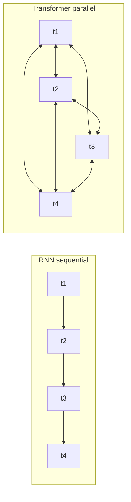
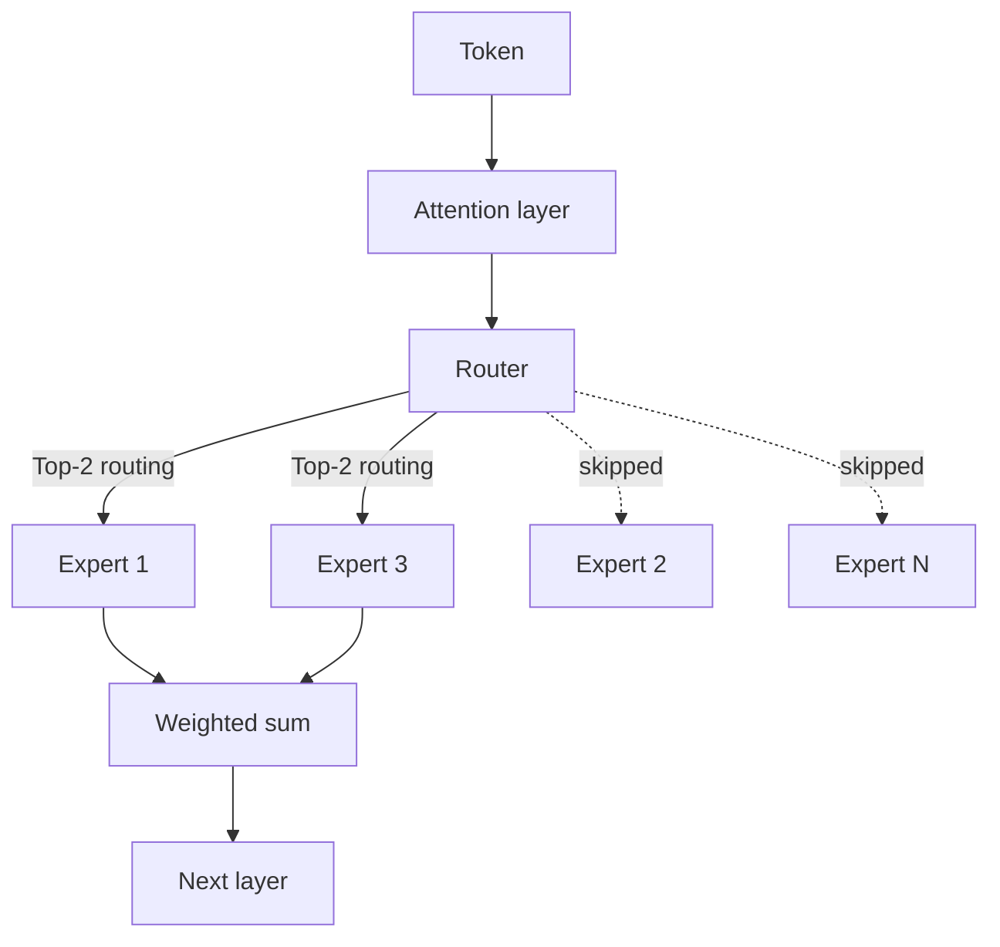

# LLM 内部机制

现代 LLM 的架构核心：Transformer、MoE、注意力数学、RoPE、GQA、KV Cache，以及推动 2026 年模型设计的推理最优扩展转向。

本章介绍大语言模型背后的核心概念。理解这些内部机制，是对 AI 系统做出合理架构决策的基础。若要了解这些架构选择的实际影响，请参阅[推理优化](../04-inference-optimization/)（KV Cache、PagedAttention）、[模型分类](../02-model-landscape/01-model-taxonomy.md)（生产环境中的 MoE 模型），以及[术语表](../GLOSSARY.md)（MoE、RoPE、ALiBi、GQA、MLA 的定义）。

## 目录

- [Transformer 革命](#transformer-革命)
- [架构变体](#架构变体)
- [专家混合（MoE）](#专家混合moe)
- [扩展定律：训练最优与推理最优](#扩展定律训练最优与推理最优)
- [原生多模态](#原生多模态)
- [自注意力机制](#自注意力机制)
- [多头注意力](#多头注意力)
- [位置编码](#位置编码)
- [前馈网络](#前馈网络)
- [层归一化](#层归一化)
- [整合起来看](#整合起来看)
- [需要掌握的关键数字](#需要掌握的关键数字)
- [面试问答](#面试问答)
- [参考资料](#参考资料)

---

## Transformer 革命

2017 年以前，序列建模主要依赖循环架构（RNN、LSTM），按顺序处理 token。这带来了两个问题：

1. **训练速度慢**：顺序处理阻碍了并行化
2. **难以处理长距离依赖**：信息必须经过许多隐藏状态才能传递

Transformer 架构由 Vaswani 等人在《Attention Is All You Need》（2017）中提出，它用自注意力替代循环机制，同时解决了这两个问题。

**给分布式系统工程师的心智模型：**
可以把循环机制想象成单线程请求流水线，每一步都依赖前一步；而自注意力则像全连接图，每个节点都能并行查询其他所有节点。



---

## 架构变体

根据原始 Transformer 中使用的组件不同，形成了三种主要变体：

| 架构 | 注意力类型 | 示例 | 最适合的任务 |
|--------------|---------------|----------|----------|
| 仅编码器 | 双向 | BERT、RoBERTa | 分类、NER、Embedding |
| 仅解码器 | 因果（从左到右） | GPT-4、Claude、Llama | 文本生成、聊天 |
| 编码器—解码器 | 交叉注意力 | T5、BART | 翻译、摘要 |

### 仅解码器（如今大多数 LLM 的架构）

```
┌─────────────────────────────────────────────────────┐
│                 Decoder Block (×N)                  │
│  ┌───────────────────────────────────────────────┐  │
│  │           Masked Self-Attention               │  │
│  │   (Each token attends only to previous)       │  │
│  └───────────────────────────────────────────────┘  │
│                         │                           │
│                    Add & Norm                       │
│                         │                           │
│  ┌───────────────────────────────────────────────┐  │
│  │              Feed-Forward Network             │  │
│  └───────────────────────────────────────────────┘  │
│                         │                           │
│                    Add & Norm                       │
└─────────────────────────────────────────────────────┘
                          │
                          ▼
                   Output Probabilities
```

**为什么仅解码器架构占主流：**
- 架构最简单
- 预训练目标（下一个 token 预测）与生成任务一致
- 能够很好地随计算资源扩展

### 仅编码器（BERT 风格）

使用双向注意力，每个 token 都能看到其他 token。它不能自回归生成文本，但在理解类任务上表现出色。

**实际用途：**
- 微调用于分类（意图识别、情感分析）
- 作为 Embedding 模型的骨干网络
- 针对特定任务提供更小、更快的模型

### 编码器—解码器（编码器的回归）

虽然仅解码器架构多年来占据主导，但针对专门的**推理**和**验证**任务，编码器—解码器架构正在部分回归（例如 o 系列和 Claude 推理模型中的内部验证器）。

---

## 专家混合（MoE）

**前沿模型最重要的架构转变**（GPT-5.5、Claude Opus 4.7、Gemini 3.1 Pro、DeepSeek V4、Llama 4 Maverick、Mixtral）。

MoE 用多个“专家”和一个选择处理当前 token 的“路由器”替代稠密前馈网络（FFN）。

```
┌─────────────────────────────────────────────────────┐
│                 MoE Layer (Decoder)                 │
│  ┌───────────────────────────────────────────────┐  │
│  │               Attention Layer                 │  │
│  └───────────────────────────────────────────────┘  │
│                         │                           │
│                 ┌───────▼───────┐                   │
│                 │     Router    │                   │
│                 └─┬───┬───┬───┬─┘                   │
│          ┌────────┘   │   │   └────────┐            │
│          ▼            ▼   ▼            ▼            │
│   ┌──────────┐ ┌──────────┐ ┌──────────┐ ┌──────────┐│
│   │ Expert 1 │ │ Expert 2 │ │ Expert 3 │ │ Expert N ││
│   └────┬─────┘ └────┬─────┘ └────┬─────┘ └────┬─────┘│
│        └────────────┴───┬───┴────────────┘        │
└─────────────────────────▼───────────────────────────┘
```

### 系统设计中 MoE 的关键细节：
1. **总参数与激活参数**：一个 1.6T 参数的 MoE 模型（如 DeepSeek V4 Pro）每个 token 可能只使用 49B 参数。Llama 4 Maverick 在 128 个专家中激活 17B 参数；Kimi K2.6 的总参数为 1T、激活参数为 32B。
    - **内存约束**：必须存储全部 1.2T 参数（需要很高的显存）。
    - **计算约束**：每次只为 100B 参数支付 FLOPs（延迟更低）。
2. **路由坍缩**：如果路由器总是只选择一个专家，其他专家就无法学习。现代模型使用**负载均衡损失**和**辅助损失**，确保所有专家都能被利用。
3. **DeepSeek-V3 的改进**：引入了**多头潜在注意力（MLA）**和**无辅助损失负载均衡**，这两项技术后来成为 MoE 效率优化的事实标准。DeepSeek V4（2026 年 4 月）将这两项技术扩展到了 100 万 token 的上下文窗口。

每个 token 的路由决策如下图所示：



---

## 扩展定律：训练最优与推理最优

最初的 Chinchilla 定律（2022）关注的是**训练最优**：在给定训练预算下寻找最佳模型规模。

如今，业界已经转向**推理最优**的扩展方式：
- **过度训练**：在远超 Chinchilla 交叉点的大规模数据（15T+ token）上训练更小的模型（例如 Llama 3 8B）。
- **为什么这样做？**：数百万用户带来的推理成本远高于一次性训练成本。一个训练时长为 10 倍的 7B 模型，其服务成本可能低于在 Chinchilla 交叉点训练的 70B 模型。

---

## 原生多模态

旧模型使用**视觉适配器**（把冻结的 CLIP 风格视觉编码器连接到 LLM）。前沿模型（GPT-5.2、Gemini 3）是**原生多模态**模型。

- **共享词表**：视觉 token 和文本 token 存在于同一个潜在空间中。
- **统一 Transformer**：同一组 Block 同时处理像素和文本。
- **优势**：与基于适配器的方法相比，空间推理和“世界模型”理解能力显著更好。

---

## 自注意力机制

自注意力是 Transformer 的核心创新。它允许每个 token 对序列中的其他 token 进行“关注”（收集信息）。

### 直觉

考虑这句话：“The animal didn't cross the street because it was too tired.”

这里的 “it” 指什么？理解这句话需要把 “it” 和 “animal” 联系起来。自注意力通过计算所有 token 对之间的相关性分数来学习这种联系。

### 数学形式

对于长度为 n、维度为 d 的输入序列 X：

```
Q = XW_Q   (Query: What am I looking for?)
K = XW_K   (Key: What do I contain?)
V = XW_V   (Value: What do I contribute?)

Attention(Q, K, V) = softmax(QK^T / √d_k) × V
```

**逐步解释：**
1. **QK^T**：点积衡量 Query 与 Key 的相似度（n × n 矩阵）
2. **/ √d_k**：进行缩放，避免大维度导致 Softmax 饱和
3. **softmax**：转换为概率（每行之和为 1）
4. **× V**：根据注意力权重对 Value 做加权求和

### 为什么要除以 √d_k？

**面试高频题**：这个问题经常被问到，因为它能检验对数值稳定性的理解。

如果不做缩放，随着维度 d 增大，点积会按比例增大。过大的点积会把 Softmax 推入饱和区域，导致梯度消失。

```python
# Without scaling (problematic for large d)
d = 512
q = np.random.randn(d)
k = np.random.randn(d)
dot = np.dot(q, k)  # Expected magnitude: ~√d ≈ 22.6

# With scaling
scaled_dot = dot / np.sqrt(d)  # Expected magnitude: ~1
```

### 注意力复杂度

| 操作 | 时间复杂度 | 空间复杂度 |
|-----------|-----------------|------------------|
| QK^T 计算 | O(n²d) | O(n²) |
| Softmax | O(n²) | O(n²) |
| 与 V 做加权求和 | O(n²d) | O(nd) |

O(n²) 的复杂度限制了上下文长度。100K 的上下文窗口意味着每层要进行 100 亿次注意力计算。

---

## 多头注意力

现代 Transformer 不使用单一注意力，而是使用多个“头”并行关注不同方面。

```
┌─────────────────────────────────────────────────────────────┐
│                    Multi-Head Attention                      │
│                                                              │
│   ┌─────────┐  ┌─────────┐  ┌─────────┐       ┌─────────┐   │
│   │ Head 1  │  │ Head 2  │  │ Head 3  │  ...  │ Head h  │   │
│   │ d_k=64  │  │ d_k=64  │  │ d_k=64  │       │ d_k=64  │   │
│   └────┬────┘  └────┬────┘  └────┬────┘       └────┬────┘   │
│        │            │            │                  │        │
│        └────────────┴────────────┴──────────────────┘        │
│                              │                               │
│                         Concatenate                          │
│                              │                               │
│                         W_O (project)                        │
└─────────────────────────────────────────────────────────────┘
```

**为什么需要多个头？**
- 不同的头可以学习不同模式（语法、语义、指代）
- 类似集成方法：多个视角可以提升鲁棒性
- 支持在不同头之间并行处理

**典型配置：**
- GPT-3 175B：96 个头 × 128 维 = 12,288 总维度
- Llama 2 70B：64 个头 × 128 维 = 8,192 总维度

### 分组查询注意力（GQA）

**对生产系统至关重要**：标准多头注意力需要在 KV Cache 中为每个头分别存储 K 和 V。GQA 让一组头共享 K 和 V。

| 注意力类型 | 每个 Query 对应的 K、V | KV Cache 缩减 | 示例 |
|----------------|---------------|----------|----------|
| 多头（MHA） | 1:1 | 基准 | GPT-3 |
| 分组查询（GQA） | 通常 8:1 | 约 8 倍 | Llama 2、Mistral |
| 多查询（MQA） | 全部共享 1 组 | 约 n_heads 倍 | PaLM、Falcon |

**实际影响：**
以 8K 上下文的 Llama 2 70B 为例：
- MHA KV Cache：每个请求约 10 GB
- GQA KV Cache：每个请求约 1.3 GB

这会直接影响批大小，进而影响吞吐量。

---

## 位置编码

自注意力具有排列不变性。如果没有位置信息，“dog bites man”和“man bites dog”会被视为相同。位置编码把序列顺序注入模型。

### 正弦位置编码（原始 Transformer）

使用不同频率的正弦和余弦函数：

```
PE(pos, 2i) = sin(pos / 10000^(2i/d))
PE(pos, 2i+1) = cos(pos / 10000^(2i/d))
```

**特性：**
- 确定性的，不包含可学习参数
- 理论上可以外推到更长序列
- 实际上外推效果并不好

### 可学习的绝对位置编码

为每个位置学习一个独立的 Embedding：

```python
position_embeddings = nn.Embedding(max_length, d_model)
```

**特性：**
- 简单有效
- 无法外推到训练长度之外
- 早期模型（GPT-2、BERT）大多采用此方法

### 旋转位置编码（RoPE）

通过旋转 Query 和 Key 向量来编码位置信息：

```
RoPE(x, pos) = x × cos(pos × θ) + rotate(x) × sin(pos × θ)
```

**特性：**
- 相对位置：注意力取决于 (pos_q - pos_k)
- 比绝对位置编码有更好的外推能力
- 使用模型：Llama、Mistral、PaLM

### ALiBi（带线性偏置的注意力）

直接向注意力分数加入与位置相关的偏置：

```
Attention = softmax(QK^T / √d_k - m × distance)
```

其中 m 是每个头各自的斜率，distance 是 |pos_q - pos_k|。

**特性：**
- 不修改 Embedding
- 外推能力优秀
- 使用模型：BLOOM、MPT

### 位置编码对比

| 方法 | 外推能力 | 计算开销 | 现代使用情况 |
|--------|---------------|------------------|--------------|
| 正弦 | 差 | 无 | 很少 |
| 可学习 | 无 | 极小 | 遗留模型 |
| RoPE | 好 | 约 5% | 大多数 LLM |
| ALiBi | 优秀 | 约 2% | 部分 LLM |

---

## 前馈网络

每个 Transformer 层都有一个逐位置处理的前馈网络（FFN）：

```python
def feed_forward(x):
    hidden = activation(x @ W1 + b1)  # Expand: d → 4d
    output = hidden @ W2 + b2         # Contract: 4d → d
    return output
```

**关键特性：**
- 逐位置处理：每个位置使用相同的权重
- 扩展比例：通常为 4 倍（例如 4096 → 16384 → 4096）
- 参数主要所在位置：FFN 约占每层参数的 2/3

### 激活函数

| 激活函数 | 公式 | 特性 | 使用情况 |
|------------|---------|------------|-------|
| ReLU | max(0, x) | 简单、稀疏 | 原始架构 |
| GELU | x × Φ(x) | 平滑，BERT 使用 | GPT-2、BERT |
| SwiGLU | Swish(xW) × xV | 当前先进方案 | Llama、PaLM |

SwiGLU 增加了门控机制，代价是 FFN 中的参数量增加约 50%。

### GLU 变体

```python
# Standard FFN
hidden = gelu(x @ W1)
output = hidden @ W2

# SwiGLU FFN
gate = silu(x @ W_gate)
hidden = x @ W_up
output = (gate * hidden) @ W_down
```

---

## 层归一化

层归一化通过归一化激活值来稳定训练：

```python
def layer_norm(x, gamma, beta):
    mean = x.mean(dim=-1, keepdim=True)
    var = x.var(dim=-1, keepdim=True)
    normalized = (x - mean) / sqrt(var + eps)
    return gamma * normalized + beta
```

### Pre-LN 与 Post-LN

**Post-LN（原始 Transformer）：**
```
x = x + Attention(LayerNorm(x))  # Wrong - this is Pre-LN
x = LayerNorm(x + Attention(x))  # Post-LN: normalize after residual
```

**Pre-LN（现代 LLM）：**
```
x = x + Attention(LayerNorm(x))  # Pre-LN: normalize before sublayer
```

| 变体 | 训练稳定性 | 最终性能 | 使用情况 |
|---------|-------------------|-------------------|-------|
| Post-LN | 更难 | 略好 | 原始论文 |
| Pre-LN | 容易得多 | 良好 | 大多数现代 LLM |

Pre-LN 已成为标准，因为它无需精细调节学习率就能训练很深的模型。

### RMSNorm

一种跳过均值中心化的简化方案：

```python
def rms_norm(x, gamma):
    rms = sqrt(mean(x^2) + eps)
    return gamma * (x / rms)
```

在性能相近的情况下，它比 LayerNorm 快约 10–15%。Llama、Mistral 都使用 RMSNorm。

---

## 整合起来看

一个完整的 Transformer 层：

```python
class TransformerLayer:
    def __init__(self, d_model, n_heads, d_ff):
        self.attn_norm = RMSNorm(d_model)
        self.attn = MultiHeadAttention(d_model, n_heads)
        self.ff_norm = RMSNorm(d_model)
        self.ff = SwiGLU_FFN(d_model, d_ff)

    def forward(self, x, mask=None):
        # Pre-norm attention with residual
        h = x + self.attn(self.attn_norm(x), mask)
        # Pre-norm FFN with residual
        out = h + self.ff(self.ff_norm(h))
        return out
```

**完整模型：**
```
Token IDs → Embedding → [Transformer Layer × N] → Output Norm → LM Head → Logits
```

---

## 需要掌握的关键数字

### 模型规模

| 模型 | 参数量 | 层数 | 头数 | 维度 | FFN 维度 |
|-------|------------|--------|-------|-----------|---------|
| GPT-3 | 175B | 96 | 96 | 12,288 | 49,152 |
| Llama 2 70B | 70B | 80 | 64 | 8,192 | 28,672 |
| Llama 2 7B | 7B | 32 | 32 | 4,096 | 11,008 |
| Mistral 7B | 7B | 32 | 32 | 4,096 | 14,336 |

### 内存需求

```
Model weights (FP16) ≈ 2 bytes × parameters
- 70B model: ~140 GB
- 7B model: ~14 GB

KV Cache per token (FP16):
= 2 × layers × heads × head_dim × 2 bytes
- Llama 70B: 2 × 80 × 64 × 128 × 2 = 2.6 MB per token
- At 8K context: 21 GB per request
```

### 计算需求

```
FLOPs per token forward pass ≈ 2 × parameters
- 70B model: ~140 TFLOPs per token
- Generate 100 tokens: 14 PFLOPs

H100 at 990 TFLOPS (FP16):
- Single token: 140ms theoretical (actual: ~20-50ms with batching)
```

---

## 关键结论

- 从 RNN 到 Transformer 的转变核心是并行化，而不只是质量提升；这也是 GPU 扩展定律得以发展的原因。
- MoE 把总参数（内存成本）与激活参数（计算成本）分开：1.2T 的 MoE 模型可以以 100B 稠密模型的延迟提供服务。
- 在生产环境中，推理最优扩展优于 Chinchilla：因为在模型生命周期内推理成本占主导，应当对小模型进行过度训练。
- GQA 是当前模型中影响最大的 KV Cache 优化之一；讨论服务成本前要先理解 N:G 的比例。
- Pre-LN 配合 RMSNorm 是现代默认方案；如果面试回答中出现 Post-LN，候选人很可能是在引用 2018 年的论文。

---

## 面试问答

### 问：解释为什么 Transformer 注意力是 O(n²)，以及有哪些替代方案。

**强回答：**
注意力要计算所有 token 两两之间的相似度。对于长度为 n 的序列：
- QK^T 是 [n, d] × [d, n]，每个头需要进行 n² 次乘法
- 注意力权重的存储空间为 n² 个浮点数

替代方案：
- 稀疏注意力（Longformer）：使用局部 + 全局模式，复杂度为 O(n)
- 线性注意力（Performer）：使用随机特征近似，复杂度为 O(n)
- Flash Attention：计算量仍为 O(n²)，但通过 Kernel 融合把内存降到 O(n)
- 状态空间模型（Mamba）：完全线性的 O(n)

权衡在于：完整的长距离依赖需要 n² 计算，但大多数任务并不需要所有 token 两两交互。

### 问：什么是 KV Cache？为什么它对服务至关重要？

**强回答：**
自回归生成时，模型每次只生成一个 token。如果没有缓存，每一步都要重新计算之前所有 token 的 K 和 V。

KV Cache 保存之前各位置的 K 和 V。每生成一个新 token：
1. 只为新位置计算 Q、K、V
2. 将新的 K、V 拼接到缓存的 K、V 后面
3. 使用完整的 K、V 进行注意力计算

这样可以把 K、V 计算的单 token 复杂度从 O(n) 降低为 O(1)。

**代价：**内存随序列长度线性增长。以 8K 上下文的 Llama 70B 为例，每个请求的 KV Cache 约为 21 GB。这会限制批大小，并要求使用 PagedAttention 等技术。

### 问：为什么现代 LLM 使用 Pre-LN 而不是 Post-LN？

**强回答：**
Pre-LN 把归一化放到每个子层之前，而不是之后。这样可以通过残差连接为梯度建立更直接的路径。

在 Post-LN 中，梯度必须经过归一化层，这可能导致训练开始阶段不稳定。Post-LN 需要学习率预热和更谨慎的初始化。

Pre-LN 使训练 100 层以上的深度模型成为可能，而不需要特殊初始化。它的代价是最终性能略低，但实际中训练稳定性的收益更重要。

### 问：MHA、MQA 和 GQA 有什么区别？

**强回答：**
三者都是多头注意力的变体，区别在于 K、V 头如何共享：

- **MHA（多头注意力）**：每个 Query 头都有自己的 K、V 头，比例为 N:N。
- **MQA（多查询注意力）**：所有 Query 头共享一个 K、V 头，比例为 N:1。
- **GQA（分组查询注意力）**：一组 Query 头共享 K、V 头，比例为 N:G（典型 G=8）。

对 KV Cache 的内存影响：
- MHA：完整大小
- MQA：1/N 大小（但质量会下降）
- GQA：1/G 大小（最好的折中）

Llama 2 70B 使用 GQA：64 个 Query 头配 8 个 KV 头，在质量损失很小的情况下把 KV Cache 缩小了 8 倍。

---

## 参考资料

- Vaswani 等：《Attention Is All You Need》（2017）
- Su 等：《RoFormer: Enhanced Transformer with Rotary Position Embedding》（2021）
- Press 等：《Train Short, Test Long: Attention with Linear Biases》（ALiBi，2022）
- Shazeer：《GLU Variants Improve Transformer》（2020）
- Ainslie 等：《GQA: Training Generalized Multi-Query Transformer Models》（2023）
- [Illustrated Transformer](https://jalammar.github.io/illustrated-transformer/)
- [The Annotated Transformer](https://nlp.seas.harvard.edu/2018/04/03/attention.html)

---

*下一篇：[Tokenization 深入理解](02-tokenization-deep-dive.md)*
