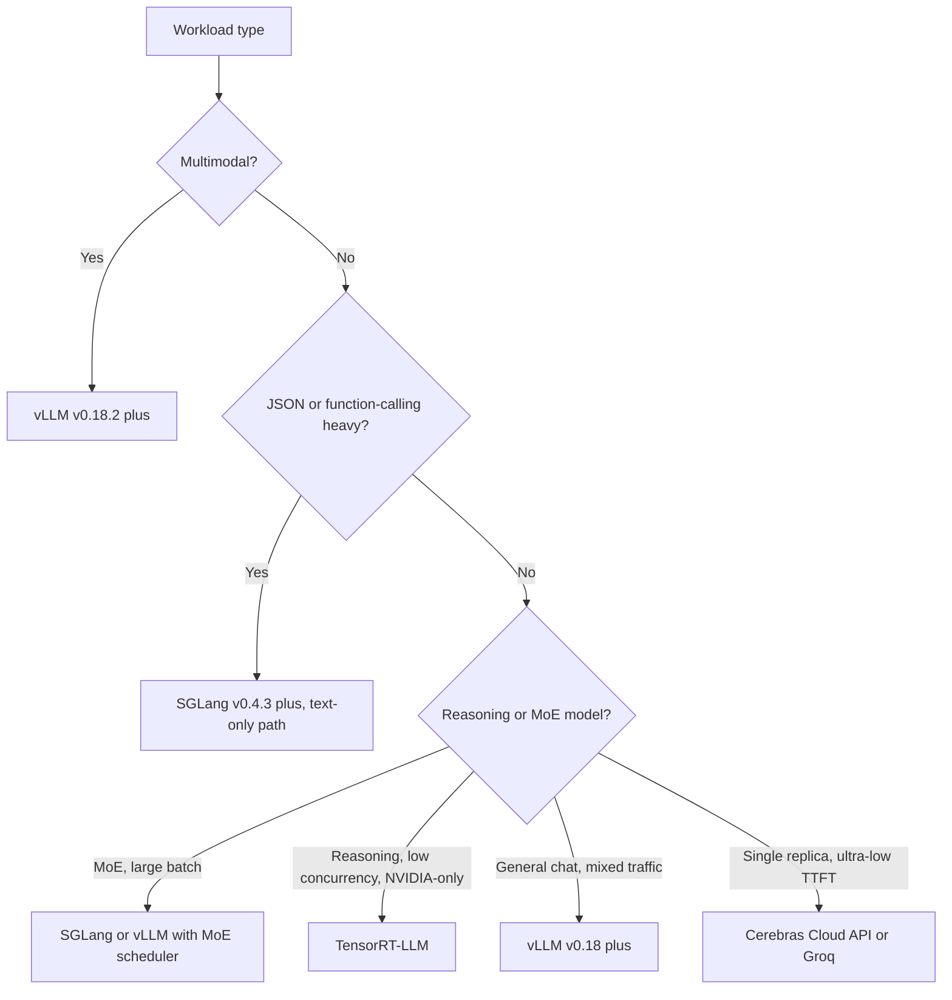

# 服务基础设施

大规模部署 LLM 需要健壮的基础设施层，负责负载均衡、模型并行和多租户隔离。关注点已经从“服务一个模型”转向“编排一支推理机群”。

## 目录

- [推理网关](#inference-gateway)
- [模型并行（Tensor 与 Pipeline）](#parallelism)
- [多 GPU 编排](#multi-gpu)
- [流式传输与长连接](#streaming)
- [2026 年 5 月推理引擎版图](#may-2026-inference-engine-landscape)
- [面试问题](#interview-questions)
- [参考资料](#references)

---

## 推理网关

网关是 AI 工作负载的“交通控制器”。

| 组件 | 职责 |
|------|------|
| **认证与限流** | 基于 Token 的配额和租户隔离。 |
| **模型路由器** | 将请求导向特定模型版本（Canary/A-B）。 |
| **上下文跟踪器** | 确保用户的 Prompt Cache 被发送到同一个 GPU 节点（会话粘滞）。 |
| **输出过滤器** | 对流式响应进行实时安全过滤和 PII 清理。 |

---

## 模型并行

对于无法放入单张 GPU 的模型（例如 Llama 4 405B 需要约 800GB VRAM），必须把模型拆分开来。

### 1. Tensor Parallelism（TP）

把单个层/张量拆分到多张 GPU 上。
- **延迟**：低（最快）。
- **通信**：高（需要 NVLink）。
- **标准**：单节点（8 张 GPU）内 90% 的生产服务都使用它。

### 2. Pipeline Parallelism（PP）

把不同层拆分开（例如 GPU 1 承载第 1～40 层，GPU 2 承载第 41～80 层）。
- **延迟**：高（有微批处理开销）。
- **效率**：利用率较低（存在气泡时间）。
- **标准**：仅用于跨多个节点部署的超大模型。

---

## 多 GPU 编排

生产环境中的 Kubernetes Operator（如 **Kube-Ray** 或 **Gloo**）会管理“GPU 池”。

- **异构集群**：在同一个集群中混用承载前沿模型的 H100 和承载小模型的 L4。
- **自动扩缩容**：依据 **KV Cache 利用率**，而不是 CPU 或普通内存使用率进行扩缩容。
- **冷启动**：使用**未量化基础镜像**，从高速 Lustre/挂载点加载权重，把启动时间从几分钟缩短到 15～20 秒。

---

## 流式传输与长连接

LLM 几乎总是通过 **Server-Sent Events（SSE）** 或 **WebSockets** 提供服务。

**基础设施挑战**：标准负载均衡器（四层）难以处理长时间存在的 AI 连接。
- **解决方案**：使用能理解“序列结束”Token 的**七层负载均衡器**（Envoy/Istio），在用户两轮交互之间重新平衡流量，而不是只在连接级别进行平衡。

---

## 2026 年 5 月推理引擎版图

到 2026 年 5 月，引擎选择已经不再是“哪个最快”的问题。每个领先引擎都赢得了特定的工作负载类别，正确答案是按工作负载选择引擎，而不是全公司只使用一个引擎。下面是团队实际采用的实用地图。

### vLLM v0.18+：默认开源引擎

[vLLM](https://docs.vllm.ai/) 在 2026 年第一季度达到 **v0.18**，并在 5 月前持续发布小版本。新增内容包括：

- **Blackwell Ultra（B300）支持**进入主线，包括 FP4 和动态稀疏（[vLLM v0.18 发布说明](https://github.com/vllm-project/vllm/releases)）。
- 支持带 NUMA 感知分配的 **PagedAttention v3**，在多路 CPU 主机上显著改善尾延迟。
- **Prefill/Decode 解耦**进入配置开关之后，主要面向超长上下文工作负载。
- 针对 Llama 4 Maverick、DeepSeek V4 Pro、Mixtral 8x22B 的 **MoE 调度器**，支持感知专家驻留的批处理。

**重要安全提示**：vLLM 修复了一个高危的**多模态 RCE**（[GHSA 于 2026 年 2 月发布](https://github.com/vllm-project/vllm/security/advisories)），该漏洞影响 v0.18.2 之前版本的多模态预处理器。**所有多模态 vLLM 部署都必须运行 v0.18.2 或更高版本。**修复只需一行补丁，但这个 CVE 确实存在，并且可以通过构造的图像输入利用。请升级。

当工作负载是“使用连续批处理运行 Llama/Mistral/Qwen/DeepSeek”时，vLLM 仍然是默认的开源引擎。它并不总是最快，但最容易运维，经过最充分的测试，也最可能在新漏洞出现后于同一周内获得补丁。

### SGLang v0.4.3+：吞吐量领先，但有重要限制

[SGLang](https://github.com/sgl-project/sglang) v0.4.3（2026 年 4 月）在若干工作负载上是吞吐量领先者：

- 在已发布的基准中，结构化输出/函数调用工作负载的吞吐量比 vLLM 高约 **29%**（[SGLang 博客，2026 年 4 月](https://lmsys.org/blog/2024-12-04-sglang-v0-4/)）。优势来自**异步约束解码**，约束编译可以与 LLM 前向过程并行执行。
- 对聊天工作负载具有一流的 **RadixAttention** 前缀缓存复用能力。
- 原生支持带专家路由感知批处理的 **MoE 服务**。

**截至 2026 年 5 月的关键安全限制**：SGLang 在多模态和解耦 Prefill 代码路径中存在**尚未修复的 RCE**（[SGLang 安全公告，2026 年 3 月](https://github.com/sgl-project/sglang/security/advisories)）。纯文本路径是安全的，也是所有公开基准所使用的路径。在补丁发布前，多模态路径应被视为**不适合生产**。一些大型部署已经把多模态流量从 SGLang 切回 vLLM v0.18.2，同时继续让 SGLang 处理纯文本函数调用工作负载。

2026 年 5 月的正确姿势是：对于吞吐优势很重要的**纯文本函数调用和结构化输出工作负载**，可以使用 SGLang；在 CVE 修复前，不要将 SGLang 用于**多模态或解耦 Prefill 的生产流量**。

### TensorRT-LLM：NVIDIA 峰值吞吐量与运维成本

[TensorRT-LLM](https://github.com/NVIDIA/TensorRT-LLM) 在纯 NVIDIA 硬件上仍是吞吐量领先者：

- 对经过手工调优的模型，在 H200、B200 和 B300 上具有最高的峰值 tokens/sec/$。
- 与 **NVIDIA Triton** 服务和 **NVIDIA NIM** 托管部署紧密集成。
- 针对 **Blackwell Ultra 上 FP4/FP8** 的定制 Kernel，通常比开源引擎领先数月。

代价在于运维：

- 每个新模型都需要一次**引擎构建**（耗时数小时、且与模型和 GPU 绑定的编译步骤）。
- 必须固定 TensorRT 和 CUDA 版本；升级通常很痛苦。
- **仅支持 NVIDIA**。离开 CUDA 就需要完整的平台重构。

决策很简单：如果未来两年确定使用 NVIDIA，并且只有一两个旗舰模型需要榨干最后的每秒 Token 数，那么 TensorRT-LLM 值得付出代价。如果需要引擎灵活性、厂商独立性或快速迭代模型，vLLM 或 SGLang 更合适。

### MoE 感知服务（Llama 4 Maverick、DeepSeek V4 Pro）

MoE 模型打破了服务成本随批大小平滑增长的假设。2026 年 5 月，MoE 服务引擎需要关注以下属性：

- **专家权重驻留**：一个 400B 参数、每个 Token 激活 17B 参数的 MoE 模型，如果让未使用的专家一直保持热驻留，大部分 VRAM 都会被浪费。引擎必须理解专家到 Token 的路由，并固定热点专家或流式加载冷门专家。
- **专家路由延迟**：路由器的决策**每个 Token 都会发生**，并带来可测量的成本。引擎现在会沿批次维度批量处理路由决策。
- **非单调的批处理曲线**：向批次加入请求可能会降低吞吐量，因为它迫使更多冷门专家被激活。最优批大小取决于批次中**路由模式的分布**，而不只是请求数量。
- **流水线感知调度**：最好的引擎会把新请求调度到与正在执行的批次共享专家激活的批次中。

| 引擎 | Llama 4 Maverick（2026 年 5 月） | DeepSeek V4 Pro（2026 年 5 月） |
|------|----------------------------------|----------------------------------|
| vLLM v0.18+ | 稳定，MoE 调度器已进入主线 | 稳定 |
| SGLang v0.4.3+ | 稳定，批大小 >32 时吞吐领先 | 稳定 |
| TensorRT-LLM | 稳定，低并发时吞吐领先 | 稳定 |

面试中可以这样总结：**MoE 服务不再是“给 vLLM 换上更大的权重”。**这是一个不同的调度问题，而所有引擎在过去 12 个月都已经开发了专用的 MoE 路径。

### 决策框架：按工作负载选择引擎

团队实际部署的工作负载可以更明确地映射如下：

| 工作负载 | 引擎选择（2026 年 5 月） | 原因 |
|----------|------------------------|------|
| 公共聊天机器人（混合流量，必须快速打补丁） | **vLLM v0.18.2+** | 最容易运维，安全更新节奏最好 |
| JSON 函数调用后端 | **SGLang v0.4.3+**（纯文本路径） | 结构化输出吞吐量提升约 29% |
| 单模型延迟敏感（一个模型、一个团队） | **B300 上的 TensorRT-LLM** | NVIDIA 峰值吞吐量值得承担单模型运维成本 |
| 多模态（输入图像、音频、视频） | **vLLM v0.18.2+** | SGLang 多模态路径尚未完成修复 |
| 推理模型（长 CoT、低并发） | **TensorRT-LLM** 或带解耦 Prefill 的 **vLLM** | 受 Decode 限制，能从定制 Kernel 中获益 |
| MoE 模型（Llama 4 Maverick、DeepSeek V4 Pro） | 带 MoE 调度器的 **vLLM v0.18+** 或 **SGLang v0.4.3+** | 两者现在都有一流的 MoE 路径 |
| 单副本、TTFT 低于 50ms | **Cerebras Cloud API** 或 **Groq LPU** | GPU 无法在 70B+ 模型上达到这种速度 |

### 2026 年 5 月的运维姿势

- **始终使用已修复的版本。**推理引擎现在的 CVE 节奏已经接近 Web 服务器。多模态 RCE 不是理论风险。
- **在第二个引擎上运行 Canary。**生产流量使用 vLLM，在 SGLang 或 TensorRT-LLM 上运行 1～5% 的 Canary，并对质量或延迟偏差告警。这样可以捕捉引擎特有的 Bug，并提供更快的迁移路径。
- **把引擎视为部署清单的一部分。**模型不是“Llama 4 Maverick”，而是“在这套硬件上、使用这个批处理配置运行的 vLLM v0.18.3 版 Llama 4 Maverick”。四个要素都要固定。
- **关注安全公告订阅源**，而不只是发布说明：[vLLM 公告](https://github.com/vllm-project/vllm/security/advisories)、[SGLang 公告](https://github.com/sgl-project/sglang/security/advisories)、[TensorRT-LLM CVE 列表](https://nvd.nist.gov/vuln/search/results?form_type=Basic&search_type=all&query=tensorrt-llm)。

---

## 面试问题

### Q：为什么低延迟服务更偏好 Tensor Parallelism，而不是 Pipeline Parallelism？

**强回答：**

Tensor Parallelism（TP）会同时在多张 GPU 上执行一个层的矩阵乘法，因此该层的延迟会随着 GPU 数量增加而降低。相反，Pipeline Parallelism（PP）顺序处理不同的层。当 GPU 2 处理第 40～80 层时，GPU 1 处于空闲状态，除非有很深的多请求流水线（批处理）。对于单个用户请求，PP 会叠加所有 GPU 的延迟，而 TP 会把延迟分摊到所有 GPU 上。

### Q：多租户 LLM 集群中如何处理“吵闹邻居”？

**强回答：**

我们通过**分层的迭代级调度**处理吵闹邻居。每个租户都被分配总 GPU 周期的一定“份额”。在连续批处理循环中，调度器确保单个租户不会占满 100% 的 KV Cache 槽位。如果租户 A 压垮系统，调度器会优先处理租户 B 和 C 的 Prefill 步骤，或者每个周期只处理租户 A 的一部分 Decode 迭代。这一机制在网关层通过 Token Bucket 限流实现，在服务引擎层通过具体调度策略实现。

---

## 参考资料

- Narayanan 等，《Efficient Large-Scale Language Model Training on GPU Clusters Using Pipedream》（2019/2021）
- NVIDIA，《Megatron-LM: Training Multi-Billion Parameter Models on GPU Clusters》（2021）

---

*下一篇：[成本优化实战手册](07-cost-optimization-playbook.md)*
