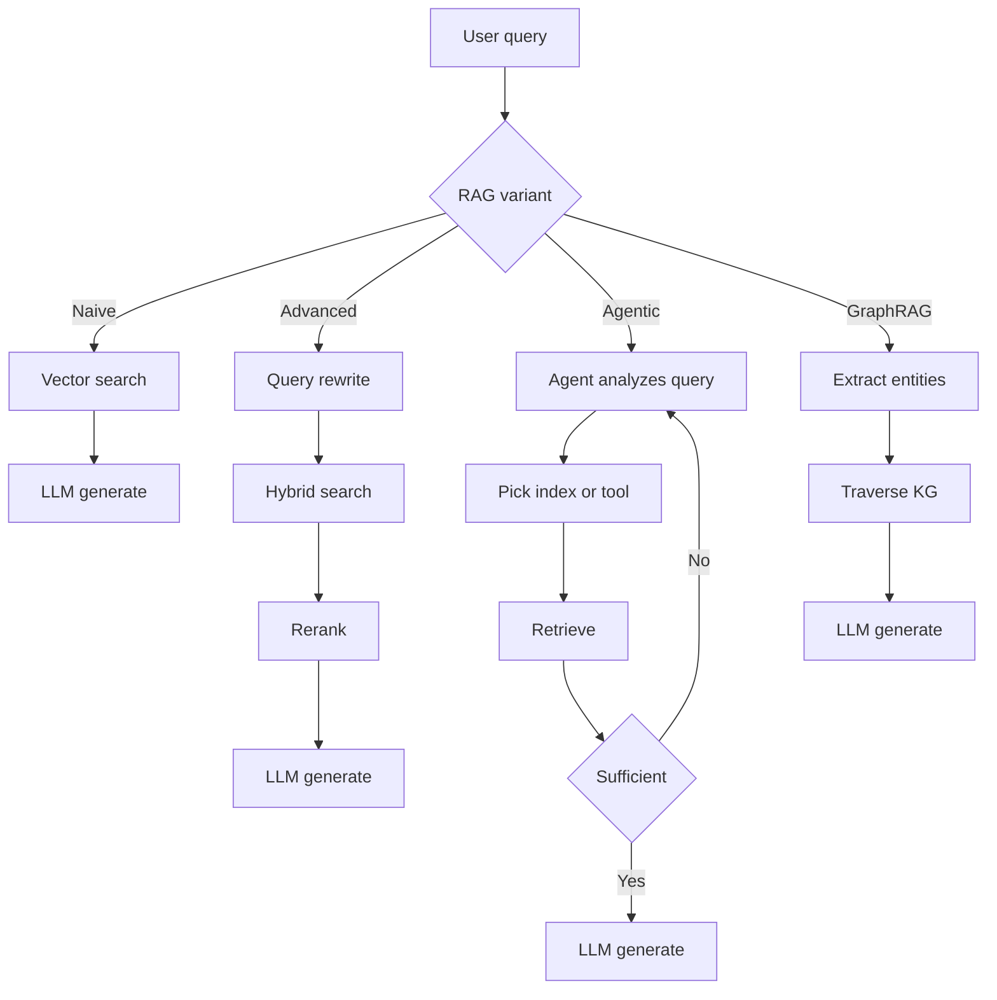
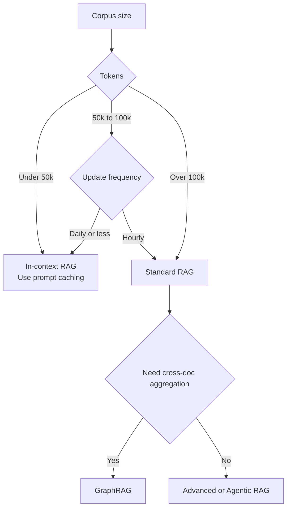

# RAG 基础

RAG 如何从朴素向量搜索发展到 Agent 化和图结构检索；什么时候选择 RAG 而不是长上下文，以及导致生产失败的三个检索缺口。

检索增强生成（RAG）是一种架构模式：向 LLM 提供外部、可验证的上下文，使其回答有依据。它已经从“简单向量搜索”发展为多阶段推理流水线：混合检索、重排序、上下文分块和 Agent 循环如今都是生产系统的基本配置。更深入的内容见[分块策略](02-chunking-strategies.md)、[向量数据库](04-vector-databases.md)、[重排序](06-reranking-strategies.md)、[上下文检索](10-contextual-retrieval.md)、[ColBERT Late Interaction](11-late-interaction-colbert.md)和[GraphRAG 重构](07-graph-rag.md)。

## 目录

- [核心理念：Grounding 与训练](#philosophy)
- [RAG 分类](#taxonomy)
- [RAG 与 200 万上下文（混合时代）](#rag-vs-long-context)
- [检索质量缺口](#quality-gap)
- [面试问题](#interview-questions)
- [参考资料](#references)

---

## 核心理念：Grounding 与训练

| 方面 | 微调 | RAG |
|------|------|-----|
| **知识类型** | 内化（权重） | 外置（上下文） |
| **更新周期** | 成本高（重新训练） | 成本为零（更新数据库） |
| **归因** | 无（黑盒） | 明确（引用） |
| **隐私** | 很难“遗忘” | 易于过滤/删除 |

**经验法则**：微调用于**形式**（风格、语气、语法）；RAG 用于**事实**（知识、数据、依据）。

---

## RAG 分类

生产 RAG 系统按其“Agent 深度”分类：

### 1. 朴素 RAG（先检索后生成）

- **流程**：用户查询 -> 向量搜索 -> Top-K -> LLM。
- **状态**：由于存在“检索缺口”且精度低，已不适合生产。

### 2. 高级 RAG（多阶段）

- **流程**：查询转换 -> 混合搜索 -> 重排序 -> LLM。
- **关键细节**：使用 **RRF（倒数排名融合）**合并关键词和语义结果。

### 3. Agentic RAG（循环式）

- **流程**：Agent 分析查询 -> 决定搜索哪些工具/索引 -> 评估结果 -> 信息不足时重新检索。
- **技术**：Self-RAG、Corrective RAG（CRAG）。

### 4. GraphRAG（结构化上下文）

- **流程**：抽取实体/关系 -> 构建知识图谱 -> 遍历图寻找“关联知识”。
- **优势**：解决“聚合型问题”（例如“总结 50 份文档中的所有法律风险”）。

四种不同 Agent 深度的变体如下：

---

## RAG 与 200 万上下文（“混合时代”）

随着 Gemini 1.5 Pro（200 万+）和 Claude Sonnet 4.6（100 万+）等模型出现，RAG 正在改变。

- **上下文内 RAG（ICR）**：对于少于 50k Token 的数据集，跳过向量数据库，把所有内容放进 Prompt。
- **Prompt Caching**：通过在 GPU 上缓存“背景知识”，让长上下文 RAG 便宜 90%。

**架构决策**：
- 如果语料库 > 100k Token 且动态变化：使用**标准 RAG**。
- 如果语料库 < 100k Token：使用**上下文内 RAG**。

在标准 RAG 与上下文内 RAG 之间选择的决策树：

---

## 检索质量缺口

“检索缺口”是 RAG 失败的第一大原因。
- **缺口 1：语义不匹配**：查询说“快车”，数据库里是“保时捷 911”。用**Embedding 重排序器**解决。
- **缺口 2：上下文缺失**：相关信息在数据库里，但 Retriever 没有召回。用**混合搜索**解决。
- **缺口 3：中间丢失**：信息已经在 Prompt 中，但 LLM 没有注意到。用**上下文压缩**解决。

---

## 面试问题

### Q：如果前沿模型都提供 100 万～200 万 Token 上下文，为什么还要使用 RAG？

**强回答：**

有三个层面的原因：
1. **成本和延迟**：即使使用 Prompt Caching，每次新用户查询都重新读取 200 万 Token，也显著贵于检索 5 个相关块（约 2k Token），TTFT（首 Token 时间）也更高。
2. **新鲜度**：RAG 可以访问实时 API（股票价格、新闻），这些内容无法静态嵌入上下文窗口。
3. **规模**：企业数据集（SharePoint、TB 级日志）甚至超过 200 万 Token。RAG 充当“过滤器”，从数据中找出真正应该进入高价值上下文窗口的 0.01%。

### Q：什么是 Agentic RAG？它与高级 RAG 有什么区别？

**强回答：**

高级 RAG 是**确定性流水线**（线性：改写 -> 搜索 -> 重排），Agentic RAG 是**随机性循环**。在 Agentic RAG 中，模型获得工具，可以决定*如何*检索。例如，如果 Agent 发现检索到的文档不相关，它可以决定“搜索 Google”或“查询 SQL 数据库”。它本质上在检索前后都增加了“推理步骤”，确保上下文足以回答 Prompt。

---

## 关键结论

- 朴素 RAG（向量搜索 + Top-K + LLM）已不适合生产；应把高级 RAG（混合 + RRF + 重排）作为新基线。
- 长上下文窗口不会消灭 RAG：即使上下文达到 200 万，成本、延迟、新鲜度和语料规模仍会把你推回检索。
- 按语料规模选择：低于 50k Token 使用带 Prompt Caching 的上下文内 RAG；超过 100k 使用标准 RAG；聚合型问题使用 GraphRAG。
- 大多数 RAG 失败是检索失败，而不是生成失败；调 Prompt 前先诊断三个缺口（语义、上下文缺失、中间丢失）。
- Agentic RAG 与高级 RAG 的选择，本质是随机性循环与确定性流水线的选择；只有当查询模式过于多样、固定流水线无法覆盖时才采用 Agentic RAG。

---

## 参考资料

- Gao 等，《Retrieval-Augmented Generation for LLMs: A Survey》（2024 更新）
- Microsoft，《From RAG to GraphRAG》（2024）
- Google，《Long-context LLMs as Retrievers》（2025）
- [Anthropic，《Introducing Contextual Retrieval》（2024 年 9 月）](https://www.anthropic.com/news/contextual-retrieval)

---

*下一篇：[分块策略](02-chunking-strategies.md)*
