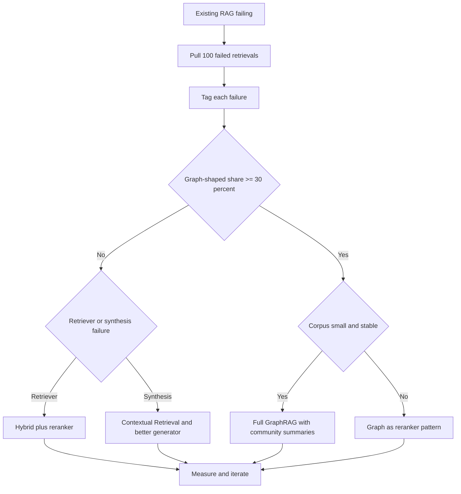
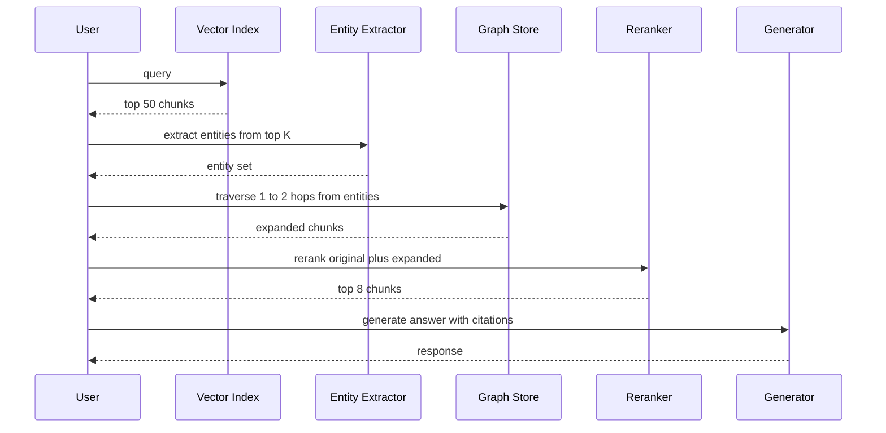

# GraphRAG

GraphRAG 是**知识图谱（KG）**与**检索增强生成**的结合。向量 RAG 擅长“找到某个具体片段”，而 GraphRAG 的设计目标是对整个数据集进行**全局推理**。

## 目录

- [GraphRAG 真正胜出的场景（以及不胜出的场景）](#when-graphrag-actually-wins-and-when-it-doesnt)
- [图作为重排序器模式（2026 年 5 月）](#graph-as-reranker-pattern-may-2026)
- [向量 RAG 的局限](#limitations)
- [GraphRAG 架构（抽取-构建-查询）](#architecture)
- [社区摘要（Microsoft 模式）](#communities)
- [实体-关系检索](#retrieval)
- [什么时候使用 GraphRAG](#when)
- [面试问题](#interview-questions)
- [参考资料](#references)

---

## GraphRAG 真正胜出的场景（以及不胜出的场景）

GraphRAG 是处理图结构问题的专用工具，不是向量 RAG 的默认升级版。对于约 80% 的生产检索工作负载，混合 BM25 加稠密检索器，再接 Cross-Encoder 重排序器，构建和运维成本更低，答案质量也具有竞争力。只有当问题确实需要向量相似度无法恢复的多跳遍历时，构建图才值得。

决策应由数据驱动，而不是由审美驱动。从现有 RAG 系统中抽取 100 个检索失败案例，把每个失败标记为以下三类之一，再让分布决定方案：

1. **词法或分块失败**：答案在语料库中，但 Retriever 没有召回。修复 Retriever（更好的 Embedding、混合评分、更大的 Top-K、重排序器或上下文检索）。
2. **合成失败**：Retriever 召回了正确的块，但生成器组合得不好。修复 Prompt、重排序器或模型。
3. **图结构失败**：答案需要跨文档追踪关系链，而这些文档没有共享表面文本。这就是 GraphRAG 类失败。

如果第三类少于失败总数的 30%，不要构建图。构建和维护成本无法回本。如果达到 30% 或以上，GraphRAG（或下文介绍的图重排序器混合方案）就是下一项合理投资。

### GraphRAG 适合的工作负载

这些场景的共同模式是：问题要求连接不会共同出现在单个块中的实体，而关系本身具有表面 Embedding 无法捕捉的语义权重。

- **药物发现和生物医学研究**：追踪基因、蛋白质、化合物和疾病之间的通路。以 UMLS 为依据的 GraLC-RAG 等变体针对该领域进行了调优。
- **金融欺诈团伙**：连接跨文档出现的账户、设备、地点和交易，而这些文档从未互相点名。
- **法律先例链**：跨多个司法管辖层级追踪案件引用，每个案件只引用其直接上级案件。
- **企业组织架构和政策归属**：诸如“Y 地区谁批准对政策 X 的例外？”这类问题，需要遍历汇报关系和政策所有权边。
- **仓库级代码智能**：调用图、类型层级和依赖关系天然是图结构；对源码块做向量相似度搜索会丢失让答案可查找的结构。

### 决策流程

### 维护尾部成本

GraphRAG 隐藏的成本不是抽取，而是维护。语料库会漂移：新文档不断到来，实体会改名，关系会被重写。一月份构建的图，到四月份已经会出现实质性错误。要规划季度刷新：对发生变化的文档重新执行抽取，并在差异范围内协调实体身份。提前为这次刷新预算 LLM 成本和工程时间，否则就不要构建图。跳过这一步的团队最终会得到一张“自信地、错误地”检索的图，这比没有图更糟。

---

## 图作为重排序器模式（2026 年 5 月）

2026 年占主导的生产模式不是完整 GraphRAG，而是图重排序器：它只需一小部分构建成本，就能获得大部分多跳收益。直觉是：不需要覆盖整个语料库的图索引，只需要覆盖 Top-K 向量结果中出现的实体，并扩展到足以找到关联证据。

流程如下：

1. 向量检索器使用已有的混合评分，为用户查询召回 Top-50 块。
2. 实体抽取器（小型微调模型或结构化输出 LLM 调用）从这 50 个块中抽取命名实体。
3. 从这些实体出发遍历图，深度为一到两跳，返回关联实体及其出现的块。
4. 扩展后的候选集（原始 50 个块加图扩展块）进入 Cross-Encoder 重排序器。
5. Top-K 重排块提供给生成器。

按需、惰性地构建查询触及的图切片，而不是建立全局图索引。构建成本下降一个数量级，维护尾部也缩短，因为无需重新索引未触及的区域。实践中，团队报告以约 20% 的前期成本获得完整 GraphRAG 质量提升的 70～80%。

### 模式流程

### 近期变体（2024～2026）

值得了解的变体简表如下：

- **HippoRAG 和 HippoRAG 2**（普林斯顿，2024 和 2025）：把检索视为记忆图上的个性化 PageRank 问题，在多跳基准上表现出色，索引成本低于 Microsoft GraphRAG。
- **LightRAG**（香港大学，2024）：以实体为中心的检索，索引流水线更简单；牺牲部分全局问题的召回率，换来明显更快的构建和更新。
- **GraLC-RAG**（2026 年 3 月）：面向生物医学场景，将图感知晚分块与 UMLS 依据结合，在多跳生物医学问答上取得了强劲的公开结果。
- **Microsoft GraphRAG 索引流水线 v2**（2025）：原始社区摘要方法的重构版本，面向增量更新，抽取成本也明显降低；如果确实需要全局摘要而不是局部多跳，这是应采用的方案。

这四种变体的总体方向相同：减少单体式索引，增加增量和惰性图构建，并更清晰地区分“全局摘要”工作负载（Microsoft 风格的社区方法仍然领先）与“局部多跳”工作负载（HippoRAG 风格的遍历更便宜且有竞争力）。

**来源：**
- [Microsoft GraphRAG](https://microsoft.github.io/graphrag)
- [HippoRAG: Neurobiologically Inspired Long-Term Memory](https://arxiv.org/abs/2405.14831)
- [Edge 等，From Local to Global: A GraphRAG Approach](https://arxiv.org/abs/2404.16130)
- [Graph-aware late chunking（arXiv 2603.22633）](https://arxiv.org/html/2603.22633v1)
- [Anthropic Contextual Retrieval（2024 年 9 月）](https://www.anthropic.com/news/contextual-retrieval)

---

## 向量 RAG 的局限

向量 RAG 在空间中的“点”上运行。以下问题就会失败：
- *“所有 500 份员工评价的主要主题是什么？”*
- *“列出 Alpha 项目与第三季度预算削减之间的所有联系。”*

**问题**：向量搜索能找到“相似文本”，但不理解“关联实体”。

---

## GraphRAG 架构

现代 GraphRAG 流水线由三个阶段组成：

1. **抽取（VLB）**：LLM 扫描文本，抽取**实体**（人物、项目、日期）和**关系**（例如“人物 A *参与*项目 B”）。
2. **图构建**：把实体作为节点、关系作为边，存储在图数据库（Neo4j、Memgraph）中。
3. **查询**：
   - **局部搜索**：寻找节点及其邻居。
   - **全局搜索**：使用**社区摘要**回答高层问题。

---

## 社区摘要

这项由 Microsoft 推广的技术包括：
1. 使用图算法（例如 Leiden）识别相关节点的集群（社区）。
2. 为**每个**社区生成自然语言摘要。
3. 查询时搜索**摘要**，而不是原始块。

**优势**：让模型无需阅读 100 万 Token，就能回答“全局概览”问题。

---

## 实体-关系检索

生产技术栈使用**混合图-向量搜索**。
- **稠密阶段**：通过 Embedding 找到最相似的节点。
- **图阶段**：遍历这些节点的边，找到可能与查询语义不相似、但逻辑上相关的“支持信息”。

---

## 什么时候使用 GraphRAG

| 特性 | 向量 RAG | GraphRAG |
|------|----------|----------|
| **数据类型** | 非结构化文本 | 高度关联的数据 |
| **查询类型** | “找到 X” | “解释 X 与 Y 的关系” |
| **规模** | PB 级 | 数百万实体 |
| **成本** | 低 | 高（抽取成本高） |

**2025 年建议**：在**内部知识库**（Wiki、代码库、法律资料库）中使用 GraphRAG，因为文档之间的联系与内容本身同样重要。

---

## 面试问题

### Q：为什么“抽取”阶段是 GraphRAG 的瓶颈？

**强回答：**

知识图谱抽取极其消耗 Token。为了构建高质量图谱，必须用“前沿”模型处理每份文档，确保不漏掉细微的实体关系。对于 10,000 页数据集，这可能产生数千美元的 LLM API 调用成本。标准缓解方式是使用 **SLM 抽取**（小型语言模型）完成初始阶段，把大模型留给重叠实体之间的“冲突消解”。Microsoft 的 LazyGraphRAG 进一步把社区摘要成本推迟到查询时。

### Q：GraphRAG 如何解决聚合问题的“上下文窗口”限制？

**强回答：**

对于聚合型问题（例如“总结 1,000 份文档的情感”），标准 RAG 必须把 1,000 个块送进上下文窗口，这既不可能，也成本高得难以接受。GraphRAG 通过**预摘要**解决：它对图中的信息集群（社区）进行层级摘要。当用户提出全局问题时，系统只检索高层社区摘要；摘要紧凑且信息密度高，让模型可以通过压缩后的视角“看到”整个数据集。

---

## 参考资料

- Edge 等，《From Local to Global: A GraphRAG Approach》（Microsoft Research，2024）
- Neo4j，《Generative AI and Graph Databases》（2025）
- WhyHow AI，《Deterministic RAG with Knowledge Graphs》（2024）

---

*下一篇：[Agentic RAG](08-agentic-rag.md)*
