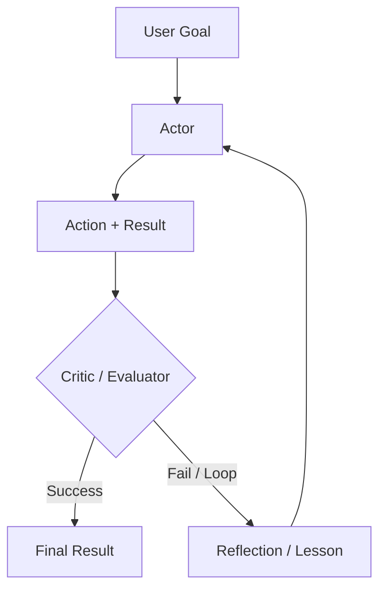

# 推理循环：ReAct 及其后续

推理循环定义 Agent 的控制流。虽然 **ReAct** 是 2023 年的基线，但当前系统已经在推理原生模型之上使用更复杂的 **Plan-and-Solve**、**Self-Reflexion** 和**推理时扩展**模式。

## 目录

- [循环的演进](#evolution)
- [ReAct：经典模式](#react)
- [Self-Reflexion 循环](#reflexion)
- [Plan-and-Solve（Soto）](#plan-and-solve)
- [流程工程（LangGraph 模式）](#flow-engineering)
- [面试问题](#interview-questions)
- [参考资料](#references)

---

## 循环的演进

| 时代 | 模式 | 核心理念 |
|------|------|----------|
| **2023** | ReAct | 交替进行思考和行动。 |
| **2024** | Reflexion | 评估错误并重试。 |
| **今天** | System 2 循环 | 使用隐藏 CoT 处理稳健的多步逻辑。 |

---

## ReAct：推理 + 行动

90% Agent 使用的基础循环：
1. **思考**：“我需要找到 X。”
2. **行动**：`search_engine("X")`
3. **观察**：“X 在 Y。”
4. **重复**。

**批评**：ReAct 很脆弱。如果搜索返回“No results”，朴素 ReAct Agent 往往会再次执行相同搜索。现代循环会注入**负向约束**（例如“不要再尝试已经看过结果的搜索”）。

---

## Self-Reflexion 循环

Reflexion 在循环中增加一个**“批评”**步骤。

**收益**：把这些“反思”存入短期记忆后，Agent 能够建立当前会话中哪些方法无效的“心理地图”。

---

## Plan-and-Solve

Agent 不再一次只决定一步（贪心方式），而是先创建一个**静态计划**，再执行它。

1. **规划器**：“我会先做 A，再做 B，然后做 C。”
2. **执行器**：执行这些步骤。
3. **重新规划器**：如果步骤 B 失败，触发完整重新规划，而不是局部修复。

**为什么？**规划能减少“随机错误”。一旦确定路径，模型不容易被嘈杂的工具结果带偏。

---

## 流程工程（LangGraph）

现代 Agent 系统已经从“聊天界面”转向**状态机**。

- **循环图**：不使用线性顺序，而是定义一张图，让模型可以多次回到“清理”节点或“验证”节点。
- **微 Agent**：图中的每个节点都是一个专门的“Prompt”或“工具”。

**关键细节**：“Agent”不再只是 LLM；Agent 是**图执行引擎**。

---

## 面试问题

### Q：什么时候使用“推理循环”（ReAct），什么时候使用 Plan-and-Solve 架构？

**强回答：**

对于环境不可预测的**探索性**任务，我会选择 **ReAct**（例如浏览尚不了解 URL 结构的新网站），因为 Agent 需要对每次观察作出反应。对于**可预测但复杂**的工作流（例如从 5 个已知 API 生成财务报告），我会选择 **Plan-and-Solve**。规划能避免模型“漫游”，也便于并行执行互不依赖的步骤。

### Q：什么是“推理时扩展”？它与 Agent 循环有什么关系？

**强回答：**

推理时扩展（通常与 OpenAI 的 o1 关联）指的是把更多计算花在**响应生成期间**，而不是只花在训练期间。在 Agent 场景中，这意味着模型不会只输出第一个看起来有效的动作，而是使用**搜索树**（类似蒙特卡洛树搜索）在内部模拟不同的动作路径，然后提交最可能成功的那条路径。这减少了所需的真实工具调用，节省外部 API 成本并降低失败率。

---

## 参考资料

- Yao 等，《ReAct: Synergizing Reasoning and Acting》（2022/2025 更新）
- Shinn 等，《Reflexion: Language Agents with Iterative Homeostatic Learning》（2024）
- Wang 等，《Plan-and-Solve Prompting》（2023）

---

*下一篇：[工具使用与 Model Context Protocol（MCP）](03-tool-use-and-mcp.md)*
