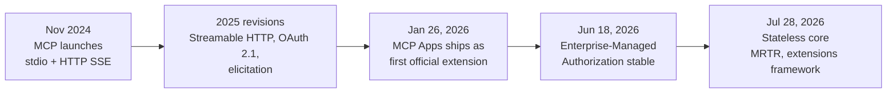
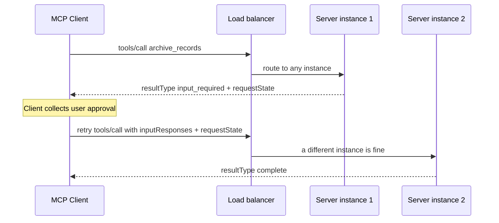
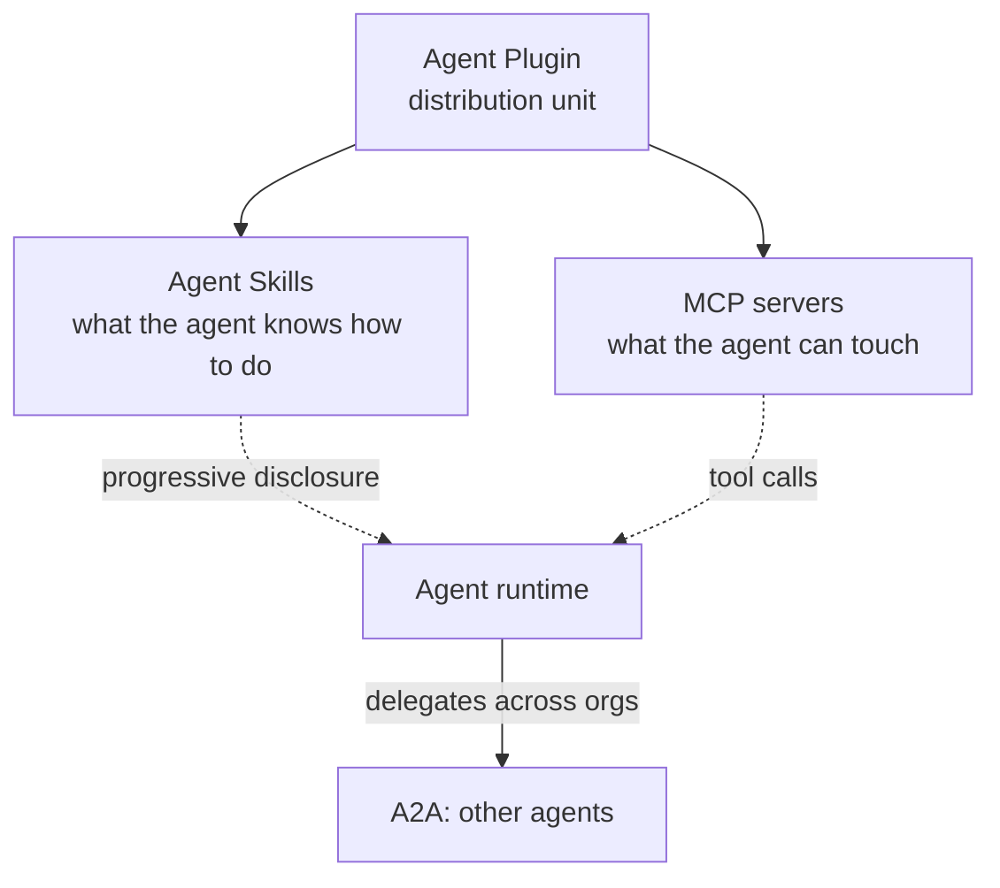
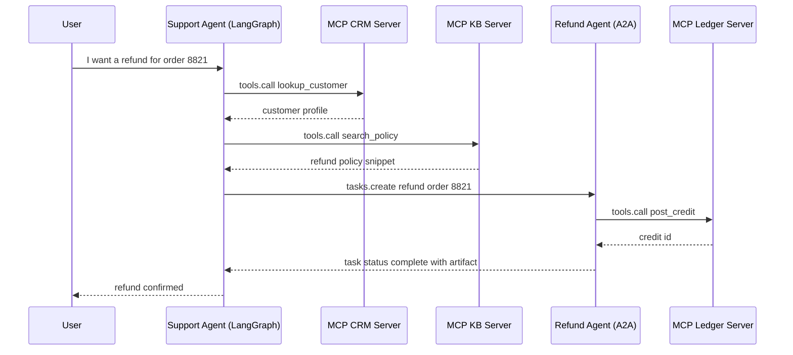
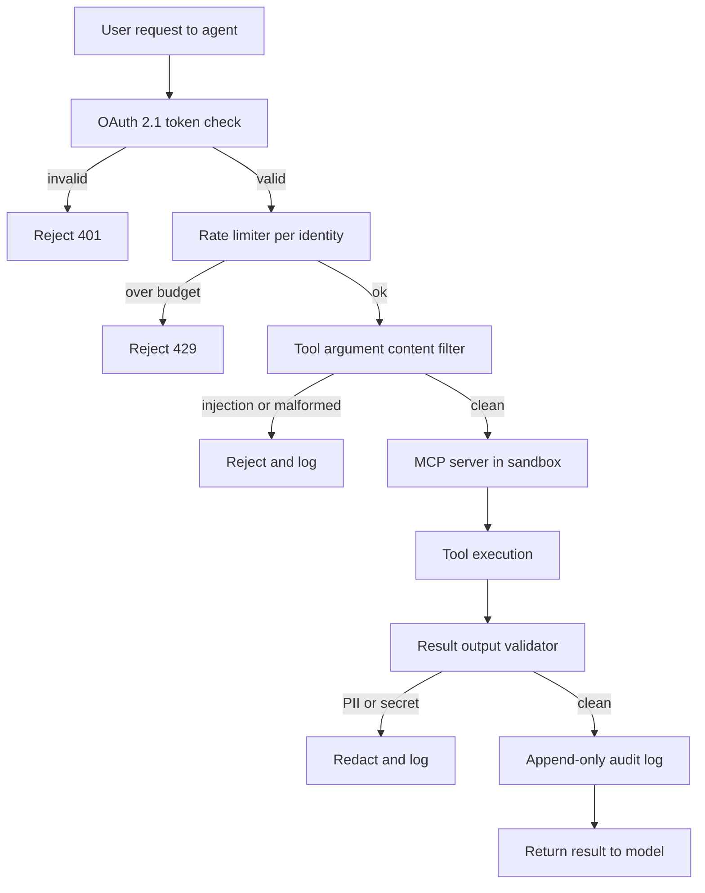

# 工具使用与 MCP

工具是 Agent 的“手”。业界已经标准化采用 **Model Context Protocol（MCP，模型上下文协议）**，用统一的本地优先通信层替代碎片化的自定义工具定义。MCP 发展迅速：可流式 HTTP 传输、OAuth 2.1 认证和原生计算机使用工具在 2025 年的规范修订中陆续落地（生态中很多人宽泛地称其为 MCP 2.0），而 **2026-07-28 修订版**将协议核心重建为无状态，这是 MCP 发布以来最大的一次改造（见下文的[无状态重写](#mcp-2026-07-28)）。与此同时，**Agent-to-Agent（A2A）**及其他互操作协议也开始出现，为 MCP 的工具访问层补充 Agent 协调能力。

## 目录

- [工具使用机制](#mechanism)
- [模型上下文协议（MCP）](#mcp)
- [MCP 2.0：可流式 HTTP 与认证](#mcp-updates)
- [MCP 2026-07-28：无状态重写](#mcp-2026-07-28)
- [MCP 扩展与生态（2026 年 8 月）](#mcp-roadmap)
- [Agent 插件](#agent-plugins)
- [Agent-to-Agent 协议（A2A）](#a2a)
- [协议格局：MCP + A2A + ACP](#protocol-landscape)
- [计算机使用工具（Anthropic）](#computer-use)
- [定义高精度工具](#precision)
- [MCP 与 OpenAI Function Calling](#mcp-vs-openai)
- [流式工具调用](#streaming)
- [Context7：实时文档 MCP](#context7)
- [面试问题](#interview-questions)
- [参考资料](#references)

---

## 工具使用机制

工具使用会经历三个步骤的循环：
1. **Schema 呈现**：向模型提供工具的 JSON Schema。
2. **意图与提取**：模型输出一次“调用”（例如 `{"tool": "get_weather", "args": {"city": "Tokyo"}}`）。
3. **执行与上下文化**：系统运行函数，并将结果反馈到 Prompt 中。

**细节**：生产技术栈不再把工具定义“硬编码”到系统 Prompt 中，而是使用**动态清单**，根据用户意图只获取必要的工具。

---

## 模型上下文协议（MCP）

MCP 由 Anthropic 开发（2024 年 11 月发布），如今已成为 Anthropic、OpenAI、Google、Microsoft 和 AWS 之间通用的工具集成标准，使模型可以访问工具和数据，而不必关心它们部署在哪里。2025 年 12 月，治理工作转移到 Linux Foundation 的 Agentic AI Foundation。

- **MCP Client**：AI 应用（例如 Agent 代码）。
- **MCP Server**：暴露 Tools（函数）、Resources（数据）和 Prompts（模板）的独立进程。
- **通信**：通过 stdio 或 HTTP 传输 JSON-RPC。

### 为什么是 MCP？
- **安全性**：工具运行在自己的进程中，不在模型逻辑内执行。
- **可移植性**：只写一次“Postgres 工具”，就能在 Claude、GPT 或 Llama 中使用。
- **可发现性**：统一的 `list_tools` 和 `get_resource` 命令。

---

## 定义高精度工具

生产质量的工具必须包含：

1. **严格类型校验**：使用 Pydantic 或 Zod，在模型甚至看到调用前就校验 Schema。
2. **详细 Docstring**：描述*什么时候不要*使用工具。
3. **置信度阈值**：要求模型为工具调用输出 `confidence` 分数。

```python
# MCP Server Example (Conceptual)
@server.tool()
class ExecuteSQL(PydanticModel):
    """Executes a Read-Only SQL query. DO NOT use for DROP/DELETE."""
    query: str = Field(..., description="The SELECT query to run.")

    async def run(self):
        # Implementation here...
        pass
```

---

## MCP 与 OpenAI Function Calling

| 特性 | OpenAI 原生能力 | MCP |
|---------|---------------|-----|
| **耦合** | 高（OpenAI 专属） | 低（与供应商无关） |
| **传输** | API Body 中的 JSON | JSON-RPC（本地/远程） |
| **数据访问** | 没有原生数据“Resource” | 原生支持 `Resources` |
| **最适合** | 原型 | 企业编排 |

---

## 流式工具调用

前沿模型支持**部分工具推测**。系统无需等待完整 JSON 生成，而是在流中刚看到工具名称和关键 ID 后，就开始“预取”工具结果。这会将感知延迟减少 **400～800ms**。

---

## MCP 2.0：可流式 HTTP 与认证

MCP 2.0 规范（2026 年 3 月批准）引入了两个重大变化：

### 1. 可流式 HTTP 传输
过去 MCP 使用 `stdio` 或基于 SSE 的基础 HTTP。MCP 2.0 增加了**可流式 HTTP**——使用一条长期 HTTP 连接处理双向流：

```
[MCP Client] ←── Streamable HTTP POST /mcp ──→ [MCP Server]
                  (with SSE response stream)
```

- 支持将 MCP Server 部署为云微服务，而不局限于本地进程
- 允许在一条连接上同时调用多个工具
- 向后兼容 stdio 传输

### 2. OAuth 2.1 授权
远程 MCP Server 现在可以要求正式认证：

```json
{
  "type": "oauth2",
  "grant_type": "client_credentials",
  "scopes": ["tools:read", "resources:documents"]
}
```

这使企业 MCP Server 可以按租户实施细粒度访问控制。

---

## MCP 2026-07-28：无状态重写

2026 年 7 月 28 日，MCP 项目在为期十周的候选版本冻结后，最终确定了 **2026-07-28** 规范修订，这是 MCP 发布以来最大的协议改造。核心变化是：**协议核心现在是无状态的**。`initialize` 握手和 `Mcp-Session-Id` 请求头被移除；每个请求都会在 `_meta` 中携带协议版本和客户端能力，Server 会在结果 `_meta` 中标识自己。跨调用状态转移到由 Server 生成的显式 Handle，并作为普通工具参数传递。实际结果是，远程 MCP Server 现在可以在普通轮询负载均衡器后进行水平扩展，完全不需要共享会话状态，而过去必须使用粘性会话或共享会话存储。

### MCP 的演进过程



### 三代 MCP 对比

| 维度 | 发布版（2024 年 11 月） | 可流式 HTTP 时代（2025 修订） | 2026-07-28 修订版 |
|-----------|-------------------|--------------------------------------|---------------------|
| **会话模型** | 有状态 `initialize` 握手 | 有状态，基于可流式 HTTP 的 `Mcp-Session-Id` | 无状态；每个请求的 `_meta` 携带版本与能力 |
| **传输** | stdio、HTTP+SSE | 增加可流式 HTTP | 可流式 HTTP 强制要求 `Mcp-Method` / `Mcp-Name` 路由头；HTTP+SSE 正式弃用 |
| **Server 发起请求** | Sampling、roots（Server 推送） | 增加 elicitation | 移除；由多轮请求替代（客户端携带状态重试） |
| **调用中用户输入** | 无 | `elicitation/create` 推送 | `input_required` 结果 + 客户端携带 `requestState` 重试 |
| **长时间运行任务** | 无 | 实验性 | Tasks 正式成为扩展（基于轮询的 Handle） |
| **Server 渲染 UI** | 无 | MCP Apps 作为扩展发布（2026 年 1 月） | MCP Apps 纳入正式扩展框架 |
| **认证** | 无标准 | OAuth 2.1 + PKCE、动态客户端注册 | OAuth 加固：RFC 9207 `iss` 校验、与发行方绑定凭证，CIMD 替代 DCR；EMA 扩展支持企业 IdP |
| **列表缓存** | 无 | 无 | 列表和读取结果必须提供 `ttlMs` + `cacheScope`；工具顺序确定，以命中 Prompt 缓存 |
| **流恢复** | 无 | SSE `Last-Event-ID` 可恢复 | 移除；客户端重新发起请求，持久化工作使用 Tasks |
| **水平扩展** | 单进程 | 负载均衡器后的粘性会话 | 任意实例处理任意请求；无共享状态 |

### 多轮请求（MRTR）

Server 发起请求的模式（`elicitation/create`、`sampling/createMessage`、`roots/list`）已移除。当 Server 需要在调用中获取用户输入时，会返回包含 `resultType: "input_required"`、`inputRequests` 数组和不透明 `requestState` Blob 的结果；客户端收集输入，再附带 `inputResponses` 重试原请求。由于状态随重试请求传递，负载均衡器后的任意 Server 实例都可以恢复被中断的调用。这使人在环审批门禁与无状态水平扩展兼容。



所有结果现在都必须包含 `resultType` 字段（`complete` 或 `input_required`；Tasks 等扩展还会增加其他值）；缺少该字段的旧 Server 结果会被视为 `complete`。

### 已弃用或移除的内容

该修订版还采用了正式的功能生命周期（Active、Deprecated、Removed），最短弃用窗口为 12 个月，并提供公开的已弃用功能注册表。本次新增弃用的功能（Roots、Sampling、Logging、DCR）最早会在 2027 年 7 月 28 日移除；早在 2025 年 3 月弃用的 HTTP+SSE 按更早时间表执行。

| 功能 | 2026-07-28 的状态 | 迁移到 |
|---------|----------------------|------------|
| `initialize` 握手、`Mcp-Session-Id` | 已移除 | 每次请求在 `_meta` 中传版本和能力；用 `server/discover` RPC 探测 |
| `elicitation/create`、`sampling/createMessage`、`roots/list` | 已移除 | 多轮请求 |
| SSE 流恢复（`Last-Event-ID`） | 已移除 | 重新发起请求；持久化工作使用 Tasks 扩展 |
| Roots | 已弃用 | 通过工具参数、资源 URI 或 Server 配置传目录 |
| Sampling | 已弃用 | 直接调用 LLM 供应商 API |
| Logging | 已弃用 | stderr（stdio）或 OpenTelemetry |
| HTTP+SSE 传输 | 正式弃用 | 可流式 HTTP |
| 动态客户端注册（RFC 7591） | 已弃用 | Client ID Metadata Documents（客户端 ID 是托管客户端元数据的 URL） |

RPC 机制从核心协议中移除，而它们提供的能力通过迁移路径被弃用，因此上表会同时出现“已移除”和“已弃用”两类行。

两个较小但与设计有关的传输变化是：可流式 HTTP POST 现在必须带 `Mcp-Method` 和 `Mcp-Name` 请求头，使负载均衡器、网关和 WAF 无需解析 JSON-RPC Body 就能路由和过滤 MCP 流量；列表结果（`tools/list`、`prompts/list`、`resources/list`）必须声明 `ttlMs` 与 `cacheScope`，为工具目录缓存提供明确规则。

### 扩展框架

核心现在刻意保持很小，其余内容都是**扩展**：使用反向 DNS ID 标识，独立于核心规范进行版本管理，并通过 SEP 流程中的 Extensions Track 治理。官方扩展包括：

| 扩展 | 状态 | 功能 |
|-----------|--------|--------------|
| **Tasks**（`io.modelcontextprotocol/tasks`） | 官方；重新设计为基于轮询的生命周期，由 AWS 贡献 | 工具调用可以返回任务 Handle；客户端轮询 `tasks/get`，通过 `tasks/update` 推送任务中输入，通过 `tasks/cancel` 取消。适用于超出单次请求生命周期的工作。 |
| **MCP Apps** | 2026 年 1 月 26 日起官方支持 | 工具声明 `ui://` 模板；Host 在沙箱 iframe 中渲染（无 DOM 访问，默认拒绝 CSP），UI 与 Host 之间的通信通过 postMessage 携带 JSON-RPC，UI 触发的操作走同一工具调用许可路径。Claude、ChatGPT、VS Code、Goose 和 Microsoft 365 Copilot 等都支持渲染。 |
| **企业托管授权（EMA）** | 2026 年 6 月 18 日起稳定 | 组织通过 IdP 集中配置 MCP Server 访问：OIDC 或 SAML 断言（RFC 8693）交换为 ID-JAG，再由 JWT bearer grant（RFC 7523）换取 MCP Access Token，无需逐用户同意页面。Okta 是首个支持的 IdP；Claude 和 VS Code 在发布时提供支持。 |

### 迁移清单

- 移除 `initialize` / Session ID 逻辑；在 `_meta` 中发送版本和能力，并实现 `server/discover` RPC（现在是 MUST）。
- 将 elicitation 和 sampling 流程转换为 MRTR：返回带 `requestState` 的 `input_required`，接受带 `inputResponses` 的重试。
- 将跨调用状态移到作为工具参数传递的显式 Handle 中，或采用 Tasks 扩展。
- 发送 `Mcp-Method` / `Mcp-Name` 请求头，在列表结果上声明 `ttlMs` / `cacheScope`，并以确定顺序返回工具。
- 规划从 DCR 迁移到 Client ID Metadata Documents；依据 RFC 9207 校验 `iss`，绝不跨发行方复用客户端凭证。
- 为真实工作留出预算：维护者本身警告，自定义实现会面临明显的改造量。

> *已于 2026 年 8 月 15 日验证。来源：modelcontextprotocol.io/specification/2026-07-28/changelog、blog.modelcontextprotocol.io*

---

## MCP 扩展与生态（2026 年 8 月）

本章跟踪到 2026 年 5 月的路线图内容大多已经发布。2026 年 8 月的状态如下：

| 路线图项目（2026 年 5 月表述） | 状态（2026 年 8 月） |
|---------------------------------|--------------------|
| 传输扩展性/无状态核心 | 已在 2026-07-28 修订版中发布（见[无状态重写](#mcp-2026-07-28)） |
| MCP Apps（Server 渲染 UI） | 2026 年 1 月 26 日作为第一个官方扩展发布；Claude、ChatGPT、VS Code、Goose 和 Microsoft 365 Copilot 等支持渲染；早期合作伙伴包括 Figma、monday.com 和 Adobe Express |
| Tasks 扩展（长时间运行工作） | 已发布。2026-07-28 修订版将其从实验性核心移到 `io.modelcontextprotocol/tasks` 扩展，并围绕基于轮询的任务 Handle 重设计。参考仓库仍标记为实验性，应将接口视为正在稳定而非已经稳定。 |
| 企业认证 | 2026 年 6 月以企业托管授权扩展发布（首个 IdP 为 Okta，Claude 和 VS Code 在发布时支持） |
| MCP Server Cards（`.well-known` 发现） | 仍为草案，作为实验扩展（SEP-2127）开发。它与新的核心 `server/discover` RPC 不同，后者是协议内能力查询。 |
| MCP Registry | 仍处于预览阶段（`registry.modelcontextprotocol.io`）；GA 时间未公布。v1.8.1 修复了 GitHub Pages 组织命名空间接管问题。 |

**现在有两层发现机制需要区分**：连接前通过 `.well-known` Server Cards 进行 HTTP 发现（实验性，为 Registry 和爬虫提供数据），以及协议内的 `server/discover` RPC（自 2026-07-28 起属于核心强制能力，用于版本协商）。

**生态规模（2026 年 8 月）**：SDK 下载量达到每月数亿。协议 7 月 28 日的发布文章称 Tier 1 SDK 每月接近 5 亿次；Anthropic 则单独报告每月 4 亿次和全年 4 倍增长，因此把汇总值当作数量级而不是精确数字，并在引用前确认统计口径。仅一个连接器目录就已列出**超过 950 个 MCP Server**。在 7 月 28 日最终发布时，AWS、Cloudflare、Google Cloud、Microsoft 和 Netlify 宣布支持。

**但迁移到无状态修订版仍处于早期。** 截至 8 月 14 日前 30 天，v1 TypeScript SDK（`@modelcontextprotocol/sdk`）约有 2 亿次 npm 下载。v2 拆分为多个包，而不是一个包：`@modelcontextprotocol/server` 约 530 万次，`@modelcontextprotocol/core` 约 390 万次，`@modelcontextprotocol/client` 约 290 万次。因此，在 GA 数周后，任意单包对比中 v2 仍只有 v1 的个位数百分比。应规划长期双版本阶段。

**治理**：MCP 在 Linux Foundation 的 Agentic AI Foundation 下治理。Governance Working Group 运行 Contributor Ladder 和授权模型，允许特定领域工作组在无需全部核心维护者审核的情况下接受 SEP；2026-07-28 修订版增加了正式 Extensions Track。

> *已于 2026 年 8 月 15 日验证。来源：modelcontextprotocol.io、blog.modelcontextprotocol.io*

---

## Agent 插件

MCP 标准化了 Agent 如何连接工具。**Agent 插件**在 2026 年 8 月 6 日达到 1.0.0，标准化了如何向 Agent *交付*一组能力。它是由供应商无关的技术指导委员会治理的打包格式，首批维护者包括 Amazon、Cursor、Microsoft、OpenAI 和 Vercel，Google 在发布当天加入；GitHub 于 8 月 12 日在 VS Code、Copilot CLI、Copilot SDK 和 Copilot 应用中全面提供支持。

一个插件是一个目录：

```
my-plugin/
├── plugin.json          # required manifest
├── skills/              # optional: Agent Skills (SKILL.md files)
│   └── code-review/
│       └── SKILL.md
├── mcp.json             # optional: MCP server declarations
└── com.example.client/  # optional: client-specific extras, namespaced
```

`mcp.json` Schema 支持三种 Server 形态（包含 command、args 和 env 的 stdio；可流式 HTTP；SSE），并保留两个环境变量 `PLUGIN_ROOT` 与 `PLUGIN_DATA`，由客户端在加载时注入。

值得学习的设计决策是规范**拒绝**标准化的内容。只有两类组件可移植：Skills 和 MCP Server。Commands、Hooks、Subagents、Rules 和 LSP Server 除非放在带命名空间的目录中，否则仍由客户端决定。这样可移植表面足够小，使插件确实能够到处运行，并把快速变化、客户端特定的部分放进不会破坏互操作性的命名空间。

### 三层如何配合



| 层 | 标准化内容 | 单元 | 治理方 |
|-------|--------------|------|------------|
| **Agent Skills**（`SKILL.md`） | Agent 应用的流程和领域知识 | 带 Front Matter、可选脚本和资产的目录 | agentskills.io |
| **MCP** | 工具、数据和资源访问 | 通过 stdio 或可流式 HTTP 讲 JSON-RPC 的 Server | Linux Foundation、Agentic AI Foundation |
| **Agent 插件** | 上述两者的分发与安装 | 带 `plugin.json` 的目录 | Agent Plugins TSC |
| **A2A** | 跨供应商或组织边界的 Agent 委托 | 带签名 Agent Card 的 Agent Endpoint | Linux Foundation |

对平台团队的实际影响是：企业管理现在有了统一控制点。GitHub 复用现有的 `managed-settings.json`，因此插件安装、市场访问和 MCP Server 白名单都通过同一文件管理。搭建内部 Agent 平台时，需要审核、签名和分发的单位是插件，而不是单个 Server。

**随之而来的安全注意事项**：插件将指令（Skills）与能力（MCP Server）捆绑在一起，因此安装插件更像安装软件包，而不是添加书签。Skills 的静态分析存在检测上限：已发布结果显示对数据外泄的检测率为 93%，对自然语言 Prompt 注入只有 42%，对主机破坏为 **0%**，因为破坏性 Skill 使用的普通 Shell 命令与合法命令看起来一样。应像审查依赖一样审查插件：固定版本、优先使用签名来源，并且绝不能让插件扩大加载它的 Agent 的操作面。

---

## Agent-to-Agent 协议（A2A）

Google 于 2025 年 4 月推出 **Agent2Agent（A2A）** 协议，用来解决 MCP 没有覆盖的问题：**不同供应商的 Agent** 如何彼此通信，而不仅仅是与工具通信。

### A2A 解决什么问题

MCP 定义 Agent 如何连接**工具和数据**。A2A 定义**编排 Agent 如何将任务委托给不同供应商或框架的专用 Agent**，即使二者不共享记忆、工具或上下文。

### 技术基础

- 基于 **HTTP、SSE 和 JSON-RPC**（与 MCP 相同，便于集成）
- 支持与 OpenAPI 认证方案对等的企业级认证
- **Agent Cards**：描述 Agent 能力、技能和 Endpoint 的 JSON 元数据文档，类似于面向 Agent 的 MCP Server Cards

### A2A 任务生命周期

```
[Client Agent] ── POST /tasks ──→ [Remote Agent]
                                     │
                  ← SSE stream ──────┘  (status updates, artifacts)
                                     │
                  ← Task Complete ───┘  (final result)
```

A2A 任务支持带流式状态更新的长时间操作，适合持续数分钟或数小时的企业流程。

### 行业采用

- 得到包括 Atlassian、Salesforce、SAP、LangChain 和 PayPal 在内的 50 多家技术伙伴支持
- 2025 年 6 月捐赠给 **Linux Foundation**，成为开放治理项目
- **0.3 版**增加 gRPC、签名安全卡和扩展的 Python SDK 支持。截至 2026 年 8 月，最新 A2A **规范**版本是 **v1.0.1**（2026 年 5 月 28 日）；生态中高于此的版本号指语言 SDK，例如 `a2a-java` v1.2.0，而不是协议
- NIST 于 2026 年 2 月启动“AI Agent Standards Initiative”，部分原因是响应 A2A/MCP 的发展

> *已于 2026 年 5 月验证。来源：developers.googleblog.com、a2a-protocol.org*

---

## 协议格局：MCP + A2A + ACP

在生产级企业系统中，多种协议同时运行于不同层：

| 协议 | 层 | 用途 | 治理方 |
|----------|-------|---------|-------------|
| **MCP** | Agent-to-Tool | 通用工具和数据访问 | Linux Foundation（Agentic AI Foundation） |
| **A2A** | Agent-to-Agent | 跨供应商 Agent 委托 | Linux Foundation |
| **ACP** | Agent Communication | 轻量异步 Agent 消息（REST） | IBM / Linux Foundation |

### 如何互补

```
┌──────────────────────────────────────────┐
│            Enterprise System             │
│                                          │
│  ┌─────────┐  A2A   ┌─────────┐         │
│  │ Agent A  │◄──────►│ Agent B │         │
│  │(Vendor X)│        │(Vendor Y)│        │
│  └────┬─────┘        └────┬─────┘        │
│       │ MCP                │ MCP          │
│  ┌────▼─────┐        ┌────▼─────┐        │
│  │ DB Tool  │        │ API Tool │        │
│  │ Server   │        │ Server   │        │
│  └──────────┘        └──────────┘        │
└──────────────────────────────────────────┘
```

**关键洞察**：MCP 与 A2A 是互补而非竞争关系。MCP 处理 Agent 到工具的连接；A2A 处理 Agent 到 Agent 的协调。生产系统会同时使用两者。

**ACP 说明**：IBM 发起的 Agent Communication Protocol（ACP）团队在 2025 年 9 月与 Google A2A 团队合并工作，开发统一的 Agent 通信标准。新项目应以 A2A 作为主要 Agent-to-Agent 协议。

---

## A2A v1.0 GA 与 2026 年 5 月 MCP 生产故事

A2A v1.0 在 2026 年 4 月的 Google Cloud Next 2026 上正式 GA，AWS、Microsoft、Salesforce、SAP、ServiceNow、Workday 和 IBM 等 150 多个组织公开承诺支持。项目转移到 Linux Foundation 的 Agentic AI Foundation 下，由其与合并后的 ACP 工作共同治理。一个小版本（v1.2）增加了密码学签名的 Agent Cards：卡片是与 Agent 运营方公钥绑定的签名 JWS 文档，因此客户端 Agent 在发起任务前，可以验证 `https://refunds.acme.com/.well-known/agent.json` 上的远程 Agent 确实属于 ACME。Google ADK 1.0、LangGraph、CrewAI、LlamaIndex、Semantic Kernel 和 AutoGen 都发布了原生 A2A 客户端/服务端支持。

### 组合模式：客服 Agent 委托退款

一个 LangGraph 客服 Agent 持有对话状态和一组 MCP 工具（CRM、工单搜索、知识库）。用户要求退款时，这项工作属于另一个团队的 Finance 退款 Agent；它位于 A2A Endpoint 后，拥有自己的策略、审计日志和 SOX 控制。客服 Agent 不会直接调用退款数据库，而是发起 A2A 任务，让 Finance Agent 自己决策。



客服 Agent 永远看不到 Ledger。Refund Agent 通过自己的 MCP Server 管理 Ledger 访问，并执行另一套策略。A2A 任务是异步的：退款处理时，客服 Agent 可以向用户返回等待消息，工件到达后再重新接入。

### MCP 2026 路线图亮点：两项都已发布

本节在 2026 年中跟踪的两项路线图内容——传输扩展性和企业托管认证——都已经落地。传输扩展性不是通过会话恢复实现，而是采用相反设计：2026-07-28 修订版将会话完全移出协议核心（见[无状态重写](#mcp-2026-07-28)）。企业托管认证则在 2026 年 6 月以企业托管授权扩展发布。RFC 8707 的原则仍然成立并进一步加固：MCP Server 是 OAuth Resource Server，Token 会绑定到特定 Server URI，不能跨 Server 重放。

### MCP 生产加固（2026 年 5 月之后）

2026 年 5 月，MCP STDIO 传输暴露了一类漏洞：STDIO MCP Server 默认认为进程边界就是信任边界，但上游模型构造的工具参数可能诱骗编写不当的 STDIO Server，以主机用户权限执行主机命令。架构修复分两步：

1. **尽可能将 STDIO MCP Server 迁移到带 TLS 的 HTTP 传输**。HTTP 强制建立明确的信任边界（网络），并支持 OAuth 2.1 Resource Server，而 STDIO 无法提供这些能力。
2. **无法迁移的 STDIO Server**，为每个 Server 运行专用容器：不挂载主机文件系统、不允许网络出口、设置严格 CPU/内存预算，并使用只读镜像。将容器视为信任边界，把失陷影响限制在容器内。

### 状态 Handle 劫持：无状态核心的新攻击面

无状态重写移除了协议层会话，因此需要跨请求状态的 Server 现在会生成显式 Handle（购物车 ID、工作流 ID），并将其作为普通工具参数返回。新的安全最佳实践文档将对应攻击命名为**状态 Handle 劫持**：未授权方获得或猜到 Handle 后，读取或修改其他用户的状态。

要求很直接，也值得记住：
- 实现授权的 Server **必须校验每个入站请求**，且**不能把拥有状态 Handle 当作认证**。Handle 是名称，不是凭证。
- Handle **应当是非确定性的**，由安全随机数生成器产生。
- Handle **应当在 Server 端与认证用户绑定**，例如用 `<user_id>:<handle>` 作为状态键，其中 user ID 来自已验证 Token，而不是客户端发送的值。

**生产 MCP 的纵深防御清单：**

- 所有远程 MCP Server 使用带 PKCE 的 OAuth 2.1，并使用绑定受众的 Token（RFC 8707）。
- STDIO Server 运行在 `network: none` 的容器中，根文件系统只读，不挂载主机卷，并设置 `nproc` 和内存上限。
- 每次工具调用都记录用户身份、Token 绑定受众、工具名、参数哈希和结果哈希，并将日志发送到只追加存储。
- 每个 MCP Server 前都设置按用户身份限制的限流器；可写工具的突发预算应严格。
- 工具参数到达 Server 前通过内容过滤器：字符串字段进行 Prompt 注入检测，结构化字段进行 Schema 校验，不需要 Shell 元字符的工具直接拒绝这类字符。
- 工具结果回馈模型前经过输出校验器：检测 PII 和 Secret，限制大小，过滤已知外泄标记。
- 危险工具（文件写入、Shell 执行、出站 HTTP）必须经过人工批准或签名能力 Token，不能只依赖模型安全调用。

请求经过所有防御层的流程：



这条流水线刻意保持保守。每一层都可以拒绝请求，只有通过全部五道门禁的结果才会到达模型。

**本节来源：**
- [Google Cloud A2A v1.0 GA at Cloud Next 2026](https://cloud.google.com/blog/products/ai-machine-learning/agent2agent-protocol-is-getting-an-upgrade)
- [MCP 2026 Roadmap (The New Stack)](https://thenewstack.io/model-context-protocol-roadmap-2026/)
- [RFC 8707: Resource Indicators for OAuth 2.0](https://www.rfc-editor.org/rfc/rfc8707)
- [Adversa AI: Top MCP Security Resources May 2026](https://adversa.ai/blog/top-mcp-security-resources-may-2026/)
- [Anthropic Constitutional Classifiers](https://www.anthropic.com/research/constitutional-classifiers)

---

## 计算机使用工具（Anthropic）

Claude 3.5+ 引入原生**计算机使用**工具，模型可以直接控制桌面或 Web 浏览器。这些工具通过 Anthropic API 提供：

| 工具 | 能力 | 说明 |
|------|------------|-------|
| `bash` | 运行 Shell 命令 | 跨轮次持久会话 |
| `text_editor` | 读取/写入/编辑文件 | 支持 view、create、str_replace 命令 |
| `computer` | 鼠标、键盘、截图 | 完整桌面 GUI 控制 |

```python
import anthropic

client = anthropic.Anthropic()

response = client.beta.messages.create(
    model="claude-3-7-sonnet-20250219",
    max_tokens=4096,
    tools=[
        {"type": "bash_20250124", "name": "bash"},
        {"type": "text_editor_20250124", "name": "str_replace_based_edit_tool"},
        {"type": "computer_20251022", "name": "computer",
         "display_width_px": 1280, "display_height_px": 800}
    ],
    messages=[{"role": "user", "content": "Open Firefox, go to GitHub, and clone my repo."}],
    betas=["computer-use-2024-10-22", "interleaved-thinking-2025-05-14"]
)
```

**计算机使用的生产安全规则：**
1. 始终在沙箱 VM 中运行（Docker + VNC 或 E2B Cloud）。
2. 在破坏性操作前，用截图验证关键状态。
3. 对不可逆操作（文件删除、表单提交）使用 HITL（人在环）。
4. 设置 `ANTHROPIC_MAX_COMPUTER_TOKENS`，限制失控循环。

---

## Context7：实时文档 MCP

2026 年最实用的 MCP Server 之一是 **Context7**，它解决了编码 Agent 的“训练数据过时”问题：

```
# Without Context7:
Agent: "I'll use langchain's `create_openai_tools_agent` function..."
(This function was deprecated 6 months ago)

# With Context7 MCP:
Agent → MCP: list_resources("langchain")
MCP → Agent: Returns current v0.3.x docs
Agent: "I'll use the new `create_react_agent` interface..."
```

**在 Claude Desktop / Claude Code 中配置：**
```json
{
  "mcpServers": {
    "context7": {
      "command": "npx",
      "args": ["-y", "@upstash/context7-mcp"]
    }
  }
}
```

Claude 会在编写使用某个库的代码前，自动调用 `resolve-library-id` 和 `get-library-docs`。

---

## 面试问题

### Q：MCP 如何解决“工具太多”（Schema 过载）问题？

**参考答案：**
2023 年，向模型提供 50 个工具会使性能下降，因为 Prompt 变得太长。MCP 通过**动态资源发现**解决这一问题。Agent 不把 50 个工具 Schema 加载进 Prompt，而是向 MCP Server 发送 `list_resources` 调用，然后只把与当前 Resource 上下文相关的工具“挂载”进来。这样 Prompt 保持精简，上下文集中于推理，而不是解析未使用的 Schema。

### Q：为什么要使用 MCP Server 将“工具逻辑”与“Agent 应用”分离？

**参考答案：**
这是关注点分离。如果工具逻辑（例如 Python 爬虫）位于独立 MCP Server 中，就可以独立扩展爬虫基础设施，不必和 LLM 编排器一起扩展。更重要的是，它提供了**安全沙箱**。如果模型通过工具参数发起注入，影响范围只到 MCP Server 进程，而该进程可以放进没有网络访问核心 Agent 状态的容器中。

### Q：MCP 和 A2A 如何在生产多 Agent 系统中协同？

**参考答案：**
它们处理**不同的通信层**。MCP 是 Agent-to-Tool 协议，让任意 Agent 都能通过 MCP Server 标准化访问数据库、API 和文件。A2A 是 Agent-to-Agent 协议，允许编排 Agent（供应商 X）将任务委托给专用 Agent（供应商 Y），而无需共享记忆或上下文。在生产中，我会为每个工具连接使用 MCP，在需要跨供应商 Agent 协调时使用 A2A。例如，基于 LangGraph 的采购编排器可以通过 MCP 查询库存数据库，再通过 A2A 将合规检查委托给另一团队托管的专用 Agent。关键设计原则是：Agent 自己的工具栈内部使用 MCP，组织或供应商边界之间使用 A2A。

---

## 参考资料
- Model Context Protocol。《Specification revision 2026-07-28: Changelog》（2026 年 7 月）。https://modelcontextprotocol.io/specification/2026-07-28/changelog
- Model Context Protocol blog。《Enterprise-Managed Authorization》（2026 年 6 月）。https://blog.modelcontextprotocol.io/posts/enterprise-managed-auth/
- Anthropic。《The Model Context Protocol Specification》（2025）
- Google。《Agent2Agent Protocol Specification v0.3》（2026）
- Linux Foundation。《Agent2Agent Protocol Project》（2025）
- NIST。《AI Agent Standards Initiative》（2026 年 2 月）
- JSON-RPC 2.0 Specification。
- Pydantic v3.0 Documentation。

---

*下一篇：[多 Agent 编排](04-multi-agent-orchestration.md)*
