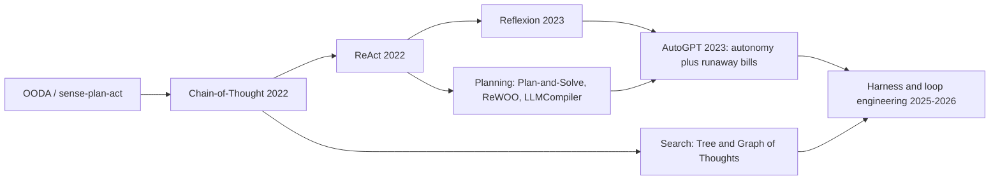
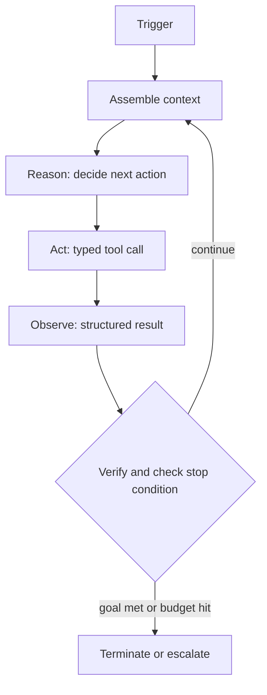
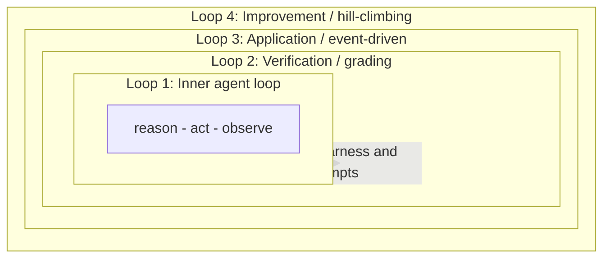
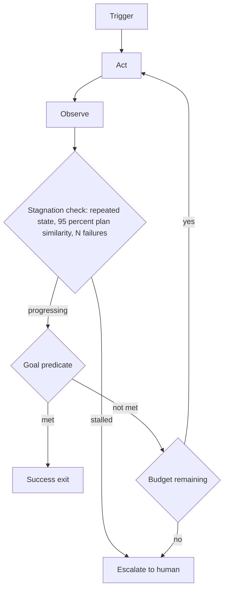

# 循环工程

第 02 章介绍了模型如何在单个步骤中推理：ReAct、Reflexion、Plan-and-Solve。**循环工程**是包裹这套推理的工程学科：围绕核心 Agent（模型加工具）设计、监控并持续改进控制循环，而不是逐轮手工 Prompt 模型。

定义这一领域的重新表述很直接：你不再是聊天框里的人，而是构建一个系统，让 Agent 围绕目标进行 Prompt、行动、观察、验证、记忆和重新运行，直到满足可验证的停止条件。弱 Harness 中的强模型会输给优秀 Harness 中的普通模型。到 2026 年，循环质量已经成为区别于基础模型质量的独立学科，杠杆也从“写更好的 Prompt”转向“设计更好的循环”。

本章贯穿两条不变量：

1. **终止必须由 Harness 按确定性标准强制执行，绝不能由模型自行声称完成。**
2. **验证工作的一方必须与产出工作的一方在结构上分离。**

## 目录

- [从 Prompt 工程到循环工程](#from-prompting-to-loop-engineering)
- [演进脉络：从 ReAct 到循环工程](#the-lineage-react-to-loop-engineering)
- [Agent 内循环](#the-inner-agent-loop)
- [循环的四个层级](#the-four-levels-of-loops)
- [循环模式](#loop-patterns)
- [终止与预算控制](#termination-and-budget-control)
- [长循环中的上下文与记忆](#context-and-memory-in-long-loops)
- [验证与评分](#verification-and-grading)
- [反模式](#anti-patterns)
- [关键指标](#metrics-that-matter)
- [成熟度阶梯](#the-maturity-ladder)
- [面试问题](#interview-questions)
- [参考资料](#references)

---

## 从 Prompt 工程到循环工程

每一代实践都会包裹上一代，而不是取代它。你仍然要写 Prompt，只是不再亲手驾驶模型。

| 层 | 工作单元 | 调优内容 | 优化目标 |
|-------|--------------|---------------|-------------------|
| **Prompt 工程** | 一次模型调用 | 措辞、示例、格式 | 一次好的响应 |
| **上下文工程** | 一次组装后的上下文 | 检索、记忆、压缩 | 每次调用模型看到的内容 |
| **Harness 工程** | 一次 Agent 运行 | 驱动代码、工具、预算、停止逻辑 | 可靠的多步骤执行 |
| **循环工程** | 一个递归目标 | 触发、验证、改进等堆叠循环 | 自主且能自我改进的系统 |

一个有用的心智模型是：**模型是策略，Harness 是内核**。不同团队会不断收敛到同一最小设计（循环中的 LLM 加工具），这说明循环是任务的属性，而不是短暂潮流。

---

## 演进脉络：从 ReAct 到循环工程

| 时代 | 步骤 | 增加的内容 |
|-----|------|---------------|
| 20 世纪 50 年代至今 | OODA、感知—计划—行动 | 控制循环思想：观察、决策、行动、重复 |
| 2022 | Chain-of-Thought | 回答前先推理（尚无工具） |
| 2022 | **ReAct** | 将 Thought、Action、Observation 与真实工具反馈交错 |
| 2023 | **Reflexion** | 外循环：把失败转成书面自我批评，并在下一次尝试中回放 |
| 2023 | Plan-and-Solve、ReWOO、LLMCompiler | 先计划后执行；延迟观察或并行运行工具 DAG，降低 Token 与延迟 |
| 2023 | AutoGPT | 证明大规模自主循环，并暴露无限循环和失控 API 账单 |
| 2025～2026 | 循环与 Harness 工程 | 把循环本身当作工程产物：触发器、验证、预算和评估驱动改进 |

关键概念跃迁是 Reflexion 的外循环。ReAct 的内循环只在一个 Episode 中学习；Reflexion 通过把批评存进情景记忆并在下次加载，在多个 Episode 之间学习。现代堆叠循环设计都源于这一步。

---

## Agent 内循环

狭义的技术产物是**Agent 内循环**：Harness 在一次 Agent 运行中执行的循环。它不断迭代，是因为长程任务无法一次前向传播完成，也因为工具结果必须反馈后才能生成最终答案。

多数工程工作发生在确定性的 Harness，而不是模型中：

| 组件 | 角色 |
|-----------|------|
| **Trigger** | 启动循环：人工、计划、事件/Hook 或自设目标；设定成本和并发画像 |
| **目标与指令** | 具体、可测试且有范围的目标与约束；歧义是目标漂移根因 |
| **上下文组装** | 每次调用前收集指令、工作状态、检索记忆和先前输出；对抗上下文腐化 |
| **Reason** | 模型分解任务并选择下一步动作；跨轮次原样保留思考块以保持连续性 |
| **Act** | 类型化工具调用：代码、Shell、搜索、查询或调用另一个 Agent；重试需有幂等键。副作用工具应放进沙箱（见[Agent 安全与沙箱](09-agentic-security-and-sandboxing.md)）。 |
| **Observe** | 用明确 SUCCESS/FAILED 状态反馈结构化结果，不要返回原始转储；大输出移到日志并只返回引用 |
| **Verify** | 根据标准检查正确性，最好由独立评分器完成 |
| **终止逻辑** | 明确成功、失败和预算停止条件 |
| **停滞检测器** | 捕获无进展：重复调用、来回振荡、失控开销 |
| **持久状态** | 将进度保存在上下文窗口外，使循环可恢复且可去重。参见[持久执行](11-durable-execution.md)。 |
| **升级路径** | 达到上限时带着准确阻塞问题转人工。参见[人在环模式](08-human-in-the-loop-patterns.md)。 |
| **Harness / Driver** | 连接所有部分并强制执行规则的确定性外层代码 |

---

## 循环的四个层级

循环工程就是堆叠循环：在内循环外嵌套更复杂的循环，并在自然检查点插入人工判断。以下四层是业界模式的综合，不是唯一标准编号。

| 层级 | 循环 | 作用 | 触发 | 实现者 | 跳过后果 |
|-------|------|--------------|---------|----------------|----------------|
| **0** | 推理深度 | 单次决策中的 CoT、ReAct 或 ToT，本身不是循环 | 不适用 | Prompt + 模型 | 步骤浅 |
| **1** | Agent 内循环 | 驱动一次运行直到停止条件 | 运行启动 | Driver/Kernel | 无法多步工作 |
| **2** | 验证循环 | 评估输出，失败时重试 | 内循环输出 | 独立评分器 | 发布未经验证的工作 |
| **3** | 应用循环 | 事件发生时调用 Agent，无需人工 Prompt | Cron、Hook、Heartbeat、目标 | 调度/Webhook 层 | 系统仍需人工操作 |
| **4** | 改进循环 | 把重复失败变成永久 Harness 修复 | Trace 与评估 | 评估 Harness | 系统永远不会变好 |

常见变体是 1 与 2 之间的**内/外双循环**：内循环执行当前策略；外循环对照原始目标观察进度，内循环停滞时重置整个策略，而不是重复失败步骤。

并行循环（编排器—Worker 或工具 DAG）需要为每个分支隔离上下文和工作区，定义合并结果的 Join/聚合语义，并为整个扇出统一预算，以免并发分支合计突破上限。实际限制是评审带宽，而不是分支数量。

---

## 循环模式

让循环架构匹配任务：环境不可预测时使用探索性、高方差循环；序列收敛后切换到计划驱动的低成本执行；发生错误时退回探索。

| 模式 | 每任务模型调用 | 延迟 | Token 成本 | 适应性 | 适用场景 |
|---------|----------------------|---------|------------|--------------|----------|
| **ReAct / 重试** | 高（每步一次） | 高 | 高 | 最高 | 不可预测环境、探索 |
| **Reflexion** | 更高（跨试验重试） | 高 | 高 | 高，跨尝试学习 | 有明确反馈的可重试任务 |
| **Plan-and-Execute** | 一次计划 + N 次执行 | 中 | 中 | 运行中低 | 收敛、可预测工作流 |
| **ReWOO** | 一次计划，延迟观察 | 低 | 低 | 低 | 工具已知且 Token 敏感 |
| **LLMCompiler** | 计划 + 并行工具 DAG | 低（并行） | 中 | 低 | 可并行的独立子任务 |
| **Evaluator-Optimizer** | 生成 + 批评循环 | 中 | 中 | 高 | 质量关键草稿 |
| **Orchestrator-Workers** | 规划器 + Worker 子 Agent | 高（约为聊天 15 倍） | 中（并行） | 高 | 广泛、可并行的研究或构建 |

生产循环中几乎总有用的模式包括：生成器—验证器分离、注入错误后重试、干净上下文技术、成本模型路由，以及只在确实需要迭代式自适应工具调用时引入循环和多 Agent 层。

- **生成器—验证器（制作者—检查者）分离**：一个子 Agent 起草，另一个通常更强的子 Agent 以对抗方式审查，并被明确要求拒绝任何无法验证完成的内容。独立评分器能捕获生成器不会主动承认的错误。
- **注入错误并重试**：把退出码、类型错误和失败测试反馈回上下文，让模型几乎零额外成本地自我修正。
- **新鲜上下文技术**：每次迭代都用干净上下文重新运行同一个目标 Prompt，每轮完成一个工作单元，在外部状态文件中跟踪进度，并在预先定义的可验证条件满足时退出。停止 Hook 会拦截退出尝试，在允许退出前验证是否完成。
- **用模型路由控制成本**：将每一步发送给满足要求的最便宜层级（分类用小模型、起草用中等模型、评审用前沿模型），并固定模型，避免循环悄然升级。将它与稳定前缀上的 Prompt 缓存结合。
- **组合，而不是框架化**：优先使用能工作的最简单模式。只有确实需要迭代式、自适应工具使用时，才引入循环和多 Agent 层。

---

## 终止与预算控制

模型不再调用工具、返回文本这一自然停止信号是**必要但不充分**的。Harness 必须独立验证目标完成。每个生产循环至少应包含目标谓词、不可恢复错误/重试上限、最大迭代、时钟超时、Token/金额上限、工具配额、停滞/振荡和消费速率中的条件。

| 停止条件 | 典型默认值 | 强制执行者 |
|----------------|-----------------|-------------|
| 目标谓词通过（SUCCESS） | 任务专属测试 | Harness |
| 不可恢复错误或重试上限（FAILURE） | 3～5 次重试 | Harness |
| 最大迭代次数 | QA 10 次，通用 15～25 次，编码 20～50 次 | Harness |
| 时钟超时 | 60～300 秒 | Harness |
| Token 或金额上限 | 每个任务 | Gateway，在 Agent 代码外 |
| 每工具配额 | 每个工具 | Harness |
| 无进展或振荡 | 3 次相同调用，或计划相似度超过 95% | Harness |
| 消费速率 | 持续高于约每分钟 4k Token | Gateway |

两条规则能区分安全循环和昂贵循环：

- **在 Agent 外部强制预算**：如果消费检查写在 Agent 代码里，失控或越狱 Agent 可以跳过它。应放在 Gateway 或 Proxy。
- **监控消费速率，而不只是累计消费**：月度上限太粗，循环可能在 20 分钟内烧掉数百美元。持续的高 Token 吞吐是可靠的失控信号。

这些报告的失败案例并非假设：有 Agent 在五分钟内调用损坏工具 400 次，有一次运行执行了 847 步却始终没有产生答案，还有重试循环在数天内累积了数万美元（数据来自从业者的复盘文章）。它们几乎都缺少外部预算护栏和停滞断路器。

除了 Harness 层护栏，模型层面的缓解也在出现：2026 年 7 月，一家实验室报告称，针对重复推理漩涡进行定向微调后，在其基准上将一个小型开放权重推理模型的死循环率从 22.9% 降到 1%。这类问题是推理 Token 循环，而不是工具调用循环；它说明失败模式真实存在且可以针对性训练，并不能替代 Harness 强制。即使模型只会每 100 次循环 1 次，上述停止条件仍然适用。

---

## 长循环中的上下文与记忆

长循环会通过**上下文腐化**悄然失败：窗口充满过时指令、旧工具输出和失败尝试，输出质量随之下降。它会在硬性上下文限制之前发生，因此很隐蔽。长上下文研究发现，即使答案就在输入中，前沿模型的质量也会随输入长度下降。更大的原始上下文并不等于更高可靠性；整理优于填塞。

| 策略 | 作用 |
|----------|--------------|
| **将状态外置到磁盘** | 将进度、计划和发现存入文件、Issue 或数据库，让循环在模型忘记上下文后仍能继续 |
| **每轮使用新上下文** | 每轮重置窗口，或将子任务委托给独立上下文的子 Agent |
| **在退化前压缩** | 用摘要替换冗长历史，同时保留可审计和恢复的原文引用 |
| **卸载工具输出** | 大输出持久化到日志，只返回一行引用 |
| **渐进披露** | 只在相关时获取上下文和 Skill，不要一开始全部加载 |
| **前缀稳定排序** | 追加新消息而非改写旧消息，使缓存前缀持续命中 |

子 Agent 隔离是长时间构建中对抗上下文腐化最稳健的结构防御，因为每个子 Agent 都在干净窗口中工作，只返回紧凑结果。底层记忆层级参见[Agent 记忆与状态](05-agent-memory-and-state.md)。

---

## 验证与评分

循环是否可信，取决于评分者。模型会乐观地评价自己，并在自己既产出又评价时钻评分漏洞。关于内在自我纠正的研究令人警醒：没有外部信号时，朴素的自我反思甚至可能降低推理质量，而不是改善它。

| 方法 | 速度 | 成本 | 特征 | 最适合 |
|----------|------|------|-----------|----------|
| **基于代码**（测试、类型、Lint、退出码） | 毫秒到秒 | 接近零 | 客观但脆弱 | 功能正确性 |
| **基于模型**（LLM-as-Judge） | 秒 | 中 | 灵活，需校准 | 语义质量、风格 |
| **人工** | 慢 | 高 | 黄金标准 | 高风险、评分校准 |

- 优先使用**确定性验证**，并把失败错误文本注入循环，让模型低成本地自我修正。
- 评分**结果而不是僵化的工具调用序列**，避免惩罚有效的替代路径。
- 构建客观的目标完成谓词并显式检查，而不是把“没有工具调用”等同于完成。
- 在信任 LLM 评分之前，用一小组专家标注案例对其进行校准。

轨迹基准和 LLM-as-Judge 步骤评分参见[Agent 系统评估](10-evaluating-agentic-systems.md)。

---

## 反模式

| 失败模式 | 根因 | 修复 |
|--------------|------------|-----|
| **Loopmaxxing** | 以为更多迭代能解决一切，没有可验证出口 | 定义成功谓词、限制迭代、拒绝不可量化目标 |
| **上下文腐化** | 窗口充满过时 Token | 提前压缩、隔离子 Agent、卸载输出 |
| **失控循环** | 没有硬停止和断路器 | 消费速率断路器 + 外部预算护栏 |
| **幻觉成功** | 相信模型自报 | 确定性验证器 + 目标谓词 |
| **目标错误指定** | 目标含糊或代理目标 | 能表达意图的终止标准 + 人工门禁 |
| **状态失忆** | 没有持久检查点 | 将已处理项目外置到磁盘或 Issue 看板 |
| **理解债务** | 变化速度超过人工评审 | 按评审带宽而非工具能力限制并行循环 |
| **自我监管预算** | 消费检查在 Agent 代码中 | 在 Agent 外的 Gateway 强制 |
| **工具泛滥** | 50 个重叠工具降低选择质量 | 精选约 10 个聚焦工具，超过 30 个时使用语义工具检索 |
| **层级/任务不匹配** | 长程任务使用无状态循环 | 让循环层级匹配任务时域 |

**Loopmaxxing** 特别值得注意，因为它最具诱惑力。它是“再加一些 Token 就好”的多步骤后继形式。对于没有具体出口的主观目标（例如改善 UX、写一篇病毒式传播的文章），它会失败：循环永不收敛，消费持续失控。即使任务可验证，Agent 也可能陷入局部最优，只做胆怯的局部微调，而不是采取大胆行动。循环更多不等于能力更多。

---

## 关键指标

衡量单位从 Token 成本转向**任务成本**。需要人工升级的便宜聊天机器人，整体成本可能高于多耗 15 倍 Token 但无需人工升级的循环。

- **任务成功率**：在精选评估集上同时报告 `pass@k`（当一次成功最重要时，k 次中至少成功一次）和 `pass^k`（面向客户可靠性时，k 次全部成功）。两者很快就会分叉：当每次尝试的成功率为 70% 时，k=3 已经有明显差距，之后还会扩大。
- **任务成本**和 Token 经济性：相对于基线进行衡量，并记录 Prompt 缓存命中率。
- **消费速率**：每分钟 Token 数和美元数，作为实时失控信号。
- **完成所需迭代次数**与时钟延迟；超过约 30 轮的运行通常意味着范围蔓延。
- **无进展信号**：重复连击、循环之间的计划相似度、振荡频率。
- **失败桶分布**：超时、未经验证的写入、未检测到的命令失败、过早终止、模型能力受限。这样可以修复“为什么”，而不只是“发生了什么”；要预期其中一部分受模型能力限制，无法通过 Harness 调优修复。
- **上下文健康度**：每轮窗口增长、压缩频率、准确率与长度曲线。
- **可评审性**：每评审小时修改行数，以及真正被评审的合并变更比例。循环并行量的真正上限是评审带宽，而不是工具能力。

调优 Harness 时一次只改一个旋钮，平均 3～6 次运行以克服噪声，并在留出集和回归集上验证，避免改进悄悄倒退。

---

## 成熟度阶梯

分阶段让循环从受监督走向大体自主，每个阶段都要赢得下一阶段：

| 阶段 | 自主性 | 增加内容 | 晋级门槛 |
|-------|----------|--------------|-----------------|
| **1. 观察** | 无 | 每次修改都需人工批准 | 已梳理边界案例 |
| **2. 确定性退出** | 低 | 用编译器、Lint、单元测试来拒绝错误 | 退出可靠 |
| **3. 断路器** | 中 | 停滞检测、消费速率限制、告警 | 能可靠捕获失控 |
| **4. 蒸馏与降级** | 高 | 将可预测 LLM 步骤转为编译脚本 | 稳定步骤脚本化，成本和方差下降 |

同一个循环设计，根据工程师的参与方式可能产生相反结果。用来加速自己已经理解的工作时，循环会复合放大杠杆；用来逃避思考时，循环会复合理解债务，直到没有人能评审已经发布的内容。纪律体现在你构建的循环，以及你保留在其中的判断力。

---

## 面试问题

### Q：定义 Agent 循环，并说明什么时候循环会主动造成伤害。

**参考答案：**
Agent 内循环是 Harness 在一次运行中执行的“推理—行动—观察”循环：组装上下文，让模型选择动作，执行工具，反馈结果，检查停止条件并重复。它存在是因为长程任务无法一次前向传播完成，工具结果必须影响后续步骤。当任务固定且可预测时循环有害：每轮都是一次额外往返，会增加延迟、成本和不确定性。我的规则是：一次性转换用单次 LLM 调用，固定序列用确定性流程，只有路径确实依赖中间结果时才用循环。

### Q：为什么验证器必须与产出者分离，预算强制应放在哪里？

**参考答案：**
同一模型既产出又评分时，会乐观地评估自己，并围绕检查项钻漏洞；研究还显示内在自我纠正可能降低推理质量。因此先用测试、类型、Lint 等确定性评分器，再用独立且通常更强的模型进行对抗式评审，高风险场景加入人工。预算强制应位于 Agent 外的 Gateway 或 Proxy。否则失控或越狱 Agent 可以跳过自己的护栏。Gateway 还能提供从工具到会话到 Key 的分层上限，以及捕获月度上限无法发现的消费速率断路器。

### Q：Agent 五分钟调用损坏工具 400 次。诊断并设计修复。

**参考答案：**
这是没有停滞检测的失控循环。Agent 得到含糊失败后无限重试。我会对工具名和参数组成的元组哈希，连续三次相同调用就中止；检测两个状态之间的振荡；比较连续计划，相似度超过约 95% 就停止；增加消费速率断路器，并在 Gateway 外部强制。还要修复直接原因：含糊的工具反馈会诱发无限重试，因此工具应返回明确的 SUCCESS 或 FAILED 终态。达到上限时带着精确阻塞问题升级人工，而不是静默继续。

### Q：什么是 Loopmaxxing，如何把不收敛循环转成有用循环？

**参考答案：**
Loopmaxxing 是认为更多迭代会自动解决难题的信念，是 Token-maxxing 的多步骤版本。没有具体出口的目标（如“改善 UX”）不会收敛，成本会失控。修复方式是构造可验证的成功函数：把模糊目标拆成可检查谓词，例如把“提升测试覆盖率”改成“billing 模块覆盖率至少 90%，测试套件以 0 退出”。如果目标确实无法检查，就不应放进自主循环，而应放进 Agent 起草、人工判断的人在环流程。

### Q：解释上下文腐化，以及多小时循环的完整缓解栈。

**参考答案：**
上下文腐化是转录内容被过时指令、旧工具输出和失败尝试填满后，质量悄然下降。它发生在硬限制之前，更大窗口不是修复方案。我的缓解栈是：把状态外置到磁盘，让循环可恢复；用新窗口隔离子任务；在退化可见前把冗长历史压缩为摘要，同时保留原文引用；把大工具输出卸载到日志；按顺序组织消息，让稳定前缀持续命中 Prompt 缓存。原则是上下文整理优于上下文填塞。

---

## 参考资料

- Yao 等。《ReAct: Synergizing Reasoning and Acting in Language Models》（2022）。https://arxiv.org/abs/2210.03629
- Shinn 等。《Reflexion: Language Agents with Verbal Reinforcement Learning》（2023）。https://arxiv.org/abs/2303.11366
- Xu 等。《ReWOO: Decoupling Reasoning from Observations》（2023）。https://arxiv.org/abs/2305.18323
- Kim 等。《An LLM Compiler for Parallel Function Calling》（2024）。https://arxiv.org/pdf/2312.04511
- Huang 等。《Large Language Models Cannot Self-Correct Reasoning Yet》（2024）。https://arxiv.org/abs/2310.01798
- Chroma Research。《Context Rot: How Increasing Input Tokens Impacts LLM Performance》（2025）。https://www.trychroma.com/research/context-rot
- LangChain。《The Art of Loop Engineering》。https://www.langchain.com/blog/the-art-of-loop-engineering
- LangChain。《Better Harness：用评估进行 Harness 爬坡》。https://www.langchain.com/blog/better-harness-a-recipe-for-harness-hill-climbing-with-evals
- Martin Fowler（Bansal）。《Harness Engineering》。https://martinfowler.com/articles/harness-engineering.html
- Oracle Developers。《The Agent Loop Decoded》。https://blogs.oracle.com/developers/the-agent-loop-decoded-three-levels-every-agent-engineer-must-know
- Data Science Dojo。《Agent 式循环：从 ReAct 到循环工程》。https://datasciencedojo.com/blog/agentic-loops-explained-from-react-to-loop-engineering-2026-guide/
- Huntley，G。《Ralph Loop》。https://ghuntley.com/ralph/
- 《成本断路器：防止 AI Agent 失控消费》。https://dev.to/sebastian_chedal/the-cost-circuit-breaker-how-we-prevent-runaway-spending-across-9-ai-agents-4i5k

---

*下一篇：[记忆架构](../08-memory-and-state/01-memory-architectures.md)*
