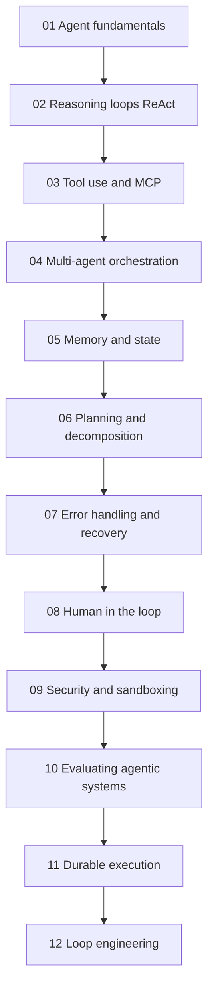
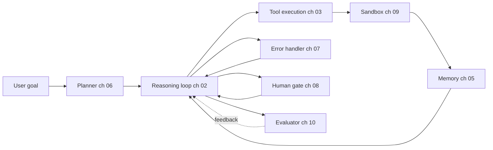

# Agent 系统

2026 年构建生产级 AI Agent：推理循环、MCP 工具使用、多 Agent 编排、记忆、规划、错误恢复、人在环和评估。

Agent 不是单一技术，而是推理循环、工具层、记忆、规划器、错误处理器和评估器的组合。本目录的 12 章分别深入介绍这些层，并按前章建立后章所需术语的顺序组织。

## 章节顺序

## 参考架构

每章概念都映射到已部署 Agent 的一个组件。下图展示各章内容在生产系统中的位置：

## 本目录文件

| 文件 | 内容 |
|------|----------------|
| [01-agent-fundamentals.md](01-agent-fundamentals.md) | 什么构成 Agent、Agent 与工作流的区别，以及何时选择各自方案。 |
| [02-reasoning-loops-react-and-beyond.md](02-reasoning-loops-react-and-beyond.md) | ReAct、Plan-and-Execute、Reflexion、Tree-of-Thought，以及循环设计模式。 |
| [03-tool-use-and-mcp.md](03-tool-use-and-mcp.md) | Function Calling、MCP、2026-07-28 无状态重写、A2A v1.0 和 MCP 生产加固。 |
| [04-multi-agent-orchestration.md](04-multi-agent-orchestration.md) | 多 Agent 何时有帮助、何时有害，以及编排与编舞。 |
| [05-agent-memory-and-state.md](05-agent-memory-and-state.md) | L1～L4 记忆层级（工作、情景、语义、程序）及其权衡。 |
| [06-planning-and-decomposition.md](06-planning-and-decomposition.md) | 任务分解、计划修订和长程规划。 |
| [07-error-handling-and-recovery.md](07-error-handling-and-recovery.md) | 工具失败、重试、循环保护和“第 100 次工具调用”问题。 |
| [08-human-in-the-loop-patterns.md](08-human-in-the-loop-patterns.md) | 确认门、升级和受监督自主。 |
| [09-agentic-security-and-sandboxing.md](09-agentic-security-and-sandboxing.md) | 代码执行沙箱、能力门控和 Agent 中的 Prompt 注入。 |
| [10-evaluating-agentic-systems.md](10-evaluating-agentic-systems.md) | 轨迹评估、Agent-as-Judge、过程奖励模型和 Agent 基准。 |
| [11-durable-execution.md](11-durable-execution.md) | 长时间运行 Agent 如何应对崩溃：事件历史、重放、恰好一次副作用和 Temporal。 |
| [12-loop-engineering.md](12-loop-engineering.md) | 围绕 Agent 设计循环：四层循环、终止与预算、上下文腐化、验证、Loopmaxxing 反模式和成熟度阶梯。 |

## 配套章节

- [工具使用与计算机 Agent](../17-tool-use-and-computer-agents/)：用 OpenClaw、Computer Use 和工具—Agent 格局扩展本节。
- [LangGraph 编排](../09-frameworks-and-tools/02-langgraph-orchestration.md)：本节模式最常见的实现框架。
- [Agent 式 RAG](../06-retrieval-systems/08-agentic-rag.md)：连接 Agent 与检索。
- [可靠性与安全](../13-reliability-and-safety/)：将 Agent 安全扩展到第 09 章沙箱之外。

## 核心要点

- Agent 不是单一技术，而是推理循环、工具层、记忆、规划器和评估器的组合。先读第 01 章。
- MCP 是 2026 年的标准工具互操作协议；除非有充分理由，不要构建自定义工具协议。
- 多 Agent 编排（第 04 章）经常被过度使用；对于多数用例，工具完善的单 Agent 胜过多 Agent。
- 记忆（第 05 章）和错误恢复（第 07 章）是大多数生产 Agent Bug 的来源，应把评估投入放在那里。
- 人在环（第 08 章）不是兜底方案；应针对高风险动作有意识地设计门禁。
- 循环工程（第 12 章）如今是独立学科：弱 Harness 中的强模型会输给优秀 Harness 中的普通模型。在 Harness 中强制终止和预算，并让验证器与产出者分离。
