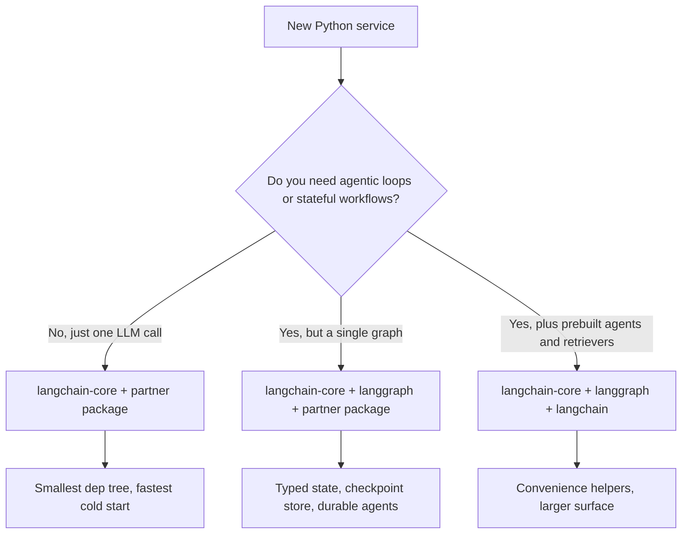

# LangChain 深入理解

LangChain 已经不再只是一个“Prompt 库”。它已经成熟为构建生产级 LLM 应用的**模块化生态**。LangGraph（2025 年底升级到 v1.0，并成为所有 LangChain Agent 的默认运行时）负责有状态编排。**LCEL（LangChain Expression Language）**仍是构建可组合链的最快方式。

## 目录

- [LangChain 技术栈](#stack)
- [LCEL：用管道编程](#lcel)
- [标准抽象（核心）](#core)
- [管理复杂度（社区包与合作伙伴包）](#complexity)
- [LangChain 模块化推进](#langchain-modularity-push)
- [面试问题](#interview-questions)
- [参考资料](#references)

---

## LangChain 技术栈

生态现在分为三个清晰的层：
1. **LangChain Core**：Prompt、输出解析器和 Runnable 的最小抽象（依赖足迹小）。
2. **LangChain Community/Partner**：对 500 多种数据库、模型和工具的集成。
3. **LangGraph**：有状态的编排层（下一章介绍）。

---

## LCEL：用管道编程

LangChain Expression Language（LCEL）使用 `|` 运算符创建执行的**有向无环图（DAG）**。

```python
# Standard RAG chain
chain = (
    {"context": retriever, "question": RunnablePassthrough()}
    | prompt
    | model.with_structured_output(Schema) 
)
```

**为什么使用 LCEL？**
- **默认异步**：每条链都支持 `.ainvoke()` 和 `.astream()`。
- **并行**：多个分支会自动并行运行。
- **可观测性**：自动与 **LangSmith** 集成，实现完整轨迹可视化。

---

## 标准抽象

### 1. Runnable
LangChain 中一切对象的“基类”。Runnable 为 `.invoke`、`.batch` 和 `.stream` 提供统一接口。

### 2. 工具与工具调用
LangChain 对 **MCP（Model Context Protocol）**提供一等支持。
- 可以把任意 MCP 服务器转换成 LangChain 的 `BaseTool`。

### 3. 输出解析器
早期系统使用正则表达式，而现代代码使用 `.with_structured_output()`，利用模型原生 JSON 能力（OpenAI 的 `.json_mode` 或 Anthropic 的 `tools`）。

---

## 管理复杂度

> [!TIP]
> **生产最佳实践**：避免在关键路径中使用 `langchain-community`。使用**合作伙伴包**（例如 `langchain-openai`、`langchain-pinecone`），以减少依赖地狱并提高稳定性。

---

## LangChain 模块化推进

截至 2026 年 5 月，生态已经完成从单体 `langchain` 导入到分层结构的长期迁移，并建立了清晰的依赖边界。拆分的目的是让团队可以精确选择需要的表面，而不必连带引入 500 多个集成。

### 已发布的包分层

| 包 | 用途 | 直接依赖 |
|------|------|---------|
| `langchain-core` | Runnable、Prompt、输出解析器、工具抽象 | Pydantic、`tenacity`，几乎没有其他依赖 |
| `langchain` | 纯 Python 的参考链、检索器和 Agent | `langchain-core` |
| `langgraph` | 有状态图编排、检查点、时间旅行 | `langchain-core` |
| `langchain-openai`、`langchain-anthropic`、`langchain-google-vertexai` 等 | 供应商合作伙伴包 | `langchain-core` + 供应商 SDK |
| `langchain-community` | 集成的长尾集合（仍可用，但不再推荐用于生产路径） | 很多依赖 |
| `langchain-classic` | 保留用于迁移的旧版 v0 链 | `langchain-core` |

根据 v1 发布信息（[LangChain 博客：Building with LangChain 1.0](https://blog.langchain.com/langchain-1-0/)），`langchain-core` 是唯一提供稳定表面和向后兼容保证的包。

### 验证库通用的标准 JSON Schema

应用代码最大的变化是：`with_structured_output()`、`bind_tools()` 和 `@tool` 现在接受任何兼容 [JSON Schema](https://json-schema.org/) 的对象，包括：

- **Pydantic v2**（历史默认选项）
- JavaScript/TypeScript LangChain 通过 `zod-to-json-schema` 使用的**[Zod 4](https://zod.dev/v4)**
- **[Valibot](https://valibot.dev/)**（函数式、可 Tree-shake 的 TS 验证）
- **[ArkType](https://arktype.io/)**（把 TypeScript 类型作为运行时 Schema）
- Python 中的普通 dict / TypedDict
- 手写的 JSON Schema 文档

[LangChain v1 结构化输出指南](https://docs.langchain.com/oss/python/langchain/structured-output)和 [JS 结构化输出指南](https://js.langchain.com/docs/how_to/structured_output)对此有详细文档。实际效果是：框架选择不再决定验证器选择；已经在 HTTP 层统一使用 Valibot 或 ArkType 的团队，可以复用这些 Schema 作为 LangChain 工具定义。

```python
# Python: TypedDict tool schema, no Pydantic in the path
from typing import TypedDict, Annotated
from langchain_anthropic import ChatAnthropic

class CreateInvoice(TypedDict):
    """Create an invoice for a customer."""
    customer_id: Annotated[str, ..., "Stripe customer id"]
    amount_cents: Annotated[int, ..., "Amount in cents, > 0"]

llm = ChatAnthropic(model="claude-opus-4-7")
structured = llm.with_structured_output(CreateInvoice)
```

```typescript
// TypeScript: Valibot schema reused for both HTTP and tool calling
import * as v from "valibot";
import { ChatAnthropic } from "@langchain/anthropic";
import { toJsonSchema } from "@valibot/to-json-schema";

const CreateInvoice = v.object({
  customer_id: v.pipe(v.string(), v.description("Stripe customer id")),
  amount_cents: v.pipe(v.number(), v.minValue(1)),
});

const llm = new ChatAnthropic({ model: "claude-opus-4-7" });
const structured = llm.withStructuredOutput(toJsonSchema(CreateInvoice));
```

### 只使用 `langchain-core` 还是完整 LangChain



2026 年 5 月的推荐姿态：

- **库 / SDK 代码**：只依赖 `langchain-core`。可复用构建块（向量存储、分块器、自定义工具）的生产者不应把 `langchain` 或合作伙伴包作为直接依赖。[LangChain 集成指南](https://docs.langchain.com/oss/python/integrations/providers)将此描述为 `langchain-community` 贡献者必须遵守的规则。
- **应用服务**：使用 `langchain-core` + 实际调用的合作伙伴包；如果有多步骤工作流，再加 `langgraph`。除非明确使用内置检索器或旧链，否则跳过 `langchain`（指这个包，而非品牌）。
- **Notebook 和原型**：为了便利，使用 `langchain` 没问题。

版本锁定很重要。`langchain-core >= 1.0` 是新代码支持的最低版本；根据 [LangChain v1 发布公告](https://blog.langchain.com/langchain-1-0/)，0.3.x 线仍会收到关键补丁，但将在 2026 年第三季度 EOL。

### 现有代码的迁移提示

- `LLMChain`、`RetrievalQA`、`ConversationalRetrievalChain` 和 `AgentExecutor` 位于 `langchain-classic` 中并已冻结。替代方案是 LCEL 管道，或更常见的 `langgraph` 图（[LangChain 迁移指南](https://python.langchain.com/docs/versions/v0_3/)）。
- 工具装饰器从 `langchain_core.tools` 导入，而不是 `langchain.tools`。
- 依赖 Pydantic v1 的输出解析器必须迁移。`langchain-core` v1.0 删除了 v1 兼容层（[发布说明](https://github.com/langchain-ai/langchain/releases/tag/langchain-core%3D%3D1.0.0)）。

---

## 面试问题

### Q：LCEL 相比传统 Python“链”（函数调用序列）的主要好处是什么？

**强回答：**
LCEL 提供**自动流式输出和并行化**。传统 Python 链中，我必须手动用 `asyncio.gather` 处理并行步骤，用自定义生成器处理流式输出；LCEL 的 `Runnable` 架构在底层处理了这些事情。如果定义 `RunnableParallel` 块，LangChain 就会并行执行它们。更重要的是，LCEL 通过 `RunnableBranch` 提供**动态路由**，无需深层嵌套 if/else 就能构建复杂逻辑。

### Q：LangChain 经常被批评“过于臃肿”，如何用它设计精简的生产系统？

**强回答：**
关键是**只导入 Core**。我使用 `langchain-core` 提供抽象，使用具体的**合作伙伴包**（如 `langchain-anthropic`）接入模型。我避免 `langchain-community` 和旧版 `Chain` 类（如 `LLMChain` 或 `RetrievalQA`），因为它们实际上已经弃用。我使用 **Runnable** 原语构建逻辑，从而保持依赖树小、执行路径透明。

---

## 参考资料
- LangChain：《The LangChain Expression Language Specification》（2025）
- Anthropic：《Partner Integration Guide for LangChain》（2025）
- Harrison Chase：《The Future of AI Orchestration》（2024 播客/文章）

---

*下一篇：[LangGraph 编排](02-langgraph-orchestration.md)*
