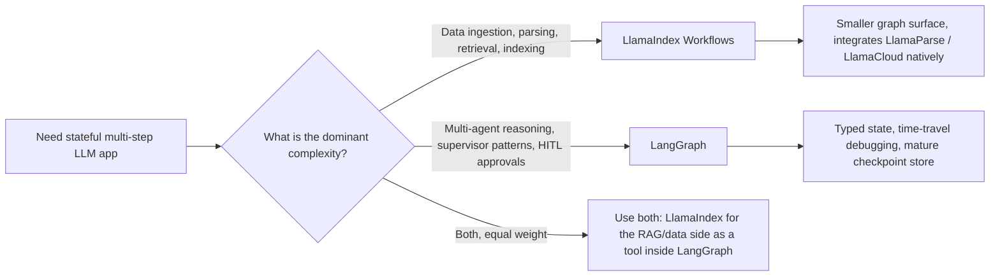

# LlamaIndex

LangChain 聚焦“编排”，而 **LlamaIndex** 是**数据中心 AI**领域的主力。它已经从 RAG 库发展成支持**工作流**和**Agent 数据操作**的框架。

## 目录

- [数据框架理念](#philosophy)
- [LlamaIndex Workflows](#workflows)
- [高级索引：超越向量搜索](#indexing)
- [LlamaCloud 与托管摄取](#llamacloud)
- [Agent 作为工具](#agents-as-tools)
- [LlamaIndex Workflows：事件驱动的应用框架](#llamaindex-workflows-event-driven-application-framework)
- [面试问题](#interview-questions)
- [参考资料](#references)

---

## 数据框架理念

LlamaIndex 建立在**数据比模型更重要**这一信念之上。
- **节点**：每个数据块都是一个带有丰富元数据的“Node”（关系、摘要和父子链接）。
- **检索器**：LlamaIndex 提供最多样的检索器集合（摘要、知识图谱、树和关键词）。

---

## LlamaIndex Workflows

2024 年底，LlamaIndex 引入了 **Workflows**，作为对 LangGraph 的回应。
- **事件驱动架构**：节点通过发出 `Events` 相互通信。
- **并发**：Workflows 原生支持异步，在大规模并行数据处理上优于线性链。

```python
# Conceptual Workflow
class RAGWorkflow(Workflow):
    @step
    async def ingest(self, ev: StartEvent) -> RetrievalEvent:
        # Custom logic...
        return RetrievalEvent(results=nodes)
```

---

## 高级索引

1. **属性图**：把向量数据块关联到图节点，用于 RAG。
2. **上下文感知分块器**：按“含义”而不是“Token 数”对文本分组（使用更小的 LLM 寻找最佳断点）。
3. **动态路径**：检索器根据问题复杂度决定查询**哪个**索引。

---

## LlamaCloud 与托管摄取

面向企业规模，LlamaIndex 聚焦 **LlamaCloud**。
- **托管摄取**：把 PDF 解析、OCR 和表格提取作为服务处理。
- **解析即模型**：使用视觉 LLM（Gemini 3.1 Pro、Claude Opus 4.7、GPT-5.5）理解版式，而不是使用基于规则的解析器。

---

## Agent 作为工具

LlamaIndex 把 Agent 看作**高级检索器**。
- 可以把复杂的 LlamaIndex 查询引擎“包装”为工具，交给 LangGraph Agent。
- **收益**：Agent 可以获得“智能数据访问”，无需了解向量数据库或图 Schema 的技术细节。

---

## LlamaIndex Workflows：事件驱动的应用框架

2024 年的宣传语是“Workflows 是我们的 LangGraph”。如今的说法已经不同：Workflows 是适用于任何 AI 应用的通用事件驱动框架，RAG 只是其中一种用法。现在 `llama-index-core` 将 Workflows 作为主要应用表面，而索引/检索器类已经移动到周围的集成包中（[LlamaIndex Workflows 文档](https://developers.llamaindex.ai/python/framework/understanding/workflows/)）。有一个命名细节值得固定下来：**Workflows** 包在 2025 年年中达到 1.0，目前作为独立包处于 2.x 线；而核心 `llama-index` 框架仍处于 0.x 线（2026 年年中约为 0.14.x）。关于这种版本变化如何破坏教程以及如何应对，请参见[应对框架变动](12-navigating-framework-churn.md)。

### 架构发生了什么变化

| 维度 | Workflows 之前的 LlamaIndex | Workflows 优先的 LlamaIndex |
|-----------|--------------------------|-----------------------------------|
| 主要抽象 | 查询引擎、聊天引擎 | 带有 `@step` 方法的 `Workflow` 类 |
| 控制流 | 线性；嵌套查询引擎 | 步骤消费/发出类型化 `Event` 子类 |
| 状态 | 隐含在引擎实例中 | 具有可序列化状态的显式 `Context` |
| 并发 | 通过异步查询引擎协作 | 一等能力：发出多个事件、扇出、汇合 |
| 持久化 | 无 | Context 可以 `pickle` 化或存为 JSON 以便恢复 |
| 流式输出 | 每个引擎独立 | 任意步骤都能调用 `ctx.write_event_to_stream()` |
| 人在环 | 手动实现 | `InputRequiredEvent` / `HumanResponseEvent` 模式 |

### 事件驱动的思维模型

```python
from llama_index.core.workflow import (
    Workflow, step, Event, StartEvent, StopEvent, Context
)

class RetrievedEvent(Event):
    nodes: list

class JudgedEvent(Event):
    nodes: list
    keep: bool

class GraphRAG(Workflow):
    @step
    async def plan(self, ctx: Context, ev: StartEvent) -> RetrievedEvent:
        await ctx.set("query", ev.query)
        nodes = await self.retriever.aretrieve(ev.query)
        return RetrievedEvent(nodes=nodes)

    @step
    async def judge(self, ctx: Context, ev: RetrievedEvent) -> JudgedEvent:
        keep = await self.relevance_judge(ev.nodes, await ctx.get("query"))
        return JudgedEvent(nodes=ev.nodes, keep=keep)

    @step
    async def answer(self, ctx: Context, ev: JudgedEvent) -> StopEvent:
        if not ev.keep:
            return StopEvent(result="No good evidence found.")
        return StopEvent(result=await self.llm.acomplete(...))
```

这一设计自然带来两个性质：

1. 引擎纯粹根据**事件类型**进行分发，因此增加分支只需增加新的 `Event` 子类和消费它的步骤，不需要修改中心路由器。
2. **并发由数据驱动**：发出三个 `RetrievedEvent` 的步骤会自动扇出三个下游 `judge` 调用，汇合步骤通过 `ctx.collect_events` 收集它们。

### Workflows 与 LangGraph



| 维度 | LlamaIndex Workflows（1.x） | LangGraph（1.x） |
|-----------|----------------------------|-----------------|
| 控制流原语 | 事件分发 | 图节点和边，以及带 Reducer 的类型化状态 |
| 状态模型 | 类 dict 的自由形式 `Context` | 带 Reducer 的 Pydantic / TypedDict 状态 |
| 恢复/时间旅行 | 可 pickle 的 Context，基础恢复 | 一等检查点，可从任意节点创建分支（[LangGraph 持久化文档](https://docs.langchain.com/oss/python/langgraph/persistence)） |
| 原生集成 | LlamaParse、LlamaCloud、全部 LlamaHub Loader | LangSmith 评测、全部 LangChain 集成 |
| 最适合的复杂度 | 数据形状：解析、Embedding、检索、精炼 | 逻辑形状：规划、行动、反思、委托 |
| 多 Agent 辅助 | `AgentWorkflow`、函数调用 Agent（[LlamaIndex AgentWorkflow](https://developers.llamaindex.ai/python/framework/understanding/agent/multi_agent/)） | `create_supervisor`、`create_react_agent`、swarm 模式 |
| 流式 UI | `ctx.write_event_to_stream` + AG-UI 协议 | `astream_events` v2、AG-UI 协议 |

使用 LlamaIndex Workflows 而不是 LangGraph 的情况：

- 难点是**数据摄取**而不是推理。LlamaCloud、LlamaParse 和属性图技术栈都是原生能力，而非适配器桥接（[LlamaCloud 概览](https://www.llamaindex.ai/llamacloud)）。
- 需要**文档驱动的并行**：解析 1,000 份 PDF，为每个数据块扇出 Embedding 步骤，再汇合为一次索引更新。
- 在 `llama-index-ts` 的 **TypeScript** 生态中开发，并希望与 Python Core 保持功能对等。

LangGraph 更合适的情况：

- 难点是 **Agent 控制循环**本身：多个 Agent、监督器模式、持久化中断、重放。
- 需要开箱即用的**时间旅行调试**。LlamaIndex 的恢复适合崩溃恢复，但不具备像 LangGraph 检查点那样从任意历史状态分支的能力。
- 已经使用 LangSmith 评测技术栈，希望不经过桥接就获得轨迹级集成。

### 真实生产姿态

很多高级架构会同时运行两者：用 LlamaIndex Workflows 处理数据平面（摄取、索引、混合检索、重排序），将其包装成工具；再用 LangGraph 在上层承载 Agent 控制平面。这正是 [AIMultiple 框架对比](https://research.aimultiple.com/agentic-ai-frameworks/)和 LlamaIndex 自己的[混合集成 Cookbook](https://developers.llamaindex.ai/python/framework/understanding/workflows/)中提到的模式。

如果新项目只能选一个，问题可以归结为：**团队未来会在数据管道还是 Agent 编排上花更多时间？**答案决定框架选择。

---

## 面试问题

### Q：LangChain 和 LlamaIndex 现在都有“图/工作流”功能，如何选择？

**强回答：**
对于主要复杂度在摄取、多模态解析和复杂检索的**数据密集型**任务，我选择 **LlamaIndex Workflows**，它的事件驱动架构更适合大规模并行数据处理。对于复杂度在推理和人在环逻辑的**逻辑密集型**多 Agent 系统，我选择 **LangGraph**。很多高级架构会同时使用两者：LlamaIndex 做 RAG 引擎，LangGraph 做整体 Agent 监督器。

### Q：LlamaIndex 中的“属性图”是什么，为什么优于基本的向量 RAG？

**强回答：**
属性图把向量的**语义灵活性**与数据库的**结构化精度**结合起来。基本 RAG 可能找到关于“Project Alpha”的数据块，却不知道它由谁负责；属性图中，向量数据块是一个节点，并连接到 `User` 节点和 `Timeline` 节点。这样就能进行**全局推理**（例如“找出上个月 Tom 编写的、关于 Project Alpha 的所有文档”）。基本 RAG 可能因为相关节点不包含准确的关键词“Alpha”而遗漏它们。

---

## 参考资料
- LlamaIndex：《The Workflows Framework: Event-Driven Agents》（2025）
- Jerry Liu：《Data-Centric AI in the LLM Era》（2024/2025）
- LlamaHub：《The Repository of 1000+ Data Loaders》（2025）

---

*下一篇：[DSPy：编程语言模型](05-dspy.md)*
