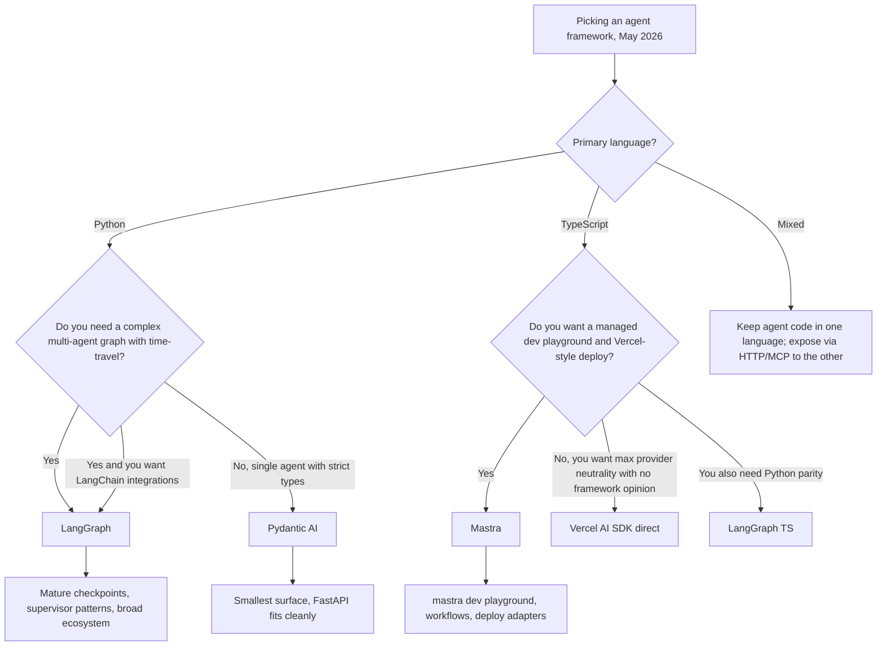

# Pydantic AI 与 Mastra：类型化 Agent 框架（2026）

截至 2026 年 5 月，Agent 框架之争已经不再是“LangGraph 还是 LlamaIndex”。对于优先考虑类型安全而不是生态广度的团队，两个较新的参与者已经占据了有意义的生产份额：Python 世界的 **Pydantic AI** 和 TypeScript 世界的 **Mastra**。两者都拒绝旧框架接受的“字符串进、字符串出”表面，并认为完全类型化的 Agent 比聪明但无类型的 Agent 更容易测试、评估和运维。

## 目录

- [这两个框架是什么](#what-these-frameworks-are)
- [Pydantic AI：Python 中的类型化 Agent](#pydantic-ai-typed-agents-in-python)
- [Mastra：TypeScript 优先的 Agent](#mastra-typescript-first-agents)
- [与 LangGraph 对比](#comparison-with-langgraph)
- [选择框架](#choosing-a-framework)
- [生产参考](#production-references)
- [面试问题](#interview-questions)
- [参考资料](#references)

---

## 这两个框架是什么

Pydantic AI 和 Mastra 都源自对框架锁定和无类型 Prompt 拼接的不满。它们关注同一组理念：

- Agent 循环由**代码**定义，而不是 YAML / JSON 图。
- 工具调用、结构化输出和人在环检查点，都在**函数签名**上进行类型化。
- 供应商可移植性是硬要求：只改一行就能从 Anthropic 切换到 OpenAI 或 Google。
- 评测、追踪和部署是一等能力，而不是后加的功能。

两者的差异主要来自技术栈：一个面向已经用 Pydantic 做 HTTP 校验的 Python 服务，另一个面向希望获得 Vercel 风格开发体验的 Next.js / Node 团队。

---

## Pydantic AI：Python 中的类型化 Agent

### 当前状态

[Pydantic AI](https://ai.pydantic.dev/) 于 2025 年 9 月发布 v1.0，2026 年 4 月以 **v1.85.1** 稳定在 1.x 线，并于 **2026 年 5 月 21 日**进入 **v2.0 Beta 周期**（[PyPI 发布历史](https://pypi.org/project/pydantic-ai/#history)）。这个库由 Pydantic 团队构建，该团队也运营 [Pydantic Logfire](https://pydantic.dev/logfire)。它以 MIT 协议开源。

主要能力面：

- 由输出类型和一组类型化工具参数化的 `Agent` 类。
- 支持 Anthropic、OpenAI、Google、Mistral、Groq、Cohere、Ollama 以及任意 OpenAI 兼容端点的供应商适配器。
- 原生 OpenTelemetry 追踪，可导出到 Logfire 或任意 OTLP Collector。
- `pydantic_evals`：支持声明式评测套件，以及 LLM 评判和代码评分器。
- 当简单 `Agent` 循环不够时，用于显式状态机的 `Graph` API。

### 团队为什么选择它

```python
from pydantic import BaseModel, Field
from pydantic_ai import Agent, RunContext

class RefundDecision(BaseModel):
    approved: bool
    amount_cents: int = Field(ge=0)
    reason: str

agent = Agent(
    "anthropic:claude-opus-4-7",
    output_type=RefundDecision,
    system_prompt="You are a refund analyst. Approve only if policy allows.",
)

@agent.tool
async def lookup_order(ctx: RunContext, order_id: str) -> dict:
    """Look up an order by id."""
    return await ctx.deps.orders.get(order_id)

result = await agent.run("Refund order 1234", deps=DepContainer(orders=db))
assert isinstance(result.output, RefundDecision)
```

三个特性使它适合生产环境：

1. **返回类型会被强制执行**。`result.output` 要么是 `RefundDecision`，要么调用失败，不存在静默的字符串漂移。
2. **工具是函数而不是 dict**。注册时根据 Python 签名和文档字符串生成 Schema，因此不会意外让面向 LLM 的 Schema 与实际实现漂移。
3. **依赖注入是显式的**。`ctx.deps` 是类型化容器，使用 Mock 对 Agent 做单元测试很简单。

[Pydantic AI 评测文档](https://ai.pydantic.dev/evals/)介绍了一种典型循环：生产 Schema 使用的同一个 Pydantic 模型，同时作为 LLM 输出类型和评测评分器的 `expected_output`。

### 适合选择 Pydantic AI 的情况

- 服务使用 **Python**，并且已经用 Pydantic 做 HTTP 校验（FastAPI 是典型情况）。
- 希望端到端使用**严格 Schema**：HTTP 边界、LLM 工具调用、LLM 输出、数据库行都采用 Schema。
- 希望拥有**供应商可移植性**，又不想自己编写适配层。
- 可以接受用命令式 Python 编写 Agent 循环，而不是图定义。

### 不适合的情况

- 需要用于多 Agent 协调和监督器模式的**声明式图**。虽然有 `Graph` API，但它比 LangGraph 更基础。
- 需要支持任意节点分支语义的**时间旅行调试**。
- 需要 LangChain 集成生态的广度（向量存储、文档 Loader 等）。

---

## Mastra：TypeScript 优先的 Agent

### 当前状态

[Mastra](https://mastra.ai/) 由 Gatsby 团队创建（毕业于 YC W25），2025 年 10 月由 Lightspeed 领投宣布获得 **1,300 万美元种子轮**（[TechCrunch 报道](https://techcrunch.com/2025/10/16/mastra-typescript-agent-framework-seed/)），并于 **2026 年 1 月发布 v1.0**。截至 2026 年 5 月，其 GitHub 仓库已经超过 **2.23 万 Star**，每周 npm 下载量超过 **30 万**（[mastra-ai/mastra](https://github.com/mastra-ai/mastra)）。Mastra 以 Elastic License v2 开源。

主要能力面：

- `Agent`、`Workflow` 和 `Tool` 原语，全部用 TypeScript 定义并完整推导类型。
- 内置**本地开发服务器**（`mastra dev`），带 Playground UI、评测运行器和轨迹查看器。
- 与 Vercel 的 **AI SDK** 紧密集成，支持流式、多步骤工具调用和供应商切换。
- 开箱即用的记忆和 RAG，支持 `libsql` / `pgvector` 适配器。
- 一条命令部署到 **Mastra Cloud**、Vercel、Cloudflare Workers 或 Node 服务器。

### 团队为什么选择它

```typescript
import { Agent } from "@mastra/core/agent";
import { createTool } from "@mastra/core/tools";
import { anthropic } from "@ai-sdk/anthropic";
import { z } from "zod";

const lookupOrder = createTool({
  id: "lookup-order",
  description: "Look up an order by id",
  inputSchema: z.object({ orderId: z.string() }),
  outputSchema: z.object({ status: z.string(), totalCents: z.number() }),
  execute: async ({ context }) => ordersDb.get(context.orderId),
});

export const refundAgent = new Agent({
  name: "refund-agent",
  model: anthropic("claude-opus-4-7"),
  instructions: "You are a refund analyst. Approve only if policy allows.",
  tools: { lookupOrder },
});
```

三个特性使它很有吸引力：

1. **端到端类型推导**。Zod Schema 同时驱动工具运行时校验、面向 LLM 的 JSON Schema，以及 `execute` 内部 `context` 的 TypeScript 类型，只有一个事实来源。
2. **`mastra dev` 是杀手级功能**。它启动本地 UI，让你无需编写前端，就能调用任意 Agent、回放任意轨迹、运行任意评测并检查任意工具输入/输出。
3. **一等工作流**。`createWorkflow` 定义由步骤组成的类型化图（每个步骤可以是 Mastra 工具或 Agent），支持分支、挂起/恢复和人在环，而且都经过类型检查。

[Generative.inc 的 Mastra 指南](https://generative.inc/blog/mastra-typescript-agent-framework)介绍了当团队其他技术栈已经完全使用 TypeScript 时，如何用 Mastra 替换 Python 编排。

### 适合选择 Mastra 的情况

- 团队以 **TypeScript 为主**，应用其余部分运行在 Next.js / Node / Bun / Cloudflare Workers 上。
- 希望获得**Vercel 风格 DX**：一个 CLI、本地 Playground 和有明确观点的部署方式。
- 流式 UI 很重要，希望依赖 AI SDK 的 `useChat` 和 `streamText` 原语。
- 希望默认接入带人工审批步骤的**挂起/恢复工作流**。

### 不适合的情况

- 需要大量预置 Agent 或社区集成。其生态规模仍小于 LangChain。
- 团队及绝大多数 AI 工具都使用 **Python**。通过 HTTP 跨语言连接没问题，但会增加延迟。
- 需要**学术风格**的自定义推理行为（自定义解码等），应留在 Python 中。

---

## 与 LangGraph 对比

| 维度 | Pydantic AI v1.85 | Mastra（2026 年 5 月） | LangGraph 1.x |
|-----------|-------------------|---------------------|----------------|
| 语言 | Python | TypeScript | Python 和 TypeScript |
| 协议 | MIT | Elastic License v2 | MIT |
| 主要单元 | 带 `output_type` 的类型化 `Agent` | 类型化 `Agent` 和 `Workflow` | 运行在类型化状态之上的节点图 |
| Schema 来源 | Pydantic v2 | Zod | JSON Schema（Pydantic、Zod、Valibot、ArkType） |
| 供应商中立性 | 内置适配器 | 通过 Vercel AI SDK | 通过 LangChain 合作伙伴包 |
| 多 Agent | 手动或 `Graph` API | `Workflow` + Agent-as-tool | `create_supervisor`、swarm、自定义图 |
| 状态持久化 | 手动或 `pydantic_graph` 检查点 | Workflow 快照 + 存储适配器 | 一等检查点存储（Postgres、Redis、SQLite、内存） |
| 时间旅行调试 | 无 | 在本地 Playground 中回放 | 支持，可从任意检查点分支 |
| 评测框架 | `pydantic_evals` | 内置 Mastra 评测 | LangSmith 或外部框架 |
| 追踪 | OTLP / Logfire | OTLP / Mastra Cloud | LangSmith 或 OTLP |
| 耦合 | 不依赖 LangChain | 不依赖 LangChain | 紧耦合 LangChain 生态 |
| 生态规模 | 小但在增长 | 小但在增长 | 大（LangChain 集成） |



---

## 选择框架

三个决策因素按权重排序：

1. **现有服务的语言**。Python 服务选择 Pydantic AI 和 LangGraph（Python）；TypeScript 服务选择 Mastra 和 LangGraph TS。跨越语言边界通常比选择正确的一侧更差。
2. **复杂度的形状**。如果 Agent 本质上是“LLM + 几个工具 + 严格输出类型”，Pydantic AI 或 Mastra 就足够，而且运行成本更低。如果有许多协作 Agent、分支、重试和审批，LangGraph 的图 + 检查点模型更占优势。
3. **生态耦合**。LangGraph 带来 LangChain 集成、LangSmith 评测及其余生态；Pydantic AI 和 Mastra 带来更干净的类型保证和更快的冷路径，但需要自己接入集成。

一个实用启发式是：如果页面上最长的是工具列表，选择 Pydantic AI 或 Mastra；如果页面上最长的是状态机，选择 LangGraph。

---

## 生产参考

以下是截至 2026 年 5 月各框架被认真用于生产的公开参考：

- **Pydantic AI**
  - [Pydantic Logfire 控制台](https://pydantic.dev/logfire)本身使用 Pydantic AI 构建内部分诊 Agent。
  - [Sourcegraph Cody](https://sourcegraph.com/cody) 团队曾[撰文介绍使用 Pydantic AI](https://ai.pydantic.dev/)为服务端工作流构建类型化代码动作 Agent。
  - 许多 FastAPI 团队采用它，因为同一个 Pydantic 模型可以同时服务 HTTP 边界和 LLM 输出类型。
- **Mastra**
  - [Stripe](https://stripe.com/) 的开发者体验原型（[mastra.ai](https://mastra.ai/)）。
  - [Resend](https://resend.com/)、[Liveblocks](https://liveblocks.io/) 和 [Vercel](https://vercel.com/) 的演示应用。
  - 种子轮公告（[TechCrunch](https://techcrunch.com/2025/10/16/mastra-typescript-agent-framework-seed/)）列出了金融科技和开发者工具领域的生产用户。
- **LangGraph**（参考）
  - [LinkedIn 的 SQL Bot](https://www.linkedin.com/blog/engineering/ai/practical-text-to-sql-for-data-analytics)、[Uber 的编码助手](https://www.uber.com/en-IN/blog/genie-uber-genai-on-call-copilot/)、[Klarna](https://www.klarna.com/)、[Elastic](https://www.elastic.co/) AI Assistant、[Replit](https://replit.com/) 以及 [LangChain 客户页面](https://www.langchain.com/built-with-langgraph)上的更多案例。

---

## 面试问题

### Q：什么时候会在 Python 服务中选择 Pydantic AI 而不是 LangGraph？

**强回答：**
当 Agent 本质上是一个带类型化输出和少量工具的 LLM，并且服务其余部分已经采用 Pydantic 形态（FastAPI、SQLModel 等）时，我会选择 Pydantic AI。收益是同一个 Pydantic 模型同时定义 HTTP 响应、LLM 输出和评测评分器的预期结构，因此不存在 Schema 漂移。当需要带检查点时间旅行的真正多 Agent 图、监督器模式或 LangChain 集成生态时，LangGraph 更重的表面就值得使用。我会问：设计中最复杂的部分是工具列表还是状态机？工具列表选 Pydantic AI，状态机选 LangGraph。

### Q：Mastra 是 Vercel AI SDK 的替代品吗？

**强回答：**
不是。Mastra 在底层供应商调用和流式输出上构建于 Vercel AI SDK 之上。Mastra 增加的是**Agent 抽象**、**工作流引擎**、**记忆**、**RAG**、**评测**和 **`mastra dev` Playground**。如果只需要在 Next.js 应用中以流式方式调用 LLM 和工具，AI SDK 本身已经足够。如果希望拥有带工作流、挂起/恢复、记忆和本地 Playground 的类型化 Agent，Mastra 就是无需自己实现这些能力的那一层。

### Q：“类型化 Agent 框架”在生产中究竟带来了什么？

**强回答：**
三点。第一，**更少的坏输入会泄漏下去**。面向 LLM 的 Schema 来源于校验运行时负载的同一个 Pydantic/Zod 定义，因此如果 LLM 幻觉生成字段，解析步骤会在任何下游代码运行之前拒绝它。第二，**干净的单元测试**。类型化工具只是带 Pydantic/Zod 边界的函数，可以不接入 LLM 单独测试。第三，**Schema 感知的评测**。评测框架可以逐字段比较两个类型化对象，而不是比较字符串差异，从而发现字段变成可选项或枚举增加新值这类细微回归。

---

## 参考资料

- Pydantic AI v1.85 发布说明：https://github.com/pydantic/pydantic-ai/releases
- Pydantic AI 文档：https://ai.pydantic.dev/
- Pydantic AI 评测：https://ai.pydantic.dev/evals/
- Mastra 仓库：https://github.com/mastra-ai/mastra
- Mastra 文档：https://mastra.ai/
- TechCrunch：《Mastra raises $13M seed for TypeScript agent framework》（2025 年 10 月）：https://techcrunch.com/2025/10/16/mastra-typescript-agent-framework-seed/
- Generative.inc Mastra 指南：https://generative.inc/blog/mastra-typescript-agent-framework
- LangGraph 1.x 文档：https://docs.langchain.com/oss/python/langgraph/
- LangChain “Built with LangGraph” 客户列表：https://www.langchain.com/built-with-langgraph
- Vercel AI SDK：https://ai-sdk.dev/
- AIMultiple《Agentic AI frameworks compared》（2026）：https://research.aimultiple.com/agentic-ai-frameworks/

---

*下一篇：如需跨框架选择标准，请参阅[框架选择指南](08-framework-selection-guide.md)。*
