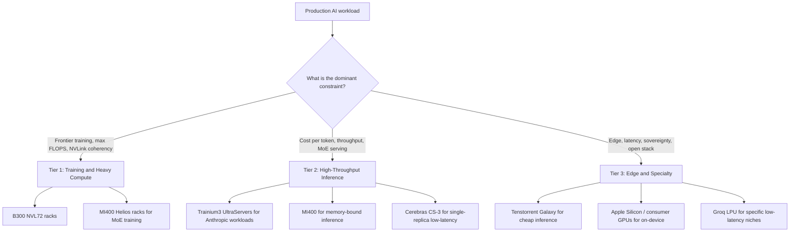

# LLM 基础设施

构建生产级 LLM 系统，需要理解部署选项、扩展模式和运维关注点。本章覆盖基础设施层。

## 目录

- [部署选项](#deployment-options)
- [服务架构](#serving-architecture)
- [扩展模式](#scaling-patterns)
- [成本管理](#cost-management)
- [监控与告警](#monitoring-and-alerting)
- [灾难恢复](#disaster-recovery)
- [2026 年 5 月 AI 加速器版图](#may-2026-ai-accelerator-landscape)
- [面试问题](#interview-questions)
- [参考资料](#references)

---

## 部署选项

### API 与自托管

| 因素 | API 供应商 | 自托管 |
|--------|---------------|-------------|
| 部署时间 | 几分钟 | 数天到数周 |
| 运维负担 | 无 | 很高 |
| 低流量成本 | 较低 | 较高（固定成本） |
| 高流量成本 | 较高 | 较低（规模经济） |
| 延迟控制 | 有限 | 完全控制 |
| 数据隐私 | 数据离开自己的基础设施 | 数据留在本地 |
| 模型选择 | 供应商提供的模型 | 任意开源模型 |
| 定制能力 | 通过 API 微调 | 完全控制 |

### 何时使用 API 供应商

```python
# Decision framework
def should_use_api(requirements: dict) -> bool:
    # Strong signals for API
    if requirements["time_to_market"] == "urgent":
        return True
    if requirements["query_volume"] < 100_000_per_month:
        return True
    if requirements["team_ml_expertise"] == "low":
        return True
    
    # Strong signals for self-hosted
    if requirements["data_residency"] == "strict":
        return False
    if requirements["latency_p99_ms"] < 100:
        return False
    if requirements["query_volume"] > 10_000_000_per_month:
        return False
    
    # Default to API for simplicity
    return True
```

### 自托管选项

| 选项 | 复杂度 | 性能 | 使用场景 |
|------|------------|-------------|----------|
| vLLM | 中等 | 优秀 | 生产服务 |
| TGI（HuggingFace） | 中等 | 很好 | HuggingFace 生态 |
| TensorRT-LLM | 高 | 最佳（NVIDIA） | 追求最高性能 |
| Ollama | 低 | 好 | 开发、小规模 |
| llama.cpp | 低 | 好 | CPU 推理、边缘设备 |

---

## 服务架构

### 单模型服务

```
┌─────────────┐     ┌─────────────┐     ┌─────────────┐
│   Client    │────▶│   Gateway   │────▶│  LLM Server │
└─────────────┘     └─────────────┘     └─────────────┘
                           │
                           ▼
                    ┌─────────────┐
                    │    Cache    │
                    └─────────────┘
```

### 多模型服务

```
                    ┌─────────────────────────────── │
                    │         Load Balancer          │
                    └───────────────┬────────────────┘
                                    │
            ┌───────────────────────┼───────────────────────┐
            │                       │                       │
            ▼                       ▼                       ▼
    ┌───────────────┐       ┌───────────────┐       ┌───────────────┐
    │  GPT-4 Pool   │       │  Claude Pool  │       │ Llama 70B Pool│
    │  (API calls)  │       │  (API calls)  │       │ (self-hosted) │
    └───────────────┘       └───────────────┘       └───────────────┘
```

### 模型路由模式

```python
class ModelRouter:
    def __init__(self):
        self.models = {
            "simple": GPT4oMini(),
            "complex": Claude35Sonnet(),
            "code": Claude35Sonnet(),
            "long_context": Gemini15Pro(),
            "vision": GPT4o()
        }
        self.classifier = QueryClassifier()
    
    async def route(self, request: Request) -> Response:
        # Classify request type
        request_type = self.classifier.classify(request)
        
        # Route to appropriate model
        model = self.models[request_type]
        
        # Execute with fallback
        try:
            return await model.generate(request)
        except RateLimitError:
            return await self.fallback(request, request_type)
    
    async def fallback(self, request: Request, original_type: str) -> Response:
        # Define fallback order
        fallbacks = {
            "simple": ["complex", "long_context"],
            "complex": ["simple"],
            "code": ["complex"]
        }
        
        for fallback_type in fallbacks.get(original_type, []):
            try:
                return await self.models[fallback_type].generate(request)
            except Exception:
                continue
        
        raise ServiceUnavailableError("All models unavailable")
```

---

## 扩展模式

### 水平扩展

```python
# Kubernetes HPA config for LLM service
hpa_config = """
apiVersion: autoscaling/v2
kind: HorizontalPodAutoscaler
metadata:
  name: llm-service-hpa
spec:
  scaleTargetRef:
    apiVersion: apps/v1
    kind: Deployment
    name: llm-service
  minReplicas: 2
  maxReplicas: 20
  metrics:
  - type: Resource
    resource:
      name: cpu
      target:
        type: Utilization
        averageUtilization: 70
  - type: Pods
    pods:
      metric:
        name: requests_per_second
      target:
        type: AverageValue
        averageValue: 100
"""
```

### 自托管的 GPU 扩展

| 规模 | GPU | 建议配置 |
|-------|------|-----------------|
| 开发/测试 | 1 | 单张 A10G 或 L4 |
| 小型生产 | 2-4 | 2× A100，使用张量并行 |
| 中型生产 | 4-8 | 4× H100，使用张量并行 |
| 大型生产 | 8+ | 多节点，使用流水线并行 |

### 基于队列的架构

对于高吞吐异步负载：

```
┌─────────────┐     ┌─────────────┐     ┌─────────────┐
│  Producers  │────▶│    Queue    │────▶│  Consumers  │
└─────────────┘     │  (Redis/    │     │  (LLM       │
                    │   SQS)      │     │   Workers)  │
                    └─────────────┘     └─────────────┘
                                               │
                                               ▼
                                        ┌─────────────┐
                                        │  Results    │
                                        │  Store      │
                                        └─────────────┘
```

```python
class AsyncLLMProcessor:
    def __init__(self):
        self.queue = RedisQueue("llm_requests")
        self.results = RedisResults("llm_results")
    
    async def submit(self, request: Request) -> str:
        request_id = generate_id()
        await self.queue.enqueue({
            "id": request_id,
            "request": request.to_dict()
        })
        return request_id
    
    async def get_result(self, request_id: str, timeout: int = 300) -> Response:
        return await self.results.wait_for(request_id, timeout)
    
    # Worker process
    async def worker_loop(self):
        while True:
            job = await self.queue.dequeue()
            try:
                result = await self.llm.generate(job["request"])
                await self.results.store(job["id"], result)
            except Exception as e:
                await self.results.store_error(job["id"], str(e))
```

---

## 成本管理

### 成本跟踪

```python
class CostTracker:
    # Pricing as of December 2025 (verify current rates)
    PRICING = {
        "gpt-4o": {"input": 2.50, "output": 10.00},  # per 1M tokens
        "gpt-4o-mini": {"input": 0.15, "output": 0.60},
        "claude-3.5-sonnet": {"input": 3.00, "output": 15.00},
        "claude-3.5-haiku": {"input": 0.25, "output": 1.25},
    }
    
    def calculate_cost(
        self,
        model: str,
        input_tokens: int,
        output_tokens: int
    ) -> float:
        pricing = self.PRICING[model]
        input_cost = (input_tokens / 1_000_000) * pricing["input"]
        output_cost = (output_tokens / 1_000_000) * pricing["output"]
        return input_cost + output_cost
    
    def track(self, request_id: str, model: str, tokens: dict):
        cost = self.calculate_cost(
            model,
            tokens["input"],
            tokens["output"]
        )
        
        self.metrics.record(
            "llm_cost",
            cost,
            tags={"model": model, "request_id": request_id}
        )
        
        return cost
```

### 成本优化策略

| 策略 | 节省 | 实现方式 |
|----------|---------|----------------|
| 模型路由 | 50-80% | 将简单查询路由到便宜模型 |
| 缓存 | 30-70% | 缓存高频查询 |
| Prompt 优化 | 10-30% | 缩短 Prompt，使用结构化输出 |
| 批处理 API | 50% | 异步工作使用批处理端点 |
| 自托管 | 不固定 | 达到规模后可能更便宜 |

### 预算告警

```python
class BudgetManager:
    def __init__(self, daily_budget: float, alert_threshold: float = 0.8):
        self.daily_budget = daily_budget
        self.alert_threshold = alert_threshold
    
    async def check_and_alert(self):
        today_cost = await self.get_today_cost()
        utilization = today_cost / self.daily_budget
        
        if utilization >= 1.0:
            await self.alert("CRITICAL: Daily budget exceeded", today_cost)
            # Consider enabling cost controls
            await self.enable_rate_limiting()
        elif utilization >= self.alert_threshold:
            await self.alert("WARNING: Approaching daily budget", today_cost)
    
    async def enable_rate_limiting(self):
        # Reduce throughput to stay within budget
        self.rate_limiter.set_rate(
            requests_per_minute=self.calculate_safe_rate()
        )
```

---

## 监控与告警

### 关键指标

```python
LLM_METRICS = {
    # Latency
    "ttft_seconds": "Time to first token",
    "total_latency_seconds": "Total request time",
    
    # Throughput
    "requests_per_second": "Request rate",
    "tokens_per_second": "Token generation rate",
    
    # Resources
    "gpu_utilization": "GPU compute usage",
    "gpu_memory_utilization": "GPU memory usage",
    "kv_cache_utilization": "KV cache usage",
    
    # Quality (sampled)
    "quality_score": "LLM-as-judge score",
    "faithfulness_score": "RAG faithfulness",
    
    # Errors
    "error_rate": "Failed requests percentage",
    "rate_limit_hits": "Rate limit rejections",
    
    # Cost
    "cost_per_request": "Average cost per request",
    "daily_cost": "Total daily spend"
}
```

### 告警配置

```yaml
alerts:
  - name: high_error_rate
    condition: error_rate > 0.05
    for: 5m
    severity: critical
    
  - name: high_latency
    condition: p99_latency > 10s
    for: 5m
    severity: warning
    
  - name: cost_spike
    condition: hourly_cost > 2 * avg_hourly_cost
    for: 1h
    severity: warning
    
  - name: quality_degradation
    condition: avg_quality_score < 3.5
    for: 30m
    severity: warning
    
  - name: gpu_memory_pressure
    condition: gpu_memory_utilization > 0.95
    for: 5m
    severity: warning
```

---

## 灾难恢复

### 多供应商故障转移

```python
class MultiProviderClient:
    def __init__(self):
        self.providers = [
            OpenAIClient(),
            AnthropicClient(),
            GoogleClient()
        ]
        self.primary = 0
    
    async def generate(self, request: Request) -> Response:
        # Try primary provider first
        try:
            return await self.providers[self.primary].generate(request)
        except (RateLimitError, ServiceError) as e:
            return await self.failover(request, e)
    
    async def failover(self, request: Request, original_error: Exception) -> Response:
        for i, provider in enumerate(self.providers):
            if i == self.primary:
                continue
            try:
                response = await provider.generate(request)
                # Log failover for monitoring
                self.log_failover(self.primary, i, original_error)
                return response
            except Exception:
                continue
        
        raise AllProvidersUnavailable("All LLM providers failed")
```

### 优雅降级

```python
class GracefulDegradation:
    def __init__(self):
        self.cache = ResponseCache()
        self.fallback_responses = FallbackResponses()
    
    async def handle_outage(self, request: Request) -> Response:
        # Level 1: Try cache
        cached = await self.cache.get_similar(request.query)
        if cached and cached.similarity > 0.9:
            return Response(
                content=cached.response,
                metadata={"source": "cache", "degraded": True}
            )
        
        # Level 2: Try fallback responses
        fallback = self.fallback_responses.get(request.intent)
        if fallback:
            return Response(
                content=fallback,
                metadata={"source": "fallback", "degraded": True}
            )
        
        # Level 3: Graceful error
        return Response(
            content="I am currently experiencing issues. Please try again later or contact support.",
            metadata={"source": "error", "degraded": True}
        )
```

---

## 2026 年 5 月 AI 加速器版图

从 2026 年 1 月到 5 月，AI 基础设施的硬件变化速度超过此前任何一个阶段。各项产能公告合计意味着**超过一万亿美元的已承诺云支出**，供应链也不再由单一供应商主导。本节是高级架构师在 2026 年 5 月进行产能规划时应掌握的快照。

### NVIDIA Blackwell Ultra（B300 / GB300 NVL72）

旗舰产品是 **B300**（“Blackwell Ultra”），自 2026 年 1 月起批量出货（[NVIDIA 新闻公告](https://nvidianews.nvidia.com/news/nvidia-blackwell-ultra-ai-factory-platform-paves-way-for-age-of-ai-reasoning)）。

| 规格 | B300 / GB300 NVL72 |
|------|---------------------|
| 每 GPU 的 HBM3e | 288 GB |
| 峰值 FP4（稀疏） | ~15 PFLOPS |
| 形态 | NVL72 机架：72 张 Blackwell Ultra GPU + 36 个 Grace CPU |
| NVL72 聚合 NVLink 带宽 | ~130 TB/s |
| 每个 NVL72 的 HBM 总量 | ~20 TB |
| 预计 2026 年出货机架 | ~60,000（Jensen Huang，GTC 2026 主题演讲） |

其战略卖点是“AI 工厂”：NVL72 被出售为一个一致的 NVLink 域推理/训练单元，而不是若干张独立显卡。对于前沿模型训练和最大规模推理负载，截至 2026 年 5 月它仍然是默认选择。

权衡没有改变：绝对性能最高、绝对价格最高、软件锁定最深。CUDA、NCCL 和 TensorRT-LLM 都以 NVIDIA 为前提；围绕它们架构，就意味着作出了绑定承诺。

### AMD MI400 与 Helios 机架

[AMD MI400](https://ir.amd.com/news-events/press-releases/detail/1252/amd-introduces-fifth-generation-instinct-mi400-series)（2025 年第四季度发布、2026 年第一季度送样、2026 年年中正式上市）是可信的第二供应源。

| 规格 | MI400 |
|------|-------|
| 内存 | HBM4，每 GPU **432 GB** |
| 内存带宽 | ~20 TB/s |
| 峰值 FP4 | ~13 PFLOPS |
| 机架方案 | **Helios**：EPYC Venice CPU、MI400 GPU、Pensando Vulcano 800Gb 网卡 |
| 软件 | ROCm 7.x，PyTorch / vLLM / SGLang 一等支持 |

每 GPU 432 GB 是最醒目的指标，比 B300 的 288 GB 高出 50% 以上。对于 MoE 服务（瓶颈是让专家权重常驻）和 KV Cache 密集型长上下文负载，每 GPU 的内存优势很实际。AMD 也缩小了大部分软件差距；ROCm 7.x 已不像 2023 年那样构成否决理由，开源服务框架通常会同时测试两者。

短板是**生产部署成熟度**。NVIDIA 已连续两代大规模向所有超大规模云厂商出货，而 AMD 仍在提升供应链产量。各大云厂商正在运行混合舰队。

### AWS Trainium3 与 Anthropic 的千亿美元交易

2025 年 11 月，Anthropic 与 AWS 宣布扩展到 2026 年最多 **5 吉瓦**的算力容量，以 Trainium 芯片为基础，并称其为**“1000 亿美元以上的交易”**（[AWS 新闻稿](https://press.aboutamazon.com/2025/11/anthropic-and-aws-announce-100-billion-strategic-partnership-investment-to-expand-trainium-compute-and-collaborate-on-ai-frontier-research)）。

关键数字：

| 规格 | Trainium3 |
|------|-----------|
| 制程 | 3nm |
| 配置 | **Trn3 UltraServer**，每系统 **144 颗芯片** |
| 相对 T2 的峰值性能 | 目标负载约 **4.4 倍** |
| 内存 | HBM3e |
| 网络 | UltraServer 内使用 NeuronLink，集群间使用 EFA |

战略含义是：AWS 现在拥有可信的垂直整合 AI 基础设施（Trainium 芯片 + Annapurna 网络 + EC2 + Bedrock）。对于 Anthropic 模型的推理密集型负载，其性价比已经能与 H200 级 NVIDIA 硬件竞争，并将在 2026 年底逐步接近 B300。

限制也很明确：Trainium 使用 **AWS Neuron SDK**，而不是 CUDA。迁移意味着重写内核、重新测试数值结果并重新调优批处理；规模足够大时值得，小规模时会很痛苦。

### Cerebras IPO（2026 年 5 月）

Cerebras 于 **2026 年 5 月 14 日**以 **185 美元/股**定价 IPO，筹资约 **55.5 亿美元**，首日开盘超过 190 美元，收盘时估值接近 **1000 亿美元**（[CNBC 报道](https://www.cnbc.com/2026/05/14/cerebras-ipo-priced.html)、[The Register](https://www.theregister.com/2026/05/15/cerebras_ipo/)）。

它带来的市场变化包括：

- **AWS 与 Cerebras 合作**提供高吞吐推理（[AWS / Cerebras 博客](https://aws.amazon.com/blogs/machine-learning/cerebras-on-aws/)）。Trainium3 服务 Anthropic 和其他内部负载，Cerebras 服务追求超低延迟的 Llama / 开源模型。
- CS-3 晶圆级引擎仍是 70B+ 模型单芯片、单副本推理并达到小于 50ms TTFT 的唯一可信选项。
- Cerebras Cloud API 已成为 GPU 主栈团队获取延迟优势、又无需移植的快速第二供应源。

IPO 的结构性意义在于：非 NVIDIA 推理供应商现在拥有公开市场融资路径，也降低了后来者融资的难度。

### Tenstorrent Galaxy Blackhole

[Tenstorrent Galaxy](https://tenstorrent.com/hardware/galaxy) 于 **2026 年 4 月 28 日**正式上市（[The Register](https://www.theregister.com/2026/04/28/tenstorrent_galaxy_ga/)、[EE Times](https://www.eetimes.com/tenstorrent-launches-blackhole-galaxy/)）。

| 规格 | Galaxy Blackhole |
|------|------------------|
| 每服务器 | **32 颗 Blackhole 芯片** |
| 每芯片 | RISC-V 核心、Tensix tile，无外部内存层级 |
| 峰值 BlockFP8 | 每服务器约 **23 PFLOPS** |
| 内存 | 芯片连接的 LPDDR4X + 片上 SRAM |
| 标价 | 每台 32 芯片服务器约 **110,000 美元** |
| 架构 | 完全开放的 RISC-V 控制平面、开放固件和开放编译器 |

开源 RISC-V 对两类用户尤其重要：希望拥有非 CUDA 栈并完全掌握固件与工具链的超大规模云厂商/主权云，以及需要自定义内核、受制于 CUDA 闭源部分的研究实验室。

每服务器 11 万美元的价格，在部分负载上约为同等 NVIDIA 推理机架的十分之一。它不是前沿训练竞争者，而是在推理和小规模微调场景中凭借每美元性能形成竞争。

### Stargate 与云投入规模

产能故事已经不只是芯片，也包括芯片周围的建筑：

- **Stargate**（OpenAI / Oracle / SoftBank 合资项目）承诺整个计划约 **1.4 万亿美元云支出**（[OpenAI 公告](https://openai.com/index/stargate-update/)）。
- 截至 2026 年第一季度，**得克萨斯州阿比林**旗舰站点已上线 **1.2 GW**；七个已公布站点还在建设多吉瓦扩容，总计划容量约 **7 GW**。
- 根据公开申报和公告，已有超过 **4000 亿美元**投入或签约用于这一版图（Oracle FY26 第三季度业绩、[SoftBank 投资者资料](https://group.softbank/en/ir)）。

对高级工程师的架构含义是：前沿模型供应商的推理边际成本下降速度可能快于公开 API 价格所显示的速度。由于底层机房已经存在，2026 年的闲置产能、非高峰推理批处理和多区域故障转移都更容易实现。

### 三层舰队策略



| 层级 | 服务对象 | 默认硬件 | 原因 |
|------|----------------|-------------------|-----|
| **第 1 层：训练与重计算** | 前沿模型训练、推理密集型任务、万亿参数 MoE | **B300 NVL72**、**MI400 Helios** | 需要 NVLink 级一致性和最大的 HBM 池 |
| **第 2 层：高吞吐推理** | API 产品、RAG 后端、Agent 平台 | **Trainium3**、**MI400**、**Cerebras CS-3**、**B300** | 优化每 token 成本和可预测 P99，通常考虑 MoE |
| **第 3 层：边缘与专用** | 延迟关键、主权部署、要求开放固件或总成本低的场景 | **Tenstorrent Galaxy**、**Apple Silicon**、消费级 GPU、**Groq LPU** | 美元/性能、开放栈和监管本地性 |

2026 年重要的判断是：**认真设计 AI 产品的高级架构师不再围绕单一供应商设计**。产能竞争太激烈、价格变化太快，而且单一供应商栈内的故障高度相关。多供应商已经成为新默认。

### 产能规划要点

- 规划时要和 FLOPS 一样重视**每个加速器的内存**；MoE 服务受专家驻留限制。
- 把 **CUDA 锁定视为真实成本**。ROCm 7.x 已足以支持大多数生产服务；Neuron 足以支持 Anthropic 以及愿意承担移植工作的团队；开放 RISC-V 足以支持成本敏感型推理。
- 超大规模云厂商的选择如今和芯片选择互相驱动：AWS = Trainium + Cerebras + 部分 NVIDIA；Microsoft = NVIDIA + Maia；Google = TPU + 部分 NVIDIA；Oracle = 大规模 NVIDIA。
- **每 token 成本**在 2025 和 2026 年大约每年下降 3～5 倍（[a16z State of AI Compute](https://a16z.com/state-of-ai-compute-2026/)）。按 2024 年价格签订的长期合同如今通常不如现货划算。

---

## 面试问题

### Q：每天 100 万次 LLM 查询，你会如何设计基础设施？

**强回答：**

每天 100 万次查询平均约为每秒 12 次，但峰值可能达到平均值的 3～5 倍。我的设计包括：

**架构：**
- 负载均衡器分发到多个 API 端点。
- 通过模型路由器优化成本，把简单查询路由到更便宜的模型。
- 使用 Redis 缓存高频查询。
- 异步负载使用基于队列的处理。

**成本优化：**
- 将 60～70% 的简单查询路由到 GPT-4o-mini 或 Claude Haiku。
- 实施语义缓存，目标缓存命中率超过 30%。
- 非紧急请求使用批处理 API，获得 50% 折扣。
- 达到这一流量后，自托管开始具备成本竞争力。

**可靠性：**多供应商自动故障转移、按用户限流、队列处理峰值，以及供应商不可用时的优雅降级。

**监控：**实时成本跟踪与预算告警、p50/p95/p99 延迟、持续采样质量指标、错误率和限流命中率。

按平均每次 2K token、使用 GPT-4o 估算，每天成本约 2.5 万美元；通过路由和缓存可以降至每天 5000～8000 美元。

### Q：什么时候应该自托管，什么时候使用 API 供应商？

**强回答：**

我的决策框架考虑以下因素：

**使用 API 供应商：**每月低于 100 万次查询、上市时间关键、团队缺少 GPU 基础设施经验、希望立即使用最新模型，或负载波动大且难以预测。

**自托管：**数据不能离开自己的基础设施、每月超过 1000 万次查询、需要低于 100ms 的 P99 延迟、需要自定义权重/微调，或希望完全控制模型行为。

**混合方式通常最好：**高流量且可预测的负载自托管；突发流量和专用模型使用 API；自托管失败时以 API 作为回退。

自托管的隐性成本包括 GPU 采购或租赁、运维工程时间、模型更新和监控基础设施，至少要为基础设施配置 1～2 名专职工程师。

---

## 参考资料

- vLLM：https://docs.vllm.ai/
- TensorRT-LLM：https://github.com/NVIDIA/TensorRT-LLM
- Text Generation Inference：https://huggingface.co/docs/text-generation-inference
- OpenAI 定价：https://openai.com/pricing
- Anthropic 定价：https://www.anthropic.com/pricing

---

*下一篇：[LLM 应用 CI/CD](02-cicd.md)*
