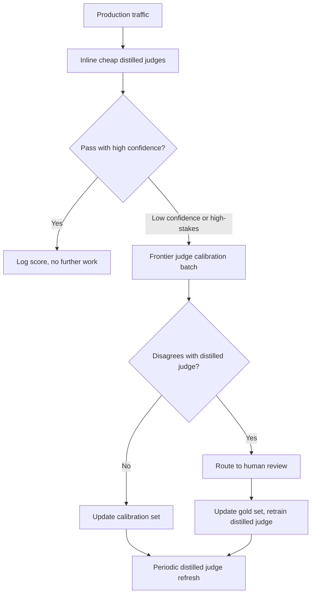

# LLM 评测

本页与英文原文逐段对应，保留标题层级、列表、表格、代码、公式、链接和面试问答。

LLM 系统的评测从根本上不同于传统机器学习。本章介绍生产环境中衡量质量的指标、方法论和实践路径，重点是评测*你的系统*；如果要了解如何阅读 MMLU、SWE-bench、Arena Elo 等公开模型基准，请参阅[基准与排行榜](03-benchmarks-and-leaderboards.md)。

## 目录

- [LLM 评测为何困难](#why-llm-evaluation-is-hard)
- [评测维度](#evaluation-dimensions)
- [自动评测方法](#automated-evaluation-methods)
- [LLM 评审](#llm-as-judge)
- [人工评测](#human-evaluation)
- [RAG 专项评测](#rag-specific-evaluation)
- [构建评测流水线](#building-evaluation-pipelines)
- [生产监控](#production-monitoring)
- [2026 年评测演进：超越 LLM 评审](#2026-eval-evolution-beyond-llm-as-judge)
- [面试问题](#interview-questions)
- [参考资料](#references)

---

## LLM 评测为何困难

### 根本挑战

传统机器学习有明确的指标（准确率、F1、AUC），而 LLM 输出是开放式文本，“正确”往往带有主观性。

| 传统机器学习 | LLM 系统 |
|----------------|-------------|
| 单一正确答案 | 存在多个有效回答 |
| 客观指标 | 主观质量 |
| 易于自动化 | 需要判断 |
| 静态测试集 | 需要多样化场景 |

### 多维质量

一个回答可能：
- 事实正确但表达糟糕；
- 表达流畅但不完整；
- 内容完整但不相关；
- 相关但不安全。

因此需要独立衡量多个质量维度。

---

## 评测维度

### 核心维度

| 维度 | 衡量内容 | 评测方式 |
|-----------|------------------|-----------------|
| **正确性** | 事实是否准确？ | 标准答案、LLM 评审 |
| **相关性** | 是否回答了问题？ | LLM 评审、人工 |
| **完整性** | 是否覆盖全部方面？ | 检查清单、LLM 评审 |
| **连贯性** | 结构清晰且合乎逻辑？ | LLM 评审、人工 |
| **简洁性** | 长度是否恰当？ | Token 数、LLM 评审 |
| **安全性** | 是否没有有害内容？ | 分类器、LLM 评审 |
| **帮助性** | 是否真正有用？ | 人工反馈 |

### 任务特定维度

**对于 RAG：**
- 忠实度：是否建立在检索上下文之上？
- 归因：是否提供了正确引用？
- 无幻觉：是否没有凭空编造？

**对于代码生成：**
- 可执行性：代码能否运行？
- 正确性：能否通过测试？
- 风格：是否遵循约定？

**对于摘要：**
- 覆盖度：是否包含关键点？
- 事实一致性：是否引入了错误？
- 压缩度：长度缩减是否恰当？

---

## 自动评测方法

### 精确匹配

最简单的方法，但单独使用通常不够：

```python
def exact_match(prediction: str, reference: str) -> float:
    return float(prediction.strip().lower() == reference.strip().lower())
```

**适用场景：**选择题、分类、实体抽取。

### 关键词包含

```python
def keyword_match(prediction: str, required_keywords: list[str]) -> float:
    prediction_lower = prediction.lower()
    matches = sum(1 for kw in required_keywords if kw.lower() in prediction_lower)
    return matches / len(required_keywords)
```

**适用场景：**检查回答是否提到了特定事实。

### 语义相似度

```python
def semantic_similarity(prediction: str, reference: str) -> float:
    pred_embedding = embed(prediction)
    ref_embedding = embed(reference)
    return cosine_similarity(pred_embedding, ref_embedding)
```

**适用场景：**改写检测、通用相似度判断。
**局限：**相似度高并不代表内容正确。

### ROUGE（摘要）

衡量 n-gram 的重叠程度：

```python
from rouge_score import rouge_scorer

scorer = rouge_scorer.RougeScorer(['rouge1', 'rouge2', 'rougeL'])

def evaluate_summary(prediction: str, reference: str) -> dict:
    scores = scorer.score(reference, prediction)
    return {
        "rouge1": scores["rouge1"].fmeasure,
        "rouge2": scores["rouge2"].fmeasure,
        "rougeL": scores["rougeL"].fmeasure
    }
```

**局限：**衡量的是重叠，而不是质量。

### 代码执行

对于代码生成，执行结果就是事实标准：

```python
def evaluate_code(prediction: str, test_cases: list[dict]) -> dict:
    try:
        exec(prediction, globals())
    except SyntaxError as e:
        return {"syntax_valid": False, "error": str(e)}
    
    passed = 0
    for test in test_cases:
        try:
            result = eval(test["call"])
            if result == test["expected"]:
                passed += 1
        except Exception:
            pass
    
    return {
        "syntax_valid": True,
        "tests_passed": passed,
        "tests_total": len(test_cases),
        "pass_rate": passed / len(test_cases)
    }
```

---

## LLM 评审

使用一个 LLM 评估另一个 LLM 的输出。

### 基础评审 Prompt

```python
JUDGE_PROMPT = """
Evaluate the following response to the user's question.

Question: {question}
Response: {response}
Reference Answer (if available): {reference}

Rate the response on these criteria (1-5 scale):

1. Correctness: Is the information accurate?
2. Relevance: Does it address the question?
3. Completeness: Are all aspects covered?
4. Clarity: Is it well-written and clear?

For each criterion, provide:
- Score (1-5)
- Brief justification

Output as JSON:
{
    "correctness": {"score": X, "reason": "..."},
    "relevance": {"score": X, "reason": "..."},
    "completeness": {"score": X, "reason": "..."},
    "clarity": {"score": X, "reason": "..."},
    "overall": X
}
"""

def llm_judge(question: str, response: str, reference: str = None) -> dict:
    prompt = JUDGE_PROMPT.format(
        question=question,
        response=response,
        reference=reference or "Not provided"
    )
    
    result = judge_model.generate(prompt)
    return json.loads(result)
```

### 两两比较

直接比较两个回答：

```python
PAIRWISE_PROMPT = """
Compare these two responses to the question and determine which is better.

Question: {question}

Response A:
{response_a}

Response B:
{response_b}

Which response is better? Consider:
- Correctness
- Helpfulness
- Clarity
- Completeness

Output your choice (A or B) and explain why.

Choice:
"""

def pairwise_judge(question: str, response_a: str, response_b: str) -> dict:
    prompt = PAIRWISE_PROMPT.format(
        question=question,
        response_a=response_a,
        response_b=response_b
    )
    
    result = judge_model.generate(prompt)
    choice = "A" if "A" in result[:10] else "B"
    
    return {"winner": choice, "explanation": result}
```

### 评审校准

LLM 评审存在偏差：

| 偏差 | 说明 | 缓解方式 |
|------|-------------|------------|
| 位置偏差 | 偏好第一个或最后一个选项 | 随机化顺序 |
| 长度偏差 | 偏好更长的回答 | 明确要求忽略长度 |
| 自偏好 | 偏好自身模型的输出 | 使用不同的评审模型 |
| 格式偏差 | 偏好某些格式 | 使用多样化训练示例 |

```python
def calibrated_pairwise_judge(question: str, response_a: str, response_b: str) -> dict:
    # Run twice with swapped positions
    result1 = pairwise_judge(question, response_a, response_b)
    result2 = pairwise_judge(question, response_b, response_a)
    
    # Check consistency
    result2_adjusted = "A" if result2["winner"] == "B" else "B"
    
    if result1["winner"] == result2_adjusted:
        return {"winner": result1["winner"], "confidence": "high"}
    else:
        return {"winner": "tie", "confidence": "low"}
```

---

## 人工评测

### 何时使用人工评测

| 使用场景 | 自动化？ | 人工？ |
|----------|-----------|--------|
| 快速迭代 | 是 | 抽查 |
| 最终质量评估 | 辅助 | 是 |
| 主观质量 | 否 | 是 |
| 安全评测 | 分类器 | 复核 |
| 边界案例 | 否 | 是 |

### 标注指南

```markdown
# Response Quality Annotation Guide

## Task
Rate the AI response quality on a 1-5 scale.

## Scale
5 - Excellent: Fully correct, helpful, well-written
4 - Good: Mostly correct, helpful, minor issues
3 - Acceptable: Correct but could be better
2 - Poor: Significant issues, partially helpful
1 - Unacceptable: Wrong, unhelpful, or harmful

## Instructions
1. Read the user question carefully
2. Read the AI response
3. Check for factual accuracy (if verifiable)
4. Assess helpfulness for the user's goal
5. Note any issues (inaccuracies, missing info, unclear)
6. Assign a score

## Examples
[Include 3-5 annotated examples at each score level]
```

### 标注者间一致性

```python
from sklearn.metrics import cohen_kappa_score

def calculate_agreement(annotator1: list, annotator2: list) -> dict:
    kappa = cohen_kappa_score(annotator1, annotator2)
    
    exact_agreement = sum(a == b for a, b in zip(annotator1, annotator2))
    exact_pct = exact_agreement / len(annotator1)
    
    return {
        "cohens_kappa": kappa,
        "exact_agreement": exact_pct,
        "interpretation": interpret_kappa(kappa)
    }

def interpret_kappa(kappa: float) -> str:
    if kappa < 0.2: return "Poor"
    if kappa < 0.4: return "Fair"
    if kappa < 0.6: return "Moderate"
    if kappa < 0.8: return "Substantial"
    return "Almost perfect"
```

---

## RAG 专项评测

### RAGAS 指标

RAGAS 提供了一组标准的 RAG 评测指标：

```python
from ragas import evaluate
from ragas.metrics import (
    faithfulness,
    answer_relevancy,
    context_precision,
    context_recall
)

def evaluate_rag(
    questions: list[str],
    contexts: list[list[str]],
    answers: list[str],
    ground_truths: list[str]
) -> dict:
    dataset = Dataset.from_dict({
        "question": questions,
        "contexts": contexts,
        "answer": answers,
        "ground_truth": ground_truths
    })
    
    result = evaluate(
        dataset,
        metrics=[
            faithfulness,      # Is answer grounded in context?
            answer_relevancy,  # Does answer address question?
            context_precision, # Are retrieved contexts relevant?
            context_recall     # Did we retrieve all needed context?
        ]
    )
    
    return result
```

### 忠实度评测

检查回答是否有上下文依据：

```python
FAITHFULNESS_PROMPT = """
Given the context and the response, determine if every claim in the 
response is supported by the context.

Context:
{context}

Response:
{response}

For each sentence in the response:
1. Extract the factual claims
2. Check if each claim is supported by the context
3. Mark as SUPPORTED or UNSUPPORTED

Output:
- Total claims: X
- Supported claims: Y
- Faithfulness score: Y/X
- Unsupported claims: [list]
"""

def evaluate_faithfulness(context: str, response: str) -> dict:
    prompt = FAITHFULNESS_PROMPT.format(context=context, response=response)
    result = judge_model.generate(prompt)
    return parse_faithfulness_result(result)
```

### 上下文相关性

评估检索上下文的质量：

```python
def evaluate_context_relevance(query: str, contexts: list[str]) -> dict:
    scores = []
    
    for context in contexts:
        prompt = f"""
        Query: {query}
        Context: {context}
        
        Is this context relevant to answering the query?
        Rate from 1-5 and explain.
        """
        
        result = judge_model.generate(prompt)
        score = extract_score(result)
        scores.append(score)
    
    return {
        "individual_scores": scores,
        "mean_relevance": sum(scores) / len(scores),
        "contexts_above_threshold": sum(1 for s in scores if s >= 3)
    }
```

---

## 构建评测流水线

### 评测数据集结构

```python
@dataclass
class EvalSample:
    id: str
    input: str
    expected_output: str  # Optional ground truth
    context: list[str]    # For RAG
    metadata: dict        # Category, difficulty, etc.

eval_dataset = [
    EvalSample(
        id="q001",
        input="What is the capital of France?",
        expected_output="Paris",
        context=[],
        metadata={"category": "factual", "difficulty": "easy"}
    ),
    # ... more samples
]
```

### 自动评测流水线

```python
class EvaluationPipeline:
    def __init__(
        self,
        system_under_test,
        evaluators: list[Evaluator],
        dataset: list[EvalSample]
    ):
        self.sut = system_under_test
        self.evaluators = evaluators
        self.dataset = dataset
    
    def run(self) -> EvalReport:
        results = []
        
        for sample in self.dataset:
            # Get prediction
            prediction = self.sut.generate(sample.input)
            
            # Run all evaluators
            scores = {}
            for evaluator in self.evaluators:
                score = evaluator.evaluate(
                    input=sample.input,
                    prediction=prediction,
                    reference=sample.expected_output,
                    context=sample.context
                )
                scores[evaluator.name] = score
            
            results.append({
                "id": sample.id,
                "input": sample.input,
                "prediction": prediction,
                "scores": scores,
                "metadata": sample.metadata
            })
        
        return self.compile_report(results)
    
    def compile_report(self, results: list) -> EvalReport:
        # Aggregate by category, compute statistics
        report = EvalReport()
        
        for metric in self.evaluators:
            scores = [r["scores"][metric.name] for r in results]
            report.add_metric(metric.name, {
                "mean": statistics.mean(scores),
                "std": statistics.stdev(scores),
                "min": min(scores),
                "max": max(scores)
            })
        
        # Breakdown by category
        for category in set(r["metadata"]["category"] for r in results):
            category_results = [r for r in results if r["metadata"]["category"] == category]
            report.add_breakdown(category, self.aggregate(category_results))
        
        return report
```

---

## 生产监控

### 需要跟踪的关键指标

```python
PRODUCTION_METRICS = {
    # Quality metrics (sample-based)
    "llm_judge_score": "Mean LLM judge score on sampled responses",
    "faithfulness": "RAG faithfulness on sampled responses",
    
    # User signals
    "thumbs_up_rate": "Positive feedback / total feedback",
    "regeneration_rate": "How often users regenerate",
    "copy_rate": "How often users copy responses",
    
    # Operational
    "error_rate": "Failed generations / total",
    "latency_p50": "Median response time",
    "latency_p99": "99th percentile response time",
    "tokens_per_response": "Average output length",
    
    # Cost
    "cost_per_request": "Average cost per request",
    "daily_cost": "Total daily API spend"
}
```

### 在线评测

```python
class OnlineEvaluator:
    def __init__(self, sample_rate: float = 0.1):
        self.sample_rate = sample_rate
    
    def maybe_evaluate(self, request: dict, response: str) -> None:
        if random.random() > self.sample_rate:
            return
        
        # Async evaluation
        asyncio.create_task(self.evaluate_async(request, response))
    
    async def evaluate_async(self, request: dict, response: str):
        scores = await self.llm_judge(request["query"], response)
        
        # Log to monitoring system
        self.log_metrics({
            "correctness": scores["correctness"],
            "relevance": scores["relevance"],
            "timestamp": datetime.now()
        })
        
        # Alert on low scores
        if scores["overall"] < 3:
            self.alert_low_quality(request, response, scores)
```

### 漂移检测

```python
def detect_quality_drift(
    current_scores: list[float],
    baseline_scores: list[float],
    threshold: float = 0.1
) -> dict:
    current_mean = statistics.mean(current_scores)
    baseline_mean = statistics.mean(baseline_scores)
    
    drift = abs(current_mean - baseline_mean)
    is_significant = drift > threshold
    
    # Statistical test
    stat, p_value = stats.ttest_ind(current_scores, baseline_scores)
    
    return {
        "current_mean": current_mean,
        "baseline_mean": baseline_mean,
        "drift": drift,
        "is_significant": is_significant,
        "p_value": p_value
    }
```

---

## 2026 年评测演进：超越 LLM 评审

2023～2024 年“使用 GPT-4 作为评审”的方案足以支撑 v1 系统，但在三方面承压：规模化成本、字符串评审器无法检查的 Agent 轨迹，以及把检索、记忆和推理混为一谈的基准。到 2026 年 5 月，生产评测栈已经拆分为四个协同工作的层次。

### 分层评审架构



成本计算决定了这种形态：当日请求量超过约 10 万时，为每条生产轨迹调用前沿评审模型（Claude Opus 4.7、GPT-5、Gemini Ultra 3）无法负担。蒸馏评审负责高频运行，前沿评审负责校准，人工负责建立事实标准。

### Galileo Luna-2：规模化蒸馏评审

[Galileo 的 Luna-2 系列](https://www.galileo.ai/luna-2)（2026 年 2 月发布）是一组面向特定任务的小型评审模型，使用数百万条前沿评审标签和人工标注训练。Galileo 公布的数据如下：

| 指标 | Luna-2 相对前沿评审 |
|--------|--------------------------|
| 单次评测成本 | 低约 97% |
| P50 延迟 | 低约 10 倍（短回答低于 100ms） |
| 与前沿评审的一致率 | 在已发布基准上为 88～92% |
| 与人工金标准标签的一致性 | 与前沿评审相差 2～3 个百分点以内 |

需要注意的是分歧的**形态**。Luna-2 按固定的失败模式分类体系训练（有依据性、指令遵循、毒性、PII、偏题、拒答），超出该体系的情况会退化为默认分数。因此，生产中可靠的模式是：

- 对它覆盖的分类，每条轨迹都**在线调用 Luna-2（或同等模型）**。
- 对 1～5% 的轨迹抽样调用**前沿评审**，检测蒸馏评审与大模型之间的漂移。
- 蒸馏评审置信度较低时自动**回退到前沿评审**（Luna-2 输出的不只是标签，还包括置信度分数）。
- 对训练分布中不存在的新失败模式，**绝不能只信任蒸馏评审**，例如刚出现的攻击向量、新的用户意图类别或领域专属事实性检查。

Galileo 的[公开技术报告](https://www.galileo.ai/research/luna-2)介绍了蒸馏方案，以及 Luna-2 仍弱于前沿评审的场景（长时域多步推理、低资源语言）。

还可以比较以下已经发布的蒸馏评审：

- [Patronus AI Lynx](https://www.patronus.ai/lynx)：用于有依据性检测，成本画像相近。
- [Vectara HHEM-2](https://www.vectara.com/blog/hhem)：用于幻觉检测。
- [Arize Phoenix Evals](https://arize.com/docs/phoenix/)：提供开放的蒸馏评审以及校准工具。

### Sierra tau2-bench 及其变体

[Sierra 的 [tau-bench](https://github.com/sierra-research/tau-bench)（2024）是首个在模拟商业环境中衡量工具使用成功率的真实 Agent 基准。2026 年的后继基准将这一思路推广开来。

[tau2-bench](https://github.com/sierra-research/tau-bench)（2026 年第一季度发布）是一次重大更新：

- **更多领域**：零售、航空、金融、医疗、通信。
- **Pass^k 指标**：衡量 Agent 在同一任务的 k 次重复试验中**全部**成功的概率。Pass^1 是传统成功率，Pass^4 才能说明 Agent 是否可靠。
- **基于验证器评分**：检查确定性的后置条件（订单已取消、退款已创建、座位已变更），而不是让 LLM 给对话记录打分。

配套基准：

- **[tau-Voice](https://sierra.ai/blog/tau-voice)**：语音到语音的变体，Agent 通过语音通道工作，可以发现纯文本基准完全遗漏的一类失败（时序、中断处理、从 ASR 错误中恢复）。
- **[tau-Knowledge](https://sierra.ai/blog/tau-knowledge)**：在模拟环境中加入 Agent 必须检索的内部知识库，将“Agent 是否能检索”和“Agent 是否能行动”解耦。

实践中，Pass^k 最具行动指导意义。Pass^1 为 70%、Pass^4 为 12% 表明“Agent 只在简单路径上有效，无法从任何轻微扰动中恢复”。这是生产团队大规模上线 Agent 前需要看到的信号。

### Agent 评审：轨迹评分

LLM 评审只给最终答案评分；Agent 评审则给**轨迹**评分，即 Agent 经历的工具调用、中间状态、重试和推理步骤序列。

这是必要的，因为长时域 Agent 会以最终答案无法揭示的方式失败：

- **答案正确、推理错误**：Agent 在计算过程出错后碰巧猜中了正确数字。
- **答案正确、路径危险**：Agent 先尝试了四次破坏性工具调用，第五次安全调用才碰巧成功。
- **答案正确、成本失控**：只需两次检索，Agent 却发起了 47 次。

生产中的典型做法：

- **过程奖励模型（PRM）**独立评估轨迹中的每一步。PRM 最初用于数学训练（OpenAI 的[逐步验证](https://arxiv.org/abs/2305.20050)），到 2026 年已经扩展到代码、工具使用轨迹和多轮对话。
- **辅助“审计 Agent”**（通常与被评模型不同）重放轨迹，在每个节点询问“这一步有依据吗”，并输出带评分的记录。[DeepMind 的 Agent 评审论文](https://arxiv.org/abs/2410.10934)（2024 年 10 月，持续完善至 2026 年）对这一方法进行了形式化。
- **这类评分会暴露的轨迹失败模式：**
  - **推理与动作不匹配**：Agent 的思维链说了一件事，实际工具调用做了另一件事。
  - **过度检索**：检索次数超出需要。
  - **工具乱试**：对同一工具做轻微变体尝试，直到某次成功。
  - **过早承诺**：证据尚未收齐就写出答案。
  - **自我越狱**：Agent 自身的中间推理绕过了安全策略。

Anthropic 的[宪法分类器论文](https://www.anthropic.com/research/constitutional-classifiers)（2025 年 1 月）及后续工作表明，用宪法分类器评估轨迹，能够捕获一部分最终答案评分完全遗漏的安全失败。

### HaluMem：操作级幻觉基准

[HaluMem](https://arxiv.org/abs/2511.03506)（2025 年 11 月）是首个将幻觉评测拆分为产生或使用记忆的**操作**、而不只评估最终答案的基准：

| 阶段 | 衡量内容 | 典型失败 |
|-------|------------------|-----------------|
| 抽取 | 写入记忆的事实与来源一致 | 来源说“用户不喜欢花生”，Agent 却记成“用户对花生过敏” |
| 更新 | 记忆更新相对于原状态是正确的 | 新记忆与旧记忆矛盾，却没有解决冲突 |
| 问答 | 回答建立在已存记忆上 | Agent 假装引用记忆，实际使用的是参数知识 |

HaluMem 论文的关键洞见是：系统可能在标准幻觉基准上取得很高的问答准确率，却在记忆抽取时犯下灾难性错误。聚合指标会隐藏错误发生的阶段，而那个阶段才是实际可以修复的地方。

实践方案：

- 为记忆层建立**按操作拆分的评测**：每次写入、更新和读取都有独立评测。
- 为每种操作使用蒸馏评审（Luna-2 或类似模型）。
- 持续跟踪各阶段错误率；5% 的抽取错误经过数千次操作累积后，会使 Agent 完全不可靠。

### 2026 年 5 月的生产评测栈

一个经得起审查的面向客户 Agent 产品评测栈大致如下：

```mermaid
flowchart LR
    A[User turn] --> B[Agent runs]
    B --> C[Trajectory logged]
    C --> D[Distilled judges run inline on each tool call and the final answer]
    D --> E[Per-step PRM trajectory score]
    E --> F[Auditor agent on 1-5 percent sample]
    F --> G[Frontier judge on flagged or high-stakes traces]
    G --> H[Human review on disagreements]
    H --> I[Gold set update]
    I --> J[Distilled judge retraining quarterly]
```



这并非没有成本，但比为每条轨迹运行前沿评审便宜得多，而且能够捕获纯最终答案评分看不到的失败类别（过程错误、记忆错误、轨迹错误）。

### 面试要点

- “LLM 评审”如今是最差情况下的回退方案，而不是默认方案。
- 严肃的团队会组合使用**在线蒸馏评审 + 用于校准的前沿评审 + 建立事实标准的人工复核**。
- 对 Agent 要**评估轨迹，而不仅是答案**；可使用 Pass^k、PRM 和 Agent 审计器。
- 对带记忆系统，要**分别衡量抽取、更新和问答**；聚合准确率会掩盖失败位置。

---

## 面试问题

### Q：如何评测一个 RAG 系统？

**强回答：**
我会在多个层次进行评测：

**1. 检索质量：**
- Precision@K：检索到的文档是否相关？
- Recall@K：是否找到了全部相关文档？
- MRR：最佳文档是否排在靠前位置？

**2. 生成质量：**
- 忠实度：回答是否有上下文依据？
- 相关性：是否回答了问题？
- 完整性：是否覆盖了所有方面？

**3. 端到端质量：**
- 与事实标准相比的答案正确性。
- 用户满意度（点赞/点踩）。

**工具：**
- 使用 RAGAS 获取自动指标。
- 使用 LLM 评审衡量主观质量。
- 使用人工评测建立金标准。

**流程：**
1. 创建评测数据集（100 个以上样例）。
2. 每次变更都运行自动指标。
3. 用 LLM 评审进行深入分析。
4. 人工复核完成最终验证。
5. 持续监控生产表现。

### Q：LLM 评审有哪些局限？

**强回答：**
它存在一些已知偏差和局限：

**偏差：**
- 位置偏差：比较时偏好第一个选项。
- 长度偏差：偏好更长的回答。
- 自偏好：可能偏好自身模型的风格。
- 格式偏差：受到排版格式影响。

**缓解方式：**
- 交换选项位置并检查一致性。
- 使用不同模型作为评审。
- 用人工标注进行校准。
- 使用多个评审 Prompt。

**不可靠的场景：**
- 高度领域化的内容。
- 细微的事实错误。
- 文化或上下文差异。
- 安全边界案例。

**最佳实践：**
- 用于快速迭代。
- 对照人工判断进行校准。
- 不要只依赖 LLM 评审。
- 高风险决策必须人工复核。

---

## 参考资料

- Es et al. "RAGAS: Automated Evaluation of Retrieval Augmented Generation" (2023)
- Zheng et al. "Judging LLM-as-a-Judge with MT-Bench and Chatbot Arena" (2023)
- RAGAS: https://docs.ragas.io/
- OpenAI Evals: https://github.com/openai/evals

---

*Next: [Observability](02-observability.md)*
