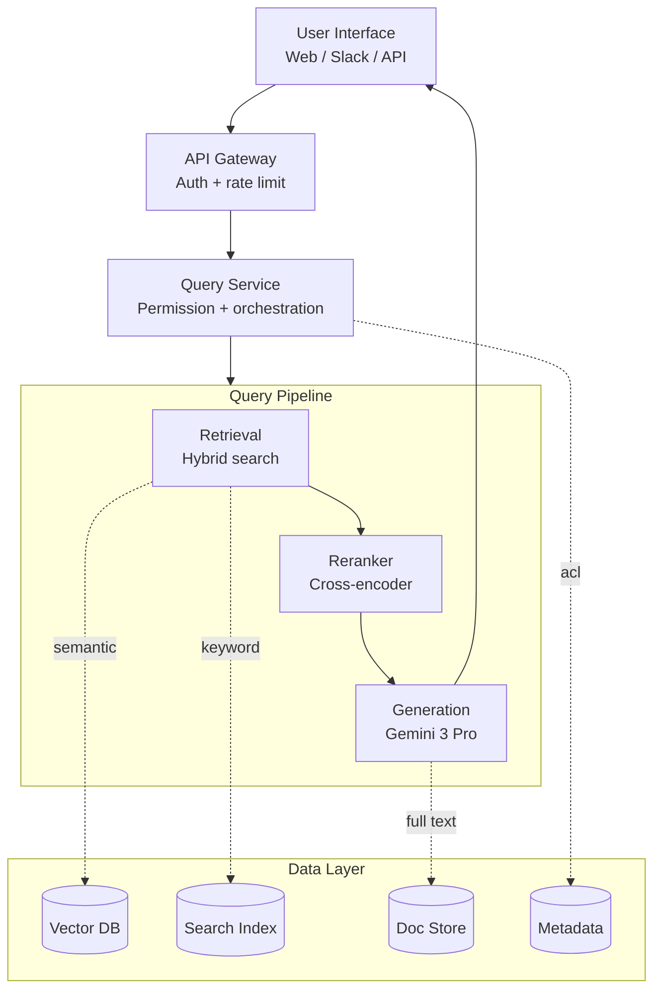
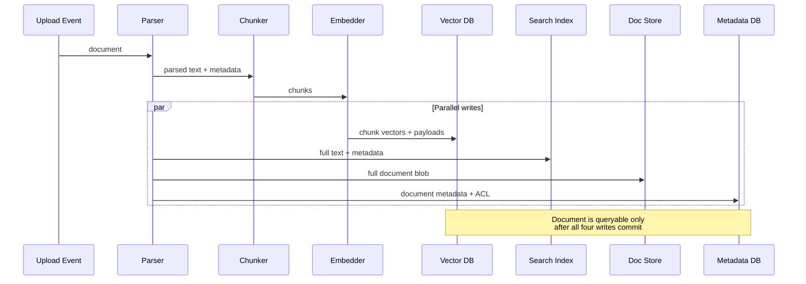
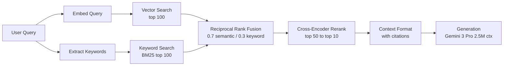

# 案例研究：企业级 RAG 系统

本页与英文原文逐段对应，保留标题层级、列表、表格、代码、公式、链接和面试问答。

本案例演示如何为企业文档搜索设计生产级 RAG 系统，涵盖需求收集、架构决策和实现细节。

## 目录

- [问题陈述](#problem-statement)
- [需求分析](#requirements-analysis)
- [系统架构](#system-architecture)
- [组件深入分析](#component-deep-dives)
- [扩展性考虑](#scaling-considerations)
- [成本分析](#cost-analysis)
- [经验总结](#lessons-learned)
- [面试演练](#interview-walkthrough)

---

## 问题陈述

### 场景

一家金融服务公司希望为内部文档构建 AI 搜索系统：
- 50 万份文档（政策、流程、研究报告）。
- 分布在多个部门的 5000 名员工。
- 文档每天更新。
- 严格的合规与审计要求。
- 回答问题时必须引用来源。

### 当前痛点

- 员工每天花费 2 小时以上搜索信息。
- 关键词搜索返回太多无关结果。
- 知识分散在各个部门。
- 新员工需要几个月才能提高生产力。

---

## 需求分析

### 功能需求

| 需求 | 优先级 | 说明 |
|-------------|----------|-------|
| 自然语言问答 | P0 | 核心功能 |
| 来源引用 | P0 | 合规要求 |
| 多文档推理 | P1 | 连接跨文档信息 |
| 追问 | P1 | 保留对话上下文 |
| 文档摘要 | P2 | 快速了解长文档 |

### 非功能需求

| 需求 | 目标 | 原因 |
|-------------|--------|-----------|
| 延迟（P95） | < 5 秒 | 用户体验 |
| 准确率 | > 90% | 信任与采用率 |
| 可用性 | 99.9% | 业务关键 |
| 并发用户 | 500 | 峰值使用量 |
| 文档新鲜度 | < 1 小时 | 政策更新 |

### 安全需求

- 基于角色的访问控制（RBAC）。
- 记录所有查询的审计日志。
- 数据不能离开公司网络。
- PII 检测与处理。

---

## 系统架构

### 高层架构

```
┌─────────────────────────────────────────────────────────────────────────┐
│                           User Interface                                │
│  (Web App, Slack Bot, API)                                             │
└─────────────────────────────┬───────────────────────────────────────────┘
                              │
                              ▼
┌─────────────────────────────────────────────────────────────────────────┐
│                          API Gateway                                    │
│  • Authentication    • Rate Limiting    • Request Routing              │
└─────────────────────────────┬───────────────────────────────────────────┘
                              │
                              ▼
┌─────────────────────────────────────────────────────────────────────────┐
│                        Query Service                                    │
│  • Query understanding   • Permission check   • Orchestration          │
└─────────────────────────────┬───────────────────────────────────────────┘
                              │
        ┌─────────────────────┼─────────────────────┐
        │                     │                     │
        ▼                     ▼                     ▼
┌───────────────┐   ┌───────────────┐   ┌───────────────┐
│   Retrieval   │   │   Reranking   │   │  Generation   │
│   Service     │   │   Service     │   │   Service     │
│               │   │               │   │               │
│ • Hybrid      │   │ • Cross-      │   │ • LLM         │
│   search      │   │   encoder     │   │ • Prompt      │
│ • Filtering   │   │ • Scoring     │   │   building    │
└───────┬───────┘   └───────────────┘   └───────────────┘
        │
        ▼
┌─────────────────────────────────────────────────────────────────────────┐
│                        Data Layer                                       │
│                                                                         │
│  ┌─────────────┐  ┌─────────────┐  ┌─────────────┐  ┌─────────────┐   │
│  │  Vector DB  │  │ Search Index│  │  Doc Store  │  │  Metadata   │   │
│  │  (Qdrant)   │  │ (Elastic)   │  │   (S3)      │  │  (Postgres) │   │
│  └─────────────┘  └─────────────┘  └─────────────┘  └─────────────┘   │
│                                                                         │
└─────────────────────────────────────────────────────────────────────────┘

┌─────────────────────────────────────────────────────────────────────────┐
│                      Ingestion Pipeline                                 │
│  Document Upload → Parse → Chunk → Embed → Index → Store Metadata      │
└─────────────────────────────────────────────────────────────────────────┘
```

将其渲染为流程图（分层系统从查询流水线展开，并通过数据层汇聚）：



### 技术选型（2025 年 12 月更新）

| 组件 | 选择 | 原因 |
|-----------|--------|-----------|
| **主 LLM** | Gemini 3.0 Pro | **250 万 Token 上下文**可原生处理 100 多份文档，无需碎片化 |
| **Agent LLM** | GPT-5.2 | 复杂跨文档分析中工具使用准确率领先 |
| **检索器** | Gemini 3 Flash | 在超大上下文窗口上实现低成本检索 |
| **嵌入模型** | text-embedding-3-large | 质量经过验证且成本高效 |
| **向量数据库** | Qdrant（自托管） | 性能、过滤能力和本地合规 |
| **重排序器** | BGE-Reranker-v2-X | 开源 SoTA，适合本地隔离 |

> [!NOTE]
> **Shift:** Production teams have moved from "Small Chunk RAG" to **"Balanced Context RAG"**. With 1M-2M token contexts on every major frontier model, we no longer need to find the "perfect 512-token chunk." We retrieve entire document segments (10k-50k tokens) and let the model's native attention handle the needle.

---

## 组件深入分析

### 文档摄取流水线

```python
class IngestionPipeline:
    def __init__(self):
        self.parser = DocumentParser()
        self.chunker = SemanticChunker(
            chunk_size=512,
            chunk_overlap=50
        )
        self.embedder = OpenAIEmbedder(model="text-embedding-3-large")
        self.vector_db = QdrantClient()
        self.metadata_db = PostgresClient()
    
    async def ingest(self, document: Document, user_context: UserContext):
        # 1. Parse document
        parsed = self.parser.parse(document)
        
        # 2. Extract metadata
        metadata = self.extract_metadata(parsed, document)
        
        # 3. Chunk
        chunks = self.chunker.chunk(parsed.text)
        
        # 4. Generate embeddings (batch)
        embeddings = await self.embedder.embed_batch([c.text for c in chunks])
        
        # 5. Store in vector DB with metadata
        points = [
            {
                "id": f"{document.id}_{i}",
                "vector": embedding,
                "payload": {
                    "document_id": document.id,
                    "chunk_index": i,
                    "text": chunk.text,
                    "department": metadata.department,
                    "access_level": metadata.access_level,
                    "created_at": metadata.created_at.isoformat()
                }
            }
            for i, (chunk, embedding) in enumerate(zip(chunks, embeddings))
        ]
        
        await self.vector_db.upsert(collection="documents", points=points)
        
        # 6. Store full document
        await self.doc_store.put(document.id, parsed.text)
        
        # 7. Store metadata
        await self.metadata_db.insert_document(document.id, metadata)
        
        # 8. Index in Elasticsearch for keyword search
        await self.es_client.index(
            index="documents",
            id=document.id,
            body={"text": parsed.text, **metadata.to_dict()}
        )
```

代码看起来是线性序列，但其中四次写入实际上并行发生。时序图明确展示了这种扇出，这对理解部分失败模式很重要：



### 查询处理

```python
class QueryService:
    def __init__(self):
        self.retriever = HybridRetriever()
        self.reranker = CohereReranker()
        self.generator = LLMGenerator()
        self.guardrails = GuardrailPipeline()
    
    async def process_query(
        self,
        query: str,
        user_context: UserContext,
        conversation_history: list[Message] = None
    ) -> QueryResponse:
        
        # 1. Input guardrails
        guardrail_result = self.guardrails.check_input(query)
        if not guardrail_result.passed:
            return QueryResponse(
                answer="I cannot help with that request.",
                blocked=True,
                reason=guardrail_result.reason
            )
        
        # 2. Query understanding (optional: rewrite query)
        processed_query = await self.understand_query(query, conversation_history)
        
        # 3. Retrieve candidates with permission filtering
        candidates = await self.retriever.search(
            query=processed_query,
            filters=self.build_permission_filter(user_context),
            top_k=50
        )
        
        # 4. Rerank
        reranked = await self.reranker.rerank(
            query=processed_query,
            documents=candidates,
            top_k=10
        )
        
        # 5. Build context
        context = self.build_context(reranked)
        
        # 6. Generate answer
        answer = await self.generator.generate(
            query=query,
            context=context,
            conversation_history=conversation_history
        )
        
        # 7. Output guardrails
        guardrail_result = self.guardrails.check_output(answer, context)
        if not guardrail_result.passed:
            answer = self.fallback_response()
        
        # 8. Build response with citations
        return QueryResponse(
            answer=answer,
            sources=[self.format_source(doc) for doc in reranked[:5]],
            confidence=self.calculate_confidence(reranked)
        )
    
    def build_permission_filter(self, user_context: UserContext) -> dict:
        return {
            "should": [
                {"key": "access_level", "match": {"value": "public"}},
                {"key": "department", "match": {"value": user_context.department}},
                {"key": "access_list", "match": {"any": [user_context.user_id]}}
            ]
        }
```

### 混合检索

```python
class HybridRetriever:
    def __init__(self, vector_weight: float = 0.7, keyword_weight: float = 0.3):
        self.vector_db = QdrantClient()
        self.es_client = ElasticsearchClient()
        self.embedder = OpenAIEmbedder()
        self.vector_weight = vector_weight
        self.keyword_weight = keyword_weight
    
    async def search(
        self,
        query: str,
        filters: dict,
        top_k: int = 50
    ) -> list[Document]:
        
        # Parallel retrieval
        vector_results, keyword_results = await asyncio.gather(
            self.vector_search(query, filters, top_k * 2),
            self.keyword_search(query, filters, top_k * 2)
        )
        
        # Reciprocal Rank Fusion
        fused = self.rrf_fusion(
            [vector_results, keyword_results],
            weights=[self.vector_weight, self.keyword_weight],
            k=60
        )
        
        return fused[:top_k]
    
    async def vector_search(self, query: str, filters: dict, top_k: int):
        query_embedding = await self.embedder.embed(query)
        
        results = await self.vector_db.search(
            collection="documents",
            query_vector=query_embedding,
            query_filter=filters,
            limit=top_k
        )
        
        return [
            Document(
                id=r.payload["document_id"],
                chunk_id=r.id,
                text=r.payload["text"],
                score=r.score,
                metadata=r.payload
            )
            for r in results
        ]
    
    def rrf_fusion(self, result_lists: list, weights: list, k: int = 60) -> list:
        scores = defaultdict(float)
        docs = {}
        
        for results, weight in zip(result_lists, weights):
            for rank, doc in enumerate(results):
                rrf_score = weight / (k + rank + 1)
                scores[doc.chunk_id] += rrf_score
                docs[doc.chunk_id] = doc
        
        sorted_ids = sorted(scores.keys(), key=lambda x: scores[x], reverse=True)
        return [docs[id] for id in sorted_ids]
```

混合检索流程概览：两个检索器并行工作，随后 RRF 按加权排名融合结果，Cross-Encoder 在上下文格式化前对候选结果重排序：



### 使用超大上下文生成（2025 年 12 月）

```python
class GeminiGenerator:
    def __init__(self):
        self.client = genai.GenerativeModel("gemini-3.0-pro")
    
    async def generate(
        self,
        query: str,
        context_docs: list[Document],
        conversation_history: list[Message] = None
    ) -> str:
        # 2.5M context allows passing ENTIRE documents, not just snippets
        system_instruction = """
        You are an enterprise knowledge assistant. 
        Analyze the provided documents to answer the query accurately.
        Cite every claim using [[DocName:PageNumber]] format.
        """
        
        contents = [{"text": doc.text} for doc in context_docs]
        contents.append({"text": f"User Query: {query}"})
        
        response = await self.client.generate_content_async(
            contents,
            generation_config=genai.types.GenerationConfig(temperature=0.0)
        )
        return response.text
```

> [!TIP]
> **Production Choice vs. Bleeding Edge**
> While Gemini 3.1 Pro offers a 1M-token window, many production systems still default to **Claude Sonnet 4.6** or **GPT-5.5** as their primary generators.
> 
> **Why?**
> - **Maturity**: 12+ months of production track record.
> - **Predictability**: Known latency patterns and fewer "hallucination spikes" on long-tail requests.
> - **SDK Stability**: Deep integration with frameworks like LangGraph and LlamaIndex.
> - **Cost**: Optimized pricing for high-volume standard RAG.

---

## 扩展性考虑

### 处理 50 万份文档

```python
# Sharding strategy for Qdrant
qdrant_config = {
    "collection": "documents",
    "vectors": {
        "size": 3072,  # text-embedding-3-large
        "distance": "Cosine"
    },
    "optimizers": {
        "indexing_threshold": 20000  # Build index after 20K points
    },
    "replication_factor": 2,  # High availability
    "shard_number": 4  # Distribute across nodes
}
```

### 处理 500 个并发用户

```
Load Balancer
     │
     ├──► Query Service (replica 1)
     ├──► Query Service (replica 2)
     ├──► Query Service (replica 3)
     └──► Query Service (replica 4)
            │
            ├──► Vector DB (3-node cluster)
            ├──► LLM API (with retry/fallback)
            └──► Elasticsearch (3-node cluster)
```

### 缓存策略

```python
class QueryCache:
    def __init__(self):
        self.exact_cache = Redis(ttl=3600)  # 1 hour
        self.semantic_cache = SemanticCache(threshold=0.95, ttl=1800)
    
    async def get_or_compute(self, query: str, user_context: UserContext) -> QueryResponse:
        # Check exact cache
        cache_key = self.make_key(query, user_context.permissions)
        cached = await self.exact_cache.get(cache_key)
        if cached:
            return cached
        
        # Check semantic cache
        similar = await self.semantic_cache.find_similar(query, user_context.permissions)
        if similar:
            return similar
        
        # Compute
        response = await self.query_service.process_query(query, user_context)
        
        # Cache result
        await self.exact_cache.set(cache_key, response)
        await self.semantic_cache.add(query, user_context.permissions, response)
        
        return response
```

---

## 成本分析

### 月成本估算（500 用户，每用户每天 100 次查询）

| 组件 | 计算 | 月成本 |
|-----------|-------------|--------------|
| LLM（Claude Sonnet） | 150 万查询 × 2K Token × $3/1M 输入 + 500 Token × $15/1M 输出 | 约 $20,250 |
| 嵌入 | 150 万查询 × $0.13/1M | 约 $200 |
| 重排序（Cohere） | 150 万 × 50 文档 × $0.001/1K | 约 $75 |
| 向量数据库（Qdrant Cloud） | 3 节点集群 | 约 $1,500 |
| Elasticsearch | 3 节点集群 | 约 $2,000 |
| 计算（查询服务） | 4 个实例 | 约 $1,000 |
| **总计** | | **约 $25,000/月** |

### 成本优化机会

1. **缓存**：30% 缓存命中率 → LLM 节省 6000 美元。
2. **模型路由**：将简单查询路由到更便宜的模型 → 节省 40%。
3. **批量嵌入**：使用异步批处理 → 节省 20%。
4. **自托管重排序器**：用开源方案替代 Cohere → 消除 75 美元成本。

---

## 经验总结

### 做得好的地方

1. **混合搜索**：结合语义和关键词，显著提升召回率。
2. **重排序**：Top-5 精确率提升 15%。
3. **清晰引用**：建立用户信任。
4. **检索时过滤权限**：无需事后过滤。

### 遇到的挑战

1. **表格抽取**：复杂表格 PDF 需要自定义解析。
2. **缩写**：领域缩写需要展开。
3. **新鲜度**：一小时新鲜度要求流式摄取。
4. **长文档**：100 页以上文档需要层次化切块。

### 可以改进的地方

1. 更早采用更好的文档解析。
2. 在扩展之前先建立评测流水线。
3. 从第一天就实现查询日志。
4. 更早与用户建立反馈闭环。

---

## 面试演练

### 如何在面试中介绍

**开场（2 分钟）：**
“我会为内部文档搜索设计企业级 RAG 系统。先让我澄清几个需求……”

**需求（3 分钟）：**
- 询问规模、延迟和准确率目标。
- 澄清安全要求。
- 了解文档类型和更新频率。

**高层设计（5 分钟）：**
- 绘制架构图。
- 解释关键组件。
- 说明技术选型理由。

**深入分析（10 分钟）：**
- 检索策略（为什么使用混合搜索）。
- 安全（查询时过滤权限）。
- 生成（Prompt 工程、引用）。
- 扩展（分片、缓存、副本）。

**权衡（5 分钟）：**
- 成本与延迟（模型选择）。
- 准确率与延迟（重排序会增加时间）。
- 新鲜度与成本（流式与批处理）。

**监控（2 分钟）：**
- 关键指标（延迟、准确率、用户反馈）。
- 如何检测问题。
- 持续改进闭环。

---

*下一篇：[案例研究：对话式 AI Agent](02-conversational-agent.md)*
