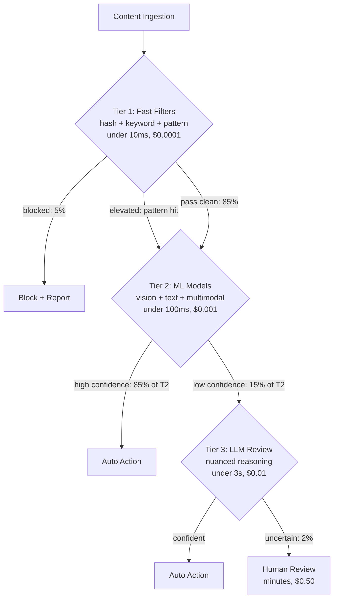
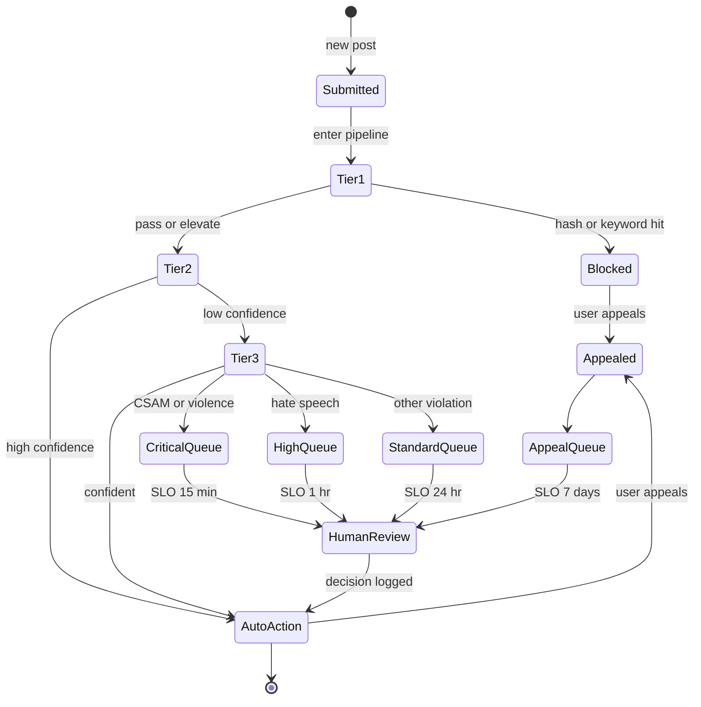

# 案例研究：大规模内容审核

本页与英文原文逐段对应，保留标题层级、列表、表格、代码、公式、链接和面试问答。

本案例演示如何为每天处理数百万条帖子的社交平台设计 AI 内容审核系统。

## 目录

- [问题陈述](#problem-statement)
- [需求分析](#requirements-analysis)
- [架构设计](#architecture-design)
- [分类流水线](#classification-pipeline)
- [人在回路](#human-in-the-loop)
- [对抗鲁棒性](#adversarial-robustness)
- [结果与指标](#results-and-metrics)
- [面试演练](#interview-walkthrough)

---

## 问题陈述

**公司：**拥有 5000 万日活用户的社交媒体平台

**现状：**
- 每天 1000 万条帖子
- 500 名人工审核员
- 平均审核时间：4 小时
- 误报率：15%
- 到达用户的有害内容：2%

**目标：**
- 将有害内容曝光率降至 0.1% 以下
- 在 15 分钟内审核高优先级内容
- 将误报率降至 5% 以下
- 在不按用户量线性增加审核员的情况下扩展

---

## 需求分析

### 内容类别

| 类别 | 严重程度 | 动作 | 延迟 |
|----------|----------|--------|---------|
| CSAM（儿童性虐待材料） | 严重 | 拦截并举报 | 立即 |
| 暴力/血腥 | 高 | 拦截并复核 | < 1 分钟 |
| 仇恨言论 | 高 | 拦截并复核 | < 5 分钟 |
| 骚扰 | 中 | 复核并警告 | < 15 分钟 |
| 垃圾信息 | 中 | 降低展示优先级 | < 1 小时 |
| 错误信息 | 中 | 添加标签并复核 | < 1 小时 |
| 成人内容 | 低 | 年龄门槛 | < 1 小时 |

### 准确性需求

| 指标 | 目标 | 理由 |
|--------|--------|-----------|
| 召回率（有害内容） | > 99% | 最小化有害内容曝光 |
| 精确率 | > 95% | 最小化误报 |
| 延迟（严重类别） | < 1 分钟 | 防止传播 |
| 延迟（标准类别） | < 15 分钟 | 平衡资源 |

---

## 架构设计

### 高层架构

```
┌─────────────────────────────────────────────────────────────────┐
│                  CONTENT MODERATION PIPELINE                     │
├─────────────────────────────────────────────────────────────────┤
│                                                                  │
│  ┌─────────────┐                                                │
│  │   Content   │                                                │
│  │   Ingestion │                                                │
│  └──────┬──────┘                                                │
│         │                                                        │
│         ▼                                                        │
│  ┌─────────────────────────────────────────────────────────┐    │
│  │                   TIER 1: FAST FILTERS                   │    │
│  │  ┌──────────┐  ┌──────────┐  ┌──────────┐              │    │
│  │  │  Hash    │  │ Keyword  │  │  Known   │              │    │
│  │  │ Matching │  │ Blocklist│  │ Patterns │              │    │
│  │  └──────────┘  └──────────┘  └──────────┘              │    │
│  └──────────────────────────┬──────────────────────────────┘    │
│                             │                                    │
│         ┌───────────────────┼───────────────────┐               │
│         │ Blocked           │ Pass              │ Elevated      │
│         ▼                   ▼                   ▼               │
│  ┌─────────────┐    ┌─────────────────────────────────────┐    │
│  │   Block +   │    │          TIER 2: ML MODELS          │    │
│  │   Report    │    │  ┌────────┐  ┌────────┐  ┌────────┐│    │
│  └─────────────┘    │  │ Vision │  │  Text  │  │ Multi- ││    │
│                     │  │ Model  │  │ Model  │  │ modal  ││    │
│                     │  └────────┘  └────────┘  └────────┘│    │
│                     └──────────────────┬──────────────────┘    │
│                                        │                        │
│         ┌──────────────────────────────┼──────────────────┐    │
│         │ High Confidence              │ Low Confidence   │    │
│         ▼                              ▼                   │    │
│  ┌─────────────┐              ┌─────────────────────────┐ │    │
│  │ Auto Action │              │    TIER 3: LLM REVIEW   │ │    │
│  └─────────────┘              │  (nuanced cases)        │ │    │
│                               └────────────┬────────────┘ │    │
│                                            │               │    │
│                        ┌───────────────────┼──────────────┐│    │
│                        │ Confident         │ Uncertain    ││    │
│                        ▼                   ▼              ││    │
│                 ┌─────────────┐    ┌─────────────┐       ││    │
│                 │ Auto Action │    │   Human     │       ││    │
│                 └─────────────┘    │   Review    │       ││    │
│                                    └─────────────┘       ││    │
│                                                          ││    │
└──────────────────────────────────────────────────────────┘│    │
```

分层流水线可表示为决策树。每层只将自己无法低成本决定的内容升级；第 1 层与第 4 层的单次决策成本约为 1:5000，因此正确路由是单位经济性的主要杠杆：



### 处理层级

| Tier | Method | Latency | Cost | Coverage |
|------|--------|---------|------|----------|
| 1 | Hash/keyword | < 10ms | $0.0001 | 5% blocked |
| 2 | ML classifiers | < 100ms | $0.001 | 85% auto-decided |
| 3 | LLM review | < 3s | $0.01 | 8% nuanced |
| 4 | Human review | Minutes | $0.50 | 2% escalated |

---

## 分类流水线

### 第 1 层：快速过滤

```python
class FastFilters:
    """
    Immediate blocking for known harmful content.
    No false positives for matches.
    """
    
    def __init__(self):
        self.hash_db = PhotoDNADatabase()  # CSAM detection
        self.keyword_filter = KeywordBlocklist()
        self.pattern_matcher = RegexPatterns()
    
    async def filter(self, content: Content) -> FilterResult:
        # CSAM hash matching (highest priority)
        if content.has_media:
            hash_match = await self.hash_db.check(content.media_hashes)
            if hash_match:
                return FilterResult(
                    action="block_report",
                    reason="csam_hash_match",
                    confidence=1.0,
                    tier=1
                )
        
        # Keyword blocklist
        if content.text:
            keyword_match = self.keyword_filter.check(content.text)
            if keyword_match and keyword_match.severity == "critical":
                return FilterResult(
                    action="block_review",
                    reason=f"keyword_{keyword_match.category}",
                    confidence=0.99,
                    tier=1
                )
        
        # Pattern matching (phone numbers in suspicious context, etc)
        pattern_match = self.pattern_matcher.check(content.text)
        if pattern_match:
            return FilterResult(
                action="elevate",
                reason=f"pattern_{pattern_match.type}",
                confidence=pattern_match.confidence,
                tier=1
            )
        
        return FilterResult(action="continue", tier=1)
```

### 第 2 层：ML 分类

```python
### Tier 2: Native Multimodal Classification (Gemini 3 Flash)

```python
class MultimodalSafety:
    """
    Dec 2025 Shift: No separate OCR/Vision models.
    Gemini 3 Flash handles interleaved text/images natively for <$0.10 / 1M posts.
    """
    async def classify(self, content: Content) -> dict:
        # Native multimodal understanding catches context (e.g., text on a protest sign)
        response = await genai.submit(
            model="gemini-3-flash",
            content=[content.text, content.image_bytes],
            schema=SafetySchema
        )
        return response
```

### Tier 3: Nuanced LLM Review (GPT-5.2-mini)

```python
class NuanceReviewer:
    """
    Using GPT-5.2-mini for nuanced context (sarcasm, regional slang).
    Reasoning capabilities of 2025-mini models exceed 2024-frontier models.
    """
    async def review(self, content: Content, context: dict) -> dict:
        result = await client.chat.completions.create(
            model="gpt-5.2-mini",
            messages=[
                {"role": "system", "content": "Analyze for regional hate speech slang."},
                {"role": "user", "content": content.text}
            ],
            response_format={"type": "json_object"}
        )
        return json.loads(result)
```
```

---

## 人在回路

### 审核队列管理

每条内容都会从提交经历到终态。将生命周期表示为状态机可以具体化 SLO：每条优先级通道有不同的终态目标时间，申诉还可以回到待处理状态：



```python
class ReviewQueueManager:
    """
    Prioritize and route content to human moderators.
    """
    
    def __init__(self):
        self.queues = {
            "critical": PriorityQueue(),  # CSAM, violence - immediate
            "high": PriorityQueue(),      # Hate speech - < 15 min
            "standard": PriorityQueue(),  # Other violations - < 1 hour
            "appeals": PriorityQueue()    # User appeals
        }
    
    async def enqueue(self, content: Content, result: ReviewResult):
        priority = self.calculate_priority(content, result)
        
        item = ReviewItem(
            content_id=content.id,
            content=content,
            ai_analysis=result,
            priority=priority,
            enqueued_at=datetime.now()
        )
        
        queue_name = self.get_queue(result.severity)
        await self.queues[queue_name].put(item)
        
        # Alert if critical
        if queue_name == "critical":
            await self.alert_moderators(item)
    
    def calculate_priority(self, content: Content, result: ReviewResult) -> float:
        priority = 0.0
        
        # Severity weight
        severity_weights = {"critical": 100, "high": 50, "medium": 20, "low": 5}
        priority += severity_weights.get(result.severity, 0)
        
        # Reach weight (viral content prioritized)
        priority += min(content.reach_score * 10, 50)
        
        # Confidence inverse (less confident = higher priority)
        priority += (1 - result.confidence) * 30
        
        return priority
```

### 审核员界面

```python
class ModeratorDecision:
    async def submit(
        self,
        moderator_id: str,
        content_id: str,
        decision: str,
        reason: str,
        notes: str = None
    ):
        # Record decision
        await self.store_decision({
            "content_id": content_id,
            "moderator_id": moderator_id,
            "decision": decision,
            "reason": reason,
            "notes": notes,
            "ai_recommendation": await self.get_ai_result(content_id),
            "decided_at": datetime.now()
        })
        
        # Execute action
        await self.execute_action(content_id, decision)
        
        # Update ML models with feedback
        await self.feedback_loop.record(
            content_id=content_id,
            ai_prediction=await self.get_ai_result(content_id),
            human_decision=decision
        )
```

---

## 对抗鲁棒性

### 规避技术与防御

| Evasion Technique | Defense |
|-------------------|---------|
| Character substitution (h@te) | Normalization + homoglyph mapping |
| Image text (text in images) | OCR pipeline |
| Invisible characters | Unicode normalization |
| Context manipulation | Multi-turn analysis |
| Encoded content | Decoding pipeline |
| Adversarial images | Robust vision models |

### 防御流水线

```python
class AdversarialDefense:
    def __init__(self):
        self.normalizer = TextNormalizer()
        self.ocr = OCRPipeline()
        self.decoder = ContentDecoder()
    
    def preprocess(self, content: Content) -> Content:
        processed = content.copy()
        
        # Normalize text
        if processed.text:
            processed.text = self.normalizer.normalize(processed.text)
            processed.text = self.decoder.decode_obfuscation(processed.text)
        
        # Extract text from images
        if processed.has_images:
            for image in processed.images:
                extracted_text = self.ocr.extract(image)
                if extracted_text:
                    processed.text = f"{processed.text}\n[IMAGE TEXT]: {extracted_text}"
        
        return processed
    
    def normalize(self, text: str) -> str:
        # Homoglyph normalization
        text = self.homoglyph_map(text)
        
        # Unicode normalization
        text = unicodedata.normalize("NFKC", text)
        
        # Remove zero-width characters
        text = re.sub(r"[\u200b-\u200f\u2028-\u202f]", "", text)
        
        # Leetspeak normalization
        text = self.leetspeak_decode(text)
        
        return text
```

---

## 结果与指标

### 性能比较

| 指标 | 之前 | 之后 | 改善 |
|--------|--------|-------|-------------|
| 有害内容曝光率 | 2% | 0.08% | 降低 96% |
| 审核延迟（严重类别） | 4 小时 | 8 分钟 | 快 30 倍 |
| 误报率 | 15% | 4.2% | 降低 72% |
| 审核员效率 | 50/天 | 200/天 | 提升 4 倍 |

### 成本分析（2025 年 12 月）

| 组件 | 每 1000 万条帖子 | 说明 |
|-----------|---------------|-------|
| 第 1 层过滤器 | $0.10 | 可忽略 |
| 第 2 层多模态 | $0.50 | Gemini 3 Flash（$0.05/1M） |
| 第 3 层 LLM（GPT-5.2） | $0.20 | 对 10% 流量做细节复核 |
| 人工审核 | $15.00 | 只处理 1% 的流量 |
| **合计** | **$15.80** | **相比 2024 年下降 40%** |

> [!TIP]
> **生产经验：**将主要工作从“第 2 层视觉/OCR”转移到**原生多模态（Gemini 3 Flash）**后，流水线复杂度降低 70%，延迟降低 400ms。

*人工审核仍然占据主要成本，但只聚焦于困难案例。*

---

## 面试演练

**面试官：**“为社交媒体平台设计一个内容审核系统。”

**强回答：**

1. **澄清规模和需求**（1 分钟）
   - “流量是多少？有哪些内容类型？可接受的误报率是多少？”
   - “是否有监管要求（CSAM 举报、GDPR）？”

2. **多层架构**（3 分钟）
   - “我会使用复杂度逐层增加的级联：”
   - “第 1 层：哈希匹配、关键词过滤——即时且确定。”
   - “第 2 层：ML 分类器——快速且专用。”
   - “第 3 层：LLM 复核——细致且理解上下文。”
   - “第 4 层：人工审核——最终裁决者。”
   - “每一层处理上一层无法处理的内容。”

3. **优先级是关键**（2 分钟）
   - “有害内容并不等价。CSAM 和暴力需要立即处理；仇恨言论优先但不一定即时；垃圾信息可以延后。”
   - “根据严重程度、触达范围和置信度建立优先级队列。”

4. **人在回路设计**（2 分钟）
   - “低置信度决策和申诉交给人工。”
   - “AI 自动处理 95% 以上内容，使人工审核在经济上可行。”
   - “建立反馈闭环：人工决策用于改进 ML 模型。”

5. **对抗鲁棒性**（2 分钟）
   - “用户会尝试规避检测，防御措施包括：”
   - “通过文本规范化处理混淆写法。”
   - “使用 OCR 识别图片中的文字。”
   - “随着规避方式演化持续更新模型。”

6. **指标**（1 分钟）
   - “主要指标：有害内容曝光率（目标 < 0.1%）。”
   - “次要指标：误报率（用户体验）。”
   - “运营指标：审核延迟、审核员吞吐量。”

---

## 参考资料

- Meta Content Moderation: https://transparency.fb.com/
- Google Perspective API: https://perspectiveapi.com/
- OpenAI Moderation: https://platform.openai.com/docs/guides/moderation

---

*下一篇：[LLM 定价参考](../02-model-landscape/03-pricing-and-costs.md)*
