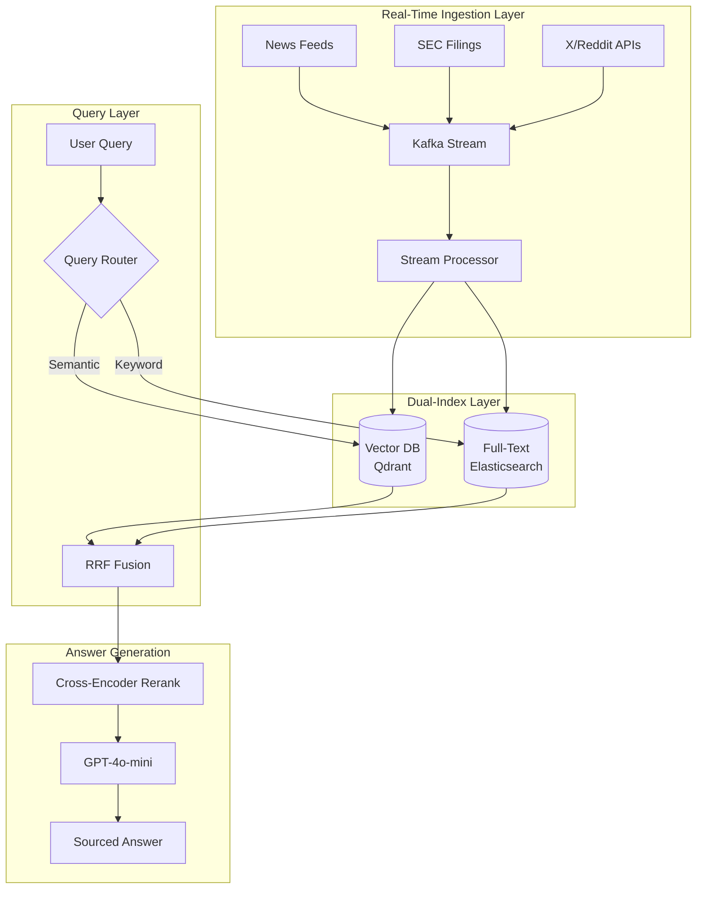

# 案例研究：实时 AI 搜索引擎

## 问题

一家金融科技初创公司需要构建一个**实时市场情报平台**，让分析师能够用自然语言询问实时市场数据、新闻和公司公告。

**面试给出的约束：**
- 数据新鲜度：查询必须反映最近 5 分钟内的信息。
- 规模：10,000 个并发用户，每小时 50,000 次查询。
- 准确性：金融数据不能产生幻觉。
- 延迟：p95 响应时间低于 3 秒。

---

## 面试题

> “设计一个系统，让用户询问‘过去一小时 Tesla 的市场情绪如何？’，并在 3 秒内得到准确、有来源的回答。”

---

## 解决方案架构



---

## 关键设计决策

### 1. 为什么用 Kafka 做接入？

面试官希望确认你理解**流式处理与批处理的区别**。

**回答：**Kafka 提供恰好一次投递，并允许多个消费者并行工作。一个消费者写入向量数据库，另一个写入 Elasticsearch。如果向量索引落后，全文索引仍然可以服务查询。这是用于提升韧性的**双写模式**。

### 2. 为什么采用混合搜索（向量 + 全文）？

**回答：**金融查询通常同时包含语义表达（“Tesla 的市场情绪”）和关键词表达（“TSLA 10-K filing”）。纯向量搜索可能漏掉精确的股票代码匹配，因此用**倒数排名融合（RRF）**组合结果。

### 3. 为什么使用 GPT-4o-mini 而不是 GPT-4o？

**回答：**在每小时 50K 次查询、p95 延迟目标为 3 秒时，需要快速生成。GPT-4o-mini 的速度超过每秒 100 token，而 GPT-4o 约为每秒 40 token。重排序器负责准确性，LLM 只负责综合已经验证过的内容。

---

## 处理新鲜度要求

这个问题最难的部分，是确保索引反映最近 5 分钟的数据。

**方案：基于 TTL 的索引**

```python
# Each document gets a timestamp field
doc = {
    "content": "Tesla announces new factory...",
    "timestamp": datetime.now(UTC),
    "source": "Reuters",
    "ttl_hours": 24  # Auto-delete after 24 hours
}

# Query filters to last N minutes
def search_recent(query: str, minutes: int = 60):
    cutoff = datetime.now(UTC) - timedelta(minutes=minutes)
    return vector_db.search(
        query=query,
        filter={"timestamp": {"$gte": cutoff}}
    )
```

---

## 成本分析

| 组件 | 每月成本（每小时 50K 次查询） |
|-----------|-----------------------------------|
| Kafka（MSK） | $2,500 |
| Qdrant（托管） | $1,800 |
| Elasticsearch | $2,000 |
| GPT-4o-mini（生成） | $3,500 |
| Cross-encoder 重排序 | $800 |
| **总计** | **$10,600/月** |

---

## 面试追问

**Q：如何防止生成幻觉的金融数据？**

A：三层控制：(1) LLM 只总结检索内容，不能自行生成事实；(2) 每个事实陈述都必须引用来源文档；(3) 生成后校验器检查回答中的每个数字是否在来源中逐字出现。

**Q：如果新闻高峰期间 Kafka 落后怎么办？**

A：通过消费者延迟监控实现背压。如果延迟超过 2 分钟，在接入侧通过采样丢弃部分负载。实时查询使用只包含最近一小时数据的“recent”索引；批处理任务再回填完整索引。

---

## 面试要点

1. **实时 AI 搜索需要流式基础设施**，而不是批量 ETL。
2. 对结构化领域，**混合搜索（语义 + 关键词）优于纯向量搜索**。
3. **延迟预算决定模型选择**：用快速模型做综合，把昂贵模型留给推理。
4. **新鲜度是过滤条件而不是 Prompt 功能**：应在索引层实现，而不是指望 Prompt 保证。

---

*相关章节：[混合搜索](../06-retrieval-systems/05-hybrid-search.md)、[服务基础设施](../04-inference-optimization/06-serving-infrastructure.md)*
