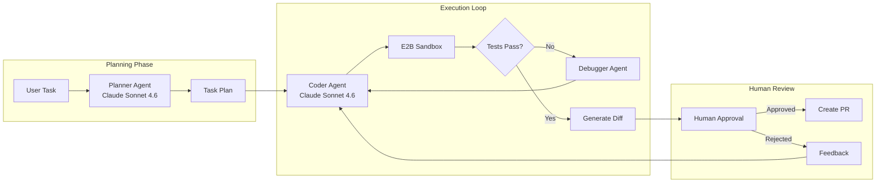
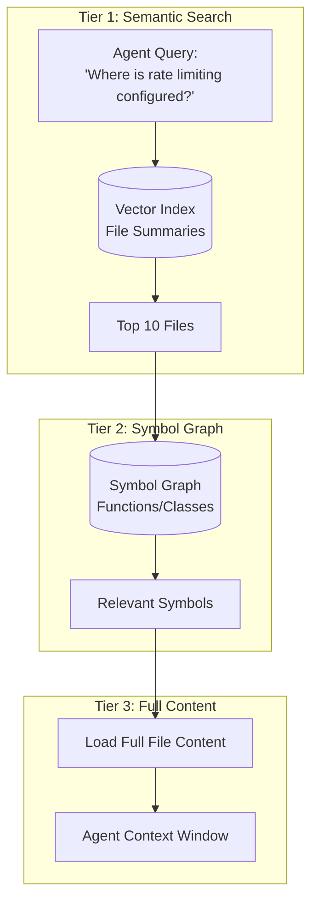

# 案例研究：自主编码 Agent

## 问题

一家开发者工具公司希望构建一个**AI 编码助手**，能够自主完成多文件任务，例如“为这个 Express API 增加认证”或“重构这个模块以使用依赖注入”。

**面试给出的约束：**
- 必须支持包含 1,000 个以上文件的代码库。
- 不能破坏既有功能，测试必须通过。
- 提交前必须由人批准变更。
- 每个任务完成成本低于 0.50 美元。

---

## 面试题

> “设计一个编码 Agent，它能接收‘为所有 API 端点增加限流’这样的任务，并产出可运行、通过测试的 Pull Request。”

---

## 解决方案架构



---

## 关键设计决策

### 1. 为什么分离 Planner 和 Coder Agent？

**回答：**规划需要**推理整个代码库**，包括要修改哪些文件以及已有哪些依赖；编码需要**精确生成语法**。分离后，可以在规划阶段启用扩展思考，在编码阶段使用快速生成，并在执行前让人审查规划结果。

### 2. 为什么使用 E2B 沙箱而不是本地执行？

**回答：**这是安全要求。Agent 会生成并运行代码，直接在本地执行会暴露宿主机。E2B 提供每次会话后重置的隔离容器；即便 Agent 生成 `rm -rf /`，也只会破坏沙箱。

### 3. 为什么两个阶段都使用 Claude Sonnet 4.6？

**回答：**Claude Opus 4.7 在 SWE-bench Pro 上领先，Claude Sonnet 4.6 以约 40% 的价格提供约 90% 的质量，适合每个任务运行多轮的 Agent。只在调试循环启用“Extended Thinking”，初次生成不启用，以控制成本。

---

## 代码库理解问题

Agent 无法把 1,000 个文件全部放进上下文，因此采用**分层检索**：



**实现：**
1. 在接入阶段用较小模型生成并索引文件摘要。
2. 使用 tree-sitter 做 AST 解析，建立符号图。
3. 分阶段检索：摘要 → 符号 → 完整内容。

---

## 自我纠错循环

Agent 会失败，可靠性的关键是**结构化自我纠错**：

```python
async def execute_with_retry(task: str, max_attempts: int = 3):
    for attempt in range(max_attempts):
        # Generate code
        code_changes = await coder_agent.generate(task)
        
        # Apply to sandbox
        sandbox.apply_changes(code_changes)
        
        # Run tests
        test_result = await sandbox.run_tests()
        
        if test_result.passed:
            return code_changes
        
        # Feed failure back to agent
        task = f"""
        Previous attempt failed. Error:
        {test_result.error}
        
        Original task: {task}
        
        Fix the issue.
        """
    
    raise MaxRetriesExceeded()
```

---

## 成本拆解

| 阶段 | 模型 | Token（平均） | 成本 |
|-------|-------|--------------|------|
| 规划 | Claude Sonnet 4.6（Extended） | 输入 8,000 / 输出 2,000 | $0.06 |
| 文件检索 | Embeddings | 50,000 | $0.01 |
| 编码（每次尝试） | Claude Sonnet 4.6 | 输入 15,000 / 输出 3,000 | $0.09 |
| 测试（平均 3 次） | - | - | $0.00 |
| **总计（平均 1.5 次尝试）** | | | **$0.21** |

每个任务 0.21 美元，低于预算。

---

## 面试追问

**Q：需要修改 20 多个文件的任务怎么办？**

A：规划阶段把任务拆成子任务，Planner 输出带依赖关系的 DAG。执行器按拓扑顺序处理并逐步运行测试；如果第 5 步失败，只重跑第 5 步及其后续，而不是重做整个任务。

**Q：如果 Agent 陷入无限重试循环怎么办？**

A：三道保险：(1) 最多尝试 3 次；(2) 同一个测试以相同错误失败两次后升级人工；(3) 每个任务 0.50 美元的总 Token 预算触发终止。

**Q：如何防止 Agent 引入安全漏洞？**

A：在沙箱测试套件中运行 Semgrep 静态分析。安全规则违规按测试失败处理，并将反馈交给 Agent 修复。

---

## 面试要点

1. **分离规划和执行**，便于设置检查点并控制成本。
2. **所有生成代码都在沙箱中运行**，例如 E2B 或 Docker。
3. **分层检索解决大代码库规模问题**：摘要 → 符号 → 内容。
4. **自我纠错循环必须有硬限制**：尝试次数、Token 和时间。

---

*相关章节：[工具使用与 MCP](../07-agentic-systems/03-tool-use-and-mcp.md)、[错误处理](../07-agentic-systems/07-error-handling-and-recovery.md)*
