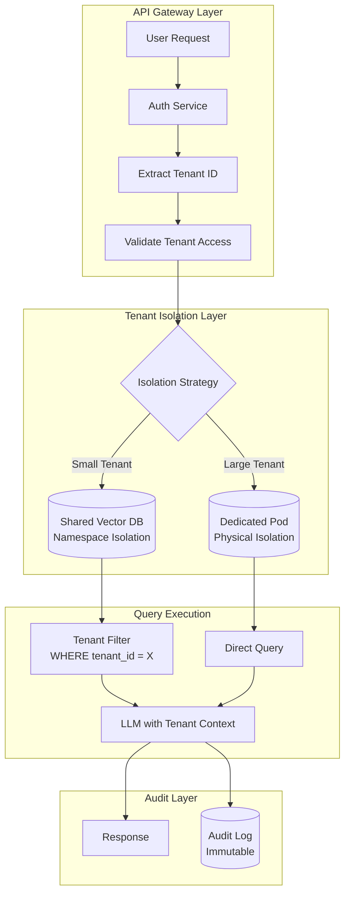
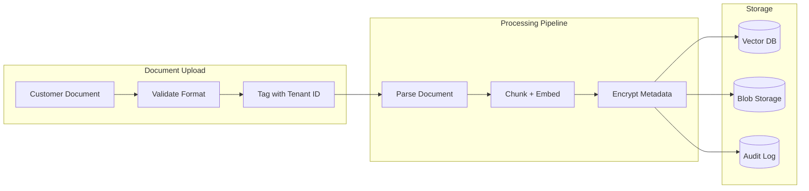

# 案例研究：多租户 AI SaaS 平台

## 问题

一家 B2B 初创公司正在构建**AI 文档分析平台**：每个客户上传自己的合同，AI 针对这些合同回答问题。客户之间可能是竞争对手，因此绝不能互相看到数据。

**面试给出的约束：**
- 500 家企业客户，每家 10,000～100,000 份文档。
- 绝对数据隔离：客户 A 的数据不能泄露给客户 B。
- 为降低成本使用共享基础设施。
- 合规要求：SOC 2 Type II、GDPR。
- 查询延迟低于 2 秒。

---

## 面试题

> “设计一个多租户 RAG 系统，让 Coca-Cola 和 Pepsi 都可以成为客户，并且跨租户数据泄露风险为零。”

---

## 解决方案架构



---

## 关键设计决策

### 1. 混合隔离：命名空间与物理隔离

**回答：**每租户一个数据库的纯物理隔离成本很高；共享数据库加 `tenant_id` 过滤的纯命名空间隔离，又可能因过滤器 Bug 造成泄露。因此采用**分层方案**：

| 层级 | 租户规模 | 隔离方式 | 原因 |
|------|-------------|------------------|-----|
| 标准 | <50K 文档 | 共享 Qdrant 中的命名空间 | 成本高效 |
| 高级 | 50K～500K 文档 | 独立 Qdrant collection | 隔离性能 |
| 企业 | >500K 文档 | 独立 Qdrant pod | 物理隔离 + 监管 |

### 2. 纵深防御保障数据隔离

**回答：**绝不依赖单一层。隔离栈包括：

1. **API Gateway**：从 JWT 校验 `tenant_id`，拒绝跨租户请求。
2. **数据库层**：用行级安全（RLS）在数据库层强制 `tenant_id` 过滤。
3. **应用层**：ORM 封装自动注入租户过滤条件。
4. **LLM 层**：System Prompt 明确声明“只为 Tenant X 回答”。
5. **输出层**：生成后扫描不属于当前租户的文档 ID。

### 3. 为什么不为每个租户部署一个向量数据库？

**回答：**500 个租户乘以每个托管实例每月 100 美元，仅数据库就要 5 万美元。对 80% 的租户采用命名空间隔离，可降到每月 8,000 美元；剩余 20% 的租户通过高级价格承担独立基础设施成本。

---

## 数据接入流水线



**关键点：**在**最早可能的位置**（上传校验）附加 `tenant_id`，并让它随文档穿过每个阶段；不能等到后面再推导或查询。

---

## 处理合规要求

### SOC 2 Type II

| 控制 | 实现 |
|---------|----------------|
| 访问日志 | 每次查询记录 `tenant_id`、`user_id` 和时间戳 |
| 静态加密 | Blob 存储使用 AES-256，向量数据库使用原生加密 |
| 传输加密 | 全链路使用 TLS 1.3 |
| 访问复核 | 从审计日志自动生成季度报告 |

### GDPR 删除权

```python
async def delete_tenant_data(tenant_id: str):
    # 1. Delete from vector DB
    await vector_db.delete(filter={"tenant_id": tenant_id})
    
    # 2. Delete from blob storage
    await blob_storage.delete_prefix(f"tenants/{tenant_id}/")
    
    # 3. Anonymize audit logs (cannot delete for compliance)
    await audit_log.anonymize(tenant_id=tenant_id)
    
    # 4. Generate deletion certificate
    return generate_deletion_certificate(tenant_id)
```

---

## 成本分析（500 个租户）

| 组件 | 每月成本 |
|-----------|--------------|
| 共享向量数据库（Qdrant Cloud） | $2,500 |
| 独立 pod（20 个企业租户） | $4,000 |
| LLM 成本（共享池，GPT-4o-mini） | $8,000 |
| Blob 存储（S3） | $1,500 |
| 审计日志（CloudWatch） | $500 |
| **总计** | **$16,500/月** |
| **每租户平均** | **$33/月** |

---

## 面试追问

**Q：如果 ORM Bug 绕过了租户过滤怎么办？**

A：依靠纵深防御。即便 ORM 失败，数据库仍通过 RLS 强制隔离。`SELECT * FROM documents` 在内部会变成 `SELECT * FROM documents WHERE tenant_id = current_tenant()`，这由 Postgres 层执行，不依赖应用层。

**Q：如何处理租户导出全部数据的请求？**

A：提供数据可移植性 API，流式导出所有文档及其 Embedding 和元数据。导出由管理员触发，写入审计轨迹，并交付到客户控制的 S3 bucket，而不是我们的基础设施。

**Q：如果 LLM 从训练数据中幻觉出与竞争对手机密信息相同的内容怎么办？**

A：这是实际风险。缓解方式包括：(1) 只做检索支撑的生成，没有检索文档就不能回答；(2) 过滤无法追溯到租户上传文档的输出；(3) 提供“私有模型”层级，只在该租户数据上微调专属模型。

---

## 面试要点

1. **多租户是分层问题**：不能依赖单一隔离机制。
2. **分层隔离平衡成本和安全**：不是所有租户都需要独立基础设施。
3. **租户 ID 必须尽早且不可变**：在上传时标记，而不是查询时才添加。
4. **合规是架构问题**：从第一天就设计审计、删除和可移植性。

---

*相关章节：[LLM 安全](../12-security-and-access/01-llm-security.md)、[访问控制与多租户隔离](../12-security-and-access/02-access-control.md)*
