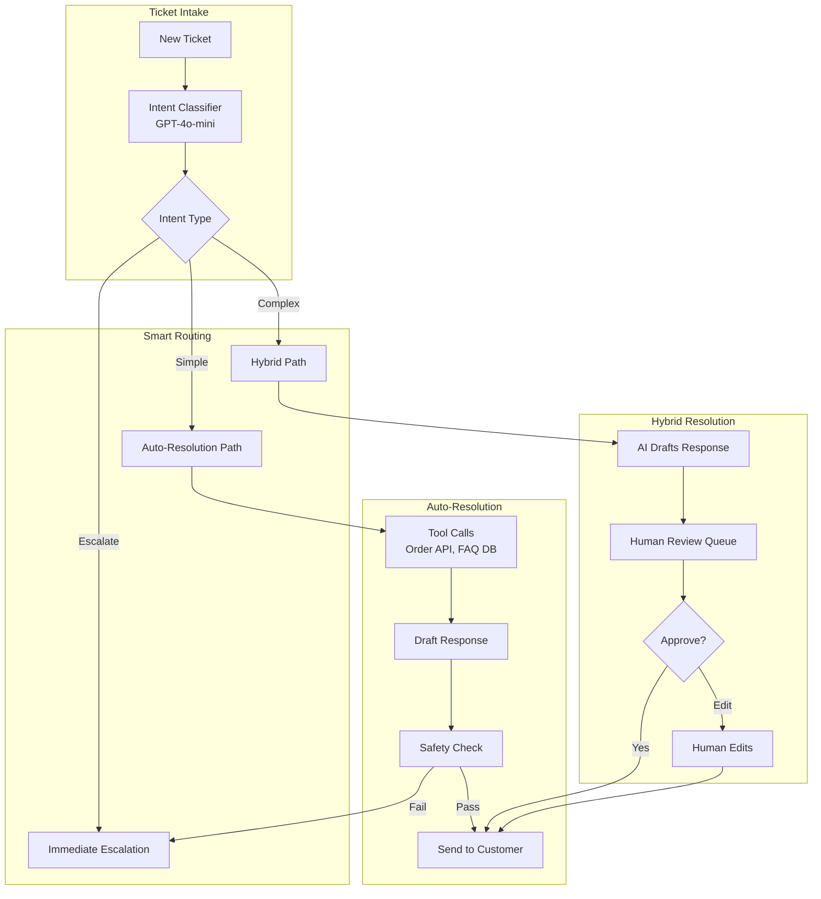
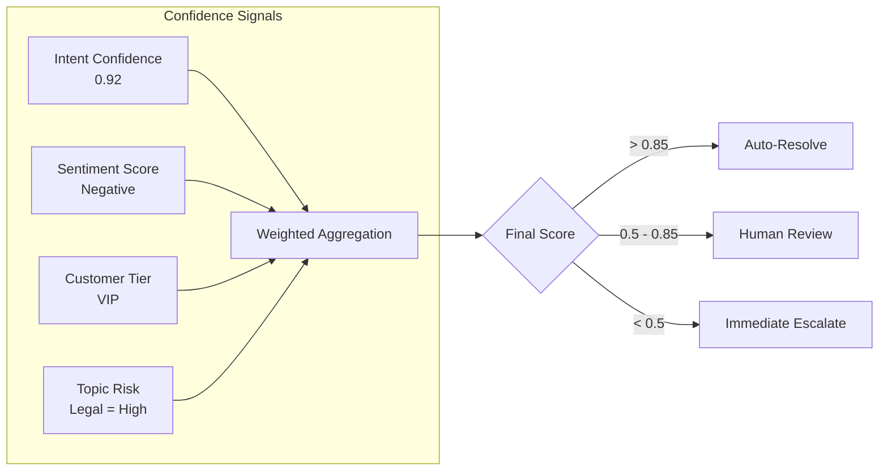
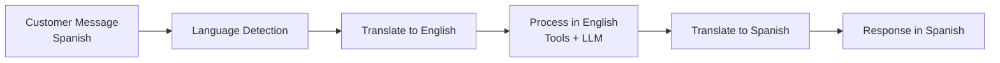

# 案例研究：AI 客户支持

本页与英文原文逐段对应，保留标题层级、列表、表格、代码、公式、链接和面试问答。

## 问题

一家电子商务公司每月处理**200 万张支持工单**。他们希望 AI 系统在无需人工介入的情况下自动解决 60% 的工单，同时把复杂问题顺畅地升级给人工。

**面试中给出的约束：**
- 支持 12 种语言、全天候运行。
- 必须与现有 Zendesk 和 Salesforce 集成。
- 不能做出虚假承诺（退款、发货日期）。
- 人工客服必须能在对话中途接管。
- 成本目标：每张已解决工单 0.05 美元。

---

## 面试题

> “设计一个客服 AI：能够自动处理‘我的订单在哪里？’，并知道何时将‘我要起诉你们欺诈’升级给人工。”

---

## 解决方案架构



---

## 关键设计决策

### 1. 三级路由（自动 / 混合 / 升级）

**回答：**并非所有工单都相同，我们将它们分到三条路径：

| 路径 | 条件 | 示例 | 人工参与 |
|------|----------|---------|-------------------|
| **自动** | 高置信度、低风险 | “我的订单在哪里？” | 无 |
| **混合** | 中等置信度或中等风险 | “我想退款” | 复核 AI 草稿 |
| **升级** | 法律、威胁、VIP、低置信度 | “这是欺诈” | 全程人工处理 |

### 2. 基于工具解决，而不是纯生成

**回答：**AI 并不知道订单在哪里，而是调用订单 API 工具。这对准确性至关重要：

```python
@tool
def get_order_status(order_id: str) -> dict:
    """Retrieve real-time order status from OMS."""
    order = oms_client.get_order(order_id)
    return {
        "status": order.status,
        "shipped_date": order.shipped_at,
        "estimated_delivery": order.eta,
        "tracking_url": order.tracking_url
    }
```

LLM 负责编排工具，但绝不编造数据。

### 3. 为什么发送前要做安全检查？

**回答：**即使是自动解决的工单，也必须经过安全过滤器：

1. **承诺检测**：标记“我保证”或“我们会赔付”等表述。
2. **情绪不匹配**：发现客户很生气时 AI 却语气轻快的情况。
3. **PII 泄露**：确保不会出现内部备注或其他客户数据。
4. **竞品提及**：如果 AI 推荐竞争对手则标记。

---

## 升级决策智能

最难的部分是判断**何时**升级。我们使用融合多种信号的置信度分数：



**关键洞见：**VIP 客户即使只问简单问题，也会进入混合路径，因为出错成本更高。

---

## 多语言支持

支持 12 种语言，但不部署 12 个独立模型：



**为什么不用原生多语言模型？**

因为成本。GPT-4o 能很好地处理这 12 种语言。每种语言使用专用模型需要 12 套部署；翻译会增加延迟，但能保持基础设施简单。

---

## 人工接管（对话中途）

人工接管时，需要完整上下文：

```python
def handoff_to_human(conversation_id: str, agent_id: str):
    conversation = get_conversation(conversation_id)
    
    # Generate summary for human agent
    summary = llm.generate(f"""
    Summarize this conversation for a human agent:
    - Customer issue
    - What AI already tried
    - Why escalation happened
    
    Conversation:
    {conversation.messages}
    """)
    
    # Create handoff package
    return {
        "summary": summary,
        "customer_sentiment": conversation.sentiment,
        "attempted_solutions": conversation.tool_calls,
        "full_transcript": conversation.messages,
        "customer_tier": conversation.customer.tier
    }
```

---

## 成本分析

| 组件 | 每张工单成本 |
|-----------|-----------------|
| 意图分类（GPT-4o-mini） | $0.002 |
| 工具调用（订单 API、FAQ 搜索） | $0.001 |
| 回答生成（GPT-4o-mini） | $0.008 |
| 安全检查 | $0.003 |
| 翻译（需要时，30% 的工单） | $0.004 |
| **平均总计** | **$0.018** |

自动解决率为 60% 时：**每张已解决工单 0.03 美元**（明显低于 0.05 美元目标）。

---

## 面试追问

**问：如果 AI 一直道歉却始终没有真正解决问题怎么办？**

答：我们跟踪“解决有效性”，而不只是“是否发送了回答”。如果客户在 24 小时内因同一问题再次回复，工单就标记为“未解决”，并将对应 AI 模式标记为待复核。我们还每周分析“哪些表述与客户再次追问相关”。

**问：如何处理坚持要求与人工沟通的客户？**

答：明确的升级短语（“和人工说”“找经理”）无论置信度分数如何都会立即触发转人工。我们不会与升级请求争辩。

**问：如果客户尝试让客服 AI 越狱怎么办？**

答：采用输入清洗加严格的工具限定回答。AI 不生成自由文本答案，而是调用工具并总结工具输出，因此无法通过 Prompt 诱导其泄露系统 Prompt。系统 Prompt 也极其狭窄：“你只帮助处理[公司]的订单问题，不能讨论其他主题。”

---

## 面试关键要点

1. **分层路由平衡自动化与风险**：不是每张工单都适合自动解决。
2. **基于工具的事实依据能防止幻觉**：AI 检索事实，而不是生成事实。
3. **置信度是多维的**：意图清晰度 + 情绪 + 客户等级 + 主题风险。
4. **转人工需要上下文**：应提供摘要，而不是只丢出完整记录。

---

*相关章节：[人在回路模式](../07-agentic-systems/08-human-in-the-loop-patterns.md)、[护栏实现](../13-reliability-and-safety/01-guardrails.md)*
