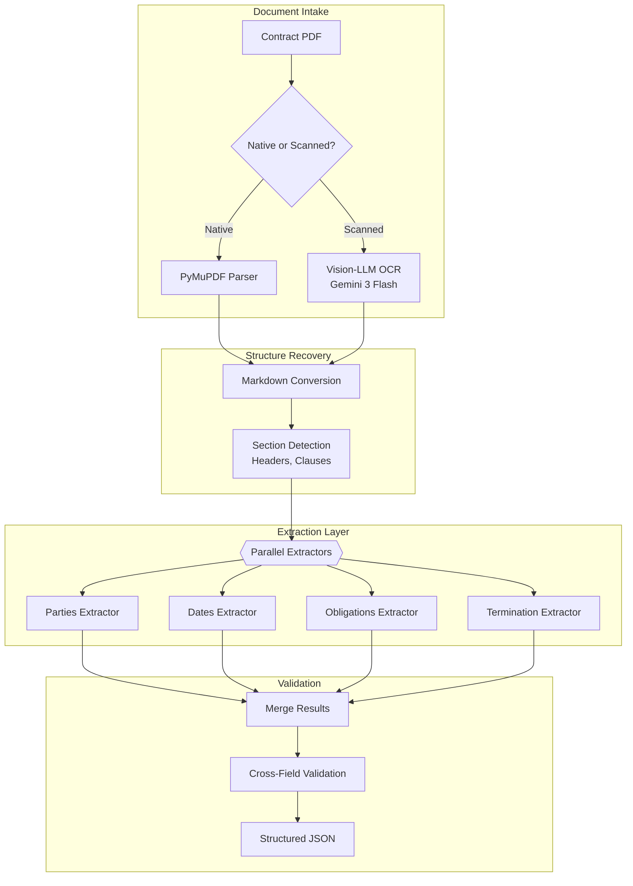
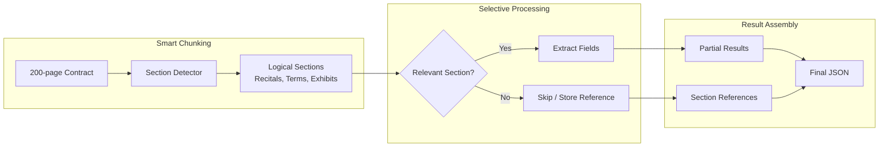

# 案例研究：文档智能流水线

本页与英文原文逐段对应，保留标题层级、列表、表格、代码、公式、链接和面试问答。

## 问题

一家法律科技公司每月需要处理**5 万份合同**，抽取关键条款（当事方、日期、义务、终止条款）并加载到可搜索数据库。

**面试中给出的约束：**
- 文档长度从 2 页到 200 页不等。
- 扫描 PDF 和原生数字文档混合。
- 多语言（英语、德语、法语、西班牙语）。
- 关键字段抽取准确率达到 95% 以上。
- 成本目标：每份文档低于 0.50 美元。

---

## 面试题

> “设计一条流水线，将 100 页合同 PDF 中的当事方、生效日期、终止条件和付款条款等结构化数据抽取为 JSON。”

---

## 解决方案架构



---

## 关键设计决策

### 1. 使用 Vision-LLM 做 OCR，而不是传统 OCR

**回答：**扫描合同经常包含印章、手写批注和复杂布局（表格、多栏）。传统 OCR（Tesseract）会产生乱码；Gemini 3 Flash 能“看懂”布局并生成保留表格的整洁 Markdown。成本较高，但准确率提升值得。

| 方法 | 100 页扫描合同表现 | 准确率 | 成本 |
|--------|---------------------------|----------|------|
| Tesseract | 噪声多、表格破碎 | 60% | $0.02 |
| AWS Textract | 较好，但仍难处理布局 | 75% | $0.15 |
| Gemini 3 Flash | Markdown 整洁、表格完整 | 92% | $0.35 |

### 2. 并行抽取器优于单次抽取

**回答：**用单个 Prompt 抽取所有字段，效果不如专用抽取器。每个抽取器都有聚焦的 Prompt 和 Schema：

```python
parties_schema = {
    "type": "object",
    "properties": {
        "party_a": {"type": "object", "properties": {
            "name": {"type": "string"},
            "role": {"type": "string"},
            "address": {"type": "string"}
        }},
        "party_b": {"type": "object", "properties": {...}}
    }
}

# Each extractor runs in parallel
async def extract_all(document: str):
    results = await asyncio.gather(
        extract_parties(document, parties_schema),
        extract_dates(document, dates_schema),
        extract_obligations(document, obligations_schema),
        extract_termination(document, termination_schema)
    )
    return merge_results(results)
```

### 3. 跨字段校验

**回答：**抽取错误经常会通过不一致暴露出来：
- 如果 `effective_date` 晚于 `termination_date`，说明存在问题。
- 如果 `party_a` 的名称出现在 `obligations` 中但拼写不同，应标记复核。
- 如果抽取出了 `payment_amount`，但 `payment_frequency` 为 null，说明结果不完整。

---

## 处理 200 页文档

上下文窗口带来的挑战：



**关键洞见：**不是 200 页中的每一页都包含需要抽取的字段。附件（附带的原始文档）只作为引用保存，不参与处理。“条款与条件”部分可能占文档 80%，却包含大多数关键字段。

---

## 多语言处理

德语合同的结构与英语合同不同，因此我们维护按语言区分的抽取器：

```python
EXTRACTORS = {
    "en": {
        "parties": EnglishPartiesExtractor(),
        "dates": StandardDatesExtractor(),
        "termination": EnglishTerminationExtractor()
    },
    "de": {
        "parties": GermanPartiesExtractor(),  # Handles "GmbH", "AG" patterns
        "dates": GermanDatesExtractor(),       # DD.MM.YYYY format
        "termination": GermanTerminationExtractor()  # "Kündigung" patterns
    }
}
```

---

## 成本拆解

| 阶段 | 每份 100 页文档成本 |
|-------|----------------------|
| OCR（Gemini 3 Flash，扫描件） | $0.18 |
| 章节检测（GPT-4o-mini） | $0.03 |
| 字段抽取（4 路并行，GPT-4o-mini） | $0.12 |
| 校验 | $0.02 |
| **总计（扫描件）** | **$0.35** |
| **总计（原生 PDF）** | **$0.17** |

平均成本（60% 原生、40% 扫描）：**每份文档 0.24 美元**（低于 0.50 美元目标）。

---

## 面试追问

**问：如果抽取置信度较低怎么办？**

答：我们为每个字段输出置信度分数，低于 0.8 的字段标记为人工复核。UI 展示“复核队列”，人工只需验证不确定字段，不必检查整份文档，平均每份文档的人力耗时可降到 30 秒。

**问：如何处理非标准布局的合同？**

答：我们维护已知合同模板的“布局库”。章节检测器先尝试匹配已知模板；匹配不到时，回退到启发式检测（寻找编号章节、全大写标题等）。未知布局会被标记，人工复核后加入布局库。

**问：如果关键条款定义在附件中怎么办？**

答：我们检测并解析交叉引用（“如附件 A 所定义”）。主文档引用附件时，抽取 Prompt 会加入相关附件内容，避免答案在附件中却抽取为 `null`。

---

## 面试关键要点

1. **面对复杂布局（表格、批注），Vision-LLM 优于传统 OCR。**
2. **并行专用抽取器优于单次抽取。**
3. **跨字段校验能在错误进入数据库前发现抽取问题。**
4. **不必处理所有页面**：检测相关章节，跳过附件。

---

*相关章节：[OCR 与布局](../10-document-processing/01-ocr-and-layout.md)、[结构化生成](../05-prompting-and-context/06-structured-generation.md)*
