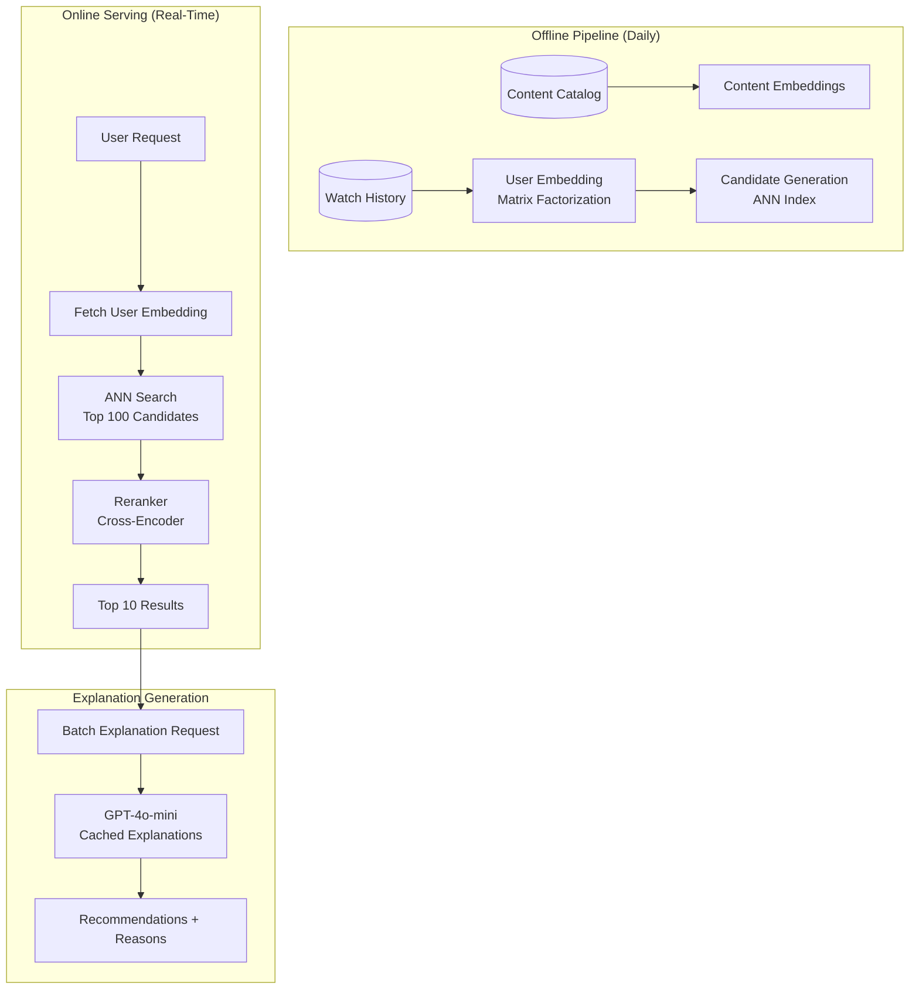
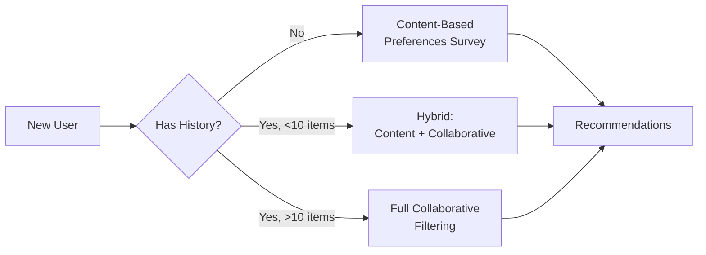

# 案例研究：AI 推荐引擎

本页与英文原文逐段对应，保留标题层级、列表、表格、代码、公式、链接和面试问答。

## 问题

一个拥有**5000 万用户**的流媒体平台需要构建推荐系统，将协同过滤与 LLM 生成的解释结合起来：“因为你喜欢《盗梦空间》，你可能会喜欢《信条》，因为它同样有烧脑的时间机制。”

**面试中给出的约束：**
- 实时推荐（p95 低于 200ms）。
- 必须解释每条推荐产生的原因。
- 处理新用户冷启动。
- 隐私：不能在用户之间泄露观看历史。
- 日活 500 万用户，每人每天查看 10 组以上推荐。

---

## 面试题

> “设计一个能大规模推荐电影，并用自然语言解释推荐原因的系统。”

---

## 解决方案架构



---

## 关键设计决策

### 1. 为什么不把所有事情都交给 LLM？

**回答：**规模经济不允许这样做。5000 万用户 × 每天 10 组推荐意味着每天 5 亿次 LLM 调用；每次 0.001 美元就是每天 50 万美元。因此改为：

| 组件 | 作用 | 每用户每天成本 |
|-----------|------|-------------------|
| 嵌入查找 | 获取预计算向量 | $0.00001 |
| ANN 搜索 | 查找候选 | $0.0001 |
| Cross-Encoder 重排序 | 为 Top 100 打分 | $0.001 |
| LLM 解释 | 生成自然语言 | $0.005 |
| **Total** | | **$0.006** |

LLM 只用于生成最终解释，不参与排名本身。

### 2. 解释缓存

**回答：**大多数解释都可以缓存。“因为你看过《盗梦空间》”适用于数千名用户。我们按 `(content_pair, reason_type)` 粒度缓存解释：

```python
cache_key = f"{source_movie}:{target_movie}:{reason_type}"
# Example: "inception:tenet:time_mechanics"

explanation = cache.get(cache_key)
if not explanation:
    explanation = generate_explanation(source_movie, target_movie, reason_type)
    cache.set(cache_key, explanation, ttl=86400)
```

预热后缓存命中率可达到 85% 以上。

### 3. 冷启动处理

**回答：**新用户没有可供协同过滤使用的历史记录。我们采用**混合方案**：



---

## 个性化解释的挑战

解释必须让人感到个性化，而不是泛泛而谈：

**不好：**“《信条》是一部热门惊悚片。”
**好：**“因为你喜欢《盗梦空间》的烧脑情节，《信条》提供了同一导演创作的类似时间操控谜题。”

我们通过在 Prompt 中加入用户上下文实现这一点：

```python
prompt = f"""
Generate a 1-sentence explanation for why this user would enjoy {target_movie}.

User context:
- Recently watched: {recent_movies}
- Preferred genres: {genres}
- Dislikes: {dislikes}

Source movie that triggered this recommendation: {source_movie}
Reason category: {reason_type}

Explanation:
"""
```

---

## 延迟预算

| 阶段 | 目标 | 实际 p95 |
|-------|--------|------------|
| 用户嵌入查找 | 5ms | 3ms |
| ANN 搜索（Top 100） | 20ms | 15ms |
| Cross-Encoder 重排序 | 50ms | 45ms |
| LLM 解释（命中缓存） | 10ms | 8ms |
| LLM 解释（未命中） | 500ms | 450ms |
| **总计（缓存命中）** | **85ms** | **71ms** |
| **总计（缓存未命中）** | **575ms** | **513ms** |

为了满足 200ms p95，我们要确保解释缓存命中率超过 95%，并异步为新的内容对生成解释。

---

## 面试追问

**问：如何防止 LLM 编造电影事实？**

答：LLM 会收到每部电影的结构化事实表（导演、演员、主题、奖项）作为上下文，只能使用表中的信息。生成后还会用校验器将声明与目录元数据比较。

**问：如果用户偏好快速变化怎么办？**

答：使用**按新近度加权的嵌入更新**，最近观看记录的权重是旧记录的 3 倍。为了实时响应，我们维护捕捉当前会话行为的“会话嵌入”，并将其与历史嵌入混合。

**问：如何对推荐算法做 A/B 测试？**

答：对 `user_id` 做哈希，将用户稳定分配到实验桶。每个桶可以使用不同的候选生成、排名或解释策略，并按桶跟踪互动指标（点击率、观看时长、跳过率）。

---

## 面试关键要点

1. **LLM 用于解释而非排名**：用传统 ML 支撑规模，用 LLM 做个性化。
2. **积极缓存**：内容对的解释可以跨用户复用。
3. **冷启动是一个连续谱**：新用户 → 基于内容；有少量历史 → 混合；历史完整 → 协同过滤。
4. **延迟预算需要缓存命中率目标**：围绕延迟 SLA 设计缓存。

---

*相关章节：[语义缓存](../08-memory-and-state/05-semantic-caching.md)、[成本优化](../04-inference-optimization/07-cost-optimization-playbook.md)*
