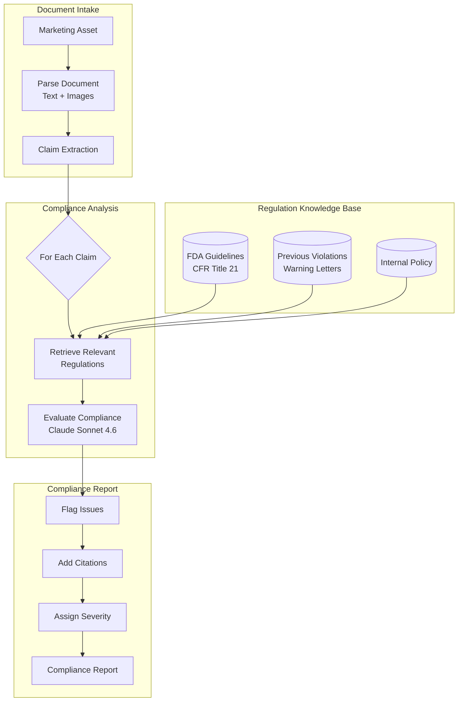
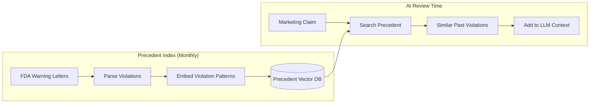
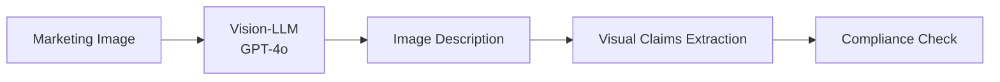

# 案例研究：监管合规自动化

本页与英文原文逐段对应，保留标题层级、列表、表格、代码、公式、链接和面试问答。

## 问题

一家制药公司必须确保所有营销材料符合 **FDA 法规**。目前每份材料的法律审核需要 2 周，他们希望 AI 预筛材料并标记问题，把法律审核缩短到 2 天。

**面试中给出的约束：**
- 必须引用具体法规条款，不能只说“这看起来不对”。
- 不能漏掉违规项（假阴性不可接受）。
- 误报（过度标记）应低于 20%。
- 每月 500 份营销材料。
- 监管检查需要完整审计轨迹。

---

## 面试题

> “设计一个审查制药营销材料、识别具体法规违规并给出引用的系统。”

---

## 解决方案架构



---

## 关键设计决策

### 1. 合规检查前先抽取声明

**回答：**营销材料内容密集，直接将整份文档与法规比对效率很低。我们先抽取独立的**声明**：

```python
claims = extract_claims(document)
# Example output:
# [
#   {"text": "Reduces symptoms by 80%", "type": "efficacy", "location": "page 2, para 3"},
#   {"text": "No side effects reported", "type": "safety", "location": "page 3, header"},
#   {"text": "Recommended by doctors", "type": "endorsement", "location": "page 1, image"}
# ]
```

随后将每条声明分别与相关法规核对。

### 2. 对法规为什么选择 RAG 而不是微调？

**回答：**法规会变化，FDA 每月都会更新指导文件。每次更新后重新微调成本很高，而 RAG 可以：
- 新指导发布后立即更新法规索引。
- 跟踪每次审核使用的法规版本（审计轨迹）。
- 向法律审核人员展示准确的来源段落。

### 3. 保守的标记策略

**回答：**漏掉违规（假阴性）是灾难性的，而额外审核（假阳性）主要只是增加时间成本。因此使用**分层阈值**：

| 置信度 | 动作 |
|------------|--------|
| >90% 违规 | 标记为 HIGH 严重度 |
| 70～90% 可能违规 | 标记为 MEDIUM，并引用疑点 |
| 50～70% 不明确 | 标记为 LOW，记录歧义 |
| <50% 可能合规 | 不标记，但记录到审计日志 |

没有记录推理过程时，我们绝不输出“合规”。

---

## 判例数据库

法规通常存在歧义。FDA 过去的警告信可以说明规则是如何执行的：



**这很重要：**仅看法规，“临床验证”这样的声明可能看起来没问题；但如果我们发现 5 封警告信都指出企业在没有具体试验数据时使用了“临床验证”，这就是危险信号。

---

## 审计轨迹要求

每个决策都必须可追溯：

```python
compliance_decision = {
    "claim_id": "claim_003",
    "claim_text": "No side effects reported",
    "decision": "VIOLATION",
    "severity": "HIGH",
    "regulation_cited": "21 CFR 202.1(e)(5)",
    "regulation_text": "Advertisements shall not contain claims that...",
    "precedent_cited": "Warning Letter 2023-FDA-04521",
    "reasoning": "Claim implies absolute safety, which contradicts...",
    "model_used": "claude-3-7-sonnet-20251022",
    "timestamp": "2025-12-21T10:30:00Z",
    "reviewer_id": null,  # Filled when human reviews
    "final_decision": null  # Filled after legal review
}
```

---

## 处理图像和视频

制药营销包含视觉声明（快乐的患者、前后对比图）：



**示例：**患者奔跑的图片暗示药物有效。如果药物用于关节炎，我们会检查临床试验是否支持“改善活动能力”的声明。

---

## 成本分析

| 阶段 | 每份材料成本 |
|-------|----------------|
| 文档解析 | $0.05 |
| 声明抽取 | $0.15 |
| 法规检索 | $0.02 |
| 合规评估（每条声明，平均 12 条） | $1.80 |
| 图像分析（平均 5 张） | $0.75 |
| 报告生成 | $0.10 |
| **Total** | **$2.87** |

每月 500 份材料：**每月 1435 美元**（相同法律工时成本超过每月 5 万美元）。

---

## 面试追问

**问：如何处理需要人工判断的法规？**

答：我们不替代人工，而是做分流。系统给问题标记附上置信度分数，低置信度标记交给资深法律顾问，高置信度且清晰的项目跳过详细审核。把人工注意力集中到边界案例后，可将 2 周审核缩短到 2 天。

**问：如果 FDA 在月中更新法规怎么办？**

答：我们有“法规监控”服务，持续监听 FDA RSS 和 Federal Register 更新。检测到相关更新后，重新建立索引，并标记近期可能受影响的审核。

**问：审计期间如何向监管机构解释 AI 的推理？**

答：每个决策都包含完整推理链：抽取的声明、检索的法规、引用的判例以及模型评估结果。我们可以向监管机构准确展示做出决策的原因，并提供所有组件的版本号。

---

## 面试关键要点

1. **先抽取声明**：将复杂文档拆成可审核单元。
2. **判例数据库优于纯法规文本**：规则如何执行同样重要。
3. **高风险领域使用保守阈值**：优化召回率，而不是精确率。
4. **审计轨迹属于架构**：从第一天起就为可解释性设计。

---

*相关章节：[RAG 基础](../06-retrieval-systems/01-rag-fundamentals.md)、[护栏实现](../13-reliability-and-safety/01-guardrails.md)*
