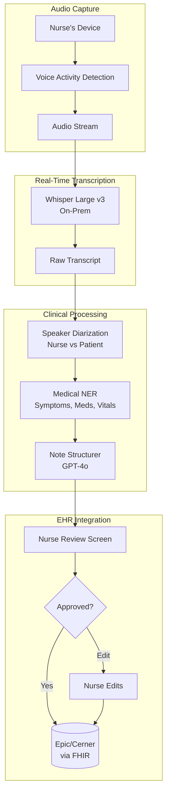
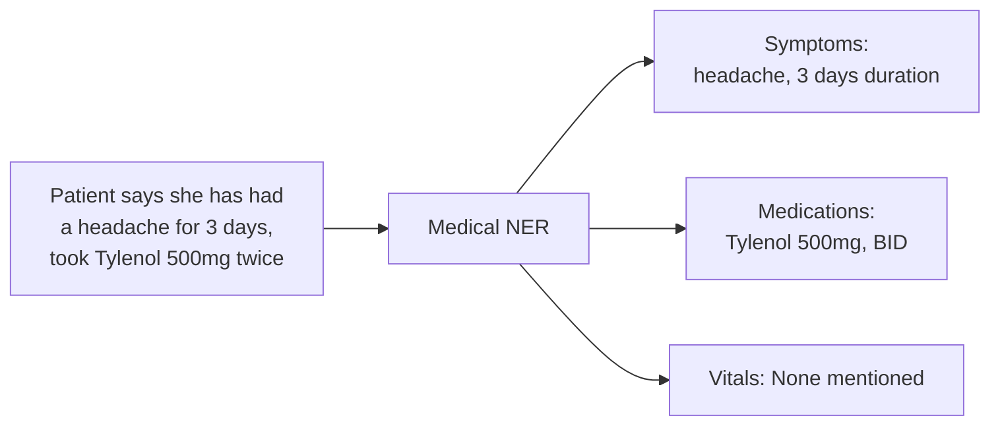

# 案例研究：医疗语音 AI 助手

本页与英文原文逐段对应，保留标题层级、列表、表格、代码、公式、链接和面试问答。

## 问题

一家医院网络希望使用**语音 AI 助手**帮助护士记录患者就诊。护士自然说话，AI 实时生成结构化临床记录。

**面试中给出的约束：**
- 符合 HIPAA（处理 PHI）。
- 能在嘈杂医院环境中工作。
- 实时转写（延迟低于 500ms）。
- 必须正确使用医学术语。
- 与现有 EHR（Epic/Cerner）集成。

---

## 面试题

> “设计一个护士在患者就诊期间可以直接交谈的语音助手，并在 EHR 中生成结构化临床记录。”

---

## 解决方案架构



---

## 关键设计决策

### 1. 为满足 HIPAA 使用本地 ASR

**回答：**没有加密和 BAA，PHI 不能离开医院网络。因此我们在本地 GPU 服务器部署 Whisper Large v3，而不是调用云 API：

| 方案 | 延迟 | HIPAA | 成本 |
|--------|---------|-------|------|
| 云 ASR（OpenAI） | 200ms | 需要 BAA，数据离开网络 | $0.006/分钟 |
| 本地 Whisper | 150ms | 完全控制，不出网 | $0.002/分钟（GPU 摊销） |

本地部署在延迟和合规性两方面都更优。

### 2. 说话人分离：谁说了什么

**回答：**记录必须区分“患者诉说头痛”和“护士观察到患者皱眉”。我们使用：

```python
# Pyannote for speaker diarization
diarization = pipeline("audio.wav")
# Output: [(0.0, 1.5, "SPEAKER_0"), (1.5, 4.2, "SPEAKER_1"), ...]

# Map speakers based on voice profile
roles = identify_roles(diarization, known_nurse_voiceprint)
# Output: {"SPEAKER_0": "nurse", "SPEAKER_1": "patient"}
```

护士设备在初始化时采集护士声纹，用于角色识别。

### 3. 用医学 NER 做结构化抽取

**回答：**我们需要结构化数据，而不只是散文文本。医学 NER 抽取：



NER 使用微调后的 BioBERT 模型，而不是 LLM，因为 NER 需要快速且确定性强。

---

## 处理噪声环境

医院环境很嘈杂，我们采用多种策略：

1. 护士设备使用**指向性麦克风**聚焦附近语音。
2. 使用**抗噪 ASR 模型**（Whisper 在噪声数据上训练）。
3. **置信度阈值**：ASR 置信度低于 0.7 时交给护士复核，而不是猜测。
4. **关键词唤醒/检测**：为医学术语使用自定义发音模型。

---

## 结构化记录格式

LLM 生成 SOAP 格式记录：

```python
note_prompt = f"""
Generate a clinical SOAP note from this encounter transcript.

Transcript:
{transcript_with_speakers}

Extracted entities:
- Symptoms: {symptoms}
- Medications: {medications}
- Vitals: {vitals}

Output format:
S (Subjective): Patient's reported symptoms
O (Objective): Nurse's observations and measurements
A (Assessment): Clinical impression
P (Plan): Next steps, orders
"""
```

---

## EHR 集成（FHIR）

输出必须是 EHR 可读取的机器格式：

```json
{
  "resourceType": "DocumentReference",
  "status": "current",
  "type": {
    "coding": [{"system": "http://loinc.org", "code": "34117-2", "display": "History and physical note"}]
  },
  "subject": {"reference": "Patient/12345"},
  "author": [{"reference": "Practitioner/nurse789"}],
  "content": [{
    "attachment": {
      "contentType": "text/plain",
      "data": "base64-encoded-soap-note"
    }
  }],
  "context": {
    "encounter": {"reference": "Encounter/visit456"}
  }
}
```

---

## 延迟预算

| 阶段 | 目标 | 实际 |
|-------|--------|--------|
| 音频采集到 VAD | 50ms | 30ms |
| ASR 转写 | 200ms | 150ms |
| 说话人分离 | 100ms | 80ms |
| NER 抽取 | 50ms | 40ms |
| LLM 结构化 | 500ms | 450ms |
| **总计（端到端）** | **900ms** | **750ms** |

为了保持实时体验，在 NER 和 LLM 处理完整句子的同时，我们持续流式展示部分转写结果。

---

## 面试追问

**问：如何处理医学缩写和术语？**

答：维护自定义词表，将缩写（PRN、BID、SOB）映射到完整术语。词表同时注入 ASR 模型（提高识别率）和 LLM Prompt（确保记录中正确展开）。

**问：如果护士在句中纠正自己怎么办？**

答：检测“其实我的意思是……”“不，等等，应该是……”等纠正模式，只使用纠正后的版本。存在冲突时，指示 LLM 优先采用后面的表述。

**问：如何确保 AI 不遗漏关键信息？**

答：我们通过“完整性检查”验证记录包含全部抽取实体。如果 NER 发现“胸痛”但 SOAP 记录没有提及，就标记给护士复核。我们还运行“安全关键”检测器，发现自杀意念、虐待或其他强制报告触发项时立即升级。

---

## 面试关键要点

1. **医疗场景本地处理**：HIPAA 通常要求数据在本地处理。
2. **说话人分离不可或缺**：临床上必须知道谁说了什么。
3. **混合抽取**：用快速 NER 获取结构，用 LLM 生成文本。
4. **始终保留人工复核**：尤其是临床文档。

---

*相关章节：[模型分类](../02-model-landscape/01-model-taxonomy.md)、[可靠性模式](../13-reliability-and-safety/03-reliability-patterns.md)*
