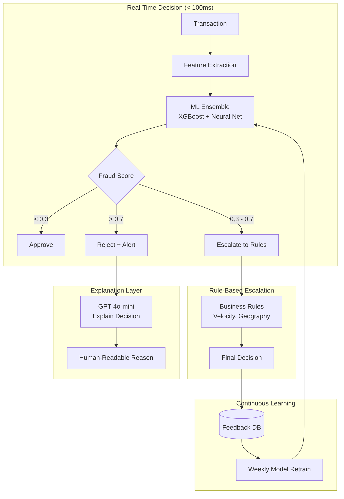
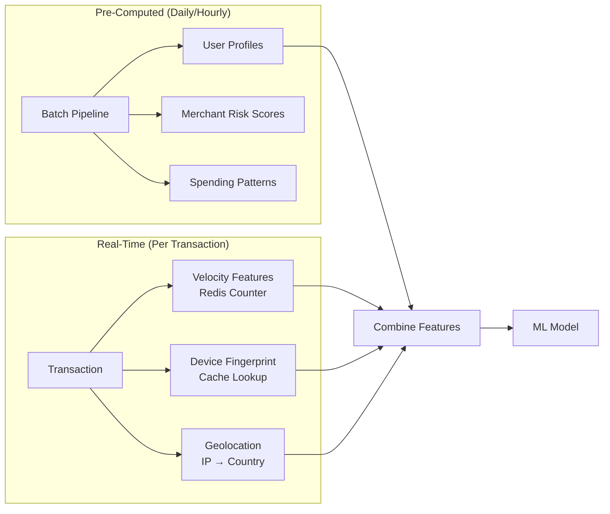
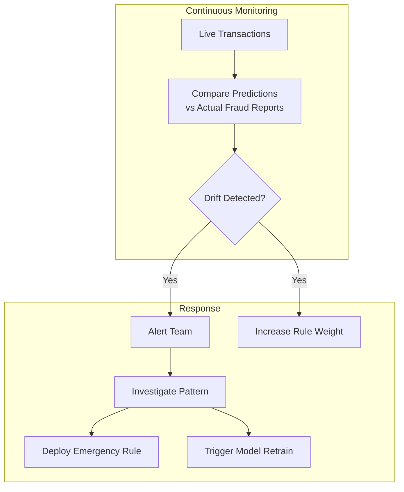

# 案例研究：实时欺诈检测

本页与英文原文逐段对应，保留标题层级、列表、表格、代码、公式、链接和面试问答。

## 问题

一家支付处理商每天处理**1000 万笔交易**。他们需要实时识别欺诈交易，在完成前阻止，同时尽量减少令正常客户沮丧的误报。

**面试中给出的约束：**
- 决策延迟低于 100ms。
- 误报率低于 0.1%（每 1000 笔最多 1 笔）。
- 必须解释交易被标记的原因。
- 法规要求保留 7 年审计轨迹。
- 欺诈模式持续演化。

---

## 面试题

> “设计一个能在 100ms 内决定批准、拒绝或升级信用卡交易，并能解释该决策的系统。”

---

## 解决方案架构



---

## 关键设计决策

### 1. 为什么采用 ML + 规则，而不是只用 ML？

**回答：**纯 ML 模型是黑盒，监管机构要求争议处理中的决策可解释。我们用 ML 打分，再用透明规则做最终决策：

| 层 | 作用 | 速度 | 可解释性 |
|-------|------|-------|----------------|
| ML 集成 | 捕获复杂模式 | 10ms | 低 |
| 业务规则 | 编码已知欺诈类型 | 5ms | 高 |
| 组合 | 兼顾两者优点 | 15ms | 中高 |

规则示例：“1 小时内在不同国家发生 5 笔以上交易则阻止”，监管人员可以理解。

### 2. 三路决策：批准 / 升级 / 拒绝

**回答：**二元的批准/拒绝过于粗糙。“灰区”（0.3～0.7 分）交给规则升级流程；高金额交易则进行人工审核：

```python
def decide(transaction, fraud_score):
    if fraud_score < 0.3:
        return "APPROVE", None
    elif fraud_score > 0.7:
        reason = explain_rejection(transaction, fraud_score)
        return "REJECT", reason
    else:
        # Gray zone: apply business rules
        if check_velocity_rules(transaction):
            return "REJECT", "Velocity limit exceeded"
        if check_geography_rules(transaction):
            return "ESCALATE", "Unusual location"
        return "APPROVE", None
```

### 3. 为什么用 LLM 解释，而不是 SHAP/LIME？

**回答：**SHAP 值只会告诉你“特征 X 为分数贡献了 0.3”。客户和监管人员想知道的是：“这笔交易被标记，是因为它来自你从未去过的国家的新设备，金额是你通常消费的 10 倍。”

我们以特征重要性为输入生成自然语言解释：

```python
prompt = f"""
Explain why this transaction was flagged as potentially fraudulent.

Transaction details:
- Amount: ${amount}
- Merchant: {merchant}
- Location: {location}
- Device: {device}

Top contributing factors:
1. {factors[0]['feature']}: {factors[0]['contribution']}
2. {factors[1]['feature']}: {factors[1]['contribution']}
3. {factors[2]['feature']}: {factors[2]['contribution']}

Write a 2-sentence explanation for the cardholder.
"""
```

---

## 面向速度的特征工程

100ms 的预算意味着特征必须预计算：



**关键洞见：**用户画像（平均消费、常用商户、常住地理位置）离线计算，实时阶段只增加交易特有的特征。

---

## 处理演化中的欺诈模式

欺诈者会适应变化，上月的模型可能漏掉本月的攻击。



**紧急规则**可以在几分钟内部署（只需更新配置）。模型重训练需要几天，但能捕获更隐蔽的模式。

---

## 面试追问

**问：如何处理模型延迟尖峰？**

答：我们有**回退栈**。如果 ML 模型在 50ms 内没有响应，就只回退到基于规则的评分，规则覆盖最常见的欺诈模式。如果所有系统都变慢，10 美元以下交易还可以默认批准。

**问：如何处理协同欺诈攻击？**

答：我们维护全局速度计数器，而不只是按用户统计。如果 1 分钟内发现不同银行卡向同一冷门商户发起 100 笔交易，即使单笔交易看起来正常，也会触发商户级阻断。

**问：如何平衡欺诈防范与客户体验？**

答：我们跟踪“冒犯率”，即被阻止的正常客户比例。每个产品团队都有冒犯预算；如果欺诈模型的冒犯率超过预算，就自动放宽阈值并通知团队。与激怒忠实客户相比，适当接受更多欺诈通常更好。

---

## 面试关键要点

1. **ML 用于评分、规则用于解释**：监管领域要结合两者。
2. **三路决策减少误报**：灰区接受额外审查。
3. **尽可能预计算**：实时预算只用于组合特征。
4. **持续重训练不可或缺**：欺诈模式每周都在变化。

---

*相关章节：[评测与可观测性](../14-evaluation-and-observability/)、[可靠性模式](../13-reliability-and-safety/03-reliability-patterns.md)*
