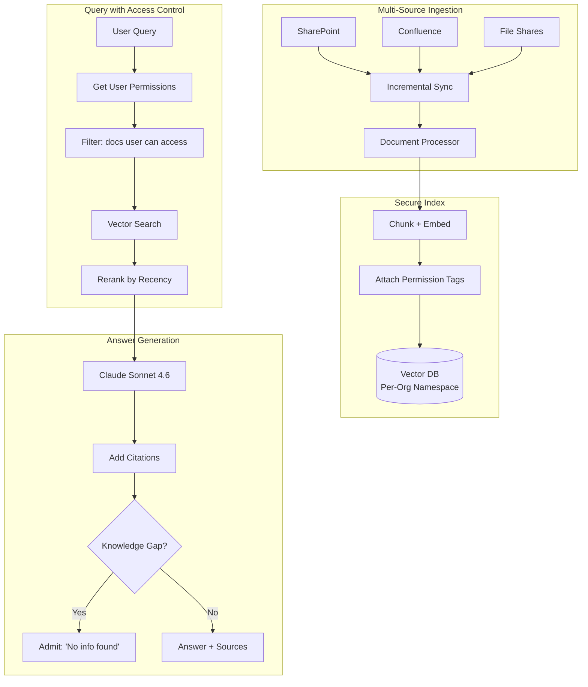
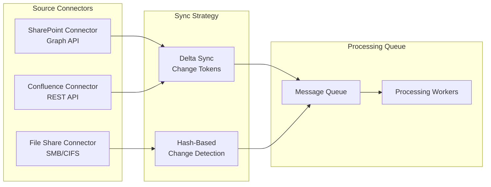

# 案例研究：企业知识管理

本页与英文原文逐段对应，保留标题层级、列表、表格、代码、公式、链接和面试问答。

## 问题

一家拥有**1 万名员工**的咨询公司，有数十年的项目报告、方法论文档和专业经验，分散在 SharePoint、Confluence 和文件共享中。他们希望构建 AI 系统，让顾问可以询问“我们如何为汽车客户做供应链优化”，并从内部知识中综合答案。

**面试中给出的约束：**
- 15 个数据源中的 200 万份文档。
- 访问控制：助理不能查看合伙人级别内容。
- 每个声明都必须引用来源。
- 处理陈旧数据：旧方法不能覆盖新方法。
- 应识别知识缺口，而不是编造答案。

---

## 面试题

> “设计一个内部知识助手，让初级顾问提问时只能根据其获授权查看的文档得到答案。”

---

## 解决方案架构



---

## 关键设计决策

### 1. 权限感知检索

**回答：**每个分块都从源系统继承权限元数据：

```python
chunk = {
    "content": "Our approach to automotive supply chain...",
    "source": "sharepoint://projects/acme-motors/final-report.docx",
    "permissions": {
        "read_groups": ["partners", "managers", "automotive-team"],
        "classification": "confidential"
    },
    "last_modified": "2024-03-15",
    "author": "jane.doe@firm.com"
}
```

查询时先过滤，再进行检索：

```python
def search(query: str, user: User):
    user_groups = get_user_groups(user.id)
    
    return vector_db.search(
        query=query,
        filter={
            "permissions.read_groups": {"$in": user_groups}
        }
    )
```

### 2. 按新近度加权排名

**回答：**对于同一主题，2024 年方法论文档的排名应高于 2019 年文档。我们使用**衰减函数**：

```python
def recency_boost(doc_date):
    age_days = (today - doc_date).days
    # Half-life of 365 days
    return 0.5 ** (age_days / 365)

final_score = semantic_score * 0.7 + recency_boost(doc.date) * 0.3
```

这样可以防止过时实践淹没当前指导。

### 3. 知识缺口检测

**回答：**必须区分“没有找到信息”和“正在编造信息”：

```python
def generate_answer(query: str, retrieved_docs: list):
    if len(retrieved_docs) == 0 or max_relevance_score < 0.5:
        return {
            "answer": "I could not find relevant information in our knowledge base for this query.",
            "confidence": "low",
            "suggestion": "Try contacting the Automotive Practice lead directly."
        }
    
    # Generate from retrieved content
    answer = llm.generate(query, context=retrieved_docs)
    return {"answer": answer, "confidence": "high", "sources": [d.source for d in retrieved_docs]}
```

---

## 多源同步



**关键洞见：**SharePoint 和 Confluence 支持变更令牌（增量同步），文件共享需要哈希比较，两者最终都进入统一处理队列。

---

## 处理冲突信息

不同文档可能包含冲突指导，我们会显式呈现冲突：

```python
def detect_conflicts(retrieved_docs):
    # Group by topic
    topics = cluster_by_topic(retrieved_docs)
    
    for topic, docs in topics.items():
        if has_contradictions(docs):
            return {
                "warning": "Found conflicting guidance",
                "perspectives": [
                    {"source": d.source, "date": d.date, "view": summarize(d)}
                    for d in docs
                ],
                "recommendation": "Defer to most recent document or consult practice lead."
            }
```

---

## 成本分析

| 组件 | 月成本 |
|-----------|--------------|
| 嵌入（200 万文档 × 更新） | $500 |
| 向量数据库（Pinecone Enterprise） | $2,000 |
| LLM 生成（5 万次查询） | $3,000 |
| 同步基础设施（连接器） | $500 |
| **Total** | **$6,000/month** |

ROI：顾问平均每周节省 2 小时信息搜索时间。按 1 万名顾问 × 100 美元/小时 × 2 小时 × 4 周计算，每月生产力收益为 800 万美元，系统收益约为成本的 1300 倍。

---

## 面试追问

**问：如何处理包含混合权限的文档？**

答：我们按章节切块，每个章节继承祖先节点中最严格的权限。普通“内部”文档中的“机密”章节里的段落，也会标记为“机密”。

**问：如何处理实时协作文档（Google Docs、实时 Confluence 页面）？**

答：我们为“实时文档”单独建立流水线，以更高频率同步（每 5 分钟一次，而静态文件每天同步）。文档定稿前，在搜索结果中标记为“草稿”。

**问：如何防止系统成为未授权数据的泄露抽象？**

答：我们从不把未授权内容放进 LLM 上下文，即使只是为了说“我不能展示这部分”。系统表现得就像未授权文档不存在，从而防止用户通过“你们有 X 的信息吗？”这类探测推断机密项目是否存在。

---

## 面试关键要点

1. **权限必须在检索阶段而非生成阶段执行**：在 LLM 看到内容前就过滤。
2. **新近度加权防止知识陈旧**：旧文档的相关性随时间衰减。
3. **承认缺口而不是产生幻觉**：使用置信度阈值和回退消息。
4. **多源同步很复杂**：不同 API 需要不同策略。

---

*相关章节：[RAG 基础](../06-retrieval-systems/01-rag-fundamentals.md)、[多租户隔离](../12-security-and-access/02-access-control.md)*
