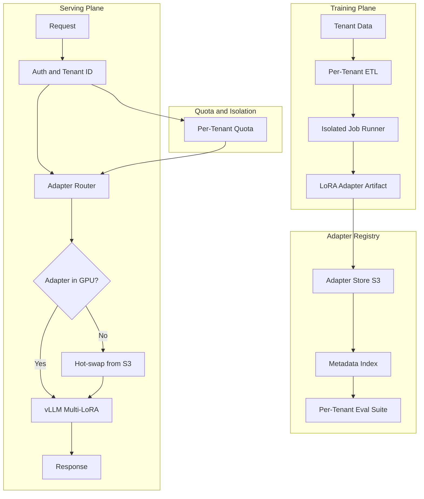
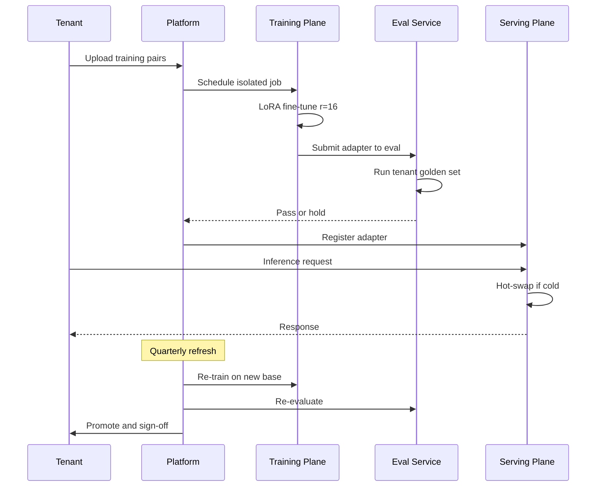

# 案例研究：多租户微调平台

本页保留英文原文的章节层级、列表、表格、代码、公式、链接和面试问答，并提供对应的中文说明。

一家垂直 AI 供应商通过单一基础模型加每租户 LoRA Adapter 服务 280 个客户，配合隔离训练、每租户“评测即 PRD”和噪声邻居缓解，将 p99 延迟保持在 1.2 秒以内。

## 业务问题

一家法律科技垂直 SaaS 供应商运营合同分析产品。280 个企业客户都希望模型遵循各自模板、判例语料和起草风格。开箱即用的 Prompt 不够：客户会与通用模型做盲 A/B 测试，一旦输出偏离内部风格就拒绝产品。每租户单独微调也不可行：70B 参数模型每个占用 140GB 磁盘，并需要专用 H100 服务，单位经济性无法成立。

2026 年 5 月的现实约束：

- 280 个付费租户，数量每年翻倍
- 每个租户有 1000～250,000 对历史合同样本（输入 + 偏好的修改）
- 租户要求评测报告，证明模型适合自己的测试集
- 单次查询延迟预算：p99 低于 1.2 秒
- 租户遵循不同合规制度：SOC 2、ISO 27001、HIPAA、FedRAMP Moderate

团队选择在共享基础模型上使用每租户 LoRA Adapter。LoRA（[Hu 等，2021](https://arxiv.org/abs/2106.09685)）和 QLoRA（[Dettmers 等，2023](https://arxiv.org/abs/2305.14314)）已经成熟；vLLM 的多 LoRA 服务（[文档](https://docs.vllm.ai/en/latest/models/lora.html)）和 SGLang 的 Adapter 切换允许多个 Adapter 共享 GPU 中的基础模型。Anyscale 和 Together AI 都发布过这一模式的生产案例（[Anyscale 2024 文章](https://www.anyscale.com/blog/fine-tuning-llms-lora-or-full-parameter-an-in-depth-analysis)、[Together AI 多 LoRA 服务](https://www.together.ai/blog/multi-lora-inference)）。

## 架构

### 组件

| 层 | 技术 | 用途 |
|-------|------|---------|
| 基础模型 | Llama 4 70B int8 | 所有租户共享 |
| Adapter | 注意力层 LoRA r=16，每租户约 120 MB | 每租户适配 |
| 训练 | 8 个 H100 节点上的 DeepSpeed ZeRO-3 | 租户隔离的任务 |
| 服务 | 带 PagedAttention 和多 LoRA 的 vLLM 0.7+ | 一个基础模型、多个 Adapter |
| Adapter 存储 | 使用每租户 KMS 密钥的 S3 | 静态加密 |
| 评测存储 | 每租户黄金集，每次重训都运行 | 每租户“评测即 PRD” |

### 训练时数据流

1. 客户通过每租户 S3 Bucket 和专用 IAM 角色上传训练样本对；KMS 密钥也按租户划分。
2. ETL 任务运行在该租户专属的 Kubernetes Namespace 中；节点选择器确保不会与其他租户任务共同调度。
3. 训练通常在 8 个 H100 组成的 Pod 上运行 4～10 小时；r=16 的 LoRA 可放入每张 H100 的 80GB 显存，并为激活值留出空间。
4. 自动使用租户黄金集运行评测；如果指标回归超过阈值，就把产物留在 Staging。
5. 将 Adapter 产物（70B 基础模型配 r=16 注意力 Adapter 时约 120MB）上传到注册表并更新元数据索引。

### 服务时数据流

1. 请求携带租户 JWT 到达网关。
2. 路由器解析该租户对应的 Adapter 版本。
3. 如果 Adapter 已热加载到 GPU 内存（每节点缓存 200 个 Adapter 的 LRU），就直接推理。
4. 如果未加载，则在 200～600ms 内从 S3 热切换 Adapter。我们根据租户流量模式预热，以隐藏这段延迟。
5. vLLM 应用 Adapter 执行请求；PagedAttention 安全地跨租户共享 KV Cache，因为 KV 按请求而不是按 Adapter 作用域隔离。

## 关键设计决策

### 1. 选择 LoRA r=16，而不是全量微调

每租户进行一次完整 70B 微调需要约 $4500 计算成本，生成 140GB 产物并独占一张 H100。r=16 的 LoRA 每租户每次重训成本为 $80～$400，产物仅 120MB，而且可以共享 GPU。在内部合同分析评测中，二者在 100 分综合指标上的准确率差距为 1.6 分。我们接受这个差距，因为成本相差 50 倍，且热切换、临时产物等运维流程简单得多。上面链接的 Anyscale 文章进行了类似比较，也得出了相同结论。

### 2. Adapter 切换预算与噪声邻居问题

vLLM 的多 LoRA 支持会把 Adapter 保留在 GPU 内存中，但每个 Adapter 占用几百 MB。在 80GB H100 上以 int8 运行约 40GB 的 70B 基础模型后，约有 30GB 可分配给 Adapter 和 KV Cache，因此一次约可驻留 200 个 Adapter。我们结合流量感知预热和尾部租户固定使用 LRU：30 个延迟 SLA 严格的租户固定在缓存中，不会被驱逐；其余 Adapter 轮换。Adapter 未热加载的租户需要承担 200～600ms 的尾延迟，我们会在租户 SLA 中明确列为冷启动预算。

噪声邻居故障是指某个租户突然产生 10 倍于正常水平的流量，把其他 Adapter 挤出缓存。缓解措施是网关按租户执行 Token Bucket 限流，并对过去 60 秒内服务过流量的 Adapter 动态启用驱逐保护。

### 3. 每租户评测套件作为闸门

我们把租户黄金集当作产品需求文档。每次重训后，训练流水线都用它评测新 Adapter；如果综合指标回归超过 2 分，就暂缓产物，并向租户 CSM 发送 Slack 提醒。这是 Hamel Husain 介绍的“评测即 PRD”模式（[如何构建领域评测](https://hamel.dev/blog/posts/evals/)），我们将它扩展为每租户一套。每个租户的黄金集在入驻时与其法务团队共同整理（60～90 分钟工作坊），并按季度刷新。

### 4. 通过 Kubernetes Namespace 和网络策略隔离训练

多租户是一个需要纵深防御的问题。训练任务运行在每租户 Namespace 中；网络策略禁止访问该租户 S3 前缀和中央指标服务之外的地址；节点选择器禁止共同调度。我们还为每租户配置专用 KMS 密钥，同时用于 Bucket 加密和模型产物加密。即使某个产物解密密钥泄露，也只会暴露一个租户，而不是全部租户。

### 5. 服务时隔离：GPU 可以共享，KV Cache 不能共享

基础模型共享，Adapter 按租户划分，KV Cache 按请求划分。PagedAttention（[vLLM 论文](https://arxiv.org/abs/2309.06180)）保证 KV 块按请求隔离，因此即使租户 A 和 B 在同一个推理批次中共享 GPU，注意力计算和 KV 状态也不会混合。我们用红队 Prompt 审计过这一点：5 万对对抗样本中没有跨租户泄露。

### 6. 模型生命周期与基础模型刷新

基础模型每 6～9 个月升级一次。升级时，所有 Adapter 都必须针对新基础模型重训。我们使用每租户保存的训练数据自动重训，运行其评测套件，并在提升版本前请求租户签字确认。280 个租户在 4 个专用训练节点上的完整基础模型刷新周期约需 3 周，计划会公开共享。评测失败的 Adapter 标记为人工复核，在问题解决前继续使用旧的基础模型 + Adapter 组合。

### 7. 为什么具体选择 r=16

如果不仔细阅读 LoRA 论文，容易认为 r=4 或 r=8 是标准选择。我们在自己的领域做了扫描：对于拥有 5 万对以上训练样本的租户，r=4 欠拟合；r=8 可以接受；r=16 已获得提升到 r=32 时 95% 的收益。r=32 让产物大小和训练成本翻倍，但指标提升不到 1 分。我们统一在注意力层（Q、K、V、O）使用 r=16，并跳过 MLP 层。这与 [Anyscale 文章](https://www.anyscale.com/blog/fine-tuning-llms-lora-or-full-parameter-an-in-depth-analysis)对类似负载的建议一致。

### 8. 冷启动工程

从 S3 冷启动热切换需要 200～600ms。我们使用流量感知预热隐藏这段延迟：Sidecar 进程读取过去 60 分钟的租户流量，在每个整分预加载排名前 50 的冷 Adapter。按尾延迟测得预热命中率为 78%；剩余冷未命中通常来自新租户或从空闲状态回归的租户，这两类情况可以接受冷启动惩罚。

## 租户生命周期时序

## 失败模式与缓解措施

### F1：重训后 Adapter 质量回归

重训后的模型在租户黄金集上比上一版本更差。缓解措施是评测闸门阻止提升版本，继续使用旧 Adapter，并告警团队和租户。每租户保留最近 3 个 Adapter 版本用于回滚。回滚时间中位数为 6 分钟。

### F2：训练时跨租户数据串扰

ETL 流水线 Bug 导致任务读取错误租户的 S3 Bucket。缓解措施是按租户限定 IAM 角色；训练任务启动时承担该租户角色，完全没有访问其他 Bucket 的凭据。回归测试验证使用租户 A 角色运行的任务无法列出租户 B 的 Bucket，并在每次 CI 构建时运行。

### F3：流量尖峰下 Adapter 缓存抖动

一次行业展会让 30 个租户同时流量激增，驱逐了大多数其他 Adapter，p99 延迟从 1.1 秒升至 4.8 秒。缓解措施是网关按租户限流；缓存为高等级租户使用固定槽位；预留 20% 缓存容量。日历中有已知活动时，我们在低峰期预热。

### F4：错误训练数据污染 Adapter

租户误上传含客户 PII 或属于错误司法辖区的合同，导致 Adapter 过拟合错误模式。缓解措施是训练前对输入运行自动 PII 检测；评测套件通过特定司法辖区案例捕获漂移；租户可以在发起重训前通过仪表盘抽查训练集。

### F5：基础模型升级破坏旧 Adapter

新基础模型使用不同的 Tokenizer 或层命名，Adapter 的矩阵形状不再适用。缓解措施是把每次基础模型升级都视为强制重训。我们绝不让 Adapter 服务于它未训练过的基础模型；服务层守卫会拒绝加载没有匹配基础版本的 Adapter。

### F6：训练平面成本失控

配置错误的任务在某个训练步骤循环，消耗 80 个 H100 小时却没有生成检查点。缓解措施是每租户月度训练预算、每任务超时（硬上限 24 小时），以及检测到损失超过 2 小时不再下降就通知 SRE 的 Watchdog。过去 6 个月我们中止了 14 个此类任务。

### F7：训练中 GPU 节点故障

训练期间 8 张 H100 中的一张发生硬件故障，导致任务崩溃。缓解措施是 DeepSpeed 每 30 分钟保存检查点，在新节点上自动恢复，并维护少量已预热备用节点。平均恢复时间为 18 分钟；任务级重试预算为 3 次，超过后通知人工。

### F8：Adapter 签名密钥轮换破坏旧客户端

我们为 Adapter 清单签名以检测篡改。未协调地轮换签名密钥会破坏服务层验证。缓解措施是在轮换窗口内双重签名；客户端 7 天内同时接受新旧密钥；所有客户端都用新密钥验证后才废弃旧密钥。

### F9：共享评测基础设施造成租户交叉污染

评测运行器误将结果写入错误租户的指标 Bucket。缓解措施是按租户提供发布评测结果的凭据；写入时检查租户 ID，验证目标与运行任务的租户一致；不一致则拒绝写入并告警。

### F10：Adapter 版本泛滥

3 年后，280 个租户在注册表中产生了超过 1 万个 Adapter 版本。存储便宜，但元数据服务负载很高。缓解措施是分层存储：旧版本 90 天后自动归档到冷存储；元数据服务每租户只索引当前版本和前 3 个版本；回滚场景下冷归档取回 SLA 为 1 分钟。

### F11：服务加载时 Adapter 校验和不匹配

S3 热切换期间网络抖动损坏 Adapter 字节，vLLM 虽然加载成功，但推理结果无意义。缓解措施是在元数据中记录每个 Adapter 的 SHA-256 校验和；服务层加载时验证校验和，拒绝服务于不匹配的 Adapter；同时通知 SRE 并重试加载。

## 运维考虑

### 监控与 SLO

| SLO | 目标 | 测量内容 |
|-----|--------|-----------------|
| 服务 p99 延迟 | 热缓存时低于 1.2 秒 | 任意时刻 95% 的租户都有热缓存 |
| 冷启动 p99 | 额外低于 1.0 秒 | Adapter 从 S3 加载的时间 |
| 训练任务成功率 | 超过 98% | 达到 Adapter 提升阶段的任务 |
| 评测闸门通过率 | 超过 90% | 通过租户黄金集的 Adapter |
| 跨租户审计发现 | 0 | 每季度自动红队 |

### 成本模型

按当前混合流量计算的每租户经济性：

- 训练：每次重训 $80～$400；每季度刷新
- 服务：共享 GPU；每百万输入 Token $0.18，每百万输出 Token $0.36（接近 Llama 4 供应商等价价格）
- Adapter 存储：每租户 120MB，每月 $0.04
- 评测：每次重训 $5
- 每租户合计：每季度 $80～$800，取决于流量

280 个租户时，月度计算成本约 $180K，毛收入为 $720K，符合 75% 毛利率的计划。

### 值班手册

- 多租户 p99 同时飙升：检查 Adapter 缓存命中率；如果较低，就限制突发租户并预热热点集合。
- 单租户回归告警：检查评测差异；确认真实回归后回滚到旧 Adapter，并通知 CSM。
- 训练队列积压：扩充训练节点（保留 2 个待命节点）；若持续存在，通知平台团队做容量规划。
- 训练任务卡住：检查检查点时间戳；2 小时没有进展就终止并从最近检查点恢复；损失曲线异常可能表示数据错误。
- 租户入驻瓶颈：评测工作坊是最长环节；提前 3 周排期，并维护预构建黄金集模板的待办队列。

### 入驻流程

新租户入驻需要 4～6 周：法务和 DPA 审查 1 周，评测集工作坊 1 周，首次训练 2 周，Canary 发布 1 周。我们在 Runbook 中记录每个租户的入驻过程，由 CSM 负责日程。评测工作坊是杠杆率最高的一小时，因为客户领域专家会在这里把判断标准编码进我们的测试集。

### 租户退出

租户退出是一个可控流程：删除租户训练数据，把所有 Adapter 版本移入保留 90 天的冷归档（以处理争议），90 天后撤销其 KMS 密钥，并提供删除证明。整个流水线自动化，由 CSM 签字确认。

### 合规状态

我们持有 SOC 2 Type II，并通过 ISO 27001 认证。客户审计包包括：每租户数据驻留证明、带 KMS 密钥 ID 的静态加密证据、训练任务日志和评测报告。平台每月自动生成审计包。

## 优秀面试候选人应覆盖的内容

- 能说出 vLLM 多 LoRA 服务和 PagedAttention，并解释 KV Cache 隔离为何是共享 GPU 多租户的关键。
- 区分每租户“评测即 PRD”和单一全局评测；对于垂直 AI，前者是必须的。
- 用具体数字说明 LoRA 与全量微调的权衡（成本比例、准确率差距、产物大小）。
- 明确指出噪声邻居问题，并至少给出三种缓解措施（限流、固定槽位、驱逐保护）。
- 说明基础模型刷新流程；这是区分已上线平台与原型的朴素运维现实。
- 用实证数字回答秩选择问题（为什么是 r=16 而非 r=4 或 r=32），而不是诉诸经验传闻。

## 参考资料

- Hu et al., [LoRA: Low-Rank Adaptation of Large Language Models](https://arxiv.org/abs/2106.09685)
- Dettmers et al., [QLoRA: Efficient Finetuning of Quantized LLMs](https://arxiv.org/abs/2305.14314)
- [vLLM Multi-LoRA serving docs](https://docs.vllm.ai/en/latest/models/lora.html)
- Kwon et al., [Efficient Memory Management for LLM Serving with PagedAttention](https://arxiv.org/abs/2309.06180)
- Anyscale, [Fine-tuning LLMs: LoRA or full-parameter](https://www.anyscale.com/blog/fine-tuning-llms-lora-or-full-parameter-an-in-depth-analysis)
- Together AI, [Multi-LoRA inference at scale](https://www.together.ai/blog/multi-lora-inference)
- Hamel Husain, [How to construct domain-specific evals](https://hamel.dev/blog/posts/evals/)
- Eugene Yan, [Evals: Constructed for LLM Apps](https://eugeneyan.com/writing/evals/)
- Microsoft, [DeepSpeed ZeRO-3](https://www.deepspeed.ai/training/)
- [SGLang adapter swapping](https://github.com/sgl-project/sglang)
- [Kubernetes Multi-Tenancy WG patterns](https://github.com/kubernetes-sigs/multi-tenancy)

相关章节：[LoRA 与微调](../03-training-and-adaptation/03-lora-qlora-peft.md)、[多租户隔离](../12-security-and-access/02-access-control.md)、[推理优化](../04-inference-optimization/01-inference-fundamentals.md)。
