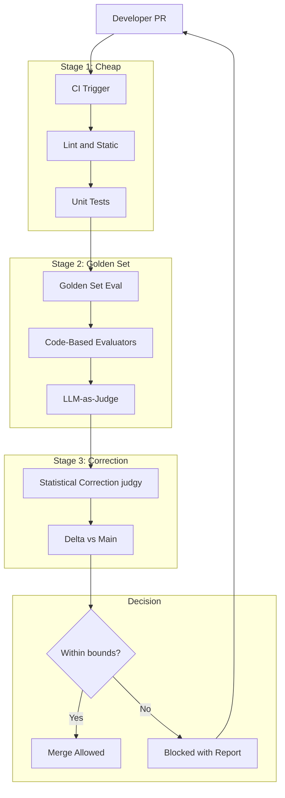
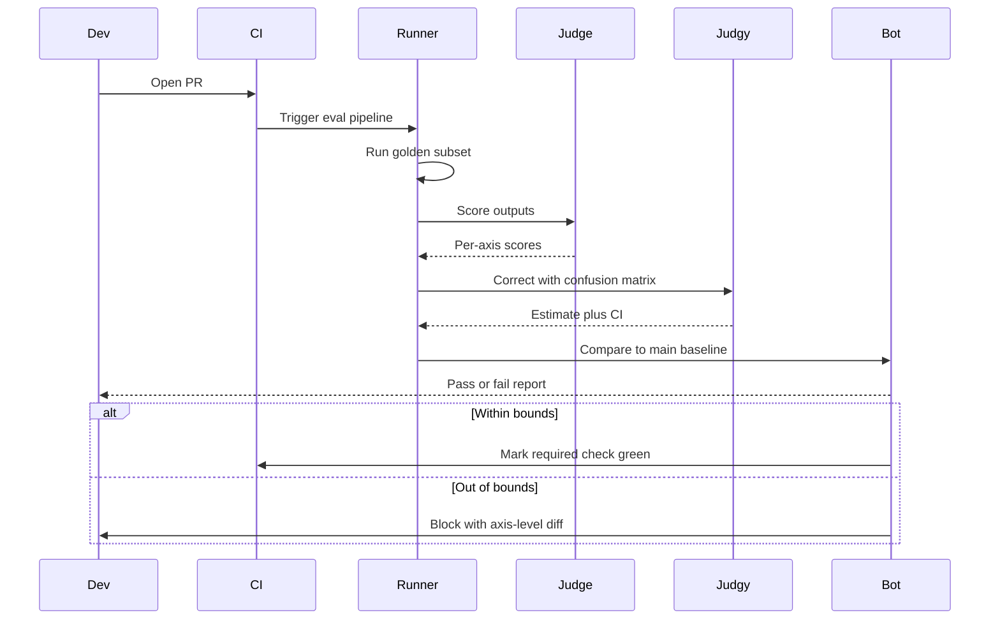

# 案例研究：AI 产品的评测门禁 CI/CD

本页保留英文原文的章节层级、列表、表格、代码、公式、链接和面试问答，并提供对应的中文说明。

一个由 28 名工程师组成的 AI 产品团队用评测闸门 CI 替代合并后的回归排查：每个 PR 在出现合并按钮前都要运行黄金集、带统计校正的 LLM 评审和失败模式分类。

## 业务问题

一家 AI 优先的 SaaS 公司发布了面向客户的问答机器人，底层是 RAG 流水线加 Agent 循环。六个月前，一次“很小”的 Prompt 变更导致特定合同类型问题的回答质量回归，客户发现后取消了 400 万美元续约。事后复盘发现：变更没有在合同专属测试集上评测；抽查使用的 LLM 评审指标漂移了 11 分却无人察觉；本应两天回滚的修复因为没有安全基线，花了 9 天。

2026 年 5 月的现实约束：

- 4 个团队共 28 名工程师；每周约 50 个 PR 会触及 AI 代码面
- 受监管行业客户不接受其领域查询出现回归
- 每个 PR 的评测预算：模型成本低于 $40；完整运行预算低于 $1200
- PR 到合并的 p95 目标：包括评测在内低于 90 分钟
- 评测方法每季度由审计员签字确认

2026 年 5 月的现实是，评测闸门 CI 已不再是可有可无的增强项。Hamel Husain 的[评测系列](https://hamel.dev/blog/posts/evals/)、Eugene Yan 的文章（[evals](https://eugeneyan.com/writing/evals/)）和用于统计校正的 [judgy 库](https://github.com/ai-evaluation/judgy)已经形成相近实践。Phoenix、Langfuse、Braintrust 和 Galileo 都提供 CI 集成。问题不再是“是否要做”，而是“如何做且不让周期翻倍”。

## 架构

### 组件

| 层 | 技术 | 用途 |
|-------|------|---------|
| 黄金集 | 仓库中的 YAML，每个产品面 1200～4000 个案例 | 稳定的测试基础 |
| 代码评测器 | 带自定义断言的 Pytest | 便宜且确定的检查 |
| LLM 评审 | 使用 Claude Sonnet 4.7 评审 | 主观质量 |
| 统计校正 | [judgy](https://github.com/ai-evaluation/judgy) | 将评审分数转换为带置信区间的估计值 |
| 流水线 | GitHub Actions + 自定义运行器 | CI 编排 |
| 轨迹存储 | Langfuse | 每 PR 的可观测性 |
| 标注 | 自托管 Argilla | 为评审校准重新人工标注 |

### 数据流

1. PR 打开后触发 GitHub Actions；第 1 阶段（Lint、单元测试、类型检查）在 2 分钟内完成。
2. 第 2 阶段对黄金集的代表性子集运行评测（默认完整集合的 10%～25%；受保护分支或标签为 `full-eval` 时运行 100%）。
3. 每个黄金集案例都用新构建运行并生成输出；适用确定性检查时由代码评测器（JSON Schema、正则、事实查找）评分，同时由 LLM 评审质量维度。
4. 第 3 阶段使用 Judge Prompt 的 train/dev/test 划分，并通过 `judgy` 校正评审分数。
5. 将校正后的估计值（含置信区间）与 `main` 最近一次绿色构建比较；如果置信区间下界在容忍范围内，PR 可以合并，否则阻断并生成详细报告。

## 关键设计决策

### 1. 黄金集构建与轮换

每个黄金集来自三个来源：最近 90 天按失败模式分层的生产轨迹样本、独立红队 LLM 生成的合成对抗案例，以及从客服工单整理的边界案例。每季度轮换 10%～15% 的案例，但不删除案例，而是归档到只在夜间运行的冻结“历史回归集”。这样可以避免评测集随产品变化而过拟合。

规模上，每个产品面至少需要 1200 个案例；低于此规模时，校正分数的置信区间过宽，无法以 95% 置信度检测 2 分回归。我们根据自身指标重新推导了样本量。

### 2. Judge 的 train/dev/test 划分

LLM Judge 本身也是带 Prompt 参数和 Few-shot 示例的模型。我们把 Judge Prompt 当作模型，遵循 train/dev/test 纪律：60% 的人工标注案例用于调优 Prompt，20% 选择最佳变体，20% 作为仅在重大 Judge Prompt 变更前查看的 Holdout。这是 [judgy 方法](https://github.com/ai-evaluation/judgy)和 Hamel 评测文章的核心。

重新校准周期为每 30 天：50 个新案例由两名人工重新标注（Cohen's kappa 必须超过 0.7）；Judge 在 dev 集上的准确率低于 80% 时重新调优。

### 3. 使用 judgy 做统计校正

在我们的领域，主观类别的朴素 LLM Judge 准确率约为 75%～88%，原始 Judge 分数存在偏差。`judgy` 使用 Judge 在 Holdout 上的混淆矩阵估计真实通过率，并返回置信区间。我们以置信区间下界是否在容忍范围内作为门禁，因此不会仅因 Judge 噪声阻断 PR，也不会因 Judge 没捕获回归就批准它。

计算示例：如果 Judge 在 Holdout 上精确率为 85%、召回率为 92%，新构建的 Judge 报告通过率为 89%，校正估计约为 87%，95% 置信区间约为 83%～91%。当区间下界最多比 `main` 低 2 分时允许合并（参阅 [judgy README 计算](https://github.com/ai-evaluation/judgy#statistical-correction)）。

### 4. 将失败模式分类作为断言面

我们不把“质量”压缩成单一数字，而是按失败模式分类的轴评分：幻觉、检索遗漏、格式违规、拒答、人格破坏和引用错误。该分类来自对 6 个月内 800 个生产失败的错误分析（[Hamel 的开放编码 + 轴心编码流程](https://hamel.dev/blog/posts/field-guide/)）。按轴评分可以在总体质量提升时，仍阻断幻觉回归。

### 5. 每个 PR 的评测预算

完整评测集运行一次的成本取决于模型用量，约为 80～200 美元。每周 50 个 PR 时，直接运行每周成本为 4000～1 万美元。因此我们限制：

- 默认 PR 按失败模式分层抽取黄金集的 10%～25%（确保每种失败模式都有代表）。
- `full-eval` 标签触发 100% 运行。
- 每晚 Cron 在 `main` 上运行 100%，捕获遗漏的漂移。
- Judge Prompt 发生新变更时，在冻结的历史集合上运行 100%。

这样每个 PR 成本低于 40 美元，每周总成本低于 1200 美元。

### 6. Judge Prompt 漂移检测

即使校准过，Judge Prompt 仍会漂移：底层模型更新，Few-shot 示例变得不具代表性，Prompt 词汇也可能对模型过时。我们通过以下方式监控漂移：

- 每月重新运行留出集，并报告相对于上月的准确率差异。
- 跟踪评审间一致性（并行运行两个 Judge Prompt，随时间出现分歧说明其中一个发生漂移）。
- 在 Git 中管理 Judge Prompt 版本；回滚只需一个提交。

漂移超过 3 分或 kappa 低于 0.65 时，创建维护工单。

### 7. 缓存评测流水线

典型黄金集案例先生成输出，再由 Judge 评分。在 Prompt 和模型版本确定时，输出是确定的。我们缓存 `(prompt-hash, model-version)` 到 `(output, judge-score)` 的映射，使重复评测几乎免费。只改编排代码、不改 Prompt 的 PR 缓存命中率约 70%，这类变更成本降低约 3 倍。

### 8. PR 级埋点

每个 PR 的评测报告包括：各轴相对 main 的通过率、新失败和新通过案例、Judge 校正置信区间、总成本，以及指向轨迹存储的链接，工程师可以重放任何失败案例。运行结束后 3 分钟内将报告作为 GitHub 评论发布。

## CI 流水线时序

## 失败模式与缓解措施

### F1：Judge Prompt 漂移未被发现

模型升级后，评审器逐渐漏检幻觉。缓解措施：每月重放留出集、跟踪评审间一致性，并为受保护分支提供“冻结评审”模式，即使有新模型也固定评审模型版本。此前导致故障的漂移事件正是由此引起；现在我们能在一个周期内捕获漂移。

### F2：评测集被过拟合

少数案例被反复调试，Prompt 在不知不觉中针对它们调优。缓解措施：按季度轮换；保留不会出现在工程师失败报告中的对抗案例（只展示结果）；由独立红队团队负责留出集。

### F3：单个 PR 只运行评测角落，漏掉回归

采用分层抽样：确保每个 PR 的 10% 样本至少包含 12 种失败模式各 1 个案例。`main` 仍然每天夜间运行完整评测。每个 PR 的覆盖有限，但不是零。

### F4：误触完整运行导致成本超支

每个 PR 都加上 `full-eval` 标签会使成本增加三倍。缓解措施是要求 CODEOWNERS 文件中的负责人批准该标签；自动提醒会通知添加标签的人。我们还将月度评测支出硬上限设为 $5K，预计超限的任务不会启动。

### F5：阻断率过高，开发者学会忽略

如果 35% 的 PR 被阻断，开发者会停止阅读报告并寻找绕过方式。缓解措施是调节闸门容忍度，将阻断率保持在 5%～12%；把阻断率作为 SLI；出现尖峰时调查原因（通常是评审器对新的失败模式过于严格）。目标是暴露真实回归，而不是做一个形式上的门卫。

### F6：留出集泄露到训练或 Prompt

某个留出案例最终变成了 Few-shot 示例。缓解措施是将留出集存放在独立仓库并使用独立访问列表；工程师不能读取它，只有评测运行器拥有部署密钥。留出案例失败时，报告只包含哈希，不包含原始案例。

### F7：评审模型弃用

供应商宣布评审模型即将停止支持。缓解措施是至少并行校准两个评审模型；模型弃用时，我们有 60 天窗口完成替换，同时保持 Kappa 阈值。Judge Prompt 的 Git 历史和校准数据让这一过程可以常规化。

### F8：评测运行器队列饱和

发布时间附近 PR 激增会让评测队列积压 30 分钟。缓解措施是使用带自动扩缩容的专用评测运行器 GPU 池，为受保护分支提供优先通道；队列深度超过 20 时，自动把非受保护 PR 降级为 5% 样本，以更快清空积压。

## 运维考量

### 监控

| SLO | 目标 |
|-----|--------|
| PR 到合并 p95 | 低于 90 分钟 |
| 每 PR 评测成本 p95 | 低于 $40 |
| 阻断率（误报 + 真实回归） | 5%～12% |
| Judge 评审者间 Kappa | 超过 0.7 |
| 留出集重放准确率月度差异 | 低于 3 分 |
| 生产回归逃逸（部署后） | 每季度低于 1 次 |

### 成本模型

每周 50 个 PR 时：

- 默认抽样：平均每 PR $25；每周 $1250
- 完整评测（每周约 8 次）：每次 $100；每周 $800
- 每晚 Cron：每次 $200；每周 $1400
- Judge 重新校准：每月 $50
- 合计：每月约 $14K

只要避免一次回归就能收回成本。事后估算的 400 万美元续约损失表明，每年避免一次类似事故就足以证明这笔投入合理。

### On-call playbook

- 阻断率尖峰：检查近期 Judge Prompt 或黄金集变更是否导致问题，并将各轴分数与基线比较。
- 评测成本尖峰：检查抽样率配置，并限制 `full-eval` 标签的使用。
- Judge 漂移告警：触发校准周期；漂移严重时切换到备用评审模型。
- 留出集泄露（哈希碰撞）：立即隔离并重新生成受影响案例。
- 评测运行器故障：PR 进入队列并显示清晰的“评测待处理”状态；运行器宕机时绝不自动合并；15 分钟内通知 SRE。

### Quarterly review

每季度 AI 团队都会复核：失败模式分类（类别是否仍匹配真实生产错误？）、黄金集轮换（哪些 10%～15% 已过时？）、Judge 校准历史（漂移是否加速？）以及阻断率趋势（闸门是否变成形式？）。复核结果进入下一季度评测路线图。我们采用 [Hamel field guide](https://hamel.dev/blog/posts/field-guide/) 流程：对最近 50 个失败进行开放编码，再通过轴心编码更新分类体系。

### Auditor pack

评测流水线每季度生成审计包：方法文档（在 Git 中版本化）、黄金集摘要（按失败模式计数）、Judge 校准结果（随时间变化的 Cohen's Kappa）、阻断率直方图，以及带理由的失败 PR 样本。审计包自动生成并由工程负责人签字。

### Why we do not use a single composite quality score

把所有轴合并成一个数字并据此设闸门很诱人，但我们不这样做。综合分会隐藏回归：格式合规性的提升可能掩盖幻觉回归。我们按各轴分数设闸门，让每个轴都有自己的置信区间和阻断条件。代价是报告噪声更多，收益是关键维度不会静默回归。

## 优秀面试候选人应覆盖的内容

- They distinguish code-based evaluators (cheap, deterministic) from LLM-as-judge (expensive, subjective) and use both in different stages.
- They name statistical correction explicitly; they understand that a raw judge score is a biased estimate and that confidence intervals are the right abstraction for gating.
- They define a failure-mode taxonomy from error analysis and gate on per-axis scores, not a single composite.
- They specify the train/dev/test discipline for the judge itself, including kappa thresholds for re-calibration.
- They bound eval cost explicitly; they know full runs cost too much for every PR and that stratified sampling is the lever.
- They have a story for judge-prompt drift: they monitor it, they version-control the prompt, they have a roll-back plan.
- They protect the held-out set with hashes and a separate access list to prevent leakage.

## 参考资料

- Hamel Husain, [Your AI product needs evals](https://hamel.dev/blog/posts/evals/)
- Hamel Husain, [A field guide to rapidly improving AI products](https://hamel.dev/blog/posts/field-guide/)
- Eugene Yan, [Evals: Constructed for LLM apps](https://eugeneyan.com/writing/evals/)
- Eugene Yan, [LLM-as-judge](https://eugeneyan.com/writing/llm-evaluators/)
- [judgy library](https://github.com/ai-evaluation/judgy)
- [Phoenix evals](https://docs.arize.com/phoenix/evaluation/concepts-evals)
- [Langfuse evaluations](https://langfuse.com/docs/scores/overview)
- [Braintrust](https://www.braintrust.dev/docs)
- [Galileo evaluate](https://www.rungalileo.io/blog/llm-evaluation)
- Zheng et al., [Judging LLM-as-a-Judge](https://arxiv.org/abs/2306.05685)
- [Argilla annotation platform](https://docs.argilla.io/)
- [pytest-html report integration](https://pytest-html.readthedocs.io/)

Related chapters: [Evaluation and Observability](../14-evaluation-and-observability/01-llm-evaluation.md), [Reliability and Safety](../13-reliability-and-safety/01-guardrails.md), [AI Evals Comprehensive Guide](../ai_evals_comprehensive_study_guide.md).
