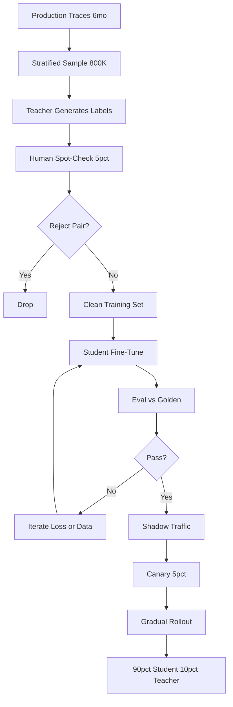

# 案例研究：客户专属蒸馏流水线

本页保留英文原文的章节层级、列表、表格、代码、公式、链接和面试问答，并提供对应的中文说明。

一家 B 轮 AI 产品通过使用 6 个月生产轨迹蒸馏 7B 学生模型，将前沿模型支出从每月 5 万美元降至 4000～6000 美元，回本期 3 个月，每 4～6 个月重新蒸馏一次。

## 业务问题

一个规模化 AI 产品（每月约 800 万用户请求）运行在前沿模型上。2026 年初成本超过每月 5 万美元，环比增长 18%，财务要求制定方案。团队发现约 90% 的生产流量属于少数重复任务模式（意图分类、结构化抽取、文档摘要和三类分流）。这些任务不需要前沿模型；在前沿模型自身输出上微调更小的模型，就能以极低成本提供服务。

2026 年 5 月的现实约束：

- 每月 5 万美元的前沿模型支出，且仍在增长
- 延迟预算：高流量任务 p95 低于 350ms
- 质量标准：客户黄金集上的回归低于 2%
- 合规：客户数据不得离开指定云区域
- 人员：1 名 ML 工程师加兼职平台支持

模型蒸馏模式已经成熟：DistilBERT（[Sanh 等，2019](https://arxiv.org/abs/1910.01108)）、TinyBERT、Alpaca 风格指令蒸馏（[Taori 等，2023](https://github.com/tatsu-lab/stanford_alpaca)）以及近期的思维链蒸馏工作（[Hsieh 等，2023](https://arxiv.org/abs/2305.02301)）都表明，在聚焦任务上，7B～13B 学生模型可以恢复教师模型 92%～98% 的表现。前沿实验室的 FDE 团队（Anthropic Field Engineering、OpenAI Solutions）也在会议演讲中公开讲解过预算计算，下面的数字与这些团队对客户引用的数字一致。

## 架构

```mermaid
flowchart LR
    subgraph Collect["Trace Collection"]
        PROD[Production Traffic] --> TRACES[Trace Store]
        TRACES --> SAMPLER[Stratified Sampler]
        SAMPLER --> CURATE[Curation Queue]
    end

    subgraph Label["Labeling"]
        CURATE --> TEACHER[Teacher Frontier Model]
        TEACHER --> LABELS[Distillation Pairs]
        LABELS --> HUMAN[Human Spot-Check]
        HUMAN --> CLEAN[Clean Pairs]
    end

    subgraph Train["Distillation"]
        CLEAN --> FT[Student Fine-Tune 8x H100]
        FT --> EVAL[Eval Suite]
        EVAL --> CANARY[Canary Cohort]
    end

    subgraph Serve["Serving"]
        CANARY --> SHADOW[Shadow Traffic]
        SHADOW --> ROLLOUT[Gradual Rollout]
        ROLLOUT --> STUDENT[Student Model Serving]
    end
```

### 组件

| 层 | 技术 | 用途 |
|-------|------|---------|
| 教师 | 前沿模型（Claude Opus 4.7 或同等模型） | 标签来源 |
| 学生 | Llama 4 7B int4 或 Qwen 3.6 7B | 生产服务 |
| 轨迹存储 | S3 + Langfuse | 抽样和重放 |
| 训练器 | 8 个 H100 上的 DeepSpeed + FSDP | 一周训练运行 |
| 评测 | 每任务黄金集，出现回归时通知值班人员 | 质量闸门 |
| 服务 | 带 FP8 的 vLLM | p95 350ms |

### 数据流

1. 六个月的生产轨迹累积在 Langfuse 和 S3 中。
2. 抽样器按任务类别分层抽样，并重新平衡以确保低频类别有代表性。
3. 教师模型（前沿模型）为每个样本生成目标输出；如果任务适合推理蒸馏，通常也会生成思维链推理轨迹。
4. 领域专家对 5% 样本做人工抽查，捕获教师错误；我们执行拒绝采样，只保留人工审核员与教师意见一致的样本对。
5. 学生模型在 8 个 H100 上微调约 1 周（计算成本约 $22K），生成一个 7B 模型。
6. 模型通过每任务评测后，与生产流量影子运行 2 周，再在 3 周内逐步发布到 5%、20%、50%、90%，并将自动回滚接入实时质量指标。

## 关键设计决策

### 1. Distill on real production traces, not synthetic data

人们很容易用 LLM 生成合成 Prompt，再由教师模型标注。我们尝试过这种方式，但得到的模型只擅长合成 Prompt，在真实流量上下降 4～7 分。生产轨迹能捕获真正重要的分布偏移、异常和尾部案例。我们收集 6 个月轨迹，按任务类别分层抽样，并使用真实 Prompt 作为蒸馏来源，这与前沿实验室 FDE 团队的实践建议一致。

### 2. Reject-sample with human spot-check

教师错误会传播给学生模型。如果使用教师的每一个输出训练，92% 的教师精确率可能变成学生 90% 的精确率。我们对教师标签的随机样本做 5% 人工抽查，人工不同意的样本对直接拒绝。这能捕获约 4% 的标签，并使学生模型在综合指标上的最终质量提升 2～4 分。每次重新蒸馏的人工标注成本约 $1800，另加计算成本。

### 3. Chain-of-thought distillation where it pays

对于推理密集任务（本案例中的分诊类别），我们采用 Hsieh 等人的[带理由蒸馏](https://arxiv.org/abs/2305.02301)方法：教师同时输出答案和推理轨迹，学生也训练为同时输出二者。这样能赋予学生模型仅靠输入输出样本无法形成的结构化思考能力。分类或抽取任务不使用该方法，因为没有收益且会增加延迟。

### 4. Eval-set construction with human labeling

我们的评测集与训练集分开整理，包含高流量任务类别中的 1800 个案例，由 3 名领域专家以多数票标注。我们每季度重新标注 200 个案例，以跟踪分布漂移。评测集是 Canary 发布的闸门信号；综合指标回归 2 分就阻止生产部署。训练数据抽样时绝不查看评测集样本。

### 5. Canary rollout and shadow traffic

即使评测通过，生产环境仍可能存在评测集漏掉的尾部行为。我们的发布流程是：

- 第 1 周：仅影子流量，不影响用户。对 100% 流量比较学生与教师输出，由差异分类器标记分歧并交人工复核。
- 第 2 周：5% 真实流量。满足以下任一条件就自动回滚：(a) 延迟 p95 超过 500ms；(b) 实时用户点赞率下降超过 1 分；(c) 某领域防护栏触发率升高。
- 第 3 周：20% 流量，使用相同防护栏。
- 第 4 周：50% 流量。
- 第 5 周：90% 流量。永久保留 10% 流量路由到教师模型，用于持续收集轨迹和重新蒸馏。

过去一年，这种保守的逐步放量捕获了两次评测集未发现的回归。

### 6. Re-distillation cadence

世界会发生漂移。新产品功能改变任务分布，用户形成新行为，教师模型也会随新版本改进。我们每 4～6 个月重新蒸馏一次。流水线部分自动化：轨迹抽样、教师标注和训练通过脚本完成；人工抽查和评测复核仍需要人。每次重新蒸馏全包成本约 $26K（$22K 计算、$1800 标注及额外开销），耗时 4～6 周。

### 7. 不适合蒸馏的情况

蒸馏并不总是正确选择，以下信号说明不适合使用：

- 流量较低（每月低于 20 万请求），无法实现回本。
- 任务变化高度频繁。如果每个请求都独一无二，学生无法学到有用分布。
- 教师模型本身不稳定或变化太快。对移动目标反复蒸馏会浪费精力。
- 质量标准极严（要求超过 99% 忠实度）。蒸馏差距是真实存在的，不能接受时就继续使用教师模型。

我们使用一个快速筛选启发式条件：至少 60% 流量属于不超过 5 种任务模式，且这些任务的月度支出超过 $20K。两项都不满足时放弃蒸馏。

### 8. 量化选择

我们以 int4 提供 7B 学生模型服务（通过 vLLM 使用 GPTQ，并采用 FP8 KV Cache）。相比 FP16，int4 大约节省 4 倍内存，在 H100 上吞吐量提升约 2.3 倍。我们测得综合准确率下降 0.4 分，完全在容忍范围内。我们还考虑过 int8（损失更小但加速也更小）和 FP8（生态不够成熟），最终 int4 的单请求成本最低。

### 9. 训练数据的隐私考量

生产轨迹按定义包含用户 PII。训练前我们执行脱敏流程：微调后的 NER 模型标记 PII 片段，并替换为类别 Token（`[EMAIL]`、`[PERSON_NAME]`）。学生模型学习结构模式，而不会记忆具体身份。脱敏模型本身在带标签样本上评测，精确率超过 98%，召回率超过 95%。

## 成本与回本

| 项目 | 金额 |
|-----------|--------|
| 轨迹收集（6 个月） | 已包含在可观测性支出中 |
| 教师标注（约 80 万对） | 一次性 $42K |
| 人工抽查 | 一次性 $8K |
| 计算（8 个 H100 运行 1 周，加重试） | 一次性 $32K |
| 评测集整理 | 一次性 $14K |
| 平台工程（额外开销） | 一次性 $24K |
| **前期合计** | **$120K** |

| 月度运行成本 | 之前 | 之后 |
|------------------|--------|-------|
| 前沿模型（10% 流量，加重新蒸馏 Harness） | $50K | $5K |
| 学生模型服务（专用 H100 上的 vLLM） | $0 | $1200 |
| **月度合计** | **$50K** | **$6.2K** |

每月节省约 $44K。回本期为 120K / 44K，约 2.7 个月；对财务部门取整为“3 个月回本”。

重新蒸馏平均每 5 个月花费 $26K，我们从同一节省项中摊销。年度净节省约 $470K。

## 蒸馏流水线

## 失败模式与缓解措施

### F1：教师模型升级使学生模型过时

前沿模型供应商发布新一代模型，教师质量跃升，学生模型相对于市场其他产品无法满足用户预期。缓解措施是每月监控教师与学生的对比评测；差距超过 4 分时提前重新蒸馏。针对更强教师重新蒸馏很直接，流水线不变。

### F2：训练与服务之间的分布偏移

新产品功能可能在一夜之间改变用户行为（通知活动带来异常查询，新价格层改变用户类型），使学生训练分布不再匹配生产环境。缓解措施是在线漂移监控器检测输入嵌入分布是否超过阈值；结构性漂移触发紧急重新蒸馏，暂时性漂移则将受影响流量路由到教师模型。

### F3：教师幻觉被固化到学生模型

教师偶尔会产生幻觉；拒绝采样能捕获大多数但不是全部错误。由于这种模式进入训练分布，学生模型可能更自信地出现幻觉。缓解措施是在评测集上做忠实度检查；幻觉率相对基线增长就重新清洗训练数据。

### F4：过度路由到教师模型导致成本回归

随着工程师为各种边界情况增加回退逻辑，10% 的教师回退比例逐渐上升。缓解措施是为教师支出设置预算告警；每季度审计回退路由；每条回退规则都必须有理由和到期时间。

### F5：Canary 发布漏掉尾部回归

评测集和影子流量都正常，但 5% 真实流量暴露了伤害某个客户群体的回归。缓解措施是对真实流量按分群计算质量指标，并支持按分群自动回滚；分群维度包括客户等级、语言和任务类别。

### F6：合规违规——训练数据驻留

客户合同要求数据驻留在指定区域，而默认训练计算位于其他区域。缓解措施是维护区域本地训练容量，将每个客户的训练数据绑定到其区域，绝不把原始轨迹复制到区域外。编排器会拒绝启动违反驻留要求的任务。

### F7：罕见任务上的灾难性遗忘

学生模型忘记了训练中只见过两次的类别。缓解措施是分层抽样保证罕见类别的最低覆盖；评测套件明确包含罕见类别案例；Canary 发布按类别单独监控质量。

### F8：教师与学生之间的成本跟踪失败

部分查询在影子阶段同时路由到学生和教师；如果不明确区分，成本核算会重复计费。缓解措施是为每次调用添加成本标签（影子、主路由、回退），并生成每日对账报告捕获错误标记的流量。

## 运维考虑

### Monitoring

| SLO | 目标 |
|-----|--------|
| 学生模型 p95 延迟 | 低于 350ms |
| 相对教师的质量差异（校正后） | 2 分以内 |
| 教师回退率 | 目标 10%，超过 15% 告警 |
| 每 1000 请求成本 | 低于蒸馏前的 30% |
| 重新蒸馏周期 | 每 4～6 个月 |

### Cost model

月度稳定状态成本：$6.2K 服务成本，加上摊销后的重新蒸馏成本（每月 $5.2K）。与只使用教师模型的 $50K 相比，完全摊销后每月节省约 $38K，年度净节省约 $456K。

### On-call playbook

- 质量回归告警：用人工重放评测集确认；若是真实回归，将受影响分群路由到教师模型直到下一训练周期，并创建高优先级工单。
- 成本超支：检查回退路由；如果流量模式发生变化，安排重新蒸馏，必要时限流。
- 延迟尖峰：检查 GPU 利用率；如果存在噪声邻居，隔离学生模型节点。
- 漂移告警：检查输入嵌入直方图；漂移大且持续时触发紧急重新蒸馏。
- 评测集泄露：如果在训练数据中发现留出评测案例，立即废弃该案例并执行去重；在本季度内刷新评测集。

### Comparative eval cadence

每月运行一次对比评测：抽取 500 个案例比较学生与教师，由 LLM-as-judge 评分，并另取 50 个案例人工评审。结果以一个仪表盘卡片呈现，由 AI 团队负责。差距扩大是需要重新蒸馏的早期预警。

### Re-distillation ritual

安排重新蒸馏后，我们遵循 4 周流程：第 1 周抽取新轨迹并用当前教师标注；第 2 周训练和评测；第 3 周影子流量；第 4 周逐步发布。完整流程有检查清单，由 ML 工程师独立执行，平台团队支持逐步放量阶段。

### Customer-facing communication

当我们把客户流量切换到蒸馏后的学生模型时，会向客户说明。面向客户的措辞是：“您的高流量查询现在由基于贵方流量微调的模型处理，该模型针对延迟和成本进行了优化。季度报告中的评测证据表明，质量与前沿基线相差不超过 2 分。”只要质量保持，大多数客户并不在意；少数金融服务和医疗客户要求明确签字同意，在他们主动选择前，我们会把这些查询路由到教师模型。

## 优秀面试候选人应覆盖的内容

- 明确计算预算并提前讨论：前期成本、回本期和持续重新蒸馏成本。
- 能说出蒸馏论文名称（DistilBERT、Alpaca、带理由蒸馏），并正确使用“学生”“教师”“拒绝采样”等术语。
- 解释生产轨迹为何优于合成数据，以及教师标签人工抽查为何重要。
- 用具体百分比和自动回滚闸门讲清 Canary 发布，并指出仅影子流量无法发现的回归类型。
- 说明蒸馏在哪些地方**没有帮助**，证明自己做过实践而非只读过资料。
- 处理教师升级场景：前沿模型变强后，学生差距扩大，重新蒸馏就是解决方案。
- 将隐私工作（训练数据中的 PII 脱敏）作为流水线的一部分，而不是事后补丁。

## 参考资料

- Sanh et al., [DistilBERT, a distilled version of BERT](https://arxiv.org/abs/1910.01108)
- Hinton et al., [Distilling the Knowledge in a Neural Network](https://arxiv.org/abs/1503.02531)
- Taori et al., [Stanford Alpaca: An Instruction-following LLaMA model](https://github.com/tatsu-lab/stanford_alpaca)
- Hsieh et al., [Distilling Step-by-Step](https://arxiv.org/abs/2305.02301)
- Jiao et al., [TinyBERT: Distilling BERT for Natural Language Understanding](https://arxiv.org/abs/1909.10351)
- Anthropic, [On distillation patterns](https://www.anthropic.com/research)
- OpenAI, [Distillation in the platform](https://platform.openai.com/docs/guides/distillation)
- [vLLM FP8 inference](https://docs.vllm.ai/en/latest/quantization/fp8.html)
- [Langfuse trace sampling](https://langfuse.com/docs/observability/sampling)
- Hamel Husain, [Field guide to rapidly improving AI products](https://hamel.dev/blog/posts/field-guide/)
- [DeepSpeed for training](https://www.deepspeed.ai/training/)
- [Together AI distillation case study](https://www.together.ai/blog/distillation)

相关章节：[微调与蒸馏](../03-training-and-adaptation/05-knowledge-distillation.md)、[推理优化](../04-inference-optimization/01-inference-fundamentals.md)、[成本管理](../04-inference-optimization/07-cost-optimization-playbook.md)。
