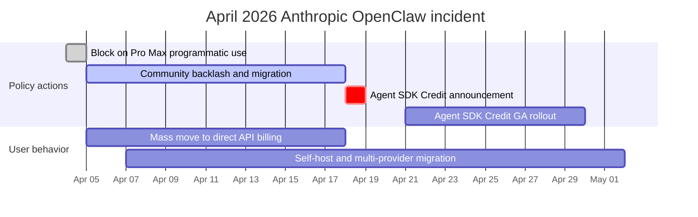

# OpenClaw 深入解析：开源个人 AI Agent

本页保留英文原文的章节层级、列表、表格、代码、公式、链接和面试问答，并提供对应的中文说明。

OpenClaw 是一个**开源、自托管的个人 AI Agent**，通过 LLM 执行任务，并把消息平台作为主要交互入口。你可以通过 WhatsApp、Telegram、Slack、Discord 或 Signal 与它对话，它会执行 Shell 命令、控制浏览器、管理日历、处理邮件并编排多步工作流。

## 目录

- [OpenClaw 是什么](#what-is-openclaw)
- [历史：从 Clawdbot 到 Moltbot 再到 OpenClaw](#history)
- [架构深入分析](#architecture)
- [AgentSkills 系统](#agentskills)
- [LLM 供应商配置](#llm-providers)
- [消息平台集成](#messaging-integrations)
- [安全模型](#security-model)
- [部署模式](#deployment-patterns)
- [性能优化与扩展](#performance)
- [真实使用案例](#use-cases)
- [局限与不应使用 OpenClaw 的场景](#limitations)
- [与替代方案比较](#comparison)
- [快速开始指南](#getting-started)
- [系统设计面试角度](#system-design-interview)
- [参考资料](#references)

---

## OpenClaw 是什么

OpenClaw 具备以下特点：

- **个人 AI Agent**：不是聊天机器人，而是代表你行动的自主 Agent
- **自托管**：运行在你的电脑、VPS 或 Raspberry Pi 上，数据由你控制
- **消息原生**：驻留在你已经使用的聊天应用中（WhatsApp、Telegram、Slack、Discord、Signal、iMessage 等 20 多个平台）
- **与 LLM 无关**：可使用 Claude、GPT-4、Gemini、DeepSeek 或本地模型
- **可通过 Skill 扩展**：预配置超过 100 个 Skill，并提供简单格式来编写自定义 Skill
- **开源**：采用 MIT 许可证，截至 2026 年初获得超过 25 万个 GitHub Star

```
# The simplest way to start
git clone https://github.com/openclaw/openclaw.git
cd openclaw
docker compose up -d

# Or via npm
npm install -g openclaw
openclaw start
```

**与聊天机器人的关键区别：**
- ChatGPT/Claude.ai：你输入内容，它用文本回复
- OpenClaw：你输入内容，它会**执行动作**——运行命令、编辑文件、发送邮件、控制智能家居设备、管理日历

---

## 历史

### 命名时间线

| 日期 | 名称 | 事件 |
|------|------|-------|
| 2025 年 11 月 | **Clawdbot** | Peter Steinberger 发布第一个原型，约用一小时构建 |
| 2026 年 1 月 | 2000 Star | 早期使用者发现该项目 |
| 2026 年 1 月 27 日 | **Moltbot** | 因 Anthropic 商标投诉改名（保留龙虾主题） |
| 2026 年 1 月 30 日 | **OpenClaw** | 再次改名，Steinberger 认为 “Moltbot” 不好读 |
| 2026 年 2 月 | 超过 14.5 万 Star | 爆发式增长，超过许多成熟开源项目 |
| 2026 年 2 月 14 日 | -- | Steinberger 加入 OpenAI，理由是需要更多资源来扩展项目 |
| 2026 年 3 月 | 超过 25 万 Star | 在 GitHub 上超过 React，成为历史上增长最快的 OSS 项目之一 |

### 创建者

Peter Steinberger 是一名奥地利软件工程师，曾花 13 年打造 PSPDFKit——全球开发者使用的 PDF 工具包，并于 2024 年出售公司。他称自己是“氛围编程者”，还曾说自己发布并不阅读的代码；这体现了一种新的 AI 优先开发理念：人提供意图，AI 提供实现。

### 为什么走红

OpenClaw 引发共鸣，是因为它解决了一个真实问题：LLM 很强大，却没有状态，每次对话都从零开始。OpenClaw 为 LLM 提供了**持久性**（跨会话记忆）、**行动能力**（不只是说话，还能执行动作）和**触达能力**（集成你已经使用的应用）。它自托管且开源，任何人都可以运行它，不必把数据交给第三方服务。

---

## 架构

### 高层概览

```
                         OPENCLAW ARCHITECTURE
 ============================================================

  Messaging Platforms              OpenClaw Gateway           LLM Providers
 ┌──────────────┐              ┌─────────────────────┐     ┌──────────────┐
 │  WhatsApp    │──┐           │                     │     │  Anthropic   │
 │  (Baileys)   │  │           │   GATEWAY            │     │  (Claude)    │
 ├──────────────┤  │  Channel  │   ┌──────────────┐  │     ├──────────────┤
 │  Telegram    │──┼──Adapters─┼──>│  Router      │  │     │  OpenAI      │
 │  (grammY)    │  │           │   │  (sessions,  │  │     │  (GPT-4)     │
 ├──────────────┤  │           │   │   bindings)  │  │     ├──────────────┤
 │  Slack       │──┤           │   └──────┬───────┘  │     │  Google      │
 │  (Bolt)      │  │           │          │          │     │  (Gemini)    │
 ├──────────────┤  │           │   ┌──────▼───────┐  │     ├──────────────┤
 │  Discord     │──┤           │   │ Agent Runtime│──┼────>│  DeepSeek    │
 │  (discord.js)│  │           │   │ (AI loop,    │  │     ├──────────────┤
 ├──────────────┤  │           │   │  tool calls, │  │     │  Local/      │
 │  Signal      │──┤           │   │  memory)     │  │     │  Ollama      │
 │  (signal-cli)│  │           │   └──────┬───────┘  │     └──────────────┘
 ├──────────────┤  │           │          │          │
 │  iMessage    │──┤           │   ┌──────▼───────┐  │     Tools & Skills
 │  (BlueBubbles│  │           │   │  Tool Layer  │  │     ┌──────────────┐
 ├──────────────┤  │           │   │  (skills,    │──┼────>│  Shell exec  │
 │  Teams       │──┘           │   │   browser,   │  │     │  Browser     │
 │  IRC, Matrix │              │   │   files,     │  │     │  File I/O    │
 │  20+ more... │              │   │   cron)      │  │     │  Calendar    │
 └──────────────┘              │   └──────────────┘  │     │  Email       │
                               │                     │     │  100+ more   │
                               │   ┌──────────────┐  │     └──────────────┘
                               │   │  Memory &    │  │
                               │   │  State       │  │     Storage
                               │   │  (sessions,  │──┼────>┌──────────────┐
                               │   │   workspace) │  │     │  ~/.openclaw/│
                               │   └──────────────┘  │     │  (state,     │
                               └─────────────────────┘     │   memory,    │
                                                           │   config)    │
                                localhost:18789             └──────────────┘
```

### 核心组件

**1. Gateway**

Gateway 是一个长期运行的 WebSocket 服务（默认地址：`localhost:18789`），是会话、路由和渠道连接的唯一事实来源。它负责：

- 通过渠道 Adapter 接收所有消息平台的连接
- 将消息路由到正确的 Agent
- 管理会话并持久化状态
- 认证和访问控制
- 热加载配置变更

**2. 渠道 Adapter**

消息从任意平台到达时，渠道 Adapter 会把它规范化为统一的内部格式。每个 Adapter 封装一个平台专用库：

| 平台 | Adapter 库 | 协议 |
|----------|----------------|----------|
| WhatsApp | Baileys | WebSocket (unofficial) |
| Telegram | grammY | Bot API |
| Slack | Bolt | Events API |
| Discord | discord.js | Gateway API |
| Signal | signal-cli | D-Bus |
| iMessage | BlueBubbles | REST API |
| IRC | irc-framework | IRC protocol |
| Matrix | matrix-js-sdk | Matrix protocol |
| Microsoft Teams | Bot Framework | REST API |

**3. Agent Runtime**

Agent Runtime 是 AI 循环。对于每条输入消息，它会：

1. 从会话历史、工作区记忆和相关 Skill 组装上下文
2. 将组装后的 Prompt 发送给配置的 LLM
3. 接收模型发出的工具调用
4. 使用系统能力执行工具调用
5. 将结果返回给模型进行下一轮迭代
6. 持久化更新后的状态（记忆、文件、会话历史）

**4. 多 Agent 路由**

OpenClaw 支持在一个 Gateway 进程中运行多个 Agent。每个 Agent 都有自己的工作区、agentDir、会话和工具配置。输入消息通过绑定关系路由到不同 Agent：

```json
{
  "agents": {
    "list": [
      {
        "name": "work-assistant",
        "agentDir": "./agents/work",
        "channels": ["slack-work"]
      },
      {
        "name": "home-assistant",
        "agentDir": "./agents/home",
        "channels": ["whatsapp-personal", "telegram"]
      },
      {
        "name": "devops-bot",
        "agentDir": "./agents/devops",
        "channels": ["discord-infra"]
      }
    ]
  }
}
```

这意味着你可以在 Slack 上运行工作助手，在 WhatsApp 上运行个人助手，在 Discord 上运行 DevOps Bot；它们都来自同一个 Gateway，但拥有完全隔离的记忆和权限。

---

## AgentSkills 系统

### Skill 的工作方式

Skill 是 OpenClaw 获得基础对话之外能力的机制。每个 Skill 都是一个目录，其中包含带 YAML frontmatter（元数据）和 Markdown 指令（行为）的 `SKILL.md` 文件。

```
~/.openclaw/skills/
  weather/
    SKILL.md           # Required: metadata + instructions
    scripts/
      fetch_weather.py # Optional: executable scripts
    references/
      api_docs.md      # Optional: supplementary docs

  email-manager/
    SKILL.md
    scripts/
      process_inbox.py
```

### SKILL.md 格式

```yaml
---
name: weather-lookup
description: >
  Fetch current weather and forecasts for any location.
  Responds to queries about temperature, rain, and conditions.
triggers:
  - weather
  - temperature
  - forecast
  - "is it going to rain"
tools:
  - web_search
  - bash
---

# Weather Lookup Skill

When the user asks about weather:

1. Use the web_search tool to find current conditions
2. Extract temperature, humidity, wind, and forecast
3. Present in a concise, readable format
4. Include both metric and imperial units

## Example Response Format

"Currently 72F (22C) and partly cloudy in San Francisco.
Forecast: Clear skies through Thursday, rain expected Friday."
```

### Skill 解析顺序

Skill 可以位于多个位置。名称冲突时，距离当前工作区最近的副本优先：

```
Priority (highest first):
  1. <workspace>/skills/        # Project-specific skills
  2. ~/.openclaw/skills/        # User-global skills
  3. <installed-packages>/      # npm-installed skills
  4. <bundled>/skills/          # Ships with OpenClaw
```

### 选择性注入

OpenClaw **不会**把所有 Skill 注入每个 Prompt。Runtime 会依据 Skill 描述和触发关键词，只选择与当前轮次相关的 Skill 注入，从而避免 Prompt 膨胀并保持模型性能。

### 创建自定义 Skill

```bash
# Create the skill directory
mkdir -p ~/.openclaw/skills/deploy-checker
cd ~/.openclaw/skills/deploy-checker

# Create the SKILL.md
cat > SKILL.md << 'EOF'
---
name: deploy-checker
description: >
  Monitor deployment status across staging and production.
  Checks health endpoints, recent commits, and CI status.
triggers:
  - deploy
  - deployment
  - "is staging up"
  - "prod status"
tools:
  - bash
  - web_search
---

# Deploy Checker

When asked about deployment status:

1. Run `curl -s https://staging.myapp.com/health` to check staging
2. Run `curl -s https://myapp.com/health` to check production
3. Check recent git log: `git log --oneline -5`
4. Report status in a clear format

## Response Format

Staging: [UP/DOWN] - version X.Y.Z - deployed 2h ago
Production: [UP/DOWN] - version X.Y.Z - deployed 1d ago
Last 3 commits: ...
EOF
```

### 社区 Skill 生态

OpenClaw Skill 生态增长很快，社区维护的集合覆盖 DevOps、家庭自动化、内容创作、数据分析等类别，包含数千个 Skill。但开放性也带来风险：安装前一定要审查第三方 Skill，早期目录曾出现恶意脚本事件。

---

## LLM 供应商配置

### 配置文件

OpenClaw 从 `~/.openclaw/openclaw.json` 读取配置（JSON5 格式，允许注释和尾随逗号）。Gateway 监视该文件，并通过热加载自动应用变更。

```json5
{
  // Model provider configuration
  "models": {
    "providers": {
      "anthropic": {
        "baseUrl": "https://api.anthropic.com",
        "apiKey": "${ANTHROPIC_API_KEY}",  // env var substitution
        "models": {
          "claude-sonnet-4": {
            "maxTokens": 8192
          }
        }
      },
      "openai": {
        "baseUrl": "https://api.openai.com/v1",
        "apiKey": "${OPENAI_API_KEY}",
        "models": {
          "gpt-4o": {
            "maxTokens": 4096
          }
        }
      },
      "custom-deepseek": {
        "api": "openai",  // OpenAI-compatible API
        "baseUrl": "https://api.deepseek.com/v1",
        "apiKey": "${DEEPSEEK_API_KEY}",
        "models": {
          "deepseek-chat": {
            "maxTokens": 4096
          }
        }
      },
      "local-ollama": {
        "api": "openai",
        "baseUrl": "http://localhost:11434/v1",
        "apiKey": "ollama",  // Ollama accepts any key
        "models": {
          "llama3.1:70b": {
            "maxTokens": 2048
          }
        }
      }
    }
  },

  // Default agent model
  "agents": {
    "defaults": {
      "model": "anthropic/claude-sonnet-4"
    }
  }
}
```

### 供应商选择策略

| 供应商 | 最适合 | 权衡 |
|----------|----------|------------|
| Anthropic（Claude） | 复杂推理、编码任务、长上下文 | 成本更高，质量最佳 |
| OpenAI（GPT-4o） | 通用任务、快速响应 | 速度和质量平衡好 |
| Google（Gemini） | 预算敏感的测试、慷慨的免费额度 | 推理质量较低 |
| DeepSeek | 最便宜的前沿级选项（2026 年 5 月 22 日永久折扣后，V4 Flash 为 $0.14/$0.28 每百万 Token，V4 Pro 为 $0.435/$0.87）；支持 1M 上下文，适合高流量、易缓存负载 | 可用性不稳定；开放权重也可自托管 |
| 本地（Ollama） | 隐私关键、离线使用 | 需要强大硬件，质量较低 |

### OpenClaw 内部的模型路由

你可以为不同 Agent 配置不同模型，以优化成本：

```json5
{
  "agents": {
    "defaults": {
      "model": "openai/gpt-4o-mini"  // Cheap default
    },
    "list": [
      {
        "name": "coding-agent",
        "model": "anthropic/claude-sonnet-4"  // Premium for code
      },
      {
        "name": "reminder-bot",
        "model": "google/gemini-2.0-flash"  // Cheap for simple tasks
      }
    ]
  }
}
```

---

## 消息平台集成

OpenClaw 通过渠道 Adapter 架构支持 20 多个消息平台：

### 支持的平台

| 平台 | 库 | 状态 | 说明 |
|----------|---------|--------|-------|
| WhatsApp | Baileys | 稳定 | 非官方 API，需要个人账号 |
| Telegram | grammY | 稳定 | 官方 Bot API，最可靠的渠道 |
| Slack | Bolt | 稳定 | 需要安装工作区应用 |
| Discord | discord.js | 稳定 | 需要 Bot Token |
| Signal | signal-cli | 稳定 | 需要关联设备 |
| iMessage | BlueBubbles | 稳定 | 仅 macOS，需要 BlueBubbles 服务 |
| Google Chat | Chat API | 稳定 | 需要工作区管理员批准 |
| Microsoft Teams | Bot Framework | Beta | 2026 年第二季度完整发布 |
| IRC | irc-framework | 稳定 | 支持经典协议 |
| Matrix | matrix-js-sdk | 稳定 | 联邦式，适合自托管 |
| Mattermost | API | 稳定 | 自托管的 Slack 替代品 |
| LINE | Messaging API | 稳定 | 日本/东南亚常用 |
| 飞书（Lark） | Open API | 稳定 | 中国常用 |
| Twitch | TMI.js | 稳定 | 仅聊天 |
| 微信 | -- | Beta | 需要自定义桥接 |
| Nostr | -- | Beta | 去中心化协议 |
| WebChat | 内置 | 稳定 | 基于浏览器的回退渠道 |

### 跨渠道统一上下文

一个关键架构决策是：Gateway 在所有渠道之间维护**统一记忆系统**。你在 WhatsApp 告诉 Agent 的事情，切换到 Slack 后它仍然记得。这使 AI Agent 无论通过哪个应用接收消息，都拥有一致上下文。

```
          WhatsApp ──┐
          Telegram ──┤     ┌─────────────────────┐
          Slack    ──┼────>│  Shared Memory Pool  │
          Discord  ──┤     │  (per-agent, cross-  │
          Signal   ──┘     │   channel sessions)  │
                           └─────────────────────┘
```

---

## 安全模型

### 安全理念

OpenClaw 的安全模型假设威胁模型是“个人助手”：一个可信操作员，可能拥有多个 Agent。优先级如下：

1. **身份优先**：谁可以与 Bot 对话？
2. **范围其次**：Bot 被允许在哪些地方行动？
3. **模型最后**：假设模型可能被操纵，限制爆炸半径

### 权限层

```
 Layer 1: Channel Authentication
 ─────────────────────────────────
 Who can message the bot?
 Configured per-channel with allowlists.

 Layer 2: Agent Tool Allow/Deny
 ─────────────────────────────────
 Which tools can this agent use?
 Configured per-agent in agents.list[].tools.

 Layer 3: Sandbox Tool Policy
 ─────────────────────────────────
 Separate from agent permissions.
 Even if agent allows a tool, sandbox may block it.

 Layer 4: Elevated Access
 ─────────────────────────────────
 Some tools require host-level access.
 Gated per-channel and per-user with allowFrom lists.
```

### Sandbox 隔离

对于非主会话（子 Agent、Cron 任务、隔离任务），OpenClaw 支持 Docker Sandbox 隔离：

```yaml
# docker-compose.sandbox.yml
services:
  openclaw-sandbox:
    image: openclaw/sandbox:latest
    network_mode: "none"        # No network access
    read_only: true             # Read-only root filesystem
    volumes:
      - ./workspace:/workspace  # Restricted workspace only
    security_opt:
      - no-new-privileges:true
```

设置 `network: "none"` 后，Sandbox 中的子 Agent 无法发出外部请求、外泄数据或访问外部服务，即使它正在运行恶意代码也一样。

### 关键安全警告

**默认信任 localhost**：默认情况下，OpenClaw 无需认证就信任来自 localhost 的连接。如果 Gateway 位于配置不当的反向代理之后，且代理把所有请求转发到 localhost，外部攻击者就能获得完整访问权限。远程部署必须配置认证。

**Skill 供应链**：社区 Skill 目录曾出现恶意包。安装前始终审查第三方 Skill，固定 Skill 版本，并对不可信 Skill 使用 Sandbox。

### 加固检查清单

```
[x] Set state directory permissions to 700
[x] Configure channel allowlists (do not leave open)
[x] Enable sandbox for sub-agents and cron jobs
[x] Use environment variables for API keys, never hardcode
[x] Put Gateway behind authenticated reverse proxy for remote access
[x] Review all third-party skills before installation
[x] Set up monitoring for unusual tool invocations
[x] Restrict elevated tool access to specific users
[x] Run Gateway as non-root user
[x] Enable TLS for WebSocket connections
```

---

## 部署模式

### 方案 1：本地开发（最快开始）

```bash
# Clone and run
git clone https://github.com/openclaw/openclaw.git
cd openclaw
cp .env.example .env
# Edit .env: add ANTHROPIC_API_KEY or OPENAI_API_KEY

npm install
npm start
```

**要求**：Node.js 20+、512MB RAM，任意操作系统。

### 方案 2：Docker（生产推荐）

```yaml
# docker-compose.yml
version: "3.8"
services:
  openclaw:
    image: openclaw/openclaw:latest
    container_name: openclaw-gateway
    restart: unless-stopped
    ports:
      - "18789:18789"
    volumes:
      - ./state:/app/state         # Persistent state
      - ./openclaw.json:/app/openclaw.json  # Configuration
    environment:
      - ANTHROPIC_API_KEY=${ANTHROPIC_API_KEY}
      - OPENAI_API_KEY=${OPENAI_API_KEY}
    mem_limit: 2g
    logging:
      driver: json-file
      options:
        max-size: "10m"
        max-file: "3"
```

```bash
docker compose up -d
docker logs -f openclaw-gateway  # Watch logs
```

### 方案 3：云 VPS（常驻运行）

OpenClaw 很轻量，拥有 512MB RAM 和 1 个 CPU 核心的机器就足够；每月 $4～6 的 VPS 即可运行。

**快速部署选项：**
- **DigitalOcean**：内置安全加固的一键应用
- **Railway**：从 GitHub README 一键部署（约 5 分钟）
- **Contabo**：VPS 方案提供免费一键 OpenClaw 插件
- **AWS Lightsail**：每月 $3.50 的实例即可轻松运行
- **Raspberry Pi**：4GB RAM 的 Pi 4 运行良好

### 生产架构

```
                    PRODUCTION DEPLOYMENT
 ====================================================

  Internet
     │
     ▼
 ┌───────────────┐
 │  Cloudflare   │     SSL termination
 │  (CDN/WAF)    │     DDoS protection
 └───────┬───────┘
         │
         ▼
 ┌───────────────┐
 │  Nginx        │     Reverse proxy
 │  (with auth)  │     Rate limiting
 └───────┬───────┘     WebSocket upgrade
         │
         ▼
 ┌───────────────────────────────────────┐
 │  Docker                              │
 │  ┌─────────────────────────────────┐ │
 │  │  openclaw-gateway               │ │
 │  │  (main process)                 │ │
 │  └────────────┬────────────────────┘ │
 │               │                      │
 │  ┌────────────▼────────────────────┐ │
 │  │  openclaw-sandbox               │ │
 │  │  (isolated sub-agents)          │ │
 │  │  network: none                  │ │
 │  └─────────────────────────────────┘ │
 │                                      │
 │  Volume: ./state (700 permissions)   │
 └──────────────────────────────────────┘
         │
         ▼
    LLM APIs
    (Anthropic, OpenAI, etc.)
```

### 远程访问的 Nginx 配置

```nginx
# /etc/nginx/sites-available/openclaw
server {
    listen 443 ssl http2;
    server_name openclaw.yourdomain.com;

    ssl_certificate /etc/letsencrypt/live/openclaw.yourdomain.com/fullchain.pem;
    ssl_certificate_key /etc/letsencrypt/live/openclaw.yourdomain.com/privkey.pem;

    location / {
        proxy_pass http://127.0.0.1:18789;
        proxy_http_version 1.1;
        proxy_set_header Upgrade $http_upgrade;
        proxy_set_header Connection "upgrade";
        proxy_set_header Host $host;
        proxy_set_header X-Real-IP $remote_addr;

        # Basic auth for web interface
        auth_basic "OpenClaw";
        auth_basic_user_file /etc/nginx/.htpasswd;
    }
}
```

---

## 性能优化与扩展

### 内存建议

| 部署场景 | 建议 RAM | 理由 |
|------------|----------------|-----------|
| 个人、轻量使用 | 512MB～1GB | Skill 少、对话短 |
| 个人、日常使用 | 4GB | 中等数量 Skill、浏览器自动化 |
| 团队或高频使用 | 8GB | 多 Agent、并发会话 |
| 生产标准 | 16GB | 完整 Skill 套件、重度自动化 |

### 上下文窗口管理

LLM 注意力计算随上下文长度呈平方增长。上下文从 50K 增加到 100K Token 时，模型要做 4 倍工作。实用优化包括：

- **限制上下文窗口**：100K Token 对大多数任务已经足够
- **开启新对话**：长历史会累积数百条消息，应定期重启
- **禁用未使用 Skill**：每个加载的 Skill 都会增加上下文预算

### Skill 优化

```
 DO: Enable only skills you actively use
 DO: Write concise SKILL.md descriptions
 DO: Use specific trigger keywords

 DON'T: Enable everything "just in case"
 DON'T: Write verbose skill instructions
 DON'T: Load 50+ skills simultaneously
```

每个启用的 Skill 都会增加 Agent 每轮需要评估的上下文。如果某个 Skill 一周没有使用，就禁用它。

### 降低延迟

1. **禁用冗长思考**：`thinkingDefault` 控制内部推理；实时交互可跳过思维链，使处理时间大约减半
2. **使用更快模型**：将简单任务（提醒、查找）路由到小模型
3. **让供应商就近部署**：选择靠近服务器的 LLM 供应商和区域
4. **使用 Docker 监控**：用 `docker stats openclaw-gateway` 查看实时资源使用

---

## 真实世界用例

### 1. Development Workflow Orchestrator

一个名为“Patch”的监督 Agent 通过 Telegram 协调 5～20 个并行 Claude Code 实例。开发者在手机上发送高层指令，监督 Agent 启动编码 Agent、分配任务、审查输出、运行测试并合并代码。

```
Developer (phone)
     │
     ▼ Telegram message: "Fix auth bug and add rate limiting"
┌─────────────┐
│  Patch      │ (OpenClaw supervisor agent)
│  Agent      │
└──────┬──────┘
       │ Spawns parallel workers
       ├──> Claude Code instance 1: Fix auth bug
       ├──> Claude Code instance 2: Add rate limiting
       └──> Claude Code instance 3: Update tests
              │
              ▼
       Results merged, tests pass
       PR created automatically
```

### 2. Email Triage at Scale

一名开发者通过 himalaya CLI 集成，让 OpenClaw 访问一个包含 15,000 封邮件的账户。Agent 处理积压邮件：退订垃圾邮件、按紧急程度分类，并起草回复供人工审核。

### 3. Home Automation Hub

一个名为“Claudette”的 Agent 通过 Home Assistant 控制整栋房屋，使用 ha-mcp Skill 访问所有 Home Assistant 实体。它控制 Philips Hue 灯和 Elgato 设备，并依据天气预报调整锅炉设置，全部通过 WhatsApp 命令完成。

### 4. Content Production Pipeline

使用并行 Discord Worker 的多 Agent 内容工作流：
- Agent 1：调研和列提纲
- Agent 2：撰写初稿
- Agent 3：生成缩略图和社交媒体素材
- 监督 Agent：审查、编辑和发布

### 5. CI/CD Monitoring

常驻 Agent 监视 GitHub Actions、GitLab CI 或 Jenkins，在构建失败、测试报错或部署完成时通过 Telegram 告警，也可以自动分诊失败并创建 Issue。

### 6. Automated Client Onboarding

新客户签约后，Agent 启动完整工作流：创建项目目录、发送欢迎邮件、安排启动会议，并向任务列表添加后续提醒。

---

## 局限与不应使用 OpenClaw 的场景

### 已知局限

**过度自治**：OpenClaw 的自主性可能变成负担。你让它做一件事，它可能陷入推理循环、反复调用工具，或在执行中重新解释目标。结果需要人工复核。

**配置复杂**：要让 OpenClaw 良好运行，需要管理环境、权限、工具连接器和执行 Sandbox。许多用户反馈，花在配置上的时间比真正使用系统还多。

**记忆脆弱**：会话内聊天历史是临时的，Gateway 重启后会丢失。工作区文件只持久化明确保存的内容。如果对话从未保存到记忆文件，之后就没有内容可检索。

**资源消耗**：加载许多 Skill 时，容器可能使用 2GB 以上 RAM；长对话历史会进一步放大消耗。

**非官方 API**：WhatsApp 集成使用 Baileys（非官方），可能因 WhatsApp 更新而失效，也可能违反服务条款。其他非官方 Adapter 也有类似风险。

### 何时不应使用 OpenClaw

| 场景 | 不适合原因 | 更好的替代方案 |
|----------|---------|-------------------|
| 多租户 SaaS | 没有为敌对多用户隔离设计 | 具备清晰租户边界的自定义 Agent 框架 |
| 高风险自动化 | 执行路径不可预测，难以审计 | 确定性工作流引擎（Temporal、Prefect） |
| 实时系统 | LLM 延迟（每轮 1～5 秒）太慢 | 事件驱动架构 |
| 受监管行业 | 没有合规认证，审计轨迹基础 | 企业级 AI 平台，支持 SOC2/HIPAA |
| 超过 10 人的团队 | 单操作员信任模型无法扩展 | 具备完善 RBAC 的共享 Agent 平台 |
| 模糊的真实世界任务 | 最适合错误成本较低的严格限定环境 | 人工操作员 |

---

## 2026 年 4 月 Anthropic 阻断与反转事件

截至 2026 年 4 月，OpenClaw 依赖 Claude Pro 和 Claude Max 订阅驱动 Agent 工作，曾被视为一种成本控制功能：用户可以使用现有个人 Claude 计划运行 OpenClaw，而无需支付 API 价格。2026 年 4 月 4 日，Anthropic 改变政策，新增执行条款，禁止第三方 Agent 框架作为 Pro 和 Max 订阅的程序化中介。数小时内，指向 Pro 和 Max 账户的 OpenClaw 实例开始报错。约 13.5 万个活跃部署受影响，其中相当一部分用户转为直接 API 计费，实际成本达到原来的 5 倍甚至更高。社区不满情绪在 Hacker News 和 X 上持续近两周。

4 月中旬，Anthropic 通过新产品 Agent SDK Credit 反转政策：在 Pro 和 Max 计划中加入按量计费额度（Max 的额度更高），明确授权通过 Anthropic Agent SDK 以程序方式使用 Agent。包括 OpenClaw 在内的 Agent SDK 集成框架可以再次驱动个人订阅，但必须在透明配额内、且只能通过 Agent SDK 路径使用。直接抓取 Claude.ai 网页会话仍然被禁止。

### 事件时间线



### 架构层面的含义

这不是安全事件，而是一个带来安全和可靠性后果的产品政策事件。它带来三点教训：

**供应商政策是架构的一部分。**从可用性的角度看，供应商可接受使用政策中的一行执行条款，与持续时间等同的服务中断没有区别。如果 Agent 平台的经济模型依赖某个供应商计划，那么供应商政策团队就在你的关键路径上。应把其服务条款视为运行时依赖，而不是法律文件。

**多供应商抽象是运维卫生，而不是优化。**同时配置 Anthropic 和 OpenAI、并为每个 Agent 配置模型路由规则的 OpenClaw 用户，在阻断期间仍能以降级质量继续工作。把单一供应商硬编码到每个 Agent 定义中的用户则完全无法工作。抽象层构建成本低，但覆盖的故障模式是真实的。

**个人数据 Agent 需要自托管后备路径。**相当一部分 OpenClaw 部署将默认 Agent 切换到本地 Ollama 模型（最常见的是 Llama 3.3 70B）两周，以较低质量换取确定可用性。教训不是本地模型已经能与前沿模型竞争，而是严肃部署必须拥有可用的回退路径，即使回退时质量降级。

### 供应商风险检查清单

 - 每个 Agent 定义都经由供应商抽象层路由，不把单一供应商模型名称硬编码进去。
 - 配置为每个 Agent 记录文档化的备用供应商，并配有经过测试的切换脚本。
 - 对个人数据或营收关键 Agent，至少有一条回退路径使用可自托管模型（Ollama、vLLM 或租户隔离的云供应商）。
 - 部署 Runbook 将供应商服务条款和可接受使用政策视为需要监控的文档，并订阅供应商安全公告和政策更新邮件列表。
 - Agent 配置中的成本预算按现实最坏情况（直接 API 价格）设置，而不是按乐观情况设置。
 - 每周 Canary 通过抽象层调用每个供应商，并在 4xx 发生变化时告警，在政策影响生产流量前暴露变化。

**来源：**
- [Axios: Anthropic blocks OpenClaw third-party agents](https://www.axios.com/2026/04/06/anthropic-openclaw-subscription-openai)
- [VentureBeat: OpenClaw reversal with Agent SDK credit](https://venturebeat.com/technology/anthropic-reinstates-openclaw-and-third-party-agent-usage-on-claude-subscriptions-with-a-catch)

---

## 与替代方案比较

| 特性 | OpenClaw | Hermes Agent | Claude Code | Open Interpreter |
|---------|----------|-------------|-------------|-----------------|
| **主要接口** | 消息应用 | 消息应用 | 终端/CLI | 终端/CLI |
| **架构** | Gateway + 渠道 Adapter | 学习循环 + Skill 记忆 | Agent CLI | 简单 REPL |
| **LLM 支持** | 任意（Claude、GPT、Gemini、本地） | 任意 | 仅 Claude | 任意 |
| **消息平台** | 20+（WhatsApp、Telegram、Slack 等） | 6 个（Telegram、Discord、Slack、WhatsApp、Signal、邮件） | 无（仅终端） | 无（仅终端） |
| **记忆** | 每个助手跨会话 | 多级（会话、持久、Skill） | 仅会话（用 CLAUDE.md 提供上下文） | 仅会话 |
| **Skill/插件** | 100+ 内置，社区生态 | 自学习 Skill 系统 | MCP 工具 | 插件有限 |
| **自托管** | 是（必须） | 是（必须） | 否（Anthropic 托管） | 是 |
| **GitHub Star** | 25 万+ | 2.2 万+ | 不适用（闭源） | 5.5 万+ |
| **最适合** | 多渠道个人 AI 助手 | 随时间学习的个人 Agent | 软件开发 | 快速本地自动化 |
| **最弱项** | 可预测性、企业使用 | 平台覆盖范围 | 非编码任务 | 复杂工作流 |

### 选择正确工具

```
Need multi-channel messaging?          --> OpenClaw
Need an agent that learns from usage?  --> Hermes Agent
Need autonomous coding specifically?   --> Claude Code
Need quick one-off local automation?   --> Open Interpreter
Need enterprise-grade reliability?     --> Custom solution or commercial platform
```

---

## 快速开始

### 最小设置（5 分钟）

```bash
# 1. Clone the repository
git clone https://github.com/openclaw/openclaw.git
cd openclaw

# 2. Copy and edit environment file
cp .env.example .env
# Add your LLM API key:
# ANTHROPIC_API_KEY=sk-ant-...
# or OPENAI_API_KEY=sk-...

# 3. Start with Docker
docker compose up -d

# 4. Check logs
docker logs -f openclaw-gateway
```

### 连接第一个渠道（Telegram）

Telegram 是最容易配置的渠道：

```json5
// ~/.openclaw/openclaw.json
{
  "channels": {
    "telegram": {
      "enabled": true,
      "token": "${TELEGRAM_BOT_TOKEN}",  // From @BotFather
      "allowedUsers": ["your_telegram_id"]
    }
  },
  "models": {
    "providers": {
      "anthropic": {
        "apiKey": "${ANTHROPIC_API_KEY}"
      }
    }
  },
  "agents": {
    "defaults": {
      "model": "anthropic/claude-sonnet-4"
    }
  }
}
```

### 安装第一个 Skill

```bash
# Install a community skill
cd ~/.openclaw/skills
git clone https://github.com/example/weather-skill.git weather

# Or create your own (see AgentSkills section above)
mkdir my-skill && cat > my-skill/SKILL.md << 'EOF'
---
name: my-first-skill
description: A simple greeting skill
---
When the user says hello, respond warmly and offer to help.
EOF
```

### 验证一切正常

```bash
# Check Gateway health
curl http://localhost:18789/health

# Check logs for errors
docker logs openclaw-gateway --tail 50

# Send a test message via Telegram to your bot
# It should respond within 2-5 seconds
```

---

## 系统设计面试角度

### 题目：“设计一个类似 OpenClaw 的个人 AI 助手平台”

这是一个很好的系统设计题，因为它同时覆盖消息系统、Agent 编排、安全、多租户和实时通信。

### 需求收集

**功能需求：**
- 用户通过消息平台交互（WhatsApp、Slack、Telegram）
- Agent 可以执行任务：运行命令、管理文件、发送邮件、控制设备
- 记忆跨会话和渠道持久化
- 每个用户支持多个相互隔离的 Agent
- 可扩展的 Skill/插件系统

**非功能需求：**
- 低延迟（包含 LLM 推理在内响应时间 < 5 秒）
- 可自托管（用户控制数据）
- 安全（Sandbox 执行、权限控制）
- 可靠（常驻助手 7×24 小时运行）

### High-Level Design

```
                     SYSTEM DESIGN

 ┌──────────────────────────────────────────────────────┐
 │                   API Gateway                         │
 │  ┌────────────┐  ┌────────────┐  ┌────────────┐     │
 │  │ WhatsApp   │  │ Telegram   │  │ Slack      │     │
 │  │ Webhook    │  │ Webhook    │  │ Events API │     │
 │  └─────┬──────┘  └─────┬──────┘  └─────┬──────┘     │
 │        └───────────────┼───────────────┘             │
 │                        ▼                              │
 │              ┌─────────────────┐                     │
 │              │ Message Router  │                     │
 │              │ (user lookup,   │                     │
 │              │  agent binding) │                     │
 │              └────────┬────────┘                     │
 └───────────────────────┼──────────────────────────────┘
                         │
          ┌──────────────▼──────────────┐
          │       Agent Orchestrator     │
          │  ┌───────────────────────┐  │
          │  │ Context Assembler     │  │
          │  │ (memory + skills +    │  │
          │  │  session history)     │  │
          │  └───────────┬───────────┘  │
          │              ▼              │
          │  ┌───────────────────────┐  │
          │  │ LLM Router           │  │
          │  │ (model selection,    │  │
          │  │  fallback, caching)  │  │
          │  └───────────┬───────────┘  │
          │              ▼              │
          │  ┌───────────────────────┐  │
          │  │ Tool Executor        │  │
          │  │ (sandboxed, gated,   │  │
          │  │  audited)            │  │
          │  └───────────────────────┘  │
          └─────────────────────────────┘
                         │
          ┌──────────────▼──────────────┐
          │       Storage Layer          │
          │  ┌──────┐ ┌──────┐ ┌─────┐ │
          │  │Memory│ │State │ │Audit│ │
          │  │Store │ │Store │ │ Log │ │
          │  └──────┘ └──────┘ └─────┘ │
          └─────────────────────────────┘
```

### 关键设计决策

**1. 为什么使用单 Gateway 进程，而不是微服务？**

OpenClaw 以单进程运行，因为个人助手场景不需要水平扩展。一个用户对应一个 Gateway，这消除了分布式系统复杂性（服务发现、服务间认证、最终一致性），并让部署简单到 Raspberry Pi 也能承受。

**2. 为什么使用渠道 Adapter，而不是统一消息 API？**

每个消息平台都有独特约束（消息长度限制、媒体支持、输入状态、已读回执）。为每个平台配置一个薄 Adapter，可以保留平台特性，同时规范化核心消息格式。这就是四人帮设计模式中的 Adapter 模式。

**3. 如何处理工具执行安全？**

采用纵深防御：(a) Agent 级工具允许列表定义理论上可使用的工具；(b) Sandbox 级策略单独限制实际上可执行的工具；(c) 提权访问要求按用户、按渠道授权；(d) 子 Agent 使用 Docker 隔离，即使恶意 Prompt 欺骗模型，爆炸半径也受到限制。

**4. 没有向量数据库时如何管理记忆？**

OpenClaw 使用简单的基于文件的记忆系统（状态目录中的 Markdown 文件），而不是向量数据库。对单用户 Agent 来说，在几百个记忆文件上做全文搜索已经足够快，也避免了运行和维护向量数据库的运维负担。

**5. 如何处理多渠道会话连续性？**

所有渠道都经过同一个 Router，由它把平台特定的用户 ID 映射到统一内部用户身份。记忆存储以 Agent 而不是渠道为键，因此对话中从 WhatsApp 切换到 Slack 仍能保持上下文。这在概念上类似 CRM 把邮件、电话和聊天关联到同一客户记录。

### 扩展讨论

| 规模 | 架构 | 说明 |
|-------|-------------|-------|
| 1 个用户 | VPS 上的单进程 | OpenClaw 的默认设计 |
| 10 个用户 | 多个 Gateway 实例，每用户一个 | 每个用户自托管自己的实例 |
| 1000 个用户 | 托管多租户平台 | 需要彻底重新设计：完善隔离、共享基础设施和计费 |
| 10 万+ 用户 | 带 Agent 池的分布式系统 | 需要水平扩展、基于队列的分发和共享 Skill 注册表 |

从“个人助手”跃迁到“多租户平台”是重大的架构变化。OpenClaw 有意不跨越这条边界，这既是优势（简单），也是局限（不进行大规模重构就无法扩展为 SaaS 产品）。

### 面试官可能追问的问题

**问：如何为长期记忆增加向量数据库？**
增加 RAG 流水线：Agent 保存记忆时，将其嵌入并存入向量数据库（Qdrant、Weaviate）；每轮检索 Top-K 相关记忆并注入上下文。这样以存储复杂度换取更好的长期召回，又不会让上下文窗口膨胀。

**问：如何把它改造成多租户？**
在容器层隔离：每个租户拥有自己的 Gateway 容器、独立存储卷、网络 Namespace 和 API Key 配置。使用每租户 Namespace 的 Kubernetes，并在前面增加路由层，把租户域名映射到容器。

**问：如何通过限流控制 LLM 成本？**
分为三层：(a) Gateway 按用户限制消息速率；(b) 编排器跟踪每个 Agent 的 Token 预算；(c) 模型路由把简单查询发送给更便宜的模型。用户接近预算时发出提醒，并允许配置每日/月度上限。

---

## 参考资料

- OpenClaw Official Documentation -- https://docs.openclaw.ai
- OpenClaw GitHub Repository -- https://github.com/openclaw/openclaw
- OpenClaw Wikipedia -- https://en.wikipedia.org/wiki/OpenClaw
- OpenClaw Skills Documentation -- https://docs.openclaw.ai/tools/skills
- OpenClaw Security Architecture -- https://docs.openclaw.ai/gateway/security
- OpenClaw Configuration Reference -- https://docs.openclaw.ai/gateway/configuration
- OpenClaw Multi-Agent Routing -- https://docs.openclaw.ai/concepts/multi-agent
- Milvus Blog: Complete Guide to OpenClaw -- https://milvus.io/blog/openclaw-formerly-clawdbot-moltbot-explained-a-complete-guide-to-the-autonomous-ai-agent.md
- DigitalOcean: What is OpenClaw -- https://www.digitalocean.com/resources/articles/what-is-openclaw
- awesome-openclaw-agents (Community Skills) -- https://github.com/mergisi/awesome-openclaw-agents

---

*下一篇：参阅[Claude Code 深入解析](../09-frameworks-and-tools/09-claude-code.md)，比较 Anthropic 面向编码的 Agent 方法。*
